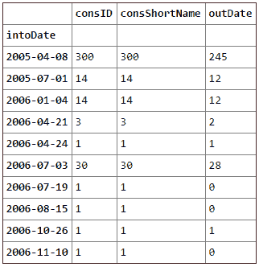
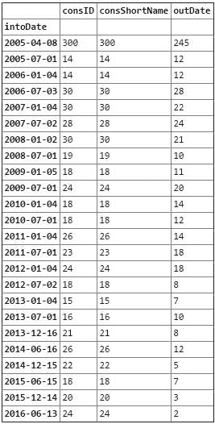
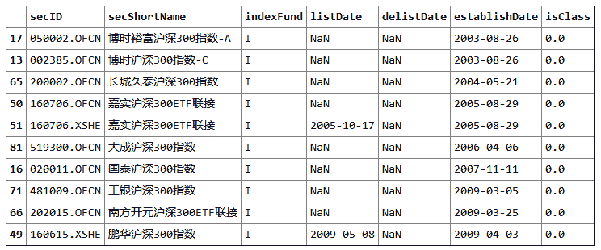
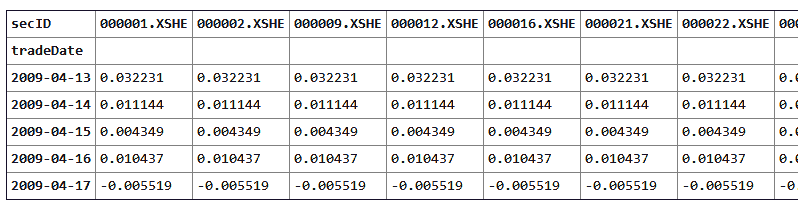
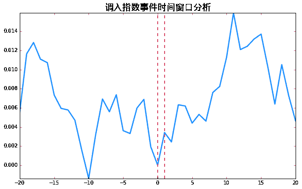
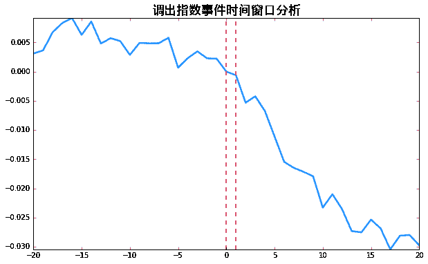
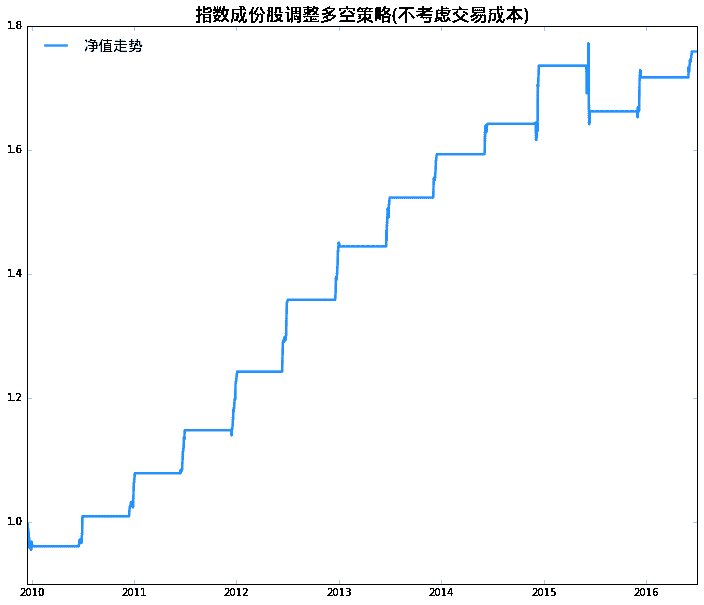

# 【Python 量化投资】指数成份股调整带来的投资机会

> 原文：[`mp.weixin.qq.com/s?__biz=MzAxNTc0Mjg0Mg==&mid=2653284277&idx=1&sn=b08add4f0fa3e7fd3d441eb317ca9ac0&chksm=802e25a0b759acb6349076f168d2f92663f6d200b9520e104174327979b824952bf9fdf384ae&scene=27#wechat_redirect`](http://mp.weixin.qq.com/s?__biz=MzAxNTc0Mjg0Mg==&mid=2653284277&idx=1&sn=b08add4f0fa3e7fd3d441eb317ca9ac0&chksm=802e25a0b759acb6349076f168d2f92663f6d200b9520e104174327979b824952bf9fdf384ae&scene=27#wechat_redirect)

每年的 6 月和 12 月，中证指数公司会对重要 A 股指数的成分股进行调整，包括沪深 300 指数、上证 180 等。随着指数成分股的调入调出，**跟踪该指数的基金包括 ETF 基金、LOF 基金等也会对基金的持仓做出相应的调整**，从而有可能会对即将调入调出的股票价格产生重要影响。指数的成分股定期调整，一般经历 3 个阶段：考察期结束日、大约 1 个半月后的“调整名单公布日”、2 到 3 周后的“调整实施日”。“调整名单公布日”那天，交易所会在官网公布调整的成分股名单。只要名单一公布，**各大基金经理就必须在 2 到 3 周之内调仓完毕**。“调整实施日”当天，指数就以新的成分股进行运作。 

这里我们使用优矿中调取指数成份股 API*，可以得到每天的指数成份股，在运算时间与数据周全性做一个权衡，我们打算每个月运行一次该 API，这样就可以到每一只只要进入到指数中的股票的进入时间以及移除时间,这里对沪深 300 指数进行详细分析。* 

**

*接着统计一下自 HS300 指数成立起，成份股的变动个数情况。2005 年 4 月 8 日 HS300 指数成立，所以当时共有 300 只股票调入。可以看出除了年终和年末的定期调整以外，还有一些时候会有有几只股票的调整，这时由于除了定期调整外，还有临时调整机制，用来应对新股上市，重组并购等特殊情况。这里我们仅对定期调整的股票进行分析。做一个简单的筛选，我们可以得到定期调整的情况。* 

**

*接下来我们再看看指数基金的情况* 

**

*可以看出 09 年以前成立的 HS300 指数基金还太少，故暂时**只分析 10 年以后的指数成份股调整。*** 

*如上我们有 10 年以后所有的指数成份股定期变动信息，**但是只有生效日期，实际上我们需要的是调整名单公布日期，因为调整名单公布后，已经是已知信息，指数基金经理已经开始建仓买入了**。通过查阅中证指数有限公司网站，我*

*找到了各个定期调整的名单公布日期。* 

*将调整名单添加到刚才的事件列表中* 

*沿用之前的业绩预告分析模板*，先进行简单的事件驱动分析** 

1.  ## **获取个股及指数每日收益**

## **此处以沪深 300 作为我们的基准，计算超额收益** 

**** 

## **2.时间窗口分析**

**** 

**可以看出调入指数事件在名单公布后**有一个显著的超额收益**，但**10 个交易日后出现明显的下跌**，并且调入指数的股票在名单公布之前的走势并不平稳。** 

****

**可以看出，**调出指数的股票在名单公布后有着显著的负的超额收益，并且在 20 个交易日内持续下跌。**** 

## **3.多空策略**

**显然对于调入和调出指数的股票，我们很自然的会想用多空策略，看多调入的股票，然后看空调出的股票。这样可以规避掉很多其他的因素对股票收益的影响，而且能进 HS300 的股票大多都可以融资融券的，所以这个是具有现实意义的。
这里我们构建多空策略，持仓周期为名单公布日到生效日，即名单公布后的隔天开盘买入，生效日当天开盘卖出，多空都为等权。**

**如上，我们可以知道 10 年以来一共 14 次指数成份股调整，其中 12 次使用我们的多空策略可以获得正收益，胜率高达 85.7%。我们做出累计净值走势，如下所示。** 

****

### ****总结****

**本文通过分析指数成份股变动事件，首先**以成份股调整名单公布时间为基准**，进行事件时间窗口分析，结果表明，调入股票在调整名单公布后平均有一个显著的涨幅，但 10 个交易日左右，又开始下跌，而且整个事件窗口收益不太稳定；**而调出股票在调整名单公布后平均有一个显著的跌幅，并且在 20 个交易日内稳定持续的下跌**。接着，依据这些信息，我们编写了基于调入调出股票的多空策略，持仓周期为调整名单发布日至生效日，等权设置多空。结果，总体操作的胜率在 85.7%，10 年至 16 年间取了 70%多的累计收益。**

### ****进一步研究****

**上面的结果还比较喜人，可以看出在大盘比较稳定的时候，这样多空操作基本都是能赚钱。而这些赚钱的原因，我们也大致知道是因为指数基金需要买入调入的股票卖出调出股票。既然如此，更加严谨的做法应该是测算大致会有多少这样的资金量买入需要调入的股票，因为一只股票可能同时在几个指数，主流指数都有指数基金，再加这个股票在各指数所占权重，以及该指数整体基金规模，就可以大致计算出有多少这样的资金会买入。然后再考虑，这些资金是否足够大，能给股票带来显著影响。调出股票同样考虑。**

****关注者****

****从 1 到 10000+****

****每天我们都在进步****

****阅读量前 10 文章****

****No.01** [给你说个事，私募机构量化研究员的薪酬水平……](http://mp.weixin.qq.com/s?__biz=MzAxNTc0Mjg0Mg==&mid=2653284109&idx=1&sn=00908f6ab13f3cd3e5214706316ac84e&chksm=802e2518b759ac0e516e5cc6e9b5f62dd22853203ba8298f5f681139a9cc0a45c1cdfa9c421e&scene=21#wechat_redirect)** 

****No.02** [独家揭秘新财富金融工程领域那些 NB 的分析师们](http://mp.weixin.qq.com/s?__biz=MzAxNTc0Mjg0Mg==&mid=2653284026&idx=1&sn=ed8bb9ceca543eaa620c284ad4e374ce&chksm=802e24afb759adb99e6cee24f26e063fb7f43855349b8142d06b4c766fee16f1df5676a0dd74&scene=21#wechat_redirect)**

****No.03** [跟你讲个笑话，我是做私募的……](http://mp.weixin.qq.com/s?__biz=MzAxNTc0Mjg0Mg==&mid=2653283777&idx=1&sn=252e295b1a788da1aaadf39c2ef959ee&scene=21#wechat_redirect)**

****No.04** [全网首发机器学习该如何应用到量化投资系列](http://mp.weixin.qq.com/s?__biz=MzAxNTc0Mjg0Mg==&mid=2653283935&idx=1&sn=56e84e986f278403d8840387c615a2a7&chksm=802e244ab759ad5c43720a7960567d215970877250ca72534016bf53a021c73f83665068639d&scene=21#wechat_redirect)**

****No.05**  [增强学习与量化投资初探](http://mp.weixin.qq.com/s?__biz=MzAxNTc0Mjg0Mg==&mid=2653283440&idx=1&sn=e5dc6e12f7b28b5ede13bd582b59b73c&scene=21#wechat_redirect)**

****No.06**  [量化缠论系列文章](http://mp.weixin.qq.com/s?__biz=MzAxNTc0Mjg0Mg==&mid=2653283801&idx=1&sn=0a05bb0247535a118183be2b917c56b4&scene=21#wechat_redirect)**

****No.07**  [书籍干货国外深度学习与机器学习书籍](http://mp.weixin.qq.com/s?__biz=MzAxNTc0Mjg0Mg==&mid=2653283143&idx=1&sn=2316c1a067239aa007196cc8cb2e6c5b&scene=21#wechat_redirect)**

****No.08**  [机器学习资料整理](http://mp.weixin.qq.com/s?__biz=MzAxNTc0Mjg0Mg==&mid=2653282920&idx=1&sn=6faa96116c590c75d92569351f987e52&scene=21#wechat_redirect)**

****No.09** [互联网金融之量化投资深度文本挖掘附源码](http://mp.weixin.qq.com/s?__biz=MzAxNTc0Mjg0Mg==&mid=2653282879&idx=1&sn=12a91c4b8317662fbae470541ebe4683&scene=21#wechat_redirect)**

****No.10** [七夕没有对象的宽客都在看这篇文章](http://mp.weixin.qq.com/s?__biz=MzAxNTc0Mjg0Mg==&mid=2653283478&idx=1&sn=aa061849c61ee84eedda3ac9d0c74ec5&scene=21#wechat_redirect)**

**听说，置顶关注我们的人都不一般**

****

********