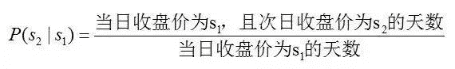
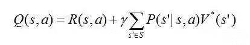
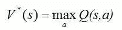
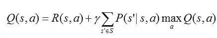
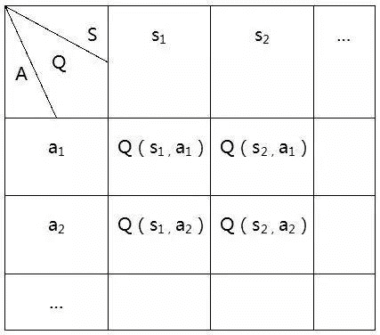
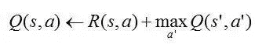

# 增强学习与量化投资初探

> 原文：[`mp.weixin.qq.com/s?__biz=MzAxNTc0Mjg0Mg==&mid=2653284270&idx=1&sn=88a18679266716e60db821c33a944227&chksm=802e25bbb759acadc7988ff888851a7d6be438280e725457a7c751b2669a16f00156da9f87d2&scene=27#wechat_redirect`](http://mp.weixin.qq.com/s?__biz=MzAxNTc0Mjg0Mg==&mid=2653284270&idx=1&sn=88a18679266716e60db821c33a944227&chksm=802e25bbb759acadc7988ff888851a7d6be438280e725457a7c751b2669a16f00156da9f87d2&scene=27#wechat_redirect)

> ********查看之前文章请点击右上角********，关注并且******查看历史消息******
> 
> ********所有文章全部分类和整理，让您更方便查找阅读。请在页面菜单里查找。********

.

几个月前人工智能围棋程序 AlphaGo 大胜李世石九段，人工智能再一次成为舆论的焦点，就连“深度学习”这样一个专业的概念也被广泛地传播开来。事实上，AlphaGo 的主体框架是一个深度增强学习模型。用一个深度神经网络拟合增强学习模型中的 Q 值（对不起，我也不知道自己在说些什么），完美地将机器学习中的深度学习与增强学习这两个分支结合在一起。假设大家对机器学习以及最优化理论中的套路有一定了解的话，下面我们将进一步探索（深度）增强学习的原理，以及其在量化投资中的应用。

MDP 与动态规划

Markov Decision Process（马尔克夫决策过程），是在 Markov 过程的基础上加入了行动(Action)与回报(Reward)的概念。首先，马尔克夫性就是说未来状态（的分布）只与当前状态有关，而与过去无关。而 MDP 中，在每种状态下可以采取若干种行动，当前状态与行动共同决定未来状态；并且在每次采取行动之后会获得一个相应的回报。具体而言，一个 MDP 由{S,A,P,R,γ}这五个部分组成：

S 是所有状态(States)构成的集合；

A 是所有行动(Actions)构成的集合；

P 是转移矩阵，即给出从某一状态&行动之下转移到另一状态的概率；

R 是回报(Reward)，它是状态(s)与行动(a)的函数 R(s,a)；

γ是贴现率（搞金融的都懂==），它的存在是为了让我们在对未来所有 Reward 进行求和的时候不会碰到正无穷。

我们可以认为 MDP 是对真实世界一个很好的模拟。面对当前时刻的环境，我们可以大致估计自己各种行为对环境的影响，以及这种行为可能带来的即时与远期后果。在此基础上，我们选择一个可以最大化未来所有收益之和的行为，从而转移到下一个状态，并不断重复该过程。这样就可以自然地引入策略(Policy)与价值(Value)的概念。策略π(s)就是 S 到 A 的一个映射，即一套完整的相机而动的方案，事先约定在每种状态下采取什么策略。而价值 V(s,π)是状态与策略的函数：从状态 s 开始，一直遵守策略π，那么未来一切收益贴现和的期望就是这个策略的价值。这样一来，所谓的最优策略π^*(s)就是价值最大的策略。在此基础上，继续定义最优值 V^*(s)=V(s,π^*)，作为状态的函数，V^*是执行最优策略时的价值。最优策略与最优值可以用动态规划求解（Bellman Equation，Value/Policy iteration）,这里就不展开讨论了。

说了这么多 MDP，我们可以暂时考虑下投资这件事情。也许有的同学已经在想：哇 MDP 的框架简直就是一个投资问题，股票的各种量价数据是当前的 State，而投资者的买卖操作是 Action，而收益（率）天然就是那个 Reward。但问题是，我们并不知道状态之间是如何转移的，也就是说 P 是未知的。况且，在已知当前状态的条件下，我们也并不知道买卖操作给我们带来的收益是多少。这样就自然而然地引出了下一话题--增强学习。

Reinforcement Learning

增强学习 RL 就是让一个智能的 agent 通过不断地与环境交互，实现 MDP 的参数估计，并进一步找出可以最大化 Reward 期望贴现和的最优策略。参数估计主要是针对转移概率 P 与回报函数 R，具体的方法是很简单粗暴的：根据历史观测求极大似然估计。以单只股票为例，将它每日的收盘价当作状态，那么从状态 s[1]转移到状态 s[2]概率的估计值就是简单地统计一下历史观测中前一天收盘价为 s1 时，有百分之多少的情况后一天的收盘价为 s[2]。即：

同理，R(s,a)的估计值是在 s 状态与 a 行动下已经观测到的回报均值。值得一提的是，上面关于股票的例子中转移概率 P 与 a 是无关的，因为我们认为自己的 action 是不会影响股价的；而回报 R 是与我们的 action 高度相关的。但在其他一些增强学习的例子中，action 可能仅影响 P 而不影响 R，也可能同时影响 P 与 R，这些情况都在 RL 的大框架之内。得到这些参数的估计值之后，就可以利用动态规划继续求解最优策略。

另一个重要的方法是 Q-Learning，可以在不估计 P 和 R 的情况下，agent 直接选择最优 action。Q(s,a)是状态与行动的函数，其值定义为从状态 s 开始并使用 a 作为第一个行动时的最大回报：

这个式子看起来有些复杂但思想很简单，右边第一项是当前的即时回报，第二项是期望最优值 V^*的贴现。显然，如果有了 Q 函数，我们可以在固定每种状态的条件下，找最大化 Q 值的 action，这样也就找到了最优的状态到行动的策略。所以问题的关键就在于学习 Q 函数，也正因此这个方法叫做 Q-Learning。考虑到 Q 与 V^*具有如下关系：

 

,那么可以得到关于 Q 的一个贝尔曼方程： 从而也可以迭代学习 Q 值直到收敛。

为了方便表述与理解，这里只以确定性 MDP 为例讨论，即已知当前状态与行动时，未来状态是唯一确定的（而不是一个概率分布）。首先建立一张 Q 值表并将所有的 Q 值初始化（如全部设为 0），

此时通过下式来迭代更新 Q 值：

这里的 s’就是由 s 与 a 唯一决定的下一状态。但以一个表来表示 Q 的成本是很大的，而且在遇到表以外的 action 或 state 时是无法给出 Q 值的（没有泛化能力）。于是，我们终于遇到了深度学习。 

深度学习 Q 函数

上文提到 Q 表有一些弊端，索性直接拟合 Q 函数，而 DeepMind 正是使用了一个深度神经网络拟合 Q 函数，命名为 DQN(Deep Q Net)。那么问题来了：神经网络作为一种监督学习，其训练是需要有标签(label)样本的，而这里 Q 值的标签是什么呢？答案就是之前迭代关系式中更新的 Q 值。他们的思路就是在更新 Q 的过程中同时训练 DQN 的权重 W。（这块内容就不深究了，因为并没有搞懂）

量化中的应用

尽管 RL 与投资问题十分贴切，但要真正运用起来还是十分有难度的，以下总结一些问题以及我的思考。

1.状态设定：

      目前深度增强学习效果比较好的场景有围棋、Atari 游戏、直升机（机器人）等。这些场景下 Reward 往往只与 State 相关，例如围棋棋盘当前的状态唯一决定价值，不管棋手走了哪一步到达当前状态。但下一个状态与当前的行动是紧密相关的。相反在股票投资中，我们的买卖策略不大可能影响股票的状态，但却直接影响我们到下一期时的收益。从这个角度讲，投资更像是一个静态问题。有一个办法是将 agent 当前持有的各种股票数量当作状态的一部分，这样 action 就可以影响 state 之间的转换了，从而可以使用 DQN 中的各种细节处理与技巧。

       另外，股票的大部分特征都是连续的变量，需要划分为离散的区间当作状态。模型对各种划分是否 robust 是一个需要验证的问题。当然这个问题是比较细节的。

2.特征选取：

      深度学习有时也称无监督特征学习，正是因为它可以很好地从原始数据中提取有效的 features，从而解决了以往机器学习中最大的难点--找 feature。但在深度增强学习中，深度网络的作用与在其他地方是有区别的，并不能用来自动地选择、构造特征。所以在用深度增强学习对量化投资过程进行建模时，仍需依靠人工经验以及金融背景选择各种特征（量价关系、技术指标等）。

3.目标函数：

      一般而言将每天在股市上的收益当作 Reward 就是最直接的选择，但这样并不能控制风险。所以也可以选择加入风险度量在目标函数当中，例如 Sharp Ratio。但是由于风险是用方差来表示的，很难在每个时间点都给出度量值，因而需要一些处理技巧来改进。

> 我和几个小伙伴们最近一直在做深度增强学习在量化中的应用，也会持续与大家分享（如在 TensorFlow 上的代码实现）。第一次写文章，有很多不足，还请各位多多批评指正。

> 补充阅读：
> 
> a. David Silver Reinforcement Learning 课程（优酷）。
> 
> b. Stanford CS229 课程网站上有讲义，第 12 讲是有关增强学习的。
> 
> c. 《机器学习》Tom Mitchell，最后一章是关于 Q-Learning 的。这本书虽然有点老，但内容上还是很丰富的。

.

**后台回复下列关键字，更多惊喜在等着****你** **【区分大小写】**  

**1.回复****每周论文** [**获取 Market Making 论文分享**](http://mp.weixin.qq.com/s?__biz=MzAxNTc0Mjg0Mg==&mid=2653283381&idx=1&sn=48ec361d5b5a0e86e7749ff100a1f335&scene=21#wechat_redirect)

**2\. 回复****matlab 量化投资** **[**获取大量源码**](http://mp.weixin.qq.com/s?__biz=MzAxNTc0Mjg0Mg==&mid=2653283293&idx=1&sn=7c26d2958d1a463686b2600c69bd9bff&scene=21#wechat_redirect)**

****3\. 回复****每周书籍**[**获取国外书籍电子版**](http://mp.weixin.qq.com/s?__biz=MzAxNTc0Mjg0Mg==&mid=2653283159&idx=1&sn=2b5ff2017cabafc48fd3497ae5efa58c&scene=21#wechat_redirect)**

******4\.** **回复******文本挖掘** **[**获取关于文本挖掘的资料**](http://mp.weixin.qq.com/s?__biz=MzAxNTc0Mjg0Mg==&mid=2653283053&idx=1&sn=1d17fbc17545e561be0664af78304a67&scene=21#wechat_redirect)********

************5\. 回复******金融数学** **[**获取金融数学藏书**](http://mp.weixin.qq.com/s?__biz=MzAxNTc0Mjg0Mg==&mid=403111936&idx=4&sn=97822bfa300f3d856d6c9acd8dc24914&scene=21#wechat_redirect)**************

**********6\. 回复******贝叶斯 Matlab****[**获取 NBM 详解与具体应用**](http://mp.weixin.qq.com/s?__biz=MzAxNTc0Mjg0Mg==&mid=401834925&idx=1&sn=d56246158c1002b2330a7c26fd401db6&scene=21#wechat_redirect)************

************7.回复****AdaBoost******[获取 AdaBoost 算法文献、代码、研报](http://mp.weixin.qq.com/s?__biz=MzAxNTc0Mjg0Mg==&mid=2653283387&idx=1&sn=d40b3a1ea73e3d85c124b5b1e4f3057b&scene=21#wechat_redirect)**************

**********8.回复****数据包络分析** **获取****[选股分析](http://mp.weixin.qq.com/s?__biz=MzAxNTc0Mjg0Mg==&mid=2653283401&idx=1&sn=fae6d0c0638174bb713952e6af983c54&scene=21#wechat_redirect)源码**********

********9.回复****SVD** **获取数据预处理之图像处理的方法********

****************

********【过往文章】********

********0.[【重！磅！干！货！】互联网金融之量化投资深度文本挖掘——附源码文档](http://mp.weixin.qq.com/s?__biz=MzAxNTc0Mjg0Mg==&mid=2653282879&idx=1&sn=12a91c4b8317662fbae470541ebe4683&scene=21#wechat_redirect)********

********1.[【机器学习课程】深度学习与神经网络系列之绪论介绍](http://mp.weixin.qq.com/s?__biz=MzAxNTc0Mjg0Mg==&mid=404690945&idx=1&sn=39ae29caade4b2fac87304d5091ecfc0&scene=21#wechat_redirect)******** 

********2.[【Python 机器学习】系列之线性回归篇【深度详细】](http://mp.weixin.qq.com/s?__biz=MzAxNTc0Mjg0Mg==&mid=405488375&idx=1&sn=e06859f0d3cf5102946bd1551d80184a&scene=21#wechat_redirect)******** 

********3.[【Python 机器学习】系列五决策树非线性回归与分类（深度详细附源码）](http://mp.weixin.qq.com/s?__biz=MzAxNTc0Mjg0Mg==&mid=2653283257&idx=1&sn=1b081581fd2b80c2bdfa03fdc73b1d3a&scene=21#wechat_redirect)******** 

********4.[【每周研报干货】各大券商研报免费分享（附下载链接）](http://mp.weixin.qq.com/s?__biz=MzAxNTc0Mjg0Mg==&mid=2653283257&idx=2&sn=49c78925e7f3535b9cad95bf91574519&scene=21#wechat_redirect)******** 

********5.[【每周书籍干货】国外近期深度学习与机器学习书籍电子版——你知道一本买来好多刀啊！](http://mp.weixin.qq.com/s?__biz=MzAxNTc0Mjg0Mg==&mid=2653283143&idx=1&sn=2316c1a067239aa007196cc8cb2e6c5b&scene=21#wechat_redirect)******** 

********6.[几种编程语言的优缺点](http://mp.weixin.qq.com/s?__biz=MzAxNTc0Mjg0Mg==&mid=2653283125&idx=1&sn=fc1a2a490600516cbdbbebfa4cd9d8fb&scene=21#wechat_redirect)******** 

********7.[【Python 机器学习】系列之从线性回归到逻辑回归篇（深度详细附源码）](http://mp.weixin.qq.com/s?__biz=MzAxNTc0Mjg0Mg==&mid=2653283118&idx=1&sn=fb38ed89200ba96f9ed2791dce76d55e&scene=21#wechat_redirect)******** 

********8.[【Python 机器学习】系列之特征提取与处理篇（深度详细附源码）](http://mp.weixin.qq.com/s?__biz=MzAxNTc0Mjg0Mg==&mid=2653283084&idx=1&sn=c7dd24ea9f5633f1f5370176fadef05f&scene=21#wechat_redirect)******** 

********9.[【最强干货】关于文本挖掘的资料（文献，报告，策略，代码）](http://mp.weixin.qq.com/s?__biz=MzAxNTc0Mjg0Mg==&mid=2653283053&idx=1&sn=1d17fbc17545e561be0664af78304a67&scene=21#wechat_redirect)********

********10.[机器学习的前期入门汇总](http://mp.weixin.qq.com/s?__biz=MzAxNTc0Mjg0Mg==&mid=404455727&idx=3&sn=d05688effdbb0583031ef9ae98c64387&scene=21#wechat_redirect)********

********11.[【深度原创研究】分级基金下折全攻略（一）](http://mp.weixin.qq.com/s?__biz=MzAxNTc0Mjg0Mg==&mid=403551881&idx=1&sn=e1ed56f607a0fe187dd7a0cf5178b638&scene=21#wechat_redirect)********

********12.[【深度原创研究】分级基金下折全攻略（二）](http://mp.weixin.qq.com/s?__biz=MzAxNTc0Mjg0Mg==&mid=403626226&idx=1&sn=4d1f56a6599c92fd6688e5eb5d7d15dc&scene=21#wechat_redirect)********

********13.[【知识食粮】最新华尔街牛人必读书籍排行](http://mp.weixin.qq.com/s?__biz=MzAxNTc0Mjg0Mg==&mid=401910135&idx=1&sn=43d5eb7549281bb9231a3be831302139&scene=21#wechat_redirect)********

********14.[通过 MATLAB 处理大数据](http://mp.weixin.qq.com/s?__biz=MzAxNTc0Mjg0Mg==&mid=401910135&idx=2&sn=5289317b5fa1afe4a5a4115520aaa8ac&scene=21#wechat_redirect)********

********15.[【扎实资料干货分享】Python、研究报告、计量经济学、投资书籍、R 语言等！(Book+Video)](http://mp.weixin.qq.com/s?__biz=MzAxNTc0Mjg0Mg==&mid=2653282744&idx=2&sn=c9e9fbf1fd0cd4efa8bf08b9c5f16d8a&scene=21#wechat_redirect)********

********16.[机器学习在统计套利中的应用](http://mp.weixin.qq.com/s?__biz=MzAxNTc0Mjg0Mg==&mid=2653282744&idx=3&sn=85d30593998974cfaf714ac0cf81f8cd&scene=21#wechat_redirect)********

********17.[量化投资修行之路](http://mp.weixin.qq.com/s?__biz=MzAxNTc0Mjg0Mg==&mid=2653282744&idx=4&sn=0ff993c537b4b1689967f1560dfd45be&scene=21#wechat_redirect)********

********18.[统计套利在股指期货跨期套利中的应用：基于协整方法的估计](http://mp.weixin.qq.com/s?__biz=MzAxNTc0Mjg0Mg==&mid=405625337&idx=3&sn=60d19beefab3a1636554b216a9b05742&scene=21#wechat_redirect)********

********19.[股指期货跨品种套利交易](http://mp.weixin.qq.com/s?__biz=MzAxNTc0Mjg0Mg==&mid=405625337&idx=2&sn=e136d7bb6542789fa12f1f90dd206641&scene=21#wechat_redirect)********

********20.[沪港通股票统计套利：基于 BP 神经网络](http://mp.weixin.qq.com/s?__biz=MzAxNTc0Mjg0Mg==&mid=405625337&idx=1&sn=c7d62703af3e5cdb90f0b1b853f8a483&scene=21#wechat_redirect)********

********21.[机器学习到底在量化金融里哪些方面有应用？](http://mp.weixin.qq.com/s?__biz=MzAxNTc0Mjg0Mg==&mid=2653282744&idx=1&sn=73db745def6298a1e352c03f51d26d95&scene=21#wechat_redirect)********

********22.[【Matlab 机器学习】之图像识别](http://mp.weixin.qq.com/s?__biz=MzAxNTc0Mjg0Mg==&mid=2653282814&idx=1&sn=f1224ea30942468ee39aa96d6ea0dd8f&scene=21#wechat_redirect)********

********23.[【干货分享】Python 数据结构与算法设计总结篇](http://mp.weixin.qq.com/s?__biz=MzAxNTc0Mjg0Mg==&mid=2653282752&idx=1&sn=5db4c3e27508abc083a7a5f388ddb6ed&scene=21#wechat_redirect)********

********24.[基于 Python 的股票数据接口调用代码实例](http://mp.weixin.qq.com/s?__biz=MzAxNTc0Mjg0Mg==&mid=2653282828&idx=1&sn=126ad1c21ce5795f8744690cb1effc13&scene=21#wechat_redirect)********

********25.[基于 Python 爬取腾讯网的最热评论代码实例](http://mp.weixin.qq.com/s?__biz=MzAxNTc0Mjg0Mg==&mid=2653282828&idx=2&sn=d73b96b78ce43b151c69ab3e70e4d24c&scene=21#wechat_redirect)********

********26.[卷积神经网络反向传播推导](http://mp.weixin.qq.com/s?__biz=MzAxNTc0Mjg0Mg==&mid=2653282851&idx=1&sn=6cc6f32f8d35089a3c80cdc4c95b48a9&scene=21#wechat_redirect)********

********27.[深度学习项目](http://mp.weixin.qq.com/s?__biz=MzAxNTc0Mjg0Mg==&mid=2653282851&idx=2&sn=d683b6a6570309b7dc07d79829c56b72&scene=21#wechat_redirect)********

********28.[混沌分形理论](http://mp.weixin.qq.com/s?__biz=MzAxNTc0Mjg0Mg==&mid=2653282968&idx=1&sn=04dcad950d1f1093ec35d7d70459020a&scene=21#wechat_redirect)********

********29.[【Python】基于情感词典进行情感分析（附代码）](http://mp.weixin.qq.com/s?__biz=MzAxNTc0Mjg0Mg==&mid=2653282977&idx=1&sn=715655ed0965227450696decde1b9864&scene=21#wechat_redirect)********

********29.[基于技术交易规则的动态模型股票价格（附论文和 Matlab 源程序）](http://mp.weixin.qq.com/s?__biz=MzAxNTc0Mjg0Mg==&mid=2653282981&idx=1&sn=7fcfb07c09bc6c40bb8e19972e4349c1&scene=21#wechat_redirect)********