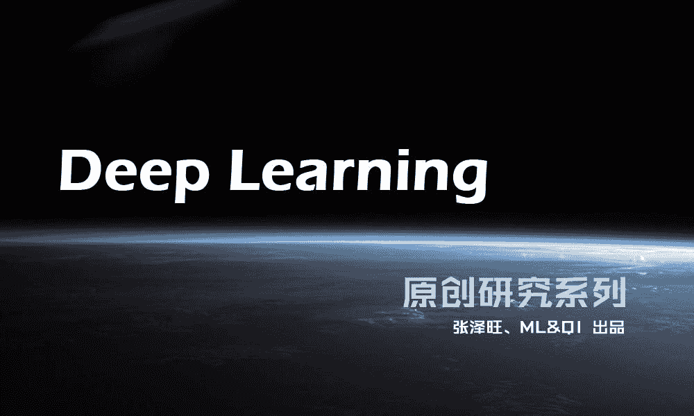

# 【深度学习研究系列】之漫谈 RNN（二）

> 原文：[`mp.weixin.qq.com/s?__biz=MzAxNTc0Mjg0Mg==&mid=2653284266&idx=1&sn=7d7cb36f40257cbe9e741469182d2cb0&chksm=802e25bfb759aca9715191b2ce3108f480260f0ab8f6851c18c1bd248acdd293dfb72c0c43d8&scene=27#wechat_redirect`](http://mp.weixin.qq.com/s?__biz=MzAxNTc0Mjg0Mg==&mid=2653284266&idx=1&sn=7d7cb36f40257cbe9e741469182d2cb0&chksm=802e25bfb759aca9715191b2ce3108f480260f0ab8f6851c18c1bd248acdd293dfb72c0c43d8&scene=27#wechat_redirect)

推送第二日，量化投资与机器学习公众号将为大家带来一个系列的 **Deep Learning** 原创研究。本次深度学习系列的撰稿人为 **张泽旺 ，DM-Master，目前在研究自动语音识别系统**。希望大家有所收获，共同进步！

漫谈 RNN 之训练方法

RNN 的训练因其递归性而变得复杂，现在深度学习大多系统中通常采用的是 Back-propagation Through Time 算法，本文不打算运用公式来讲解，而是将公式转化成易懂的文字来描述这些算法。  

历史文章：（点击阅读）

[【深度学习研究系列】之漫谈 RNN（一）](http://mp.weixin.qq.com/s?__biz=MzAxNTc0Mjg0Mg==&mid=2653284264&idx=1&sn=97afacc16a1c3784c03c4069fc5ffd8e&chksm=802e25bdb759acabf2128dccaa2654689a2195e4ed5910fc54cbcefe99a7dee56bc158361a33&scene=21#wechat_redirect)

* * *

RNN 是一个循环递归网络，因此在 t 时刻，网络的输出误差不仅与 t 时刻的隐含状态有关，也与 t 时刻之前的所有时刻的隐含状态有关。这一特点，正表明 RNN 相比传统的隐马尔科夫模型的优势是它充分考虑了历史所有时刻的状态。

当我们构建好了一个 RNN 模型之后，最大的难点就在于训练这个模型，这里说的训练实际上就是数学上的优化过程。在训练神经网络的时候，后向传播算法是最流行的训练算法，而 BPTT 则是基于它的一个变形。那么什么是后向传播算法呢？

> 考虑一个多层感知器（MLP），假设它有 K 个隐含层，考虑输入层和输出层的话一共有 K+2 个隐含层，输入层的神经元个数为 M，输出层的神经元个数为 N，并且每一个隐含层的神经元个数为 H_k。后向传播算法的步骤通常如下： 
> 
> 1.  初始化神经元的所有参数，包括输入层与隐含层之间的权重、隐含层与隐含层之间的权重以及隐含层和输出层之间的权重（这里的权重包括连接权重和神经元偏置），权重初始化的方法通常有产生高斯随机数、线性均匀随机分布、赋予常数 0 等等。设定参数更新的步长，即学习率的大小。
>     
>     
> 2.  利用 MLP 的前向计算公式，将输入值代入 MLP 网络得输入层神经元中，计算出每一个隐含层的神经元激活值以及输出层每个神经元的值。
>     
>     
> 3.  计算出输出层每个神经元的误差，这里的误差表达式可以有很多种类型，例如常见的有平方差形式、交叉熵形式等等。训练网络的目标就是要使得输出层神经元的总误差 E 达到最小。
>     
>     
> 4.  根据第 K+1 层与第 K+2 层之间的数量关系，计算出 E 对第 K+1 层上每个神经元的偏导数，由此偏导数即可计算出 E 对第 K+1 层与第 K+2 层之间权重的偏导数，于是第 K+1 层与第 K+2 层之间权重即可更新。
>     
>     
> 5.  以此类推，一直计算到第 1 层神经网络上的所有神经元的偏导数，这样即可更新输入层与第一层之间的权重。这就是误差的后向传播。
>     
>     
> 6.  完成以上即为一个 Epoch，而训练的目标就是不断重复这样的 Epoch，直到总误差 E 收敛到某个规定的阈值为止。

以上说的是用于训练 MLP 的后向传播算法，由于权重的更新是通过不断减去它的一阶偏导慢慢实现的，因此我们称这种算法为梯度下降法。虽然梯度下降算法在误差平面上只能找到局部最优值，但是这个缺点可以被一些错误得以很好避免，例如在训练的时候可以增加一些噪声、可以按照 Epoch 的增大而动态改变学习率的大小、采取不同的初始化方法、采取预训练的权重等等。

对于 RNN 来说，传统的后向算法已经无法适用了，这个时候我们需要把 RNN 网络在时间维度上展开，这个时候我们采用的是基于时间的后向传播算法（BPTT）。

BPTT 算法的计算步骤如下：

> 1.  初始化、前馈计算，跟后向传播算法的流程一样
>     
>     
> 2.  计算每一时刻输出层 K 的误差，总误差就是我们要优化的变量。
>     
>     
> 3.  计算 T 时刻隐含层 K-1 层的误差、第 k-1 层历史时刻的误差、第 K-2 层 T 时刻的误差。 
>     
>     
> 4.  更新 K-1 层 T 时刻的权重。
>     
>     
> 5.  依次类推，直到第一层 t=1 时刻的权重被更新，即完成一个训练 Epoch。
>     
>     
> 6.  持续迭代，直到总误差收敛为某个阈值为止，停止训练

BPTT 算法的计算复杂度相比于传统的 BP 算法要复杂 N 倍，N 是整个网络的连接个数。而 BPTT 另外一个计算上的缺点则是它考虑了所有的历史信息，于是有人提出了使用 truncated-BPP，即只考虑固定长度的历史，超过此时间的历史信息不用纳入 BPTT 中计算。这在一定程度上会影响 RNN 的记忆性，不过就算运用完整的 BPTT 算法，RNN 的记忆性也无法长期保留，一个研究观点表明 RNN 最多只能记忆 10~20 个时间点。

通常训练一个 RNN 需要很多个 Epoch，花费几个小时甚至几天都有可能，并且，训练 RNN 也没有训练 MLP 那么稳定，通常可以采取的措施有使用 Dropout、使用批归一化等技巧，而对于网络超参的设置需要因数据规模而定，甚至有时候需要在实践中得出经验甚至是要靠直觉来判断。

近期文章预告：

**《漫谈 RNN 之梯度消失及梯度爆炸》**

**《漫谈 RNN 之长短期记忆模型 LSTM》**

****《漫谈 RNN 之序列建模（机器翻译篇）》****

**关注者**

**从 1 到 10000+**

**每天我们都在进步**

**阅读量前 10 文章**

**No.01** [给你说个事，私募机构量化研究员的薪酬水平……](http://mp.weixin.qq.com/s?__biz=MzAxNTc0Mjg0Mg==&mid=2653284109&idx=1&sn=00908f6ab13f3cd3e5214706316ac84e&chksm=802e2518b759ac0e516e5cc6e9b5f62dd22853203ba8298f5f681139a9cc0a45c1cdfa9c421e&scene=21#wechat_redirect)

**No.02** [独家揭秘新财富金融工程领域那些 NB 的分析师们](http://mp.weixin.qq.com/s?__biz=MzAxNTc0Mjg0Mg==&mid=2653284026&idx=1&sn=ed8bb9ceca543eaa620c284ad4e374ce&chksm=802e24afb759adb99e6cee24f26e063fb7f43855349b8142d06b4c766fee16f1df5676a0dd74&scene=21#wechat_redirect)

**No.03** [跟你讲个笑话，我是做私募的……](http://mp.weixin.qq.com/s?__biz=MzAxNTc0Mjg0Mg==&mid=2653283777&idx=1&sn=252e295b1a788da1aaadf39c2ef959ee&scene=21#wechat_redirect)

**No.04** [全网首发机器学习该如何应用到量化投资系列](http://mp.weixin.qq.com/s?__biz=MzAxNTc0Mjg0Mg==&mid=2653283935&idx=1&sn=56e84e986f278403d8840387c615a2a7&chksm=802e244ab759ad5c43720a7960567d215970877250ca72534016bf53a021c73f83665068639d&scene=21#wechat_redirect)

**No.05**  [增强学习与量化投资初探](http://mp.weixin.qq.com/s?__biz=MzAxNTc0Mjg0Mg==&mid=2653283440&idx=1&sn=e5dc6e12f7b28b5ede13bd582b59b73c&scene=21#wechat_redirect)

**No.06**  [量化缠论系列文章](http://mp.weixin.qq.com/s?__biz=MzAxNTc0Mjg0Mg==&mid=2653283801&idx=1&sn=0a05bb0247535a118183be2b917c56b4&scene=21#wechat_redirect)

**No.07**  [书籍干货国外深度学习与机器学习书籍](http://mp.weixin.qq.com/s?__biz=MzAxNTc0Mjg0Mg==&mid=2653283143&idx=1&sn=2316c1a067239aa007196cc8cb2e6c5b&scene=21#wechat_redirect)

**No.08**  [机器学习资料整理](http://mp.weixin.qq.com/s?__biz=MzAxNTc0Mjg0Mg==&mid=2653282920&idx=1&sn=6faa96116c590c75d92569351f987e52&scene=21#wechat_redirect)

**No.09** [互联网金融之量化投资深度文本挖掘附源码](http://mp.weixin.qq.com/s?__biz=MzAxNTc0Mjg0Mg==&mid=2653282879&idx=1&sn=12a91c4b8317662fbae470541ebe4683&scene=21#wechat_redirect)

**No.10** [七夕没有对象的宽客都在看这篇文章](http://mp.weixin.qq.com/s?__biz=MzAxNTc0Mjg0Mg==&mid=2653283478&idx=1&sn=aa061849c61ee84eedda3ac9d0c74ec5&scene=21#wechat_redirect)

听说，置顶关注我们的人都不一般

****