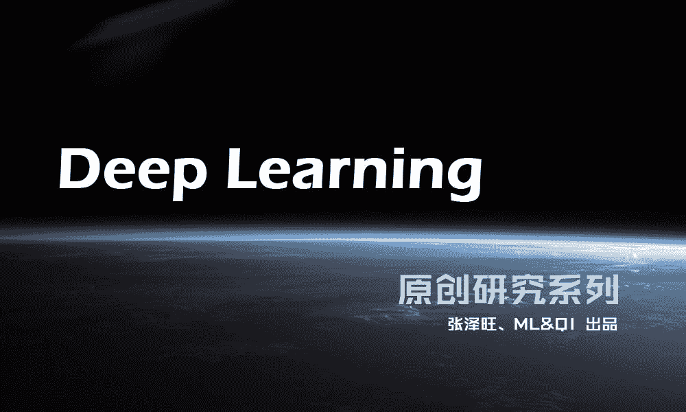
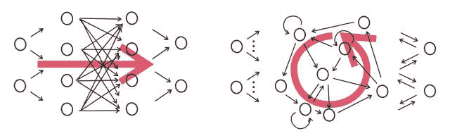
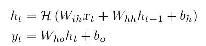
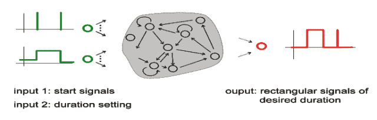
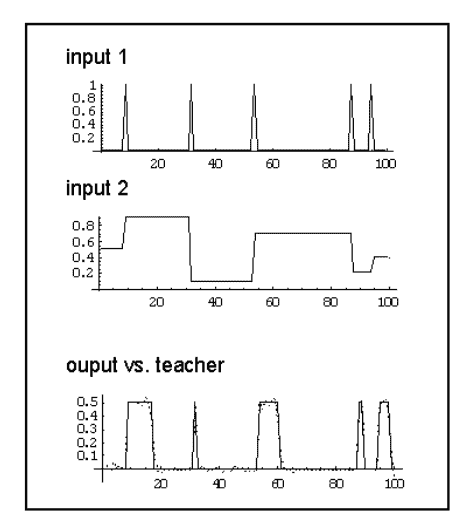

# 【深度学习研究系列】之漫谈 RNN（一）

> 原文：[`mp.weixin.qq.com/s?__biz=MzAxNTc0Mjg0Mg==&mid=2653284264&idx=1&sn=97afacc16a1c3784c03c4069fc5ffd8e&chksm=802e25bdb759acabf2128dccaa2654689a2195e4ed5910fc54cbcefe99a7dee56bc158361a33&scene=27#wechat_redirect`](http://mp.weixin.qq.com/s?__biz=MzAxNTc0Mjg0Mg==&mid=2653284264&idx=1&sn=97afacc16a1c3784c03c4069fc5ffd8e&chksm=802e25bdb759acabf2128dccaa2654689a2195e4ed5910fc54cbcefe99a7dee56bc158361a33&scene=27#wechat_redirect)

从今天起，量化投资与机器学习公众号将为大家带来一个系列的 **Deep Learning** 原创研究。本次深度学习系列的撰稿人为 **张泽旺** 。希望大家有所收获，共同进步！

漫谈 RNN 之基本概念

RNN 是一个图灵完全的模型，便意味着只要设计好 RNN 的外部存储机制，RNN 模型的应用之广泛将远超我们的想象。为了更好地了解时序模型，从这期开始谈谈以 RNN 为核心的可扩展时序模型的研究状况及应用。  

* * *

在神经网络模型中，一般分为非时序模型和时序模型，对于非时序模型而言，其应用场景有单一手写字识别、图像物体分类等等，最基本的模型是前馈式神经网络（FNN）；而对于时序模型而言，其应用场景十分广泛，如连续手写字识别、语音识别、语义理解、机器翻译、看图说话、自动生成、数据压缩等等，最基础的模型是循环神经网络（RNN）。今天我们着重谈论的是 RNN 的基础概念。

**图 1 左:FNN，右:RNN**

RNN 最初也是受人类的生物神经模型启发而来，因为所有的生物神经系统都是一个动态的系统，神经元与神经元之间不是孤立的而是互相产生动态影响的，这就促发了 RNN 的诞生。RNN 相比普通的 FNN 的主要区别有：

*   FNN 的神经元是静态的，而 RNN 是一个动态的网络，其神经元的状态时刻处于动态变化之中

*   如果说 FNN 可以进行任意的非线性映射，那么 RNN 则可以拟合任意的动态系统

*   FNN 的训练一般采用后向传播（BP）算法，而 RNN 一般采用随时间的后向传播（BPTT）算法

*   FNN 在拟合非线性系统上取得了很大的成功，但是 RNN 在处理长时间时序问题上还存在着很大不足

RNN 的数学公式也很简单，每个神经元的状态不仅与连接到它的输入有关，而且与前一时刻神经元的状态有关。即：

 

其中 x 是输入序列，h 是状态序列，最后的输出是 y。

RNN 既可以处理有监督学习问题，也可以处理无监督学习问题，今天我们着重谈论 RNN 在有监督学习中的应用。对于有监督学习而言，一般的应用情景是：给定包含输入和标准输出的训练集，构建一个 RNN 模型学习到这个训练集输入与输出之间的映射关系，然后用测试集去验证这个模型的输出与标准输出的差异。

下面看一个运用 RNN 进行时序建模的例子，考虑这样一个定时问题，输入分为两部分，u1 是作为触发脉冲，而 u2 是作为输出的 duration。当 u1 为 1 时，u2 便立即产生一个随机数，而此时的输出 0.5，并且 duration 为 10×u2；其他时刻，输出均为 0。

那么用 RNN 去建模这样一个时序问题，RNN 需要内部存储着 duration 的记忆，以及对触发具有响应的能力。下图是运用 RNN 对这个定时问题建模的测试结果：

在最下方图里，实线是标准的输出，而散点则是 RNN 模型的预测值，可以看到，预测值基本上与标准输出相吻合。这是一个简单的 RNN 运用的例子，后续将探讨更多更复杂的 RNN 建模问题。

近期文章预告：

**《漫谈 RNN 之训练方法》**

**《漫谈 RNN 之梯度消失及梯度爆炸》**

**《漫谈 RNN 之长短期记忆模型 LSTM》**

****《漫谈 RNN 之序列建模（机器翻译篇）》****

**关注者**

**从 1 到 10000+**

**每天我们都在进步**

**阅读量前 10 文章**

**No.01** [给你说个事，私募机构量化研究员的薪酬水平……](http://mp.weixin.qq.com/s?__biz=MzAxNTc0Mjg0Mg==&mid=2653284109&idx=1&sn=00908f6ab13f3cd3e5214706316ac84e&chksm=802e2518b759ac0e516e5cc6e9b5f62dd22853203ba8298f5f681139a9cc0a45c1cdfa9c421e&scene=21#wechat_redirect)

**No.02** [独家揭秘新财富金融工程领域那些 NB 的分析师们](http://mp.weixin.qq.com/s?__biz=MzAxNTc0Mjg0Mg==&mid=2653284026&idx=1&sn=ed8bb9ceca543eaa620c284ad4e374ce&chksm=802e24afb759adb99e6cee24f26e063fb7f43855349b8142d06b4c766fee16f1df5676a0dd74&scene=21#wechat_redirect)

**No.03** [跟你讲个笑话，我是做私募的……](http://mp.weixin.qq.com/s?__biz=MzAxNTc0Mjg0Mg==&mid=2653283777&idx=1&sn=252e295b1a788da1aaadf39c2ef959ee&scene=21#wechat_redirect)

**No.04** [全网首发机器学习该如何应用到量化投资系列](http://mp.weixin.qq.com/s?__biz=MzAxNTc0Mjg0Mg==&mid=2653283935&idx=1&sn=56e84e986f278403d8840387c615a2a7&chksm=802e244ab759ad5c43720a7960567d215970877250ca72534016bf53a021c73f83665068639d&scene=21#wechat_redirect)

**No.05**  [增强学习与量化投资初探](http://mp.weixin.qq.com/s?__biz=MzAxNTc0Mjg0Mg==&mid=2653283440&idx=1&sn=e5dc6e12f7b28b5ede13bd582b59b73c&scene=21#wechat_redirect)

**No.06**  [量化缠论系列文章](http://mp.weixin.qq.com/s?__biz=MzAxNTc0Mjg0Mg==&mid=2653283801&idx=1&sn=0a05bb0247535a118183be2b917c56b4&scene=21#wechat_redirect)

**No.07**  [书籍干货国外深度学习与机器学习书籍](http://mp.weixin.qq.com/s?__biz=MzAxNTc0Mjg0Mg==&mid=2653283143&idx=1&sn=2316c1a067239aa007196cc8cb2e6c5b&scene=21#wechat_redirect)

**No.08**  [机器学习资料整理](http://mp.weixin.qq.com/s?__biz=MzAxNTc0Mjg0Mg==&mid=2653282920&idx=1&sn=6faa96116c590c75d92569351f987e52&scene=21#wechat_redirect)

**No.09** [互联网金融之量化投资深度文本挖掘附源码](http://mp.weixin.qq.com/s?__biz=MzAxNTc0Mjg0Mg==&mid=2653282879&idx=1&sn=12a91c4b8317662fbae470541ebe4683&scene=21#wechat_redirect)

**No.10** [七夕没有对象的宽客都在看这篇文章](http://mp.weixin.qq.com/s?__biz=MzAxNTc0Mjg0Mg==&mid=2653283478&idx=1&sn=aa061849c61ee84eedda3ac9d0c74ec5&scene=21#wechat_redirect)

听说，置顶关注我们的人都不一般

****