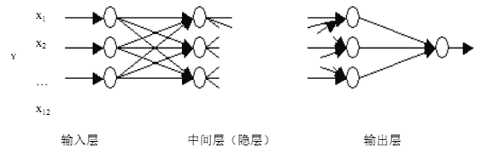
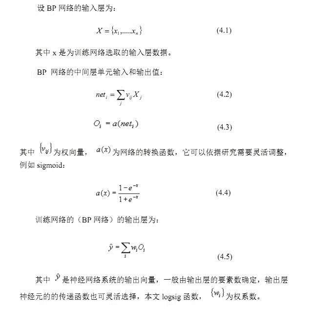
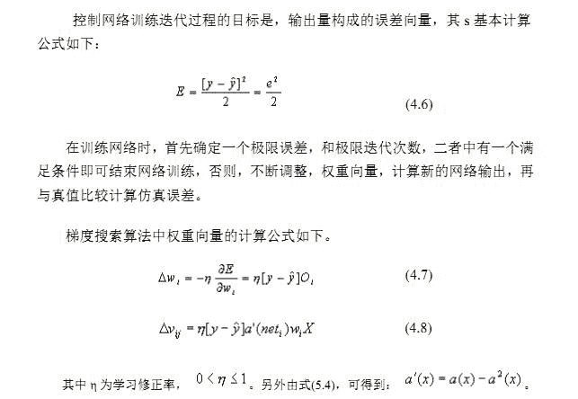
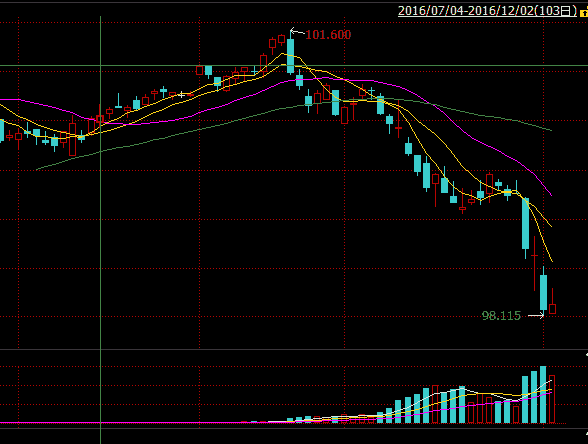
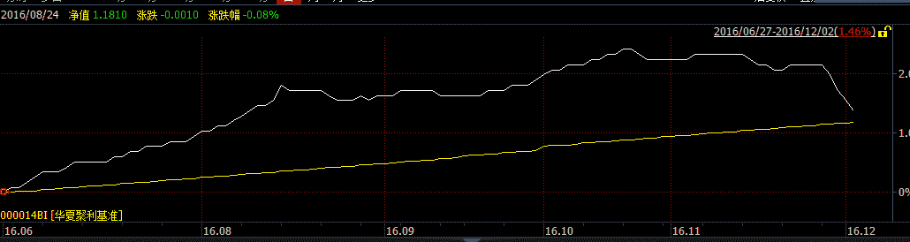
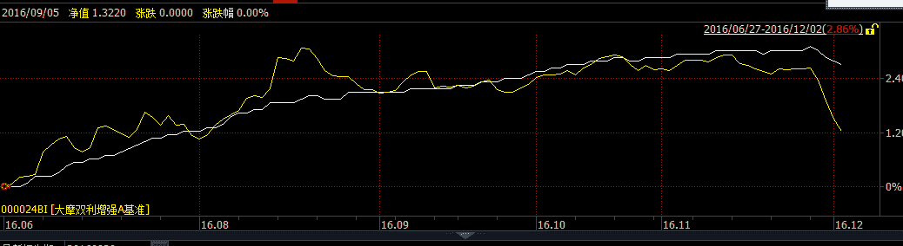
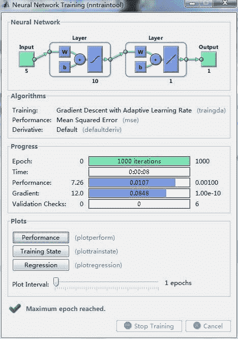
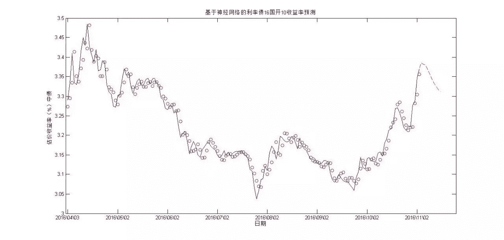
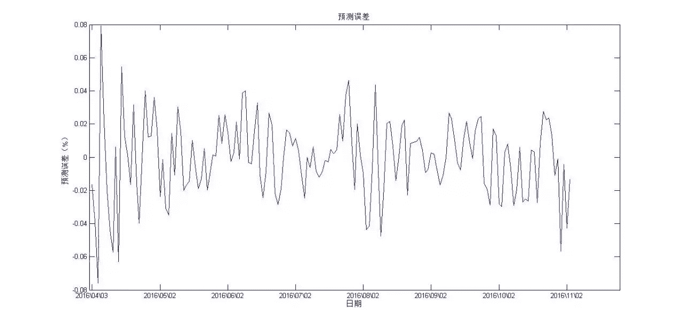
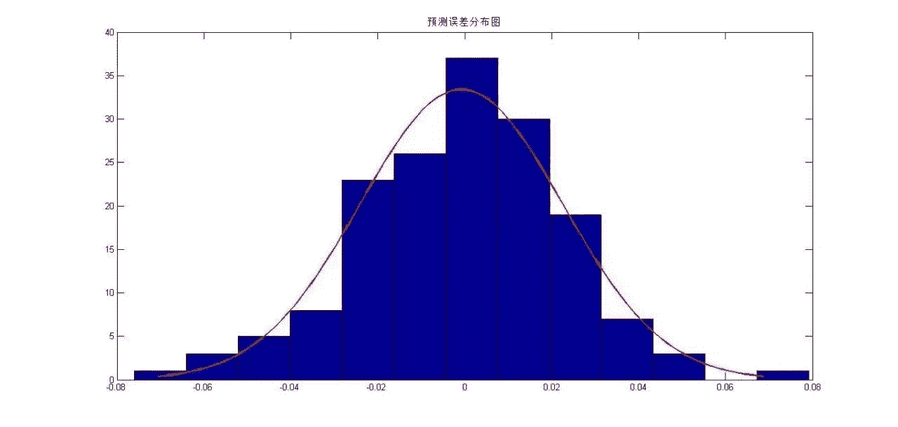

# 【Matlab 量化投资】基于神经网络的利率债 16 国开 10 收益率预测模型

> 原文：[`mp.weixin.qq.com/s?__biz=MzAxNTc0Mjg0Mg==&mid=2653284261&idx=1&sn=1b80441e1f7178aeaf34f8d8cb5639fc&chksm=802e25b0b759aca673276a2e648511762078e8c25f3ce7722f54204542d991631c9eb726ab5c&scene=27#wechat_redirect`](http://mp.weixin.qq.com/s?__biz=MzAxNTc0Mjg0Mg==&mid=2653284261&idx=1&sn=1b80441e1f7178aeaf34f8d8cb5639fc&chksm=802e25b0b759aca673276a2e648511762078e8c25f3ce7722f54204542d991631c9eb726ab5c&scene=27#wechat_redirect)

以往大家接触的量化投资与机器学习在股票和期货上运用的较多，然而大家却忽略了一个重要的金融市场，那就是债券市场。今天小编就告诉大家机器学习在债券市场上的运用。在机器学习中有一个非常重要的模型—神经网络模型。

**by 编辑部：李齐**  

**一、利用 BP 网络模型仿真成本分析的原理**

建立如图所示为一个三层神经网络结构。它具有:(1)输入层。用来输入资源动因数据、或作业中心成本。(2)中间层。也称为处理层或隐层，处理输入层的数据并为输出层传递信息。(3)输出层。它以中间层的输出作为输入，再经处理给出网络的最终输出。若共有 m 个输出单元，则一次输出一个 m 维向量，这里依据分析的需要，也许是各个作业中心的总成本或是服务产品的总成本或单个产品的成本。

BP 网络是一种多层前馈神经网络，它是仿真人的大脑思考问题的过程，有若干神经元构成，每个神经元，与其他神经元之间有联系，其联系方式，一般通过转换函数实现，转换函数取值，一般是绝对值以归一化，而且，基本都是初等的连续函数，这里构造三层神经元。如果权值的调整采用反向传播(Back Propagation)的学习算法，就叫 BP 网络。在确定了 BP 网络的结构后，利用本文所选样本公司的若干项指标数据和输出层对应的若干项数据（这些依据研究分析的需要不同，或许是资源成本动因+作业中心总成本；资源成本动因+服务产品总成本等），可以对网络进行训练，也即对网络的权值和阈值进行学习和调整，

以使网络确定有关财务指标与公司财务安全度之间的复杂映射关系。网络的训练过程实际上是一个循环调整神经元之间权重的过程，控制循环的目标是仿真值与真值误差向量，权重的调整用计算方法中的梯度下降法。   

**二、BP 网络的 MATLAB 实现 **

建立 BP 神经网络模型的核心，是反映多对多关系的网络的建立，这里主要环节是三个：建立网络、训练网络和利用网络进行仿真，Matlab 软件包为我们提供了大量的函数，其中就有实现上述功能的函数： 

**1.网络的初步建立 **

网络仿真的第一步就是要搭建网络框架，以便为下一步用实际数据进行网络训练打下基础，建立 BP 网络的函数为 newff(),调用格式如下： 

newff(minmax(p)，[n,k]，{‘tansig’,’logsig’},’traingdx) 

**2\.  训练网络 **

第二步，就是用实际历史数据训练网络，以便研究对象之间的多对多关系，用来完成此项功能的函数为 train()，调用格式如下： 

net=train(net,p,t) 

**3.仿真与使用网络 **

最后，就是利用训练好的网络进行分析研究，给出网络输入，研究网络输出，进行仿真预测，完成该功能的函数为 sim(net,testp)，调用格式如下： 

y=sim(net,testp) 

**三、基于神经网络的利率债 16 国开 10 收益率预测模型 **

**3.1 背景介绍 **

债券市场是发行和买卖债券的场所，是（金融市场）一个重要组成部分。债券市场是一国金融体系中不可或缺的部分。 

一个统一、成熟的债券市场可以为全社会的投资者和筹资者提供低风险的投融资工具；债券的收益率曲线是社会经济中一切金融商品收益水平的基准，因此债券市场也是传导中央银行货币政策的重要载体。可以说，统一、成熟的债券市场构成了一个国家金融市场的基础。 

本周上交所国债市场小幅下行，周五上证国债指数收于 160.40 点，较上周末下跌了 0.25 点，全周共成交了 30.11 亿元。上交所企债市场小幅上扬，周五上证企债指数收于 209.28 点，较上周末上涨了 0.08 点，共成交 70.62 亿元。本周国债期货大幅下跌，5 年期主力合约 3 月品种（TF1703）收盘报 99.77 元，较上周下跌了 0.800 元。从市场情况看，本周市场资金面非常紧张，交易所债市上涨乏力，银行间债市大幅下挫。其中 2016 年 11 月 29 日，十年期国债期货主力合约 T1703 大跌 0.71%至 98.930，创下今年以来最大单日跌幅。总体来看，本周市场资金面非常紧张，市场利率大幅飙升，银行间债市大幅下挫，国债期货快速下跌。而且在过了 11 月末时间节点后，市场资金面并未出现明显的好转，或许这

与控风险和防止人民币过度贬值有关。临近年末，市场资金面将维持紧平衡，不排除年末进一步趋紧的可能，或许本轮资金面紧张将延续到农历新年后，债市相应步入调整期。 

十年国债期货主力合约走势图

华夏聚利债券型基金走势图 

大摩双利债券型基金走势图 

由于近期市场利率的大幅调整，债券市场可谓经过了惊心动魄的一周，债券市场的核心是利率，如何判断利率走势成为债券市场一个核心的问题。 

16 国开 10（代码 160210）是利率债中最活跃的债券之一，于 2016 年 4 月 1 号国家开发银行发行，在同年 4 月 5 日开始计息，交易量较大，其收益率走势是整个债券市场收益率的一个风向标，如何合理预测 160210 收益率，制定合理有效的投资策略，是每一个债券研究员的重要课题。 

  **3.2 建立神经网络模型并预测收益率走势 **

通过 matlab，建立神经网络，神经网络部分参数如下： 

net.trainParam.goal=0.001; 

net.trainParam.show=20; 

net.trainParam.epochs=1000; 

net.trainParam.min_grad=1e-10; 

net.trainParam.mc=0.95; 

我们选取的数据为'2016-04-03'至'2016-12-02’，160210 估价收益率（中债），数据来至于 wind 数据库，对于提出数据直接用下面代码直接提取 

[w_wsd_data,w_wsd_codes,w_wsd_fields,w_wsd_times,w_wsd_errorid,w_wsd_reqi

d]=w.wsd('160210.IB','yield_cnbd','2016-04-03','2016-12-02','credibility=1','TradingC

alendar=NIB','Fill=Previous'); 

Wind 提供的 API 直接获取数据，方便快捷。接下来，第一组我们用前五天的数据来预测第六个交易日的数据，第二组用第二至第六天的数据来预测第七天的数据，以次类推，建立 163 组数据当做训练模型。最后预测出 12 月 5 日至 12 月 16 日 10 个交易日的收益率。这对交易员来说可以作为一个判断和参考。 

**3.3 预测结果与预测误差**

2016 年 12 月 5 日至 2016 年 12 月 16 日 160210 十个交易日收益率预测如下

3.3850    3.3812   3.3794    3.3673    3.3550 

3.3418    3.3317   3.3228    3.3164    3.3118

从上图和数据中看出，160210 的收益率会延续上一周的走势继续上行，然后在周三有反转迹象，紧接着收益率会向下。在图 6-5 和 6-7 中可以看出，预测的误差与实际在 8BP 的误差以内，而且误差呈现明显的正态分布，误差在一定范围内是可以接受的。

**四、后期策略展望**

2017 年 CPI 有上行的空间，目前的预测是明年平均 2.1%，比今年的 1.9%略高，但是，应该不会造成货币政策出现明显的紧缩。明年的货币政策仍然保持稳健，但是带有略紧的偏向。具体来说，不会再有降息的空间，但是以目前通胀的情况，也不会加息;此外，资金面偏紧的局面明年可能也不会有明显的好转，银行间回购利率和十年期国债利率还是会保持上行的压力。在债券市场一定要保持谨慎，明年银行间市场利息可能会略有上升。不过，央行肯定是要把握一个度去平衡，因为央行也不想引发像 2013 年的钱荒的局面，那对银行间市场的冲击就会比较大，甚至会影响实体经济的融资，未来会在一个温和的范围内，偏向更加谨慎，让银行间利率波动性更高一点，从而避免市场存在一种根本不需要进行流动性风险防范的心理。未来资金面不会过于紧张，但短期资金成本会提高，只能拿长期资金，因此会把债市引上一条健康的轨道，但短期内不可避免地会引起债市的波动。2017 年，请在债市谨慎慢行！

**关注者**

**从 1 到 10000+**

**每天我们都在进步**

**阅读量前 10 文章**

**No.01** [给你说个事，私募机构量化研究员的薪酬水平……](http://mp.weixin.qq.com/s?__biz=MzAxNTc0Mjg0Mg==&mid=2653284109&idx=1&sn=00908f6ab13f3cd3e5214706316ac84e&chksm=802e2518b759ac0e516e5cc6e9b5f62dd22853203ba8298f5f681139a9cc0a45c1cdfa9c421e&scene=21#wechat_redirect)

**No.02** [独家揭秘新财富金融工程领域那些 NB 的分析师们](http://mp.weixin.qq.com/s?__biz=MzAxNTc0Mjg0Mg==&mid=2653284026&idx=1&sn=ed8bb9ceca543eaa620c284ad4e374ce&chksm=802e24afb759adb99e6cee24f26e063fb7f43855349b8142d06b4c766fee16f1df5676a0dd74&scene=21#wechat_redirect)

**No.03** [跟你讲个笑话，我是做私募的……](http://mp.weixin.qq.com/s?__biz=MzAxNTc0Mjg0Mg==&mid=2653283777&idx=1&sn=252e295b1a788da1aaadf39c2ef959ee&scene=21#wechat_redirect)

**No.04** [全网首发机器学习该如何应用到量化投资系列](http://mp.weixin.qq.com/s?__biz=MzAxNTc0Mjg0Mg==&mid=2653283935&idx=1&sn=56e84e986f278403d8840387c615a2a7&chksm=802e244ab759ad5c43720a7960567d215970877250ca72534016bf53a021c73f83665068639d&scene=21#wechat_redirect)

**No.05**  [增强学习与量化投资初探](http://mp.weixin.qq.com/s?__biz=MzAxNTc0Mjg0Mg==&mid=2653283440&idx=1&sn=e5dc6e12f7b28b5ede13bd582b59b73c&scene=21#wechat_redirect)

**No.06**  [量化缠论系列文章](http://mp.weixin.qq.com/s?__biz=MzAxNTc0Mjg0Mg==&mid=2653283801&idx=1&sn=0a05bb0247535a118183be2b917c56b4&scene=21#wechat_redirect)

**No.07**  [书籍干货国外深度学习与机器学习书籍](http://mp.weixin.qq.com/s?__biz=MzAxNTc0Mjg0Mg==&mid=2653283143&idx=1&sn=2316c1a067239aa007196cc8cb2e6c5b&scene=21#wechat_redirect)

**No.08**  [机器学习资料整理](http://mp.weixin.qq.com/s?__biz=MzAxNTc0Mjg0Mg==&mid=2653282920&idx=1&sn=6faa96116c590c75d92569351f987e52&scene=21#wechat_redirect)

**No.09** [互联网金融之量化投资深度文本挖掘附源码](http://mp.weixin.qq.com/s?__biz=MzAxNTc0Mjg0Mg==&mid=2653282879&idx=1&sn=12a91c4b8317662fbae470541ebe4683&scene=21#wechat_redirect)

**No.10** [七夕没有对象的宽客都在看这篇文章](http://mp.weixin.qq.com/s?__biz=MzAxNTc0Mjg0Mg==&mid=2653283478&idx=1&sn=aa061849c61ee84eedda3ac9d0c74ec5&scene=21#wechat_redirect)

听说，置顶关注我们的人都不一般

****