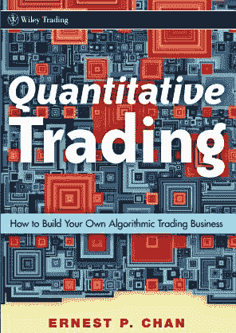
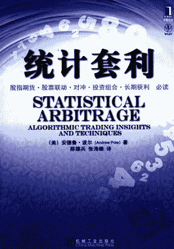

# 这么好的干货你们都没发现，可惜啊！

> 原文：[`mp.weixin.qq.com/s?__biz=MzAxNTc0Mjg0Mg==&mid=2653284248&idx=1&sn=64a9a7f0211eabcfcf1b794ee1e3b6b3&chksm=802e258db759ac9b3fc58e6dfedaddaa6fc829f141f4453e0d8fe4de85cee77f17da18bb0b63&scene=27#wechat_redirect`](http://mp.weixin.qq.com/s?__biz=MzAxNTc0Mjg0Mg==&mid=2653284248&idx=1&sn=64a9a7f0211eabcfcf1b794ee1e3b6b3&chksm=802e258db759ac9b3fc58e6dfedaddaa6fc829f141f4453e0d8fe4de85cee77f17da18bb0b63&scene=27#wechat_redirect)

之前在今年七夕的时候的一篇推文，有很多干活，有些人没有注意到。今天再重新发一下。

因

为

这

里

有

**狗 粮**

咱们

宽客们都是

高端人士

我们

**嘿  嘿  嘿**

****嘿  嘿  嘿****

******嘿  嘿  嘿******

**▼**

**／01／**

**试用人群**

刚分手，还未完全走出

单身时间

3 月

作者里什•纳兰是一位专业基金经理，在书中他站在一个非纯粹技术性的视角介绍了量化交易策略，用生动的文笔带领读者游历整个“黑箱”。

阅读本书的过程，是您掀开量化交易神秘面纱的过程，是您慢慢理解数量金融大师及其投资策略的过程，也可能是您对量化交易越来越感兴趣的过程。

**单身宝典**

**／02／**

**试用人群**

主动和前任分手的人

单身时间

6 月

这是一本浅显易懂的交易系统读物。

适合掌握一定金融知识的童鞋去阅读。

英文原版，更加原汁原味。提升自我外文阅读水平。

内有不少 vba 的代码和 matlab 的代码（交易策略）

**单身宝典**

**／03／**

**试用人群**

被劈腿，被分手，无理由突然被单身

下次老子（娘）一定先甩了你！

（看完就得实际操作）

单身时间

12 月

本书含有大量的实践案例，你将学会如何利用各种 Python 库（包括 NumPy、pandas、matplotlib 以及 IPython 等）高效地解决各式各样的数据分析问题。

由于作者 Wes McKinney 是 pandas 库的主要作者，所以本书也可以作为利用 Python 实现数据密集型应用的科学计算实践指南。本书适合刚刚接触 Python 的分析人员以及刚刚接触科学计算的 Python 程序员。

**单身宝典**

**／04／**

**试用人群**

永远只心动不行动的人

吃完这袋就去表白！

单身时间

18 月

该书主要讲述了将套利建立在历史数据基础之上进行分析，估算相关变量的概率分布，并结合基本面数据进行分析以用以指导套利交易。

**单身宝典**

**／05／**

**试用人群**

身边 100 个朋友，没有一个异性

单身时间

24 月

一部深思熟虑、非常实用的指南著作，涵盖了高频交易和系统交易的方方面面。高度推荐此书。

**单身宝典**

**／06／**

**试用人群**

为了不凑合，不将就，为了不委屈自己

单身时间

36 月

你想要的 Python 书籍都在这里。

**单身宝典**

**／07／**

**试用人群**

一个人熬过所有的苦，从此路一个人走

熟悉的配方，熟悉的味道，还要再看 100 年

单身时间

42 月

你想要的 Quant Interview Books 都在这里。

**单身宝典**

**／08／**

**试用人群**

也许，我们生来就是孤独的

单身时间

一生

你想要的投资阅读书籍都在这里。

**单身宝典**

**▼**

今日互动

**＃你单身多久了＃**

在留言区留言

留言点赞**第一名**

我们将送出一袋**“狗粮”**

**对自己好一点**

**单身也要快乐**

**** 

**别急**

**福利有的**

后台回复

**“狗 粮”**

这次

有你想要的

好多好多

**** 

听说，置顶关注我们的人都不一般

****