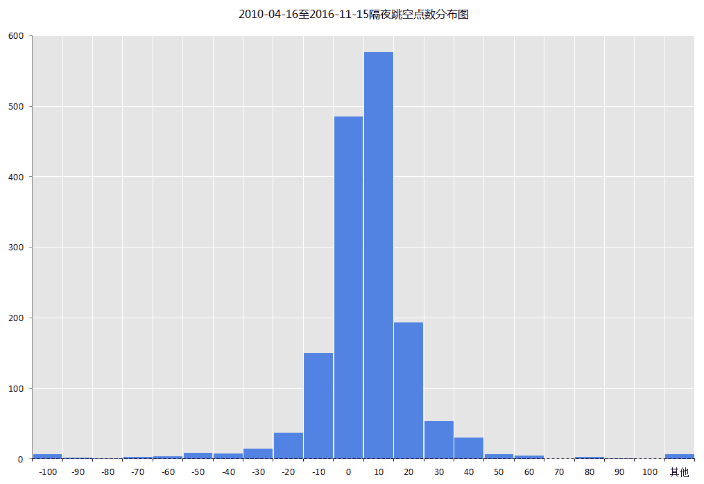
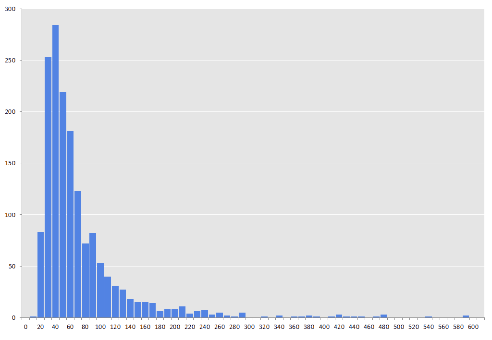
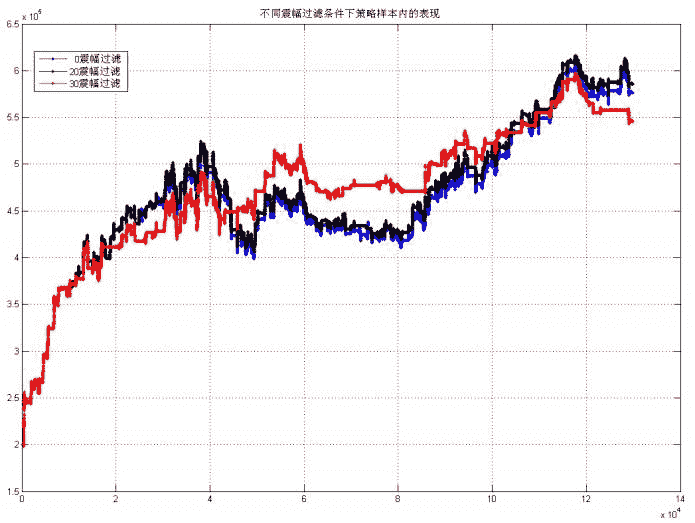
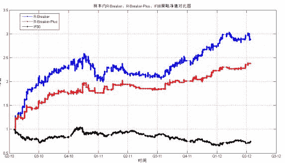
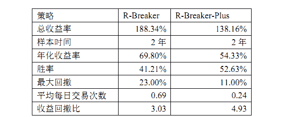
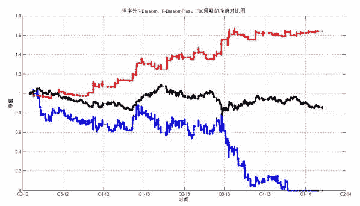
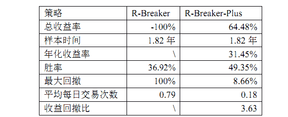
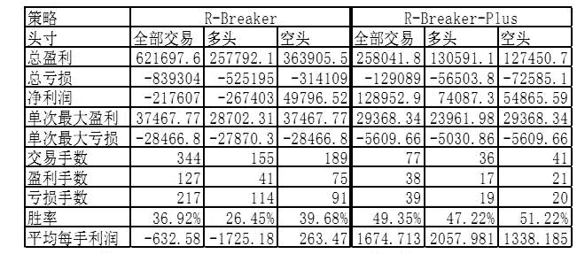

# R-Breaker 策略优化表现

> 原文：[`mp.weixin.qq.com/s?__biz=MzAxNTc0Mjg0Mg==&mid=2653284246&idx=1&sn=b5b80e2fa9610fc0355a6261c7a81d39&chksm=802e2583b759ac95ccaeefee37c0129f51158271fa5e2c584cd5ca1a8e60bb55f2d1ed11b5fb&scene=27#wechat_redirect`](http://mp.weixin.qq.com/s?__biz=MzAxNTc0Mjg0Mg==&mid=2653284246&idx=1&sn=b5b80e2fa9610fc0355a6261c7a81d39&chksm=802e2583b759ac95ccaeefee37c0129f51158271fa5e2c584cd5ca1a8e60bb55f2d1ed11b5fb&scene=27#wechat_redirect)

R-Breaker 是个经典的具有长生命周期的日内模型

类型：日内趋势追踪+反转策略

周期：1 分钟、5 分钟

根据前一个交易日的收盘价、最高价和最低价数据通过一定方式计算出六个价位，

从大到小依次为：

突破买入价（buy_break)、观察卖出价(sell_setup)、

反转卖出价(sell_enter)、反转买入价(buy_enter)、

观察买入价(buy_setup)、突破卖出价(sell_break)

 

以此来形成当前交易日盘中交易的触发条件。

**交易规则：**

**- 反转:**

    - 持多单，当日内最高价超过观察卖出价后，盘中价格出现回落，且进一步跌破反转卖出价构成的支撑线时，采取反转策略，即在该点位反手做空；

    - 持空单，当日内最低价低于观察买入价后，盘中价格出现反弹，且进一步超过反转买入价构成的阻力线时，采取反转策略，即在该点位反手做多；

**- 突破:**

    - 在空仓的情况下，如果盘中价格超过突破买入价，则采取趋势策略，即在该点位开仓做多；

    - 在空仓的情况下，如果盘中价格跌破突破卖出价，则采取趋势策略，即在该点位开仓做空；

是否隔夜留仓

R-Breaker 是日内交易策略，若某个交易日已开仓且收盘前仍未触发平仓信号，则在收盘时强行平仓，不隔夜留仓以避免跳空的风险。

下图是 2010 年 4 月 16 日至 2016 年 11 月 15 日隔夜跳空点数的分布图。1599 个交易日中有 1114 个交易日跳空点数(绝对值)大于 5 ，占了 69.67% ，最大跳空点数达到了 368 。风险非常大。所以不隔夜留仓是明智的。 

 

 R-Breaker 策略的改进思路 

R-Breaker 策略有如下缺点：

策略虽然在盘中趋势明显，波段较大时产生的交易信号有效，收益也高。但国内股指期货市场随着时间的发展越来越成熟，非有效性越来越不明显，如家常便饭般连续出现整日大波段趋势的现象已不复存在，R-Breaker 策略对此依赖过大，获利的空间也越来越小。下面从历史数据来说明：

 

**第一：**在预期有大趋势的情况下使用 R-Breaker 策略，在预期出现震荡市场

的情况下不进行交易或结合其它量化策略。 这样改进的难点在于如何预测趋势是

否会出现，因为趋势往往在其结束后才能确认，所以这个改进思路实现的难度较

大。 

**第二：**对上一交易日的震幅设置一个阈值，以过滤震荡的行情。

**第三：**必须加入止损的策略。 

**第四：**未加入停止交易的机制。R-Breaker 策略只要在日内产生穿越信号就会开

仓，有时即使上一个交易日震幅较大，6 个价格之间距离较远，当日仍然会出现

1 分钟实时收盘价在某根价位线上下反复来回穿越的情形，导致在较小的区间内

频繁开仓平仓，产生大量的交易成本。 

**第五：**参数的改进。

**波动过滤 **

震幅定义为每个交易日的最高价减去最低价， 震幅过滤是指当前一交易日的最高价减去最低价低于所设置的阈值（20 点、30 点等等）时，下一交易日就不再开仓交易。下图中蓝线、黑线、红线分别代表 0 震幅、20 点震幅、30 点震幅过滤的条件下 R-Breaker 策略的表现。黑线大致始终在蓝线上方，虽然红线最终低于蓝线，但红线在中间时段的表现优于蓝线，最大回撤也较小，稳定性明显更强。因此，使用震幅过滤确实能优化策略。 

 

**** 止盈止损****

**纵向： **

1\.  固定资金止损：每次交易浮动盈亏的资金亏损达到 1 千、3 千、5 千时就止损平仓； 

2\.  固定点数止损：每次交易浮动盈亏的点数亏损达到 5 点、10 点、20 点时就平仓止损（与 1 类似） ； 

3\.  固定百分比止损：当日实时资金亏损达到 1%、3%、5%时就平仓止损，当日不再开仓 

4\.  最大点数回撤：每次交易实时点数从做多(空)开仓后的最高(低)点向下（上）回撤超过 5、10、20 点后就平仓止盈或止损。 

**横向：** 

5\.  以时间（分钟）为横坐标，合约点数为纵坐标建立坐标系，在做多（空）开仓点画一条斜率为 K 的射线，合约轨迹线向下（上）穿过射线就平仓止盈。 

6\.  做多（空）开仓 M 分钟后的连续 N 分钟内未突破前 M 分钟的最高（低）点就平仓止盈 

经过测试，采用最简单最常规的方法 2 表现反而最好。由于股市具有多空不对称性，所以在做多和做空后分别采用不同的浮动盈亏止损点数。例如，做多开仓后，当盘中价格低于开仓买入价超过 5 点，就在该时点卖出止损平仓；做空开仓后，当盘中价格高于开仓卖出价超过 10 点，就在该时点买入止损平仓。 

**** 停止交易****

日内停止交易是指，在当日交易亏损达到一定次数（每次平仓后若总资金低于这手交易开仓前，就算一次亏损）或当日累计亏损资金达到一定金额（或百分比）就及时平仓，且当日之后时段即使触发了交易信号也不再开仓交易。日内最大亏损次数可设置为 3 次左右，最大亏损资金类似止盈止损中的设计方法。但经过其它的调整和改进，这一步的改进方法其实已经影响不大，下文可以看到最后完成的策略交易频率并不高，日内出现多次亏损的情况几乎不存在，且第二步的止盈止损就保证了日内的最大亏损资金数额不会过大。 

  **参数调整**

F1=0.01×i，i=1，2，3，…，100； 

F2=0.01×j，j=1，2，3，…，100。 

即做 100×100=1 万次循环。 

**模型改变**

**当开盘发生较大隔夜跳空，导致第一分钟收盘价在突破买入价(Bbreak)之上或突破卖出价(Sbreak)之下，按照 R-Breaker 策略的交易规则，就会在第一分钟相应买入开多或卖出开空。但依据市场的交易经验、目前中国股市的萎靡不振和中国投资者的心理特点，在发生大幅隔夜大涨或大跌后，投资者一般会信心不足，不敢继续追涨或杀跌，期指价格往往也会慢慢回补，所以当做趋势突破而做多追涨或做空杀跌是不明智的，而且在样本内也出现了数次由于这种情况而出现大量亏损的情况。因此，将模型做出改变，开盘第一分钟期指价格就在突破买入价(Bbreak)之上或突破卖出价(Sbreak)之下的情形不作为趋势策略交易信号触发的情况，只有在盘中发生穿越才算。 **

**基本设置**

**综上，最后得出的新趋势策略命名为 R-Breaker-Plus，具体叙述如下： **

****1\.  数据样本： ****

**样本内：【2010-04-16，2012-04-15】（481 个交易日）的 1 分钟高频数据(开盘价、最高价、最低价、收盘价)； **

**样本外：【2012-04-16，2014-02-07】（438 个交易日）的 1 分钟高频数据(开盘价、最高价、最低价、收盘价)； **

****2\.  期货交易标的：**IF00 股指期货主力合约 **

****3\.  初始资金投入：**  20 万元，只交易一手。 **

****4\.  交易成本：**单次交易手续费：0.00007（万分之零点七）；滑点：单次交易**

**滑点 0.6 个。 **

****5\.  是否隔夜留仓**：不隔夜留仓。 **

****6\.  交易规则：**在空仓的情况下，如果盘中价格超过突破买入价（不包括开盘就在价格线之上的情形），则在该时点该点位开仓做多；在空仓的情况下，如果盘中价格跌破突破卖出价（不包括开盘就在价格线之下的情形），则在该时点该点位开仓做空。 **

**突破买入价和突破卖出价由观察买入价和观察卖出价计算而来，计算公式如下： **

**观察买入价 Bsetup=Low-f1×(High-Close); **

**         观察卖出价 Ssetup=High+f1×(Close-Low); **

**         突破买入价 Bbreak=Ssetup+f3×(Ssetup-Bsetup); **

**         突破卖出价 Sbreak=Bsetup-f3×(Ssetup-Bsetup)。 **

**其中，参数 f1=0.03,f3=0.87。 **

****7.止损规则：**做多开仓后，当盘中价格低于开仓买入价超过 10 点，就在该时点卖出止损平仓；做空开仓后，当盘中价格高于开仓卖出价超过 15 点，就在该时点买入止损平仓。 **

**样本内原 R-Breaker 策略（蓝线）、改进后的 R-Breaker-Plus（红线）策略和当月连续合约 IF00（黑线）的净值表现对比如下： **

**** 

**** 

** 可以看出，原始的 R-Breaker 策略获利更多，年化收益率要比改进后的 R-Breaker-Plus 策略高出 15 个百分比，原因是 R-Breaker 的交易次数接近 R-Breaker-Plus 的 3 倍，但平均每手盈利 R-Breaker-Plus 超过了 R-Breaker 的 2 倍。稳定性上 R-Breaker-Plus 要远远好于 R-Breaker，最大回撤 11%不到原始策略的一半，且胜率超过了 50%，远高于原始策略。研究量化投资策略的学者们已得出结论：一般稳定性要比收益更重要。因为我的策略只是用一手进行交易来研究，若投入实盘使用，肯定要放大资金倍数，回撤更小稳定性更高的策略能放大的倍数更高，最终得的盈利也会比收益虽高但回撤偏大的策略要好。从做多和做空子策略分开来看，R-Breaker-Plus 都比 R-Breaker 的每手利润要高出不少，胜率更高，更加稳定。所以综合来看，在样本内 R-Breaker-Plus 要胜于 R-Breaker，但 R-Breaker-Plus 交易次数不是很频繁。 **

****

****

****

**所以综合样本内和样本外的表现，改进后的趋势子策略 R-Breaker-Plus 无论从收益性还是从稳定性上来说，都远远优于原始的 R-Breaker 策略。**

**后记**

**以上是一些简单改进，数据回测时间也可以自己调整。@西西**

****关注者****

****从 1 到 10000+****

****每天我们都在进步****

****阅读量前 10 文章****

****No.01** [给你说个事，私募机构量化研究员的薪酬水平……](http://mp.weixin.qq.com/s?__biz=MzAxNTc0Mjg0Mg==&mid=2653284109&idx=1&sn=00908f6ab13f3cd3e5214706316ac84e&chksm=802e2518b759ac0e516e5cc6e9b5f62dd22853203ba8298f5f681139a9cc0a45c1cdfa9c421e&scene=21#wechat_redirect)** 

****No.02** [独家揭秘新财富金融工程领域那些 NB 的分析师们](http://mp.weixin.qq.com/s?__biz=MzAxNTc0Mjg0Mg==&mid=2653284026&idx=1&sn=ed8bb9ceca543eaa620c284ad4e374ce&chksm=802e24afb759adb99e6cee24f26e063fb7f43855349b8142d06b4c766fee16f1df5676a0dd74&scene=21#wechat_redirect)**

****No.03** [跟你讲个笑话，我是做私募的……](http://mp.weixin.qq.com/s?__biz=MzAxNTc0Mjg0Mg==&mid=2653283777&idx=1&sn=252e295b1a788da1aaadf39c2ef959ee&scene=21#wechat_redirect)**

****No.04** [全网首发机器学习该如何应用到量化投资系列](http://mp.weixin.qq.com/s?__biz=MzAxNTc0Mjg0Mg==&mid=2653283935&idx=1&sn=56e84e986f278403d8840387c615a2a7&chksm=802e244ab759ad5c43720a7960567d215970877250ca72534016bf53a021c73f83665068639d&scene=21#wechat_redirect)**

****No.05**  [增强学习与量化投资初探](http://mp.weixin.qq.com/s?__biz=MzAxNTc0Mjg0Mg==&mid=2653283440&idx=1&sn=e5dc6e12f7b28b5ede13bd582b59b73c&scene=21#wechat_redirect)**

****No.06**  [量化缠论系列文章](http://mp.weixin.qq.com/s?__biz=MzAxNTc0Mjg0Mg==&mid=2653283801&idx=1&sn=0a05bb0247535a118183be2b917c56b4&scene=21#wechat_redirect)**

****No.07**  [书籍干货国外深度学习与机器学习书籍](http://mp.weixin.qq.com/s?__biz=MzAxNTc0Mjg0Mg==&mid=2653283143&idx=1&sn=2316c1a067239aa007196cc8cb2e6c5b&scene=21#wechat_redirect)**

****No.08**  [机器学习资料整理](http://mp.weixin.qq.com/s?__biz=MzAxNTc0Mjg0Mg==&mid=2653282920&idx=1&sn=6faa96116c590c75d92569351f987e52&scene=21#wechat_redirect)**

****No.09** [互联网金融之量化投资深度文本挖掘附源码](http://mp.weixin.qq.com/s?__biz=MzAxNTc0Mjg0Mg==&mid=2653282879&idx=1&sn=12a91c4b8317662fbae470541ebe4683&scene=21#wechat_redirect)**

****No.10** [七夕没有对象的宽客都在看这篇文章](http://mp.weixin.qq.com/s?__biz=MzAxNTc0Mjg0Mg==&mid=2653283478&idx=1&sn=aa061849c61ee84eedda3ac9d0c74ec5&scene=21#wechat_redirect)**

**听说，置顶关注我们的人都不一般**

****

********