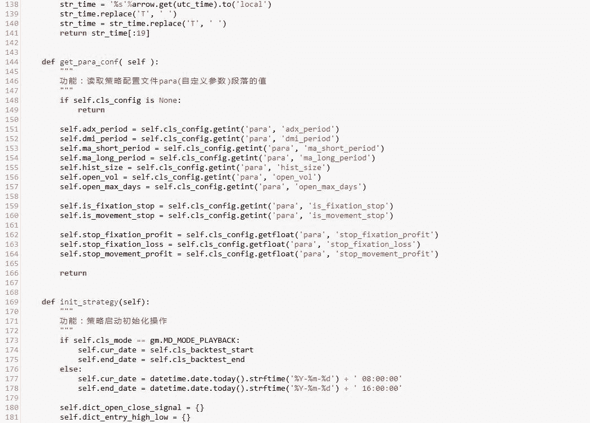
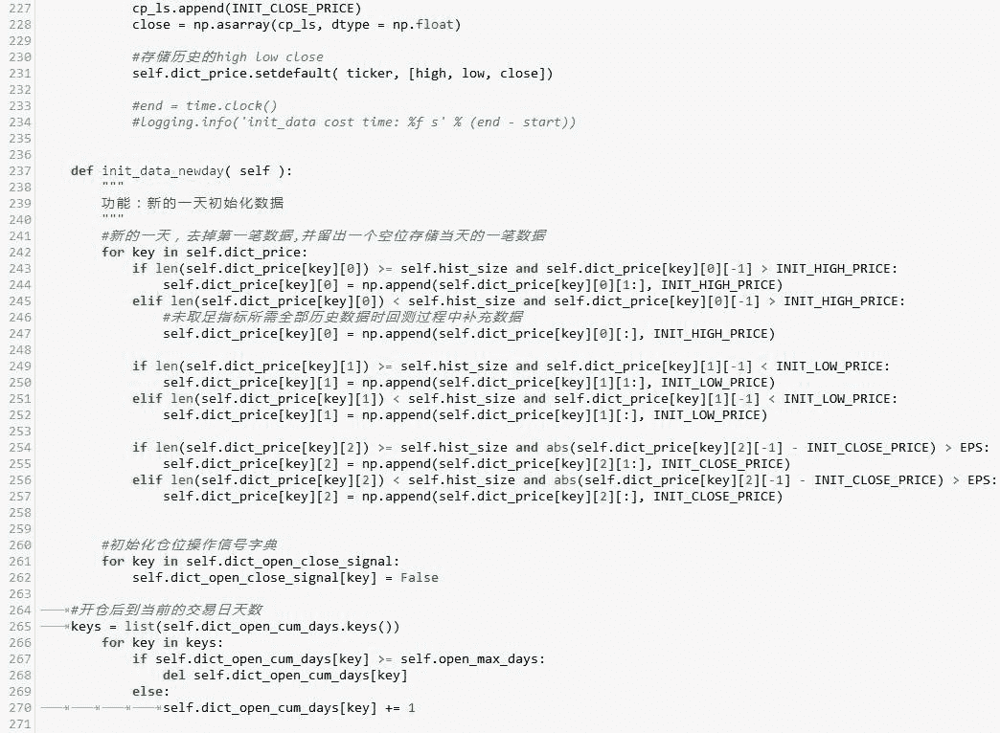

# 【Python 量化投资】趋向系统指标策略 ADX、DMI 指标用于股票池（附源码）

> 原文：[`mp.weixin.qq.com/s?__biz=MzAxNTc0Mjg0Mg==&mid=2653284234&idx=1&sn=f08731fc4560226131dbeaa7d7ff1acd&chksm=802e259fb759ac89430205ebae1bf28fd7f1057a8b12e179a5b7fd1fb65b0223159406f32498&scene=27#wechat_redirect`](http://mp.weixin.qq.com/s?__biz=MzAxNTc0Mjg0Mg==&mid=2653284234&idx=1&sn=f08731fc4560226131dbeaa7d7ff1acd&chksm=802e259fb759ac89430205ebae1bf28fd7f1057a8b12e179a5b7fd1fb65b0223159406f32498&scene=27#wechat_redirect)

**[什么是 ADX]**

ADX(average directional indicator) 平均趋向指数，常用的趋势衡量指标。通常与趋向系统（DMI）一起使用，利用多空趋向之变化差离与总和判定平均趋势，ADX 数值不能显示趋势的发展方向。

但是如果趋势存在，ADX 可以衡量趋势的强度。

**[ADX 的计算方法(默认区间 14 天)]**

**Step 1**. 计算 Directional movement (动向变化值）

+DM：当日最高价比昨日最高价高并且当日最低价比昨日最低价高，即为上升动向+DM。上升幅度为：当日最高价减去昨日最高价。

-DM：当日最高价比昨日最高价低并且当日最低价比昨日最低价低，即为下降动向-DM。下降幅度为：昨日最低价减去今日最低价。

**Step 2** . 计算 True Range (真实波幅）

TR =∣最高价-最低价∣，∣最高价-昨收∣，∣昨收-最低价∣ 三者之中的最高值

**Step 3**: 计算 Directional Movment Index (动向指数）

+DI(14) = +DM(14)/TR(14)*100

-DI(14) = -DM(14)/TR(14)*100

**Step 4**: 计算 ADX

DX 是+DI 与-DI 两者之差的绝对值除以两者之和的百分数。

DX＝[(+DI14)-(-DI14)]/[(+DI14)+(-DI14)]*100

ADX 是 DX 的 14 天平滑平均线。

ADX = SMA(DX, 14)

不论上升趋势或下降趋势，ADX 的读数越大，趋势越明显。

衡量趋势强度时，需要比较几天的 ADX 读数，观察 ADX 究竟是上升或下降。ADX 读数上升，代表趋势转强；如果 ADX 读数下降，意味着趋势转弱。

当+DI14 从下向上递增突破-DI14 时，显示市场内部有新的多头买家进场，愿意以较高的价格买进，因此入场信号。当-DI14 从下向上递增突破+DI14 时，显示市场内部有新的空头卖家出货，愿意以较低卖出，为离场信号

策略逻辑： 

使用 ADX 的相对上升下降来判断趋势。配合双均线信号一起用。

在这里 ADX 更多是作为验证趋势是否会增强的信号使用，以避免在横盘中多次交易。

**源代码**

（点击阅读原文查看完整文件）

**关注者**

**从 1 到 10000+**

**每天我们都在进步**

**阅读量前 10 文章**

**No.01** [给你说个事，私募机构量化研究员的薪酬水平……](http://mp.weixin.qq.com/s?__biz=MzAxNTc0Mjg0Mg==&mid=2653284109&idx=1&sn=00908f6ab13f3cd3e5214706316ac84e&chksm=802e2518b759ac0e516e5cc6e9b5f62dd22853203ba8298f5f681139a9cc0a45c1cdfa9c421e&scene=21#wechat_redirect)

**No.02** [独家揭秘新财富金融工程领域那些 NB 的分析师们](http://mp.weixin.qq.com/s?__biz=MzAxNTc0Mjg0Mg==&mid=2653284026&idx=1&sn=ed8bb9ceca543eaa620c284ad4e374ce&chksm=802e24afb759adb99e6cee24f26e063fb7f43855349b8142d06b4c766fee16f1df5676a0dd74&scene=21#wechat_redirect)

**No.03** [跟你讲个笑话，我是做私募的……](http://mp.weixin.qq.com/s?__biz=MzAxNTc0Mjg0Mg==&mid=2653283777&idx=1&sn=252e295b1a788da1aaadf39c2ef959ee&scene=21#wechat_redirect)

**No.04** [全网首发机器学习该如何应用到量化投资系列](http://mp.weixin.qq.com/s?__biz=MzAxNTc0Mjg0Mg==&mid=2653283935&idx=1&sn=56e84e986f278403d8840387c615a2a7&chksm=802e244ab759ad5c43720a7960567d215970877250ca72534016bf53a021c73f83665068639d&scene=21#wechat_redirect)

**No.05**  [增强学习与量化投资初探](http://mp.weixin.qq.com/s?__biz=MzAxNTc0Mjg0Mg==&mid=2653283440&idx=1&sn=e5dc6e12f7b28b5ede13bd582b59b73c&scene=21#wechat_redirect)

**No.06**  [量化缠论系列文章](http://mp.weixin.qq.com/s?__biz=MzAxNTc0Mjg0Mg==&mid=2653283801&idx=1&sn=0a05bb0247535a118183be2b917c56b4&scene=21#wechat_redirect)

**No.07**  [书籍干货国外深度学习与机器学习书籍](http://mp.weixin.qq.com/s?__biz=MzAxNTc0Mjg0Mg==&mid=2653283143&idx=1&sn=2316c1a067239aa007196cc8cb2e6c5b&scene=21#wechat_redirect)

**No.08**  [机器学习资料整理](http://mp.weixin.qq.com/s?__biz=MzAxNTc0Mjg0Mg==&mid=2653282920&idx=1&sn=6faa96116c590c75d92569351f987e52&scene=21#wechat_redirect)

**No.09** [互联网金融之量化投资深度文本挖掘附源码](http://mp.weixin.qq.com/s?__biz=MzAxNTc0Mjg0Mg==&mid=2653282879&idx=1&sn=12a91c4b8317662fbae470541ebe4683&scene=21#wechat_redirect)

**No.10** [七夕没有对象的宽客都在看这篇文章](http://mp.weixin.qq.com/s?__biz=MzAxNTc0Mjg0Mg==&mid=2653283478&idx=1&sn=aa061849c61ee84eedda3ac9d0c74ec5&scene=21#wechat_redirect)

听说，置顶关注我们的人都不一般

****