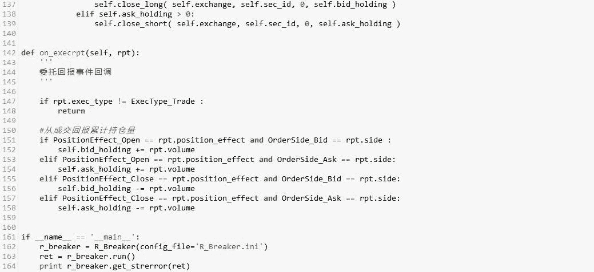

# 【Python 量化投资】经典策略复现之 R-Breaker（附源码）

> 原文：[`mp.weixin.qq.com/s?__biz=MzAxNTc0Mjg0Mg==&mid=2653284216&idx=1&sn=eac74bc5d29e74d9c8e5c862a4c758ca&chksm=802e256db759ac7bf0abd373ff91fb37ca5bc07053e545dc7a1d55f5e6797567ce435378d41e&scene=27#wechat_redirect`](http://mp.weixin.qq.com/s?__biz=MzAxNTc0Mjg0Mg==&mid=2653284216&idx=1&sn=eac74bc5d29e74d9c8e5c862a4c758ca&chksm=802e256db759ac7bf0abd373ff91fb37ca5bc07053e545dc7a1d55f5e6797567ce435378d41e&scene=27#wechat_redirect)

（文末给出解释）

R-Breaker 是个经典的具有长生命周期的日内模型

类型：日内趋势追踪+反转策略

周期：1 分钟、5 分钟

根据前一个交易日的收盘价、最高价和最低价数据通过一定方式计算出六个价位，

从大到小依次为：

突破买入价（buy_break)、观察卖出价(sell_setup)、

反转卖出价(sell_enter)、反转买入价(buy_enter)、

观察买入价(buy_setup)、突破卖出价(sell_break)

 

以此来形成当前交易日盘中交易的触发条件。

**交易规则：**

**- 反转:**

    - 持多单，当日内最高价超过观察卖出价后，盘中价格出现回落，且进一步跌破反转卖出价构成的支撑线时，采取反转策略，即在该点位反手做空；

    - 持空单，当日内最低价低于观察买入价后，盘中价格出现反弹，且进一步超过反转买入价构成的阻力线时，采取反转策略，即在该点位反手做多；

**- 突破:**

    - 在空仓的情况下，如果盘中价格超过突破买入价，则采取趋势策略，即在该点位开仓做多；

    - 在空仓的情况下，如果盘中价格跌破突破卖出价，则采取趋势策略，即在该点位开仓做空；

**源代码**

 

**关注者**

**从 1 到 10000+**

**每天我们都在进步**

**阅读量前 10 文章**

**No.01** [给你说个事，私募机构量化研究员的薪酬水平……](http://mp.weixin.qq.com/s?__biz=MzAxNTc0Mjg0Mg==&mid=2653284109&idx=1&sn=00908f6ab13f3cd3e5214706316ac84e&chksm=802e2518b759ac0e516e5cc6e9b5f62dd22853203ba8298f5f681139a9cc0a45c1cdfa9c421e&scene=21#wechat_redirect)

**No.02** [独家揭秘新财富金融工程领域那些 NB 的分析师们](http://mp.weixin.qq.com/s?__biz=MzAxNTc0Mjg0Mg==&mid=2653284026&idx=1&sn=ed8bb9ceca543eaa620c284ad4e374ce&chksm=802e24afb759adb99e6cee24f26e063fb7f43855349b8142d06b4c766fee16f1df5676a0dd74&scene=21#wechat_redirect)

**No.03** [跟你讲个笑话，我是做私募的……](http://mp.weixin.qq.com/s?__biz=MzAxNTc0Mjg0Mg==&mid=2653283777&idx=1&sn=252e295b1a788da1aaadf39c2ef959ee&scene=21#wechat_redirect)

**No.04** [全网首发机器学习该如何应用到量化投资系列](http://mp.weixin.qq.com/s?__biz=MzAxNTc0Mjg0Mg==&mid=2653283935&idx=1&sn=56e84e986f278403d8840387c615a2a7&chksm=802e244ab759ad5c43720a7960567d215970877250ca72534016bf53a021c73f83665068639d&scene=21#wechat_redirect)

**No.05**  [增强学习与量化投资初探](http://mp.weixin.qq.com/s?__biz=MzAxNTc0Mjg0Mg==&mid=2653283440&idx=1&sn=e5dc6e12f7b28b5ede13bd582b59b73c&scene=21#wechat_redirect)

**No.06**  [量化缠论系列文章](http://mp.weixin.qq.com/s?__biz=MzAxNTc0Mjg0Mg==&mid=2653283801&idx=1&sn=0a05bb0247535a118183be2b917c56b4&scene=21#wechat_redirect)

**No.07**  [书籍干货国外深度学习与机器学习书籍](http://mp.weixin.qq.com/s?__biz=MzAxNTc0Mjg0Mg==&mid=2653283143&idx=1&sn=2316c1a067239aa007196cc8cb2e6c5b&scene=21#wechat_redirect)

**No.08**  [机器学习资料整理](http://mp.weixin.qq.com/s?__biz=MzAxNTc0Mjg0Mg==&mid=2653282920&idx=1&sn=6faa96116c590c75d92569351f987e52&scene=21#wechat_redirect)

**No.09** [互联网金融之量化投资深度文本挖掘附源码](http://mp.weixin.qq.com/s?__biz=MzAxNTc0Mjg0Mg==&mid=2653282879&idx=1&sn=12a91c4b8317662fbae470541ebe4683&scene=21#wechat_redirect)

**No.10** [七夕没有对象的宽客都在看这篇文章](http://mp.weixin.qq.com/s?__biz=MzAxNTc0Mjg0Mg==&mid=2653283478&idx=1&sn=aa061849c61ee84eedda3ac9d0c74ec5&scene=21#wechat_redirect)

听说，置顶关注我们的人都不一般

****