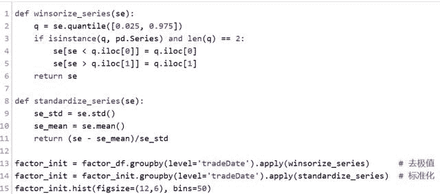

# 【Python 量化投资】基于单因子的 Alpha 预测

> 原文：[`mp.weixin.qq.com/s?__biz=MzAxNTc0Mjg0Mg==&mid=2653284193&idx=1&sn=53bd83e937415d8537451e01542e7a61&chksm=802e2574b759ac629c23ce404af1f0824b73d02c48a0994be7fe16d8b7fd33e57f69ae09364b&scene=27#wechat_redirect`](http://mp.weixin.qq.com/s?__biz=MzAxNTc0Mjg0Mg==&mid=2653284193&idx=1&sn=53bd83e937415d8537451e01542e7a61&chksm=802e2574b759ac629c23ce404af1f0824b73d02c48a0994be7fe16d8b7fd33e57f69ae09364b&scene=27#wechat_redirect)

**AlphaHorizon 介绍 - 以非流动性因子 ILLIQ 为例**名称解释：**AlphaHorizon**是优矿团队实现的基于单因子的 Alpha 研究和实现一种过程和方法。AlphaHorizon 可以对研究得到的 alpha 因子做一个比较完整的分析报告，包括 alpha 因子的回测、IC 和换手率等等。需要注意的是，AlphaHorizon 的分析和真实的策略交易是不一样的，它**仅仅着眼于 alpha 因子对于收益率的预测方面**。 数据加载和处理部分 AlphaHorizon 需要的数据因子数据格式为 Series - MultiIndex，MultiIndex 包括 tradeDate、secID 两级价格数据格式为 DataFrame, index 为 tradeDate，columns 为各个股票的 secID；价格即收盘价本文的分析中，使用从 09 年至今的超过 7 年数据进行回测。['2009-01-05', '2009-01-06', '2009-01-07', '2009-01-08', '2009-01-09']1）因子数据加载2）因子数据处理对因子数据进行截面处理：去极值，标准化3）价格和行业数据加载此处篇幅较大，细节请参考优矿社区本篇文章。

 AlphaHorizon 分析部分 1）数据整理通过 AlphaHorizon 包（可从优矿导入）的 get_clean_factor_and_forward_returns 函数，将因子和价格数据转成目标格式。得到行业因子分类和前瞻收益率数据，前瞻窗口默认为 1、5、10、20，对应于日度、周度、半月度、月度调仓。2）分位数收益简要分析将股票按照 alpha 因子分为不同的分位数组合，默认分为 5 分位，每天计算不同分位数组合内股票的平均超额收益（此处的超额收益为超过市场平均的收益，下同），得到的不同分位数组合内股票的平均超额收益，再取时间序列平均。作图展示不同分位数组合的日平均超额收益情况，图中的纵轴超额收益的单位为 bps(0.0001):无论前瞻时间窗口，第五分位组合的超额收益均为正，第一分位组合超额收益则为负从一至五，各个分位数组合超额收益呈现递增趋势还可以计算最好与最坏的分位数组合的平均超额收益之差，并作为时间序列画出来做多最好的分位数组合，同时做空最坏的分位数组合；下图给出这一策略的累积收益曲线3）信息系数分析信息系数衡量的是因子对股票横截面超额收益率的预测能力；计算方式为当期因子值与下期股票收益率之间的秩相关系数；信息系数越接近于 1，说明因子的预测效果越好。对于不同的调仓周期，IC 月度平均后作热度图：图中颜色越红表示 IC 越大，也即表示因子在这个月表现良好；颜色越绿表示因子在这个月表现不佳；注意，2016 年 7 月之后的绿色是因为没有回测数据而 IC 为 nan 可以注意到，2014 年 11 月和 12 月 IC 出现显著为绿色的情况，是因为这一段时间小盘股表现明显弱于大盘股，而 ILLIQ 有小盘股暴露 4）换手率分析计算因子换手率可以展示出因子的时间序列稳定性，侧面反映出使用该因子做策略时候的调仓成本等。可以看到，该因子月度调仓，其换手大致在 40%附近，多头组合换手率略高于空头组合。5）分行业表现上述的 IC 和超额收益分析，可以很容易的拓展到分行业的情况分行业的 IC 均值作图，可以看到该因子在不同行业里的表现相对来说都比较均衡；不同的颜色代表不同的调仓周期对于不同的行业，计算用因子分位数选股构建组合得到的平均超额收益；直方图中不同的颜色代表不同的调仓周期

 总结性表格对不同调仓周期，以因子值为权重构建多空组合，得到的策略回测结果的统计

**本次因子的分析借助优矿量化平台实现。**

往期精彩阅读链接 

直接点击，查看往期精彩文章

*   [【HMM 系列】之 HMM 指数择时深度研究](http://mp.weixin.qq.com/s?__biz=MzAxNTc0Mjg0Mg==&mid=2653283909&idx=1&sn=ff416c442cd1a9382bbd2142f9679745&scene=21#wechat_redirect)

*   [机器学习该如何应用到量化投资系列（一）](http://mp.weixin.qq.com/s?__biz=MzAxNTc0Mjg0Mg==&mid=2653283935&idx=1&sn=56e84e986f278403d8840387c615a2a7&chksm=802e244ab759ad5c43720a7960567d215970877250ca72534016bf53a021c73f83665068639d&scene=21#wechat_redirect)

*   [机器学习该如何应用到量化投资系列（二）](http://mp.weixin.qq.com/s?__biz=MzAxNTc0Mjg0Mg==&mid=2653283982&idx=1&sn=6a14e2e145d8e7db46ba64a1439e1b2f&chksm=802e249bb759ad8d436e05f51625be0f5142ab8af374ebcfad24c332efc5fd0190a8283cbdfb&scene=21#wechat_redirect)

*   [【Python 量化投资】对数周期幂率（LPPL）模型在 A 股中应用](http://mp.weixin.qq.com/s?__biz=MzAxNTc0Mjg0Mg==&mid=2653283845&idx=1&sn=a00892888cd23b2bbb8c95ad3605218d&scene=21#wechat_redirect)

*   [【量化投资策略探讨】决策树和随机森林](http://mp.weixin.qq.com/s?__biz=MzAxNTc0Mjg0Mg==&mid=2653283764&idx=1&sn=f61f65377473e55428f9c2204d148b25&scene=21#wechat_redirect)

*   [公众号干货精华帖整理从创办至今](http://mp.weixin.qq.com/s?__biz=MzAxNTc0Mjg0Mg==&mid=2653283882&idx=1&sn=154943c97279a743190c9573e2e8f52e&scene=21#wechat_redirect)

*   [【Matlab 量化投资】GFTD 指标程序化实现](http://mp.weixin.qq.com/s?__biz=MzAxNTc0Mjg0Mg==&mid=2653283878&idx=1&sn=387f9395917442553bbfde43183ce010&scene=21#wechat_redirect)

*   [【量化缠论】系列文章（一）](http://mp.weixin.qq.com/s?__biz=MzAxNTc0Mjg0Mg==&mid=2653283801&idx=1&sn=0a05bb0247535a118183be2b917c56b4&scene=21#wechat_redirect)

*   [跟你讲个笑话，我是做私募的……](http://mp.weixin.qq.com/s?__biz=MzAxNTc0Mjg0Mg==&mid=2653283777&idx=1&sn=252e295b1a788da1aaadf39c2ef959ee&scene=21#wechat_redirect)

*   [【干货】各大券商研究报告！](http://mp.weixin.qq.com/s?__biz=MzAxNTc0Mjg0Mg==&mid=2653283773&idx=1&sn=d4604682da0c5563be9da16717d11bf9&scene=21#wechat_redirect)

*   [【重磅干货】Matlab 高频算法交易从基础到高级算法的完美 实现](http://mp.weixin.qq.com/s?__biz=MzAxNTc0Mjg0Mg==&mid=2653283757&idx=1&sn=35a7faaf06721de2b8fdb5673126022a&scene=21#wechat_redirect)

*   [马尔可夫区制转换模型与金融市场周期【附源码】](http://mp.weixin.qq.com/s?__biz=MzAxNTc0Mjg0Mg==&mid=2653283605&idx=2&sn=aa9c31166efba53c3bf5dd496d7357e0&scene=21#wechat_redirect)

*   [【多因子系列】之新手必看 | 量化交易七宗罪](http://mp.weixin.qq.com/s?__biz=MzAxNTc0Mjg0Mg==&mid=2653283543&idx=1&sn=f7376931ac3a99647b26ba5fa0c597d7&scene=21#wechat_redirect)

*   [【多因子系列之二】where is my alpha](http://mp.weixin.qq.com/s?__biz=MzAxNTc0Mjg0Mg==&mid=2653283598&idx=1&sn=53973fe24d449159e896616faae6c804&scene=21#wechat_redirect)

*   [【机器学习】支持向量机的概念与运用初探](http://mp.weixin.qq.com/s?__biz=MzAxNTc0Mjg0Mg==&mid=2653283515&idx=1&sn=edeedbb0190fc1c1242de5795635fccc&scene=21#wechat_redirect)

*   [七夕没有对象的宽客都在看这篇文章](http://mp.weixin.qq.com/s?__biz=MzAxNTc0Mjg0Mg==&mid=2653283478&idx=1&sn=aa061849c61ee84eedda3ac9d0c74ec5&scene=21#wechat_redirect)

*   [【Python 机器学习】信息熵和在决策树中的运用（附源码）](http://mp.weixin.qq.com/s?__biz=MzAxNTc0Mjg0Mg==&mid=2653283451&idx=1&sn=2f10aaa1083856c0a2e07e718a3973cd&scene=21#wechat_redirect)

*   [增强学习与量化投资初探](http://mp.weixin.qq.com/s?__biz=MzAxNTc0Mjg0Mg==&mid=2653283440&idx=1&sn=e5dc6e12f7b28b5ede13bd582b59b73c&scene=21#wechat_redirect)

*   [【Python 机器学习】数据预处理——图像压缩与线性代数](http://mp.weixin.qq.com/s?__biz=MzAxNTc0Mjg0Mg==&mid=2653283419&idx=1&sn=43f113c5e81745b607e9e1f60e7f1a35&scene=21#wechat_redirect)

*   [【每周书籍干货】国外近期深度学习与机器学习书籍电子版——你知道一本买来好多刀啊！](http://mp.weixin.qq.com/s?__biz=MzAxNTc0Mjg0Mg==&mid=2653283143&idx=1&sn=2316c1a067239aa007196cc8cb2e6c5b&scene=21#wechat_redirect)

*   [【Matlab 量化投资】根据期货高频数据和期货交易所交易规则以及 BS 方法判断高频交易方向和多空主力建仓减仓行为（附源码！！！）](http://mp.weixin.qq.com/s?__biz=MzAxNTc0Mjg0Mg==&mid=2653283293&idx=1&sn=7c26d2958d1a463686b2600c69bd9bff&scene=21#wechat_redirect)

*   [【量化投资系列】基于多重分形理论的短趋势择时策略研究](http://mp.weixin.qq.com/s?__biz=MzAxNTc0Mjg0Mg==&mid=2653283004&idx=1&sn=95a79928c89a69ac12d07514f5085c9a&scene=21#wechat_redirect)

*   [【重！磅！干！货！】互联网金融之量化投资深度文本挖掘——附源码文档](http://mp.weixin.qq.com/s?__biz=MzAxNTc0Mjg0Mg==&mid=2653282879&idx=1&sn=12a91c4b8317662fbae470541ebe4683&scene=21#wechat_redirect)

*   [【机器学习资料整理】（学习工具、学习视频、博客和文章推荐、ML 相关算法参考、部分机器学习译文）](http://mp.weixin.qq.com/s?__biz=MzAxNTc0Mjg0Mg==&mid=2653282920&idx=1&sn=6faa96116c590c75d92569351f987e52&scene=21#wechat_redirect)

*   [大数据之微信公众号深度量化研究](http://mp.weixin.qq.com/s?__biz=MzAxNTc0Mjg0Mg==&mid=404626412&idx=1&sn=502f2a57b8f9b13887c30fb65e39a7f7&scene=21#wechat_redirect)

听说，置顶关注我们的人都不一般

****