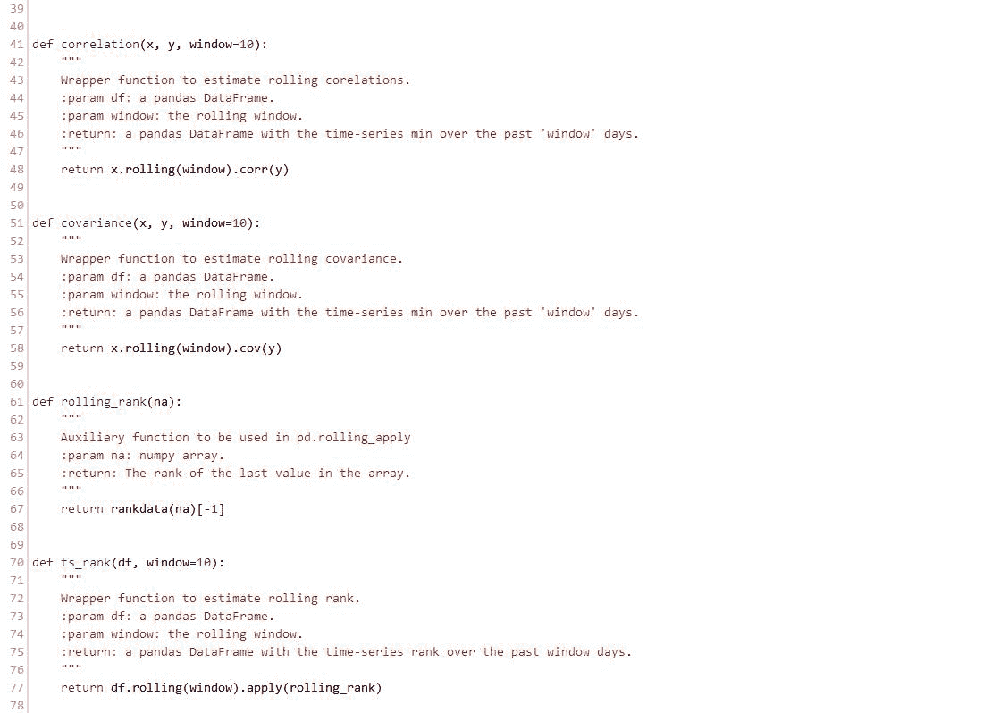

# Formulaic 101 Alpha （Alpha#01 - Alpha#60）

> 原文：[`mp.weixin.qq.com/s?__biz=MzAxNTc0Mjg0Mg==&mid=2653284191&idx=1&sn=e509207081fdc4a4741605db1f96205b&chksm=802e254ab759ac5c87a8ea46c9771a8c8136956c888479bc494f68c40a96c2b8023be781cb28&scene=27#wechat_redirect`](http://mp.weixin.qq.com/s?__biz=MzAxNTc0Mjg0Mg==&mid=2653284191&idx=1&sn=e509207081fdc4a4741605db1f96205b&chksm=802e254ab759ac5c87a8ea46c9771a8c8136956c888479bc494f68c40a96c2b8023be781cb28&scene=27#wechat_redirect)

**Alpha#01-#60**

class Alphas(object):

    def __init__(self, pn_data):

        """

        :type pn_data: pandas.Panel

        """

        self.open = pn_data.minor_xs('Open')

        self.high = pn_data.minor_xs('High')

        self.low = pn_data.minor_xs('Low')

        self.close = pn_data.minor_xs('Close')

        self.volume = pn_data.minor_xs('Volume')

        self.returns = self.close.pct_change()

    def alpha001(self):

        inner = self.close

        inner[self.returns < 0] = stddev(self.returns, 20)

        return rank(ts_argmax(inner ** 2, 5))

    def alpha002(self):

        df = -1 * correlation(rank(delta(log(self.volume), 2)), rank((self.close - self.open) / self.open), 6)

        return df.replace([-np.inf, np.inf], 0).fillna(value=0)

    def alpha003(self):

        df = -1 * correlation(rank(self.open), rank(self.volume), 10)

        return df.replace([-np.inf, np.inf], 0).fillna(value=0)

    def alpha004(self):

        return -1 * ts_rank(rank(self.low), 9)

    def alpha006(self):

        df = -1 * correlation(self.open, self.volume, 10)

        return df.replace([-np.inf, np.inf], 0).fillna(value=0)

    def alpha007(self):

        adv20 = sma(self.volume, 20)

        alpha = -1 * ts_rank(abs(delta(self.close, 7)), 60) * sign(delta(self.close, 7))

        alpha[adv20 >= self.volume] = -1

        return alpha

    def alpha008(self):

        return -1 * (rank(((ts_sum(self.open, 5) * ts_sum(self.returns, 5)) -

                           delay((ts_sum(self.open, 5) * ts_sum(self.returns, 5)), 10))))

    def alpha009(self):

        delta_close = delta(self.close, 1)

        cond_1 = ts_min(delta_close, 5) > 0

        cond_2 = ts_max(delta_close, 5) < 0

        alpha = -1 * delta_close

        alpha[cond_1 | cond_2] = delta_close

        return alpha

    def alpha010(self):

        delta_close = delta(self.close, 1)

        cond_1 = ts_min(delta_close, 4) > 0

        cond_2 = ts_max(delta_close, 4) < 0

        alpha = -1 * delta_close

        alpha[cond_1 | cond_2] = delta_close

        return alpha

    def alpha012(self):

        return sign(delta(self.volume, 1)) * (-1 * delta(self.close, 1))

    def alpha013(self):

        return -1 * rank(covariance(rank(self.close), rank(self.volume), 5))

    def alpha014(self):

        df = correlation(self.open, self.volume, 10)

        df = df.replace([-np.inf, np.inf], 0).fillna(value=0)

        return -1 * rank(delta(self.returns, 3)) * df

    def alpha015(self):

        df = correlation(rank(self.high), rank(self.volume), 3)

        df = df.replace([-np.inf, np.inf], 0).fillna(value=0)

        return -1 * ts_sum(rank(df), 3)

    def alpha016(self):

        return -1 * rank(covariance(rank(self.high), rank(self.volume), 5))

    def alpha017(self):

        adv20 = sma(self.volume, 20)

        return -1 * (rank(ts_rank(self.close, 10)) *

                     rank(delta(delta(self.close, 1), 1)) *

                     rank(ts_rank((self.volume / adv20), 5)))

    def alpha018(self):

        df = correlation(self.close, self.open, 10)

        df = df.replace([-np.inf, np.inf], 0).fillna(value=0)

        return -1 * (rank((stddev(abs((self.close - self.open)), 5) + (self.close - self.open)) +

                          df))

    def alpha019(self):

        return ((-1 * sign((self.close - delay(self.close, 7)) + delta(self.close, 7))) *

                (1 + rank(1 + ts_sum(self.returns, 250))))

    def alpha020(self):

        return -1 * (rank(self.open - delay(self.high, 1)) *

                     rank(self.open - delay(self.close, 1)) *

                     rank(self.open - delay(self.low, 1)))

    def alpha021(self):

        cond_1 = sma(self.close, 8) + stddev(self.close, 8) < sma(self.close, 2)

        cond_2 = sma(self.volume, 20) / self.volume < 1

        alpha = pd.DataFrame(np.ones_like(self.close), index=self.close.index,

                             columns=self.close.columns)

        alpha[cond_1 | cond_2] = -1

        return alpha

    def alpha022(self):

        df = correlation(self.high, self.volume, 5)

        df = df.replace([-np.inf, np.inf], 0).fillna(value=0)

        return -1 * delta(df, 5) * rank(stddev(self.close, 20))

    def alpha023(self):

        cond = sma(self.high, 20) < self.high

        alpha = pd.DataFrame(np.zeros_like(self.close), index=self.close.index,

                             columns=self.close.columns)

        alpha[cond] = -1 * delta(self.high, 2)

        return alpha

    def alpha024(self):

        cond = delta(sma(self.close, 100), 100) / delay(self.close, 100) <= 0.05

        alpha = -1 * delta(self.close, 3)

        alpha[cond] = -1 * (self.close - ts_min(self.close, 100))

        return alpha

    def alpha026(self):

        df = correlation(ts_rank(self.volume, 5), ts_rank(self.high, 5), 5)

        df = df.replace([-np.inf, np.inf], 0).fillna(value=0)

        return -1 * ts_max(df, 3)

    def alpha028(self):

        adv20 = sma(self.volume, 20)

        df = correlation(adv20, self.low, 5)

        df = df.replace([-np.inf, np.inf], 0).fillna(value=0)

        return scale(((df + ((self.high + self.low) / 2)) - self.close))

    def alpha029(self):

        return (ts_min(rank(rank(scale(log(ts_sum(rank(rank(-1 * rank(delta((self.close - 1), 5)))), 2))))), 5) +

                ts_rank(delay((-1 * self.returns), 6), 5))

    def alpha030(self):

        delta_close = delta(self.close, 1)

        inner = sign(delta_close) + sign(delay(delta_close, 1)) + sign(delay(delta_close, 2))

        return ((1.0 - rank(inner)) * ts_sum(self.volume, 5)) / ts_sum(self.volume, 20)

    def alpha031(self):

        adv20 = sma(self.volume, 20)

        df = correlation(adv20, self.low, 12)

        df = df.replace([-np.inf, np.inf], 0).fillna(value=0)

        return ((rank(rank(rank(decay_linear((-1 * rank(rank(delta(self.close, 10)))), 10)))) +

                 rank((-1 * delta(self.close, 3)))) + sign(scale(df)))

    def alpha033(self):

        return rank(-1 + (self.open / self.close))

    def alpha034(self):

        inner = stddev(self.returns, 2) / stddev(self.returns, 5)

        inner = inner.replace([-np.inf, np.inf], 1).fillna(value=1)

        return rank(2 - rank(inner) - rank(delta(self.close, 1)))

    def alpha035(self):

        return ((ts_rank(self.volume, 32) *

                 (1 - ts_rank(self.close + self.high - self.low, 16))) *

                (1 - ts_rank(self.returns, 32)))

    def alpha037(self):

        return rank(correlation(delay(self.open - self.close, 1), self.close, 200)) + rank(self.open - self.close)

    def alpha038(self):

        inner = self.close / self.open

        inner = inner.replace([-np.inf, np.inf], 1).fillna(value=1)

        return -1 * rank(ts_rank(self.open, 10)) * rank(inner)

    def alpha039(self):

        adv20 = sma(self.volume, 20)

        return ((-1 * rank(delta(self.close, 7) * (1 - rank(decay_linear(self.volume / adv20, 9))))) *

                (1 + rank(ts_sum(self.returns, 250))))

    def alpha040(self):

        return -1 * rank(stddev(self.high, 10)) * correlation(self.high, self.volume, 10)

    def alpha043(self):

        adv20 = sma(self.volume, 20)

        return ts_rank(self.volume / adv20, 20) * ts_rank((-1 * delta(self.close, 7)), 8)

    def alpha044(self):

        df = correlation(self.high, rank(self.volume), 5)

        df = df.replace([-np.inf, np.inf], 0).fillna(value=0)

        return -1 * df

    def alpha045(self):

        df = correlation(self.close, self.volume, 2)

        df = df.replace([-np.inf, np.inf], 0).fillna(value=0)

        return -1 * (rank(sma(delay(self.close, 5), 20)) * df *

                     rank(correlation(ts_sum(self.close, 5), ts_sum(self.close, 20), 2)))

    def alpha046(self):

        inner = ((delay(self.close, 20) - delay(self.close, 10)) / 10) - ((delay(self.close, 10) - self.close) / 10)

        alpha = (-1 * delta(self.close))

        alpha[inner < 0] = 1

        alpha[inner > 0.25] = -1

        return alpha

    def alpha049(self):

        inner = (((delay(self.close, 20) - delay(self.close, 10)) / 10) - ((delay(self.close, 10) - self.close) / 10))

        alpha = (-1 * delta(self.close))

        alpha[inner < -0.1] = 1

        return alpha

    def alpha051(self):

        inner = (((delay(self.close, 20) - delay(self.close, 10)) / 10) - ((delay(self.close, 10) - self.close) / 10))

        alpha = (-1 * delta(self.close))

        alpha[inner < -0.05] = 1

        return alpha

    def alpha052(self):

        return (((-1 * delta(ts_min(self.low, 5), 5)) *

                 rank(((ts_sum(self.returns, 240) - ts_sum(self.returns, 20)) / 220))) * ts_rank(self.volume, 5))

    def alpha053(self):

        inner = (self.close - self.low).replace(0, 0.0001)

        return -1 * delta((((self.close - self.low) - (self.high - self.close)) / inner), 9)

    def alpha054(self):

        inner = (self.low - self.high).replace(0, -0.0001)

        return -1 * (self.low - self.close) * (self.open ** 5) / (inner * (self.close ** 5))

    def alpha055(self):

        divisor = (ts_max(self.high, 12) - ts_min(self.low, 12)).replace(0, 0.0001)

        inner = (self.close - ts_min(self.low, 12)) / (divisor)

        df = correlation(rank(inner), rank(self.volume), 6)

        return -1 * df.replace([-np.inf, np.inf], 0).fillna(value=0)

    def alpha060(self):

        divisor = (self.high - self.low).replace(0, 0.0001)

        inner = ((self.close - self.low) - (self.high - self.close)) * self.volume / divisor

        return - ((2 * scale(rank(inner))) - scale(rank(ts_argmax(self.close, 10))))

听说，置顶关注我们的人都不一般

****