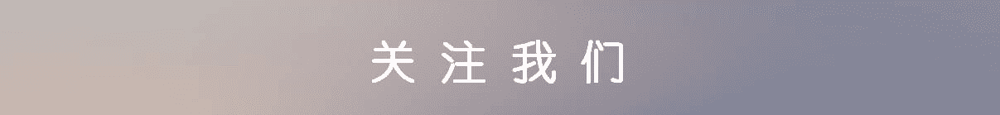
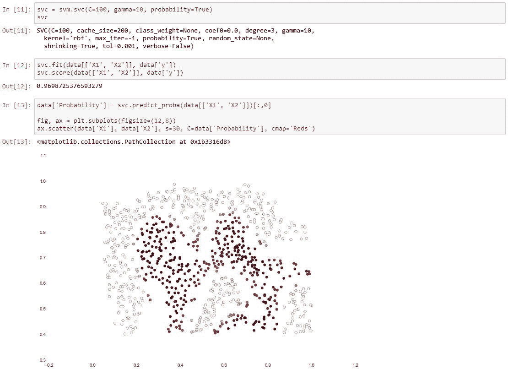

# 【Python 机器学习】支持向量机（附源码）

> 原文：[`mp.weixin.qq.com/s?__biz=MzAxNTc0Mjg0Mg==&mid=2653284165&idx=1&sn=15c8e39e21d9a7a6904a8ed9f0c16758&chksm=802e2550b759ac463b0c3dcca360c91f43964926dcf5d7ddedb6bbc7351171d4ad76443abe39&scene=27#wechat_redirect`](http://mp.weixin.qq.com/s?__biz=MzAxNTc0Mjg0Mg==&mid=2653284165&idx=1&sn=15c8e39e21d9a7a6904a8ed9f0c16758&chksm=802e2550b759ac463b0c3dcca360c91f43964926dcf5d7ddedb6bbc7351171d4ad76443abe39&scene=27#wechat_redirect)

从本周开始，推送一个系列关于 **Python 机器学习 。**为了保证内容的原汁原味。我们采取全英的推送。希望大家有所收获。提高自己的英语阅读能力和研究水平。

> In this exercise, we'll be using support vector machines (SVMs) to build a spam classifier. We'll start with SVMs on some simple 2D data sets to see how they work. Then we'll do some pre-processing work on a set of raw emails and build a classifier on the processed emails using a SVM to determine if they are spam or not.
> 
> The first thing we're going to do is look at a simple 2-dimensional data set and see how a linear SVM works on the data set for varying values of C (similar to the regularization term in linear/logistic regression). Let's load the data.

We'll visualize it as a scatter plot where the class label is denoted by a symbol (+ for positive, o for negative).

 

Notice that there is one outlier positive example that sits apart from the others. The classes are still linearly separable but it's a very tight fit. We're going to train a linear support vector machine to learn the class boundary. In this exercise we're not tasked with implementing an SVM from scratch, so I'm going to use the one built into scikit-learn.

The difference is a bit subtle but look at the color of the points near the boundary. If you're following along in the exercise text, there's a drawing where the decision boundary is shown as a line on the plot which helps make the difference a bit clearer.

Now we're going to move from a linear SVM to one that's capable of non-linear classification using kernels. We're first tasked with implementing a gaussian kernel function. Although scikit-learn has a gaussian kernel built in, for transparency we'll implement one from scratch.

For this data set we'll build a support vector machine classifier using the built-in RBF kernel and examine its accuracy on the training data. To visualize the decision boundary, this time we'll shade the points based on the predicted probability that the instance has a negative class label. We'll see from the result that it gets most of them right.

For the third data set we're given both training and validation sets and tasked with finding optimal hyper-parameters for an SVM model based on validation set performance. Although we could use scikit-learn's built-in grid search to do this quite easily, in the spirit of following the exercise directions we'll implement a simple grid search from scratch.

 

Now we'll move on to the second part of the exercise. In this part our objective is to use SVMs to build a spam filter. In the exercise text, there's a task involving some text pre-processing to get our data in a format suitable for an SVM to handle. However, the task is pretty trivial (mapping words to an ID from a dictionary that's provided for the exercise) and the rest of the pre-processing steps such as HTML removal, stemming,normalization etc. are already done. Rather than reproduce these pre-processing steps, I'm going to skip ahead to the machine learning task which involves building a classifier from pre-processed train and test data sets consisting of spam and non-spam emails transformed to word occurance vectors.

 

听说，置顶关注我们的人都不一般

****