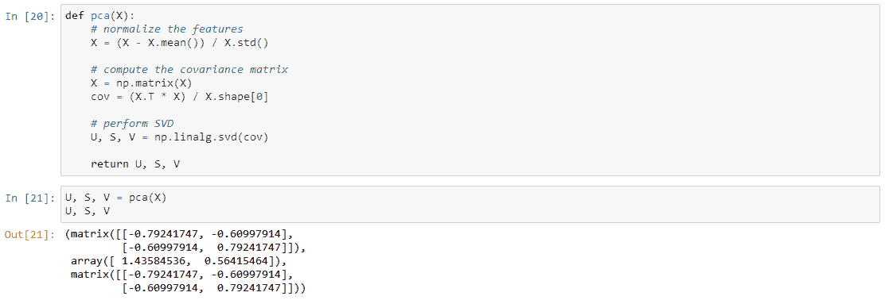

# 【Python 机器学习】K-Means 聚类和主成分分析（附源码）

> 原文：[`mp.weixin.qq.com/s?__biz=MzAxNTc0Mjg0Mg==&mid=2653284144&idx=1&sn=54155dd516a3e9afd446b405c2022c8c&chksm=802e2525b759ac33f7104f788ba7a69554bef895fe443e9243f259b05c93f5bdd95e54d338a0&scene=27#wechat_redirect`](http://mp.weixin.qq.com/s?__biz=MzAxNTc0Mjg0Mg==&mid=2653284144&idx=1&sn=54155dd516a3e9afd446b405c2022c8c&chksm=802e2525b759ac33f7104f788ba7a69554bef895fe443e9243f259b05c93f5bdd95e54d338a0&scene=27#wechat_redirect)

从本周开始，推送一个系列关于 **Python 机器学习 。**为了保证内容的原汁原味。我们采取全英的推送。希望大家有所收获。提高自己的英语阅读能力和研究水平。

> ## **K-means clustering**
> 
> To start out we're going to implement and apply K-means to a simple 2-dimensional data set to gain some intuition about how it works. K-means is an iterative, unsupervised clustering algorithm that groups similar instances together into clusters. The algorithm starts by guessing the initial centroids for each cluster, and then repeatedly assigns instances to the nearest cluster and re-computes the centroid of that cluster. The first piece that we're going to implement is a function that finds the closest centroid for each instance in the data.

> ## The output matches the expected values in the text (remember our arrays are zero-indexed instead of one-indexed so the values are one lower than in the exercise). Next we need a function to compute the centroid of a cluster. The centroid is simply the mean of all of the examples currently assigned to the cluster.

> ## This output also matches the expected values from the exercise. So far so good. The next part involves actually running the algorithm for some number of iterations and visualizing the result. This step was implmented for us in the exercise, but since it's not that complicated I'll build it here from scratch. In order to run the algorithm we just need to alternate between assigning examples to the nearest cluster and re-computing the cluster centroids.

One step we skipped over is a process for initializing the centroids. This can affect the convergence of the algorithm. We're tasked with creating a function that selects random examples and uses them as the initial centroids.

Our next task is to apply K-means to image compression. The intuition here is that we can use clustering to find a small number of colors that are most representative of the image, and map the original 24-bit colors to a lower-dimensional color space using the cluster assignments. Here's the image we're going to compress.

 

 

Now we need to apply some pre-processing to the data and feed it into the K-means algorithm.

 

 

Cool! You can see that we created some artifacts in the compression but the main features of the image are still there. That's it for K-means. We'll now move on to principal component analysis.

> ## **Principal component analysis**
> 
> PCA is a linear transformation that finds the "principal components", or directions of greatest variance, in a data set. It can be used for dimension reduction among other things. In this exercise we're first tasked with implementing PCA and applying it to a simple 2-dimensional data set to see how it works. Let's start off by loading and visualizing the data set.

The algorithm for PCA is fairly simple. After ensuring that the data is normalized, the output is simply the singular value decomposition of the covariance matrix of the original data.

Now that we have the principal components (matrix U), we can use these to project the original data into a lower-dimensional space. For this task we'll implement a function that computes the projection and selects only the top K components, effectively reducing the number of dimensions.

 

We can also attempt to recover the original data by reversing the steps we took to project it. 

Notice that the projection axis for the first principal component was basically a diagonal line through the data set. When we reduced the data to one dimension, we lost the variations around that diagonal line, so in our reproduction everything falls along that diagonal.

Our last task in this exercise is to apply PCA to images of faces. By using the same dimension reduction techniques we can capture the "essence" of the images using much less data than the original images.

The exercise code includes a function that will render the first 100 faces in the data set in a grid. Rather than try to re-produce that here, you can look in the exercise text for an example of what they look like. We can at least render one image fairly easily though.

Yikes, that looks awful. These are only 32 x 32 grayscale images though (it's also rendering sideways, but we can ignore that for now). Anyway's let's proceed. Our next step is to run PCA on the faces data set and take the top 100 principal components.

 Now we can attempt to recover the original structure and render it again.

 

听说，置顶关注我们的人都不一般

****