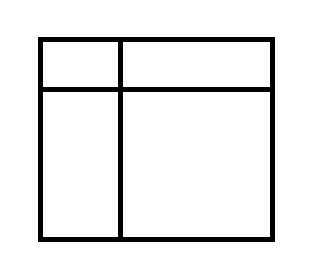

# 在周末遇到了失散多年的李雷和韩梅梅

> 原文：[`mp.weixin.qq.com/s?__biz=MzAxNTc0Mjg0Mg==&mid=2653284115&idx=1&sn=3120d27b898b8be4a28412d835bb2064&chksm=802e2506b759ac10e3e1ec8c70d0128eec83d3c74c8bd0d0b7b6e61b2c7a85399b6214ae2f79&scene=27#wechat_redirect`](http://mp.weixin.qq.com/s?__biz=MzAxNTc0Mjg0Mg==&mid=2653284115&idx=1&sn=3120d27b898b8be4a28412d835bb2064&chksm=802e2506b759ac10e3e1ec8c70d0128eec83d3c74c8bd0d0b7b6e61b2c7a85399b6214ae2f79&scene=27#wechat_redirect)

今日周末就不推送专业性文章了

小编的一个表弟在上小学，问了两道数学问题，想与大家分享一下，看看大家小学毕业没有啊！

**不要百度**

**不要百度**

**不要百度**

要相信自己

不然

**第一题**

韩梅梅早上从家步行去上学，走完一半路程时，爸爸发现韩梅梅的语文书丢在家里，随即骑车去给韩梅梅送书，追上时，韩梅梅还有 1/5 的路程没有走完，韩梅梅随即上了爸爸的车，由爸爸送往学校，这样韩梅梅比独自步行提早 5 分钟到学校。

**问：韩梅梅从家到学校全部步行需要多少时间。**

**第二题**

李雷把一个正方形用两条线段分成 4 个长方形，这 4 个长方形的周长的和是 18 分米。

**问：原正方形的周长是多少分米？**

大家可以开动大脑

如果做出来

可以发送至留言

周末快乐

听说，置顶关注我们的人都不一般

****