# 给你说个事，私募机构量化研究员的薪酬水平……

> 原文：[`mp.weixin.qq.com/s?__biz=MzAxNTc0Mjg0Mg==&mid=2653284109&idx=1&sn=00908f6ab13f3cd3e5214706316ac84e&chksm=802e2518b759ac0e516e5cc6e9b5f62dd22853203ba8298f5f681139a9cc0a45c1cdfa9c421e&scene=27#wechat_redirect`](http://mp.weixin.qq.com/s?__biz=MzAxNTc0Mjg0Mg==&mid=2653284109&idx=1&sn=00908f6ab13f3cd3e5214706316ac84e&chksm=802e2518b759ac0e516e5cc6e9b5f62dd22853203ba8298f5f681139a9cc0a45c1cdfa9c421e&scene=27#wechat_redirect)

大家都在私募圈子混 很多人会经常问某某某你的工资怎么样啊？
我的工资怎么样！

能给你说嘛！ 你说是吧 今天是周末编辑部说说这个事
**私募机构****量化研究员****的****薪酬水平**

作为一个会写一点程序的本科生你的主要作用就是干活**杂七杂八的开发小任务****前途渺茫的研究项目**薪资反应了供求硕士生就不一样了起码人家多读了几年书在某些方面更加专业虽然不能说是很厉害**但是研究能力确实出众一些**

博士就更不用说了

没有绝对

只有相对

**但是这个社会大多都是**

**看颜值看学历**

你必须承认

量化研究员的招聘条件

**一般都是硕士起步**

有些更是要

**985**

**211**

不光这些

量化研究员

是一个综合素质要求很高的职位

**数学、金融、计算机**

**样样精通**

所以

行业竞争压力大

**搞金融的都去读 CS 了**

**搞计算机的也去学金融了**

———十分尴尬，抢饭碗啊！！！

其实

工资的高低

很大一部分取决于你的能力

不要怕没公司要你

不要怕薪酬太少

不要怕

不要怕

不要怕

**用知识武装自己**

**用勤奋弥补不足**

**薪酬算什么**

**眼光要放长远**

最后一条

要记住

**跟对师父**

 

**————莫入歧途** 

 ****  先来说说“魔都”

**上海**

国际金融大都市

这个不用解释

也不需要解释 直接上表**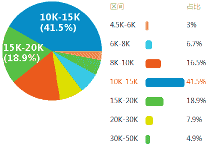** 该数据仅供参考

## **按工作经验统计**

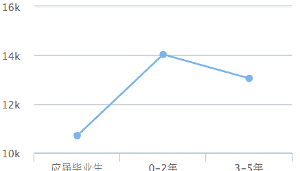

应届毕业生工资¥10700

3-5 年工资¥13050

0-2 年工资¥14030

该数据仅供参考

## **历年工资变化趋势**

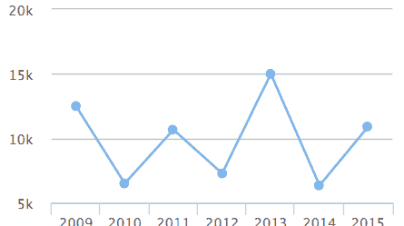

2009 年工资¥12499

2010 年工资¥6500

2011 年工资¥10666

2012 年工资¥7276

2013 年工资¥14999

2014 年工资¥6344

2015 年工资¥10908

该数据仅供参考

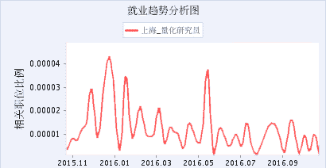

曲线越向上代表市场需求量越大就业情况越好

接下来说说“花都”

**广州**

一个一年四季 

如春的城市

直接上表

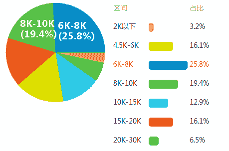 

该数据仅供参考

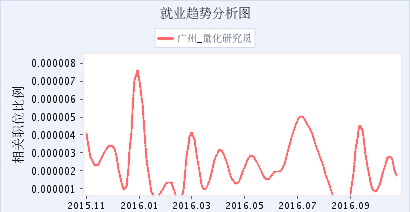

曲线越向上代表市场需求量越大就业情况越好

 

接下来说说“京城”

**北京**

北京的历史

不用解释

北京的政治文化

不用解释

直接上表

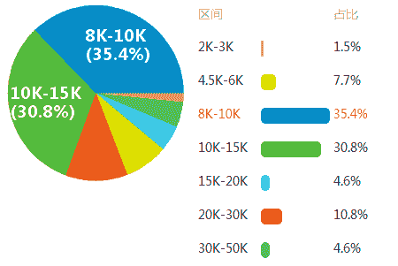

该数据仅供参考

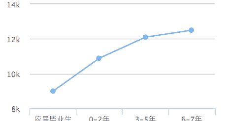

  应届毕业生工资¥9000

0-2 年工资¥10890

3-5 年工资¥12100

6-7 年工资¥12500

该数据仅供参考

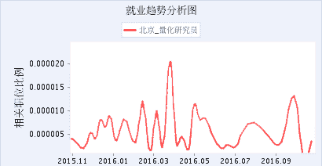

曲线越向上代表市场需求量越大就业情况越好

 

接下来说说“深圳速度”

**深圳**

中国改革开放建立的

第一个经济特区

金融行业迅猛发展

深圳速度

不可一世

直接上表

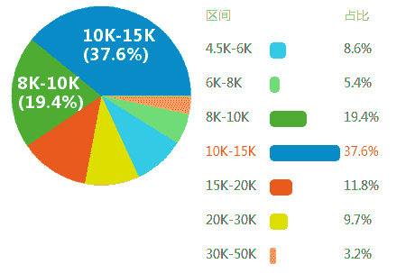

该数据仅供参考

## **按工作经验统计**

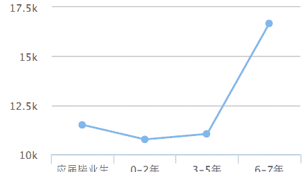

0-2 年工资¥10760

3-5 年工资¥11040

应届毕业生工资¥11500

6-7 年工资¥16670

该数据仅供参考

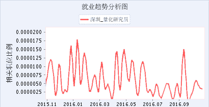 曲线越向上代表市场需求量越大就业情况越好

是不是惊呆了

<fieldset class="96wx-bdc">

因此

你现在能做的就是

**要么主动揽比较复杂的开发活**

**要么多跟大佬学东西提**

**出让老板欣赏的新想法**

让老板感觉到你是**可以独当一面**

（不管是负责系统架构也好

还是负责研究新策略也好）

那么你就能熬出头了

薪酬算什么

</fieldset>

**愿全天下所有****私募机构量化研究员****都能****加薪****加薪****加薪**

听说，置顶关注我们的人都不一般

****