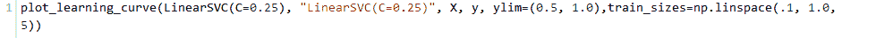
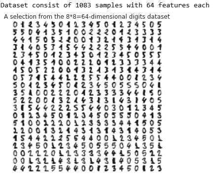

# 【sklearn 机器学习】——应用机器学习的建议

> 原文：[`mp.weixin.qq.com/s?__biz=MzAxNTc0Mjg0Mg==&mid=2653284075&idx=1&sn=e4f049f63885384beb307ce45b8cfc4d&chksm=802e24feb759ade8baf4b39c265ea90c92adb26157fd52840412c7f7a0dce2d7e490d9beea23&scene=27#wechat_redirect`](http://mp.weixin.qq.com/s?__biz=MzAxNTc0Mjg0Mg==&mid=2653284075&idx=1&sn=e4f049f63885384beb307ce45b8cfc4d&chksm=802e24feb759ade8baf4b39c265ea90c92adb26157fd52840412c7f7a0dce2d7e490d9beea23&scene=27#wechat_redirect)

**编辑部在优矿上也有自己的账号。本次推文基于优矿。大家可以点击阅读原文查看。**

本文以 Bremen 大学机器学习课程的教程为基础的。总结了使用机器学习解决新问题的一些建议。包括：

*   可视化数据的方法

*   选择一个适合当前问题的机器学习方法

*   鉴别和解决过拟合和欠拟合问题

*   处理大数据库问题（注意：不是非常小的）

*   不同损失函数的利弊

本文以 Andrew Ng 的《Advice for applying Machine Learning》为基础。
这个笔记的目的是用一个互动的方法解释这些观点。有些建议是可以讨论的。它们仅是建议，不是严格的规则。
翻译参考来自 http://blog.jobbole.com/85680/

# **数据集**

我们使用 `sklearn` 的 make_classification 函数来生成一些简单的玩具数据：

注意到我们为二分类生成了一个数据集，这个数据集包括 1000 个数据点，每个特征 20 维。我们已经使用 pandas 的 DataFrame 类把数据和类别封装到一个共同的数据结构中。通过直接查看原始特征值，我们很难获得该问题的任何线索，即使在这个低维的例子中。因此，有很多的提供数据的更容易视图的方法；其中的小部分将在接下来的部分中讨论。

**可视化**

当你接到一个新的问题，第一步几乎都是可视化，也就是说，观察你的数据。

`Seaborn` 是一个不错的统计数据可视化包。我们使用它的一些函数来探索数据。

第一步是使用 pairplot 生成散点图和直方图。两种颜色对应了两个类别，我们使用了特征的一个子集、仅仅使用前 50 个数据点来简化问题。

基于该直方图，我们可以看到一些特征比其他特征对分类更有用。特别地，特征 11 和 14 看起来有丰富的信息量。这两个特征的散点图显示类别在二维空间中几乎是线性可分的。要更加注意的是，特征 12 和 19 是高度负相关的。我们可以通过使用 corrplot 更系统地探索相关性：

我们可以发现之前的观察结果在这里得到了确认：特征 11 和 14 与类强相关（他们有丰富的信息量）。更进一步，特征 12 和特征 19 强负相关，特征 19 和特征 14 强相关。因此，有一些特征是冗余的。这对于有些分类器可能会出现问题，比如，朴素贝叶斯，它假设所有的特征都是独立的。剩下的特征大部分都是噪声，他们既不相互关联，也不和类别相关。

注意到如果特征维数较大、数据点较少的时候，数据可视化会变得更有挑战性。

# **方法的选择**

一旦我们已经使用可视化方法对数据进行了探索，我们就可以开始应用机器学习了。机器学习方法数量众多，通常很难决定先尝试哪种方法。这个简单的备忘单（归功于 Andreas Müller 和 sklearn 团队）可以帮助你为你的问题选择一个合适的机器学习方法（供选择的备忘录见 http://dlib.net/ml_guide.svg）

我们有了 1000 个样本，要预测一个类别，并且有了标签，那么备忘单推荐我们首先使用 LinearSVC（LinearSVC 代表线性核的支持向量分类，并且对于这类特殊问题使用一个有效的算法）。所有我们做了个试验。LinearSVC 需要选择正则化；我们使用标准 L2 范数惩罚和 C=10.我们分别画出训练分数和验证分数的学习曲线（这个例子中分数代表准确率）：

我们可以注意到训练数据和交叉验证数据的错误率有很大的差距。这意味什么？我们可能过度拟合训练数据了！

# **解决过拟合**

有很多方法来减少过拟合：

*   增加训练样本数

可以看到当训练数据增加时，验证分数越来越大，差距越来越小；因此现在不再过拟合了。有很多获得更多数据的方法，比如（a）可以尽力投资收集更多数据，（b）基于现有数据创造一些人为的数据（比如图像旋转，平移，扭曲），或者（c）加入人工噪声。如果以上的这些方法都不可行，就不可能获得更多的数据，我们或者可以

*   减少特征的维数 （从我们可视化中可以知道，特征 11 和 14 是信息量最大的）

注意到，因为我们是手动的挑选特征，而且在比我们给分类器更多的数据上，这有一点作弊的意味。我们可以使用自动挑选特征：

这样做效果非常好。在这个 toy 数据集上，特征选择是简单的。应该注意到特征选择只是减少模型复杂度的一个特殊种类。其他的方法是：（a）减少线性回归多项式模型的次数，（b）减少人工神经网络节点的个数/层数，（c）增加 RBF 核的带宽等等。

仍然有一个问题：为什么分类器不能自动的识别有用的特征？首先让我们转向另一种选择，来减少过拟合：

*   增加分类器的正则化 （减少线性 SVC 的 C 的系数）

这已经有一点点作用了。我们也可以使用基于交叉验证的网格搜索自动地挑选分类器的正则化：

一般说来，特征选择似乎更好。分类器可以自动识别有用的特征吗？回想一下，LinearSVC 还支持 L1 范数惩罚，这产生了一个稀疏的解决方案。稀疏解决方案对应一个隐式的特征选择。让我们来试试这个：

大部分系数是 0（对应的特征被忽略），并且目前最大的权重在特征 11 上。

# **不同的数据集**

我们生成另外一个二分类的数据集，并且再次应用 LinearSVC。

结果很不好，甚至训练误差都不如随机误差。这个可能的原因是什么？难道上面的所有方法（更多数据，特征选择，增加正则化）都不奏效了吗？

结果是：No。我们处在一个完全不同的情况：以前，训练分数一直接近完美，我们不得不解决过拟合。这次，训练误差也非常低。是欠拟合。让我们来看一看数据：

这些数据显然不是线性可分的；更多的数据或者更少的特征没有用了。我们的模型错了；因此欠拟合。

**解决欠拟合**

减少欠拟合的方法：

*   使用更多或更好的特征（到原点的距离应该有用！）

非常好！但是我们必须要花一些心思来想出这些特征。或许分类器可以自动的做到这些？

*   使用更复杂的模型（减少正则化或非线性核）

是的，这也可以达到满意的效果！

# **更大的数据集和更高维的特征空间**

回到原始的数据集上，但是这次有更多的特征和样本，并且有 5 类。LinearSVC 在这样大小的数据集上会有一点慢；备忘单上建议使用 SGDClassifier。这个分类器学习到一个线性模型（就像 LinearSVC 或 logistic 回归），但是它在训练中使用随机梯度下降（就像反向传播的人工神经网络一样）。

SGDClassifier 允许小批量扫描数据，这对于数据量太大不能放到内存中时有帮助。交叉验证和这项技术不兼容；使用逐步验证代替：这里，估计器总是在训练数据集的下一块上进行测试（在用它进行训练之前）。训练之后，会再次进行测试来检查它适应数据的能力。

 

这个图告诉我们，在 50 个 mini-batches 的数据之后，我们已经不能再提高验证数据了，因此可以停止训练了。由于训练分数不是很高，我们可能是欠拟合而不是过拟合。要是使用 rbf 核测试一下就更好了，但是 SGDClassifier 很不幸的不兼容核技巧。替代方法是可以使用一个多层的感知机，它也可以使用随机梯度下降进行训练，但是一个非线性模型，或者像备忘单建议的，使用核近似法。

现在在一个机器学习中使用的经典的解决光学字符识别的数据集上：

由 1083 个样本组成的数据集，每个样本由 64 个特征组成
因此我们有 1083 个手写数字（0，1，2，3，4，5）样本，每一个样本由 8*8 的 4bit 像素（0，16）灰度图片组成。因此特征的维数适中（64）；但是，这 64 维空间的可视化是非常重要的。我们来说明不同的减少维数（至二维）方法，基于 http://scikit-learn.org/stable/auto_examples/manifold/plot_lle_digits.html#example-manifold-plot-lle-digits-py

已经随机投影的二维数据的结果不是太差：

 

然而，有一个很著名的方法一般来说应该适合，也就是 PCA（使用 TruncatedSVD 来实现，不需要构建协方差矩阵）： 

 

PCA 给出一个更好的结果，而且在这个数据集上甚至更快。通过允许 64 维输入空间到二维目标空间的非线性变换，我们可以得到更好的结果。这有很多种方法；我们这里只介绍一种方法：t-SNE。

 

t-SNE 唯一的不足是它需要更多的时间来计算，因此不适用于大数据集（在目前的条件下）

# **损失函数的选择**

损失函数的选择也非常重要。下面是不同损失函数的说明：

# **总结**

以上我们讨论了一些怎么让机器学习在一个新的问题上工作起来的建议。我们考虑了分类问题，回归和聚类问题也与之类似。然而，专注于人工数据集（为了便于理解）还有点过于简单化。在很多实际问题中，数据的收集、组织、预处理是极重要的。

往期精彩阅读链接 

直接点击，查看往期精彩文章

*   [【HMM 系列】之 HMM 指数择时深度研究](http://mp.weixin.qq.com/s?__biz=MzAxNTc0Mjg0Mg==&mid=2653283909&idx=1&sn=ff416c442cd1a9382bbd2142f9679745&scene=21#wechat_redirect)

*   [机器学习该如何应用到量化投资系列（一）](http://mp.weixin.qq.com/s?__biz=MzAxNTc0Mjg0Mg==&mid=2653283935&idx=1&sn=56e84e986f278403d8840387c615a2a7&chksm=802e244ab759ad5c43720a7960567d215970877250ca72534016bf53a021c73f83665068639d&scene=21#wechat_redirect)

*   [机器学习该如何应用到量化投资系列（二）](http://mp.weixin.qq.com/s?__biz=MzAxNTc0Mjg0Mg==&mid=2653283982&idx=1&sn=6a14e2e145d8e7db46ba64a1439e1b2f&chksm=802e249bb759ad8d436e05f51625be0f5142ab8af374ebcfad24c332efc5fd0190a8283cbdfb&scene=21#wechat_redirect)

*   [【Python 量化投资】对数周期幂率（LPPL）模型在 A 股中应用](http://mp.weixin.qq.com/s?__biz=MzAxNTc0Mjg0Mg==&mid=2653283845&idx=1&sn=a00892888cd23b2bbb8c95ad3605218d&scene=21#wechat_redirect)

*   [【量化投资策略探讨】决策树和随机森林](http://mp.weixin.qq.com/s?__biz=MzAxNTc0Mjg0Mg==&mid=2653283764&idx=1&sn=f61f65377473e55428f9c2204d148b25&scene=21#wechat_redirect)

*   [公众号干货精华帖整理从创办至今](http://mp.weixin.qq.com/s?__biz=MzAxNTc0Mjg0Mg==&mid=2653283882&idx=1&sn=154943c97279a743190c9573e2e8f52e&scene=21#wechat_redirect)

*   [【Matlab 量化投资】GFTD 指标程序化实现](http://mp.weixin.qq.com/s?__biz=MzAxNTc0Mjg0Mg==&mid=2653283878&idx=1&sn=387f9395917442553bbfde43183ce010&scene=21#wechat_redirect)

*   [【量化缠论】系列文章（一）](http://mp.weixin.qq.com/s?__biz=MzAxNTc0Mjg0Mg==&mid=2653283801&idx=1&sn=0a05bb0247535a118183be2b917c56b4&scene=21#wechat_redirect)

*   [跟你讲个笑话，我是做私募的……](http://mp.weixin.qq.com/s?__biz=MzAxNTc0Mjg0Mg==&mid=2653283777&idx=1&sn=252e295b1a788da1aaadf39c2ef959ee&scene=21#wechat_redirect)

*   [【干货】各大券商研究报告！](http://mp.weixin.qq.com/s?__biz=MzAxNTc0Mjg0Mg==&mid=2653283773&idx=1&sn=d4604682da0c5563be9da16717d11bf9&scene=21#wechat_redirect)

*   [【重磅干货】Matlab 高频算法交易从基础到高级算法的完美 实现](http://mp.weixin.qq.com/s?__biz=MzAxNTc0Mjg0Mg==&mid=2653283757&idx=1&sn=35a7faaf06721de2b8fdb5673126022a&scene=21#wechat_redirect)

*   [马尔可夫区制转换模型与金融市场周期【附源码】](http://mp.weixin.qq.com/s?__biz=MzAxNTc0Mjg0Mg==&mid=2653283605&idx=2&sn=aa9c31166efba53c3bf5dd496d7357e0&scene=21#wechat_redirect)

*   [【多因子系列】之新手必看 | 量化交易七宗罪](http://mp.weixin.qq.com/s?__biz=MzAxNTc0Mjg0Mg==&mid=2653283543&idx=1&sn=f7376931ac3a99647b26ba5fa0c597d7&scene=21#wechat_redirect)

*   [【多因子系列之二】where is my alpha](http://mp.weixin.qq.com/s?__biz=MzAxNTc0Mjg0Mg==&mid=2653283598&idx=1&sn=53973fe24d449159e896616faae6c804&scene=21#wechat_redirect)

*   [【机器学习】支持向量机的概念与运用初探](http://mp.weixin.qq.com/s?__biz=MzAxNTc0Mjg0Mg==&mid=2653283515&idx=1&sn=edeedbb0190fc1c1242de5795635fccc&scene=21#wechat_redirect)

*   [七夕没有对象的宽客都在看这篇文章](http://mp.weixin.qq.com/s?__biz=MzAxNTc0Mjg0Mg==&mid=2653283478&idx=1&sn=aa061849c61ee84eedda3ac9d0c74ec5&scene=21#wechat_redirect)

*   [【Python 机器学习】信息熵和在决策树中的运用（附源码）](http://mp.weixin.qq.com/s?__biz=MzAxNTc0Mjg0Mg==&mid=2653283451&idx=1&sn=2f10aaa1083856c0a2e07e718a3973cd&scene=21#wechat_redirect)

*   [增强学习与量化投资初探](http://mp.weixin.qq.com/s?__biz=MzAxNTc0Mjg0Mg==&mid=2653283440&idx=1&sn=e5dc6e12f7b28b5ede13bd582b59b73c&scene=21#wechat_redirect)

*   [【Python 机器学习】数据预处理——图像压缩与线性代数](http://mp.weixin.qq.com/s?__biz=MzAxNTc0Mjg0Mg==&mid=2653283419&idx=1&sn=43f113c5e81745b607e9e1f60e7f1a35&scene=21#wechat_redirect)

*   [【每周书籍干货】国外近期深度学习与机器学习书籍电子版——你知道一本买来好多刀啊！](http://mp.weixin.qq.com/s?__biz=MzAxNTc0Mjg0Mg==&mid=2653283143&idx=1&sn=2316c1a067239aa007196cc8cb2e6c5b&scene=21#wechat_redirect)

*   [【Matlab 量化投资】根据期货高频数据和期货交易所交易规则以及 BS 方法判断高频交易方向和多空主力建仓减仓行为（附源码！！！）](http://mp.weixin.qq.com/s?__biz=MzAxNTc0Mjg0Mg==&mid=2653283293&idx=1&sn=7c26d2958d1a463686b2600c69bd9bff&scene=21#wechat_redirect)

*   [【量化投资系列】基于多重分形理论的短趋势择时策略研究](http://mp.weixin.qq.com/s?__biz=MzAxNTc0Mjg0Mg==&mid=2653283004&idx=1&sn=95a79928c89a69ac12d07514f5085c9a&scene=21#wechat_redirect)

*   [【重！磅！干！货！】互联网金融之量化投资深度文本挖掘——附源码文档](http://mp.weixin.qq.com/s?__biz=MzAxNTc0Mjg0Mg==&mid=2653282879&idx=1&sn=12a91c4b8317662fbae470541ebe4683&scene=21#wechat_redirect)

*   [【机器学习资料整理】（学习工具、学习视频、博客和文章推荐、ML 相关算法参考、部分机器学习译文）](http://mp.weixin.qq.com/s?__biz=MzAxNTc0Mjg0Mg==&mid=2653282920&idx=1&sn=6faa96116c590c75d92569351f987e52&scene=21#wechat_redirect)

*   [大数据之微信公众号深度量化研究](http://mp.weixin.qq.com/s?__biz=MzAxNTc0Mjg0Mg==&mid=404626412&idx=1&sn=502f2a57b8f9b13887c30fb65e39a7f7&scene=21#wechat_redirect)

听说，置顶关注我们的人都不一般

****