# 【Python 量化投资】基于技术分析研究股票市场

> 原文：[`mp.weixin.qq.com/s?__biz=MzAxNTc0Mjg0Mg==&mid=2653284014&idx=1&sn=c4554ce901dbb190e9c8e2b7a0f48a25&chksm=802e24bbb759adadd986e0b814031aee6f0da8e0b58fd98afb94fff1b8fe47753638575cfa9c&scene=27#wechat_redirect`](http://mp.weixin.qq.com/s?__biz=MzAxNTc0Mjg0Mg==&mid=2653284014&idx=1&sn=c4554ce901dbb190e9c8e2b7a0f48a25&chksm=802e24bbb759adadd986e0b814031aee6f0da8e0b58fd98afb94fff1b8fe47753638575cfa9c&scene=27#wechat_redirect)

**所有推文全部分类**

**请在页面菜单查找**

**为了更方便的阅读**

 **一**

金融专业人士以及对金融感兴趣的业余人士感兴趣的一类就是历史价格进行的技术分析。维基百科中定义如下，金融学中，技术分析是通过对过去市场数据（主要是价格和成交量）的研究预测价格方向的证券分析方法。

下面，我们着重对事后验证过去市场数据的研究，而不是过多低关注对未来股价变动的预测。我们选取的研究目标是标准普尔（S&P）500 指数，这是美国股票市场有代表性的指标，包括了许多著名公司的股票，代表着高额的市场资本，而且，该指数也具有高流动性的期货和期权市场。

 **二**

我们将从 Web 数据来源读取历史指数水平信息，并未一个基于趋势信号的交易系统实现简单的事后验证。但是，首先需要数据才能开始工资，这里我们主要靠 pandas 库，因为 NumPy 库比较常用，所以还是把该库导入。

（PS:除 NumPy 和 SciPy，pandas 也是 Python 的重要库之一）

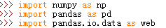

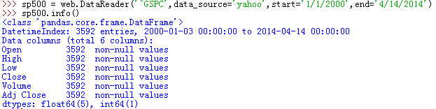

这里 DataReader 函数来自 pandas.io.data，可以用来从不同数据来源，尤其是雅虎财经网站上获取金融数据。

这里我们读取了从 2000 年的第一个交易日到结束日期的 S&P500 指数事件序列数据，而且自动地用 TimeStamp 对象生成一个时间索引。

收盘价的时间序列图如下：

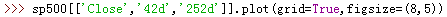

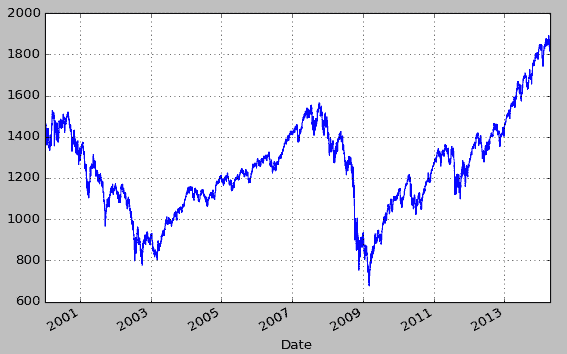

所以先在 pandas DataFrame 对象上添加一个新列，用于两个趋势之间的差值。

此处的趋势策略是基于两个月（42 个交易日）和一年（252 个交易日）的趋势（也就是两种期间指数水平的移动平均数）。Pandas 可以高效地生成各个时间序列。 

首先先生成趋势数据： 

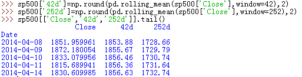

 **三**

现在数据已经已经完整，开始设计一条规则来生成趋势信号。规则如下：

买入信号（多头）：

    42 天趋势第一次高于 252 天趋势 SD 点。

等待（持币）:

    42 天趋势在 252 天趋势的+/-SD 点范围内。

卖出信号（空头）：

    42 天信号第一次低于 252 天趋势 SD 点。

Pandas 数值运算通常以向量方式进行，这样可以取两列的全部差值：

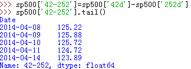 

在最后一个可用交易日上，42 日趋势线远远高于 252 趋势线。尽管两个趋势列中的项目数量不相等，pandas 通过在相应的指数位置放入 NaN 处理这种情况：

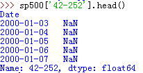 

现在生成我们的投资机制，此处假定信号阈值为 50：

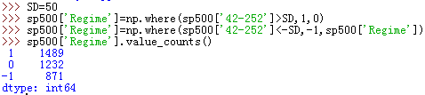 

即在 1489 个交易日中，42 日趋势线高于 252 日趋势线 SD 个点以上，1232 个交易日中，42 日趋势线低于 252 日趋势线 SD 个点以上。所以，如果短期趋势线与长期趋势线交叉，它很可能在持续一段时间，即所谓的投资机制。图形如下：

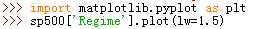

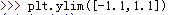

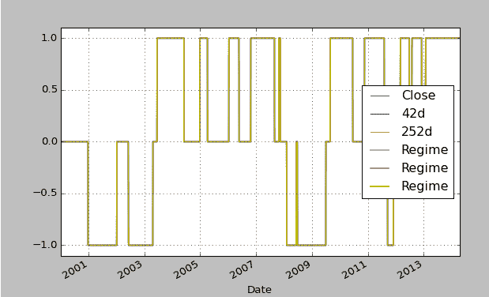

 **四**

至此，测试基于信号投资策略所需的数据都已准备就绪。为简化，假定投资者可以直接投资于指数或者直接做空指数，现实中要通过指数基金、交易所交易基金或者指数期货完成。这也会造成一些交易成本。因为不打算频繁交易，所以此处忽略交易成本。

根据投资机制，投资者可以选择做空、做多市场指数，或者持币观望。这种简化策略使我们只注意市场收益。当投资者做多时形成市场收益（1），做空时形成负的市场收益（-1），持币时不行成任何市场收益（0）。所以，需要先计算对数收益率。其中，shift 方法按照所需指数输入项数量移动时间序列----这里，每移动一个交易日，就能得到每日的对数收益率：

而基于趋势的投资策略的收益，将 Regime 列乘以下一天的 Returns 列（用“昨天”的头寸得出今天的收益）：

所以比较指数累计持续收益和我们所用策略的累积持续收益即可：

 

往期精彩阅读链接 

直接点击，查看往期精彩文章

*   [【HMM 系列】之 HMM 指数择时深度研究](http://mp.weixin.qq.com/s?__biz=MzAxNTc0Mjg0Mg==&mid=2653283909&idx=1&sn=ff416c442cd1a9382bbd2142f9679745&scene=21#wechat_redirect)

*   [机器学习该如何应用到量化投资系列（一）](http://mp.weixin.qq.com/s?__biz=MzAxNTc0Mjg0Mg==&mid=2653283935&idx=1&sn=56e84e986f278403d8840387c615a2a7&chksm=802e244ab759ad5c43720a7960567d215970877250ca72534016bf53a021c73f83665068639d&scene=21#wechat_redirect)

*   [机器学习该如何应用到量化投资系列（二）](http://mp.weixin.qq.com/s?__biz=MzAxNTc0Mjg0Mg==&mid=2653283982&idx=1&sn=6a14e2e145d8e7db46ba64a1439e1b2f&chksm=802e249bb759ad8d436e05f51625be0f5142ab8af374ebcfad24c332efc5fd0190a8283cbdfb&scene=21#wechat_redirect)

*   [【Python 量化投资】对数周期幂率（LPPL）模型在 A 股中应用](http://mp.weixin.qq.com/s?__biz=MzAxNTc0Mjg0Mg==&mid=2653283845&idx=1&sn=a00892888cd23b2bbb8c95ad3605218d&scene=21#wechat_redirect)

*   [【量化投资策略探讨】决策树和随机森林](http://mp.weixin.qq.com/s?__biz=MzAxNTc0Mjg0Mg==&mid=2653283764&idx=1&sn=f61f65377473e55428f9c2204d148b25&scene=21#wechat_redirect)

*   [公众号干货精华帖整理从创办至今](http://mp.weixin.qq.com/s?__biz=MzAxNTc0Mjg0Mg==&mid=2653283882&idx=1&sn=154943c97279a743190c9573e2e8f52e&scene=21#wechat_redirect)

*   [【Matlab 量化投资】GFTD 指标程序化实现](http://mp.weixin.qq.com/s?__biz=MzAxNTc0Mjg0Mg==&mid=2653283878&idx=1&sn=387f9395917442553bbfde43183ce010&scene=21#wechat_redirect)

*   [【量化缠论】系列文章（一）](http://mp.weixin.qq.com/s?__biz=MzAxNTc0Mjg0Mg==&mid=2653283801&idx=1&sn=0a05bb0247535a118183be2b917c56b4&scene=21#wechat_redirect)

*   [跟你讲个笑话，我是做私募的……](http://mp.weixin.qq.com/s?__biz=MzAxNTc0Mjg0Mg==&mid=2653283777&idx=1&sn=252e295b1a788da1aaadf39c2ef959ee&scene=21#wechat_redirect)

*   [【干货】各大券商研究报告！](http://mp.weixin.qq.com/s?__biz=MzAxNTc0Mjg0Mg==&mid=2653283773&idx=1&sn=d4604682da0c5563be9da16717d11bf9&scene=21#wechat_redirect)

*   [【重磅干货】Matlab 高频算法交易从基础到高级算法的完美 实现](http://mp.weixin.qq.com/s?__biz=MzAxNTc0Mjg0Mg==&mid=2653283757&idx=1&sn=35a7faaf06721de2b8fdb5673126022a&scene=21#wechat_redirect)

*   [马尔可夫区制转换模型与金融市场周期【附源码】](http://mp.weixin.qq.com/s?__biz=MzAxNTc0Mjg0Mg==&mid=2653283605&idx=2&sn=aa9c31166efba53c3bf5dd496d7357e0&scene=21#wechat_redirect)

*   [【多因子系列】之新手必看 | 量化交易七宗罪](http://mp.weixin.qq.com/s?__biz=MzAxNTc0Mjg0Mg==&mid=2653283543&idx=1&sn=f7376931ac3a99647b26ba5fa0c597d7&scene=21#wechat_redirect)

*   [【多因子系列之二】where is my alpha](http://mp.weixin.qq.com/s?__biz=MzAxNTc0Mjg0Mg==&mid=2653283598&idx=1&sn=53973fe24d449159e896616faae6c804&scene=21#wechat_redirect)

*   [【机器学习】支持向量机的概念与运用初探](http://mp.weixin.qq.com/s?__biz=MzAxNTc0Mjg0Mg==&mid=2653283515&idx=1&sn=edeedbb0190fc1c1242de5795635fccc&scene=21#wechat_redirect)

*   [七夕没有对象的宽客都在看这篇文章](http://mp.weixin.qq.com/s?__biz=MzAxNTc0Mjg0Mg==&mid=2653283478&idx=1&sn=aa061849c61ee84eedda3ac9d0c74ec5&scene=21#wechat_redirect)

*   [【Python 机器学习】信息熵和在决策树中的运用（附源码）](http://mp.weixin.qq.com/s?__biz=MzAxNTc0Mjg0Mg==&mid=2653283451&idx=1&sn=2f10aaa1083856c0a2e07e718a3973cd&scene=21#wechat_redirect)

*   [增强学习与量化投资初探](http://mp.weixin.qq.com/s?__biz=MzAxNTc0Mjg0Mg==&mid=2653283440&idx=1&sn=e5dc6e12f7b28b5ede13bd582b59b73c&scene=21#wechat_redirect)

*   [【Python 机器学习】数据预处理——图像压缩与线性代数](http://mp.weixin.qq.com/s?__biz=MzAxNTc0Mjg0Mg==&mid=2653283419&idx=1&sn=43f113c5e81745b607e9e1f60e7f1a35&scene=21#wechat_redirect)

*   [【每周书籍干货】国外近期深度学习与机器学习书籍电子版——你知道一本买来好多刀啊！](http://mp.weixin.qq.com/s?__biz=MzAxNTc0Mjg0Mg==&mid=2653283143&idx=1&sn=2316c1a067239aa007196cc8cb2e6c5b&scene=21#wechat_redirect)

*   [【Matlab 量化投资】根据期货高频数据和期货交易所交易规则以及 BS 方法判断高频交易方向和多空主力建仓减仓行为（附源码！！！）](http://mp.weixin.qq.com/s?__biz=MzAxNTc0Mjg0Mg==&mid=2653283293&idx=1&sn=7c26d2958d1a463686b2600c69bd9bff&scene=21#wechat_redirect)

*   [【量化投资系列】基于多重分形理论的短趋势择时策略研究](http://mp.weixin.qq.com/s?__biz=MzAxNTc0Mjg0Mg==&mid=2653283004&idx=1&sn=95a79928c89a69ac12d07514f5085c9a&scene=21#wechat_redirect)

*   [【重！磅！干！货！】互联网金融之量化投资深度文本挖掘——附源码文档](http://mp.weixin.qq.com/s?__biz=MzAxNTc0Mjg0Mg==&mid=2653282879&idx=1&sn=12a91c4b8317662fbae470541ebe4683&scene=21#wechat_redirect)

*   [【机器学习资料整理】（学习工具、学习视频、博客和文章推荐、ML 相关算法参考、部分机器学习译文）](http://mp.weixin.qq.com/s?__biz=MzAxNTc0Mjg0Mg==&mid=2653282920&idx=1&sn=6faa96116c590c75d92569351f987e52&scene=21#wechat_redirect)

*   [大数据之微信公众号深度量化研究](http://mp.weixin.qq.com/s?__biz=MzAxNTc0Mjg0Mg==&mid=404626412&idx=1&sn=502f2a57b8f9b13887c30fb65e39a7f7&scene=21#wechat_redirect)

听说，置顶关注我们的人都不一般

****