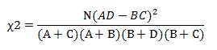
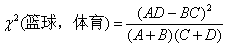
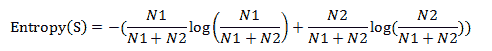
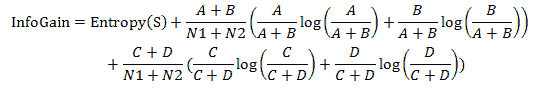
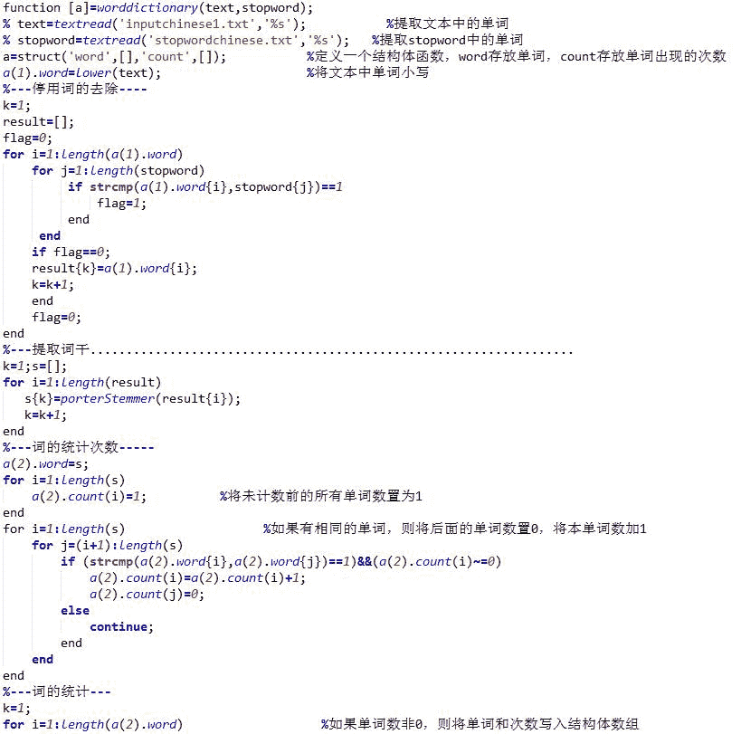
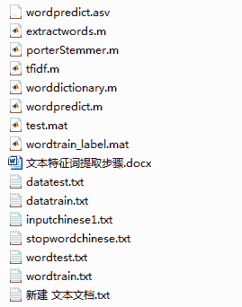

# 【Matlab 机器学习】用 Matlab 编写的文本分类程序

> 原文：[`mp.weixin.qq.com/s?__biz=MzAxNTc0Mjg0Mg==&mid=2653283994&idx=1&sn=ab236bd78733e62cae7ff074721c4cf6&chksm=802e248fb759ad99b1ca1c5c8b6733363575d00c25bd010397d738b6146ef43f31d66d379a93&scene=27#wechat_redirect`](http://mp.weixin.qq.com/s?__biz=MzAxNTc0Mjg0Mg==&mid=2653283994&idx=1&sn=ab236bd78733e62cae7ff074721c4cf6&chksm=802e248fb759ad99b1ca1c5c8b6733363575d00c25bd010397d738b6146ef43f31d66d379a93&scene=27#wechat_redirect)

**所有推文全部分类**

**请在页面菜单查找**

**为了更方便的阅读**

 **特征提取步骤** 

**1.** 卡方检验

**1.1** 统计样本集中文档总数（N）。

**1.2 ** 统计每个词的正文档出现频率（A）、负文档出现频率（B）、正文档不出现频率）、负文档不出现频率。

**1.3** 计算每个词的卡方值，公式如下：

 

**1.4** 将每个词按卡方值从大到小排序，选取前 k 个词作为特征，k 即特征维数。

**1.5** 进一步化简，注意如果给定了一个文档集合（例如我们的训练集）和一个类别，则 N，M，N-M（即 A+C 和 B+D）对同一类别文档中的所有词来说都是一样的，而我们只关心一堆词对某个类别的开方值的大小顺序，而并不关心具体的值，因此把它们去掉是完全可以的，故实际计算的时候我们都使用

**2\.** 信息增益

**2.1**  统计正负分类的文档数:N1、N2。

**2.2**  统计每个词的正文档出现频率（A）、负文档出现频率（B）、正文档不出现频率）、负文档不出现频率。

**2.3**  计算信息熵

**2.4**  计算每个词的信息增益

 

**2.5 ** 将每个词按信息增益值从大到小排序，选取前 k 个词作为特征，k 即特征维数。

 **例子**

10 月 23 日十佳球：亨利快攻隔人扣，九指扣将占两席(篮球)

欧冠第三轮全进球：阿扎尔&科斯塔 60 米奔袭(足球)

C 罗皇马生涯 50 大经典进球(足球)

2013 中网女单第三轮：李娜 2-0 淘汰利斯基集锦 (网球)

13 韩国站排位赛集锦 (赛车)

10 月 23 日 十佳 球 亨利 快攻 隔 人 扣 九 指 扣 将 占 两 席 

欧 冠 第三 轮 全 进球 阿扎尔科斯塔 60 米 奔袭 

C 罗 皇 马 生涯 50 大 经典 进球 

2013 中 网 女单 第三 轮 李娜 2-0 淘汰 利斯基 集锦 

13 韩国 站 排位 赛 集锦

 **部分代码展示**

 **文件预览**

后台回复

**【matlab1】**

获取源码

往期精彩阅读链接 

直接点击，查看往期精彩文章

*   [【HMM 系列】之——HMM 指数择时深度研究](http://mp.weixin.qq.com/s?__biz=MzAxNTc0Mjg0Mg==&mid=2653283909&idx=1&sn=ff416c442cd1a9382bbd2142f9679745&scene=21#wechat_redirect)

*   [【全网首发】——机器学习该如何应用到量化投资系列（一）](http://mp.weixin.qq.com/s?__biz=MzAxNTc0Mjg0Mg==&mid=2653283935&idx=1&sn=56e84e986f278403d8840387c615a2a7&chksm=802e244ab759ad5c43720a7960567d215970877250ca72534016bf53a021c73f83665068639d&scene=21#wechat_redirect)

*   [【全网首发】机器学习该如何应用到量化投资系列（二）](http://mp.weixin.qq.com/s?__biz=MzAxNTc0Mjg0Mg==&mid=2653283982&idx=1&sn=6a14e2e145d8e7db46ba64a1439e1b2f&chksm=802e249bb759ad8d436e05f51625be0f5142ab8af374ebcfad24c332efc5fd0190a8283cbdfb&scene=21#wechat_redirect)

*   [【Python 量化投资】对数周期幂率（LPPL）模型在 A 股中应用](http://mp.weixin.qq.com/s?__biz=MzAxNTc0Mjg0Mg==&mid=2653283845&idx=1&sn=a00892888cd23b2bbb8c95ad3605218d&scene=21#wechat_redirect)

*   [【量化投资策略探讨】决策树和随机森林](http://mp.weixin.qq.com/s?__biz=MzAxNTc0Mjg0Mg==&mid=2653283764&idx=1&sn=f61f65377473e55428f9c2204d148b25&scene=21#wechat_redirect)

*   [【干货扫荡】公众号干货精华帖整理从创办至今](http://mp.weixin.qq.com/s?__biz=MzAxNTc0Mjg0Mg==&mid=2653283882&idx=1&sn=154943c97279a743190c9573e2e8f52e&scene=21#wechat_redirect)

*   [【Matlab 量化投资】GFTD 指标程序化实现（附源码）](http://mp.weixin.qq.com/s?__biz=MzAxNTc0Mjg0Mg==&mid=2653283878&idx=1&sn=387f9395917442553bbfde43183ce010&scene=21#wechat_redirect)

*   [【量化缠论】系列文章（一）](http://mp.weixin.qq.com/s?__biz=MzAxNTc0Mjg0Mg==&mid=2653283801&idx=1&sn=0a05bb0247535a118183be2b917c56b4&scene=21#wechat_redirect)

*   [跟你讲个笑话，我是做私募的……](http://mp.weixin.qq.com/s?__biz=MzAxNTc0Mjg0Mg==&mid=2653283777&idx=1&sn=252e295b1a788da1aaadf39c2ef959ee&scene=21#wechat_redirect)

*   [【干货】各大券商研究报告！](http://mp.weixin.qq.com/s?__biz=MzAxNTc0Mjg0Mg==&mid=2653283773&idx=1&sn=d4604682da0c5563be9da16717d11bf9&scene=21#wechat_redirect)

*   [【重磅干货】Matlab 高频算法交易——从基础到高级算法的完美 实现（源码附送，这货太干了！）](http://mp.weixin.qq.com/s?__biz=MzAxNTc0Mjg0Mg==&mid=2653283757&idx=1&sn=35a7faaf06721de2b8fdb5673126022a&scene=21#wechat_redirect)

*   [马尔可夫区制转换模型与金融市场周期【附源码】](http://mp.weixin.qq.com/s?__biz=MzAxNTc0Mjg0Mg==&mid=2653283605&idx=2&sn=aa9c31166efba53c3bf5dd496d7357e0&scene=21#wechat_redirect)

*   [【多因子系列】之新手必看 | 量化交易七宗罪](http://mp.weixin.qq.com/s?__biz=MzAxNTc0Mjg0Mg==&mid=2653283543&idx=1&sn=f7376931ac3a99647b26ba5fa0c597d7&scene=21#wechat_redirect)

*   [【多因子系列之二】where is my alpha](http://mp.weixin.qq.com/s?__biz=MzAxNTc0Mjg0Mg==&mid=2653283598&idx=1&sn=53973fe24d449159e896616faae6c804&scene=21#wechat_redirect)

*   [【机器学习】支持向量机的概念与运用初探](http://mp.weixin.qq.com/s?__biz=MzAxNTc0Mjg0Mg==&mid=2653283515&idx=1&sn=edeedbb0190fc1c1242de5795635fccc&scene=21#wechat_redirect)

*   [七夕没有对象的宽客都在看这篇文章](http://mp.weixin.qq.com/s?__biz=MzAxNTc0Mjg0Mg==&mid=2653283478&idx=1&sn=aa061849c61ee84eedda3ac9d0c74ec5&scene=21#wechat_redirect)

*   [【Python 机器学习】信息熵和在决策树中的运用（附源码）](http://mp.weixin.qq.com/s?__biz=MzAxNTc0Mjg0Mg==&mid=2653283451&idx=1&sn=2f10aaa1083856c0a2e07e718a3973cd&scene=21#wechat_redirect)

*   [增强学习与量化投资初探](http://mp.weixin.qq.com/s?__biz=MzAxNTc0Mjg0Mg==&mid=2653283440&idx=1&sn=e5dc6e12f7b28b5ede13bd582b59b73c&scene=21#wechat_redirect)

*   [【Python 机器学习】数据预处理——图像压缩与线性代数](http://mp.weixin.qq.com/s?__biz=MzAxNTc0Mjg0Mg==&mid=2653283419&idx=1&sn=43f113c5e81745b607e9e1f60e7f1a35&scene=21#wechat_redirect)

*   [【每周书籍干货】国外近期深度学习与机器学习书籍电子版——你知道一本买来好多刀啊！](http://mp.weixin.qq.com/s?__biz=MzAxNTc0Mjg0Mg==&mid=2653283143&idx=1&sn=2316c1a067239aa007196cc8cb2e6c5b&scene=21#wechat_redirect)

*   [【Matlab 量化投资】根据期货高频数据和期货交易所交易规则以及 BS 方法判断高频交易方向和多空主力建仓减仓行为（附源码！！！）](http://mp.weixin.qq.com/s?__biz=MzAxNTc0Mjg0Mg==&mid=2653283293&idx=1&sn=7c26d2958d1a463686b2600c69bd9bff&scene=21#wechat_redirect)

*   [【量化投资系列】基于多重分形理论的短趋势择时策略研究](http://mp.weixin.qq.com/s?__biz=MzAxNTc0Mjg0Mg==&mid=2653283004&idx=1&sn=95a79928c89a69ac12d07514f5085c9a&scene=21#wechat_redirect)

*   [【重！磅！干！货！】互联网金融之量化投资深度文本挖掘——附源码文档](http://mp.weixin.qq.com/s?__biz=MzAxNTc0Mjg0Mg==&mid=2653282879&idx=1&sn=12a91c4b8317662fbae470541ebe4683&scene=21#wechat_redirect)

*   [【机器学习资料整理】（学习工具、学习视频、博客和文章推荐、ML 相关算法参考、部分机器学习译文）](http://mp.weixin.qq.com/s?__biz=MzAxNTc0Mjg0Mg==&mid=2653282920&idx=1&sn=6faa96116c590c75d92569351f987e52&scene=21#wechat_redirect)

*   [大数据之微信公众号深度量化研究](http://mp.weixin.qq.com/s?__biz=MzAxNTc0Mjg0Mg==&mid=404626412&idx=1&sn=502f2a57b8f9b13887c30fb65e39a7f7&scene=21#wechat_redirect)

听说，置顶关注我们的人都不一般

****