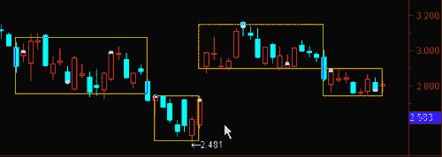

# 【全网首发】机器学习该如何应用到量化投资系列（二）

> 原文：[`mp.weixin.qq.com/s?__biz=MzAxNTc0Mjg0Mg==&mid=2653283982&idx=1&sn=6a14e2e145d8e7db46ba64a1439e1b2f&chksm=802e249bb759ad8d436e05f51625be0f5142ab8af374ebcfad24c332efc5fd0190a8283cbdfb&scene=27#wechat_redirect`](http://mp.weixin.qq.com/s?__biz=MzAxNTc0Mjg0Mg==&mid=2653283982&idx=1&sn=6a14e2e145d8e7db46ba64a1439e1b2f&chksm=802e249bb759ad8d436e05f51625be0f5142ab8af374ebcfad24c332efc5fd0190a8283cbdfb&scene=27#wechat_redirect)

**所有推文全部分类**

**请在页面菜单查找**

**为了更方便的阅读**

有一些单纯搞计算机、数学或者物理的人会问，究竟怎么样应用 ML 在量化投资。他们能做些什么自己擅长的工作。虽然在很多平台或者自媒体有谈及有关的问题，但是不够全面和完整。从今日起，量化投资与机器学习公众号将推出一个系列【机器学习该如何应用到】。今日的推文，是编辑部人员对国外一篇关于深度学习在量化投资中的应用的博客论文进行了翻译。为此也希望大家从国外研究者眼中，看到 DL 的应用。

 

**前言**

**深度学习技术在交易中的研究**

深度学习最近受到了很多关注，特别是在图像分类和语音识别领域。然而，它的应用似乎并没有广泛应用到交易当中。这项调查涵盖了到目前为止作者(Greg Harris)发现相关的系统交易。（点击阅读原文获取原文 PDF）

一些名词：

**DBN** = Deep BeliefNetwork(深度信念网络)

**LSTM** = LongShort-Term Memory(长短期记忆)，一种时间递归神经网络

**MLP** = Multi-layer Perceptron(多层神经网络)

**RBM** = RestrictedBoltzmann Machine(限制玻尔兹曼机)

**ReLU** = RectifiedLinear Units(修正线性单元)，激活函数

**CNN** =Convolutional Neural Network(卷积神经网络)

 ******Limit OrderBook 模型****** 

Sirignano(2016)预测了 limit order books 的变化。他设计了一个可以利用局部空间结构的“空间神经网络”，他设计的网络可作为分类器而且比一般的神经网络计算效率更高。他建立模型以求出下一个状态的最佳买价、卖价的联合分布情况。同时，也能求出其中之一（买/卖价）的改变对另外一个的影响。

**Architecture** – Each neural network has 4 layers. The standard neuralnetwork has 250 neurons per hidden layer, and the spatial neural network has50\. He uses the tanh activation function on the hidden layer neurons.

**Training**– He trained and tested on order books from 489 stocks from 2014 to 2015(a separate model for each stock). He uses Level III limit order book data fromthe NASDAQ with event times having nanosecond decimal precision. Traininginvolved 50TB of data and used a cluster with 50 GPUs. He includes 200features: the price and size of the limit order book across the first 50non-zero bid and ask levels. He uses dropout to prevent overfitting. He usesbatch normalization between each hidden layer to prevent internal covariateshift. Training is done with the RMSProp algorithm. RMSProp is similar tostochastic gradient descent with momentum but it normalizes the gradient by arunning average of the past gradients. He uses an adaptive learning rate wherethe learning rate is decreased by a constant factor whenever the training errorincreases over a training epoch. He uses early stopping imposed via avalidation set to reduce overfitting. He also includes an l² penalty whentraining in order to reduce overfitting. 

**Results **– He shows that limit order books exhibit some degree of local spatialstructure. He predicts the order book 1 second ahead and also at the time ofthe next bid/ask change. The spatial neural network outperforms the standardneural network and logistic regression with non-linear features. Both neuralnetworks have 10% lower error than logistic regression.

****基于价格的分类模型****

Dixon(etal.)(2016)使用了一个深度神经网络去预测未来 5 分钟的价格变化的信号，曾在 43 种大宗商品和外汇期货中使用。

**Architecture** – Their input layer has 9,896 neurons for inputfeatures made up of lagged price differences and co-movements betweencontracts. There are 5 learned fully-connected layers. The first of the fourhidden layers contains 1,000 neurons, and each subsequent layer tapers by 100neurons. The output layer has 135 neurons (3 for each class {-1, 0, 1} times 43contracts).

**Training**– They used the standard back-propagation with stochastic gradientdescent. They speed up training by using mini-batching (computing the gradienton several training examples at once rather than individual examples). Ratherthan an nVidia GPU, they used an Intel Xeon Phi co-processor. 

**Results**– They report 42% accuracy, overall, for three-class classification.They do some walk-forward training instead of a traditional backtest. Theirboxplot shows some generally positive Sharpe ratios from the mini-backtests foreach contract. They did not include transaction costs or crossing the bid-askspread. All their predictions and features were based on the mid-price at theend of each 5-minute time period. 

Takkeuchi andLee(2013)研究了动量效应对预测股票月收益率的影响。

**Architecture** – They use an auto-encoder composed of stacked RBMs toextract features from stock prices which they then pass to a feed-forwardneural network classifier. Each RBM consists of one layer of visible units andone layer of hidden units connected by symmetric links. The first layer has 33units for input features from one stock at a time. For every month t, thefeatures include the 12 monthly returns for month t-2 through t-13 and the 20daily returns approximately corresponding to month t. They normalize each ofthe return features by calculating the z-score relative to the cross-section ofall stocks for each month or day. The number of hidden units in the final layerof the encoder is sharply reduced, forcing dimensionality reduction. The outputlayer has 2 units, corresponding to whether the stock ended up above or belowthe median return for the month. Final layer sizes are 33-40-4-50-2.

**Training**– During pre-training, they split the dataset into smaller,non-overlapping mini-batches. Afterwards, they un-roll the RBMs to form anencoder-decoder, which is fine-tuned using back-propagation. They consider allstocks trading on the NYSE, AMEX, or NASDAQ with a price greater than $5\. Theytrain on data from 1965 to 1989 (848,000 stock-month samples) and test on datafrom 1990 to 2009 (924,300 stock-month samples). Some training data held-outfor validation for the number of layers and the number of units per layer. 

**Results** – Their overall accuracy is around 53%. When they consider thedifference between the top decile and the bottom decile predictions, they get3.35% per month, or 45.93% annualized return.

Batres-Estrada(2015)预测了在给定的交易日中哪些股票会有高于中位数的回报（基于标准普尔 500）。他的研究对 Takeuchi 和 Lee(2013)的研究也产生了影响。

**Architecture** – He uses a 3-layer DBN coupled to an MLP. He uses 400neurons in each hidden layer, and he uses a sigmoid activation function. Theoutput layer is a softmax layer with two output neurons for binaryclassification (above median or below). The DBN is composed of stacked RBMs,each trained sequentially.

**Training**– He first pre-trains the DBN module, then fine-tunes the entire DBN-MLPusing back-propagation. The input includes 33 features: monthly log-returns formonths t-2 to t-13, 20 daily log-returns for each stock at month t, and anindicator variable for the January effect. The features are normalized usingthe Z-score for each time period. He uses S&P 500 constituent data from1985 to 2006 with a 70-15-15 split for training-validataion-test. He uses thevalidation data to choose the number of layers, the number of neurons, and theregularization parameters. He uses early-stopping to prevent over-fitting. 

**Results **– His model has 53% accuracy, which outperforms regularized logisticregression and a few MLP baselines.

Sharang andRao(2015)使用了 DBN（深度信念网络）训练的技术指标对投资组合进行分类。

**Architecture**– They use a DBN consisting of 2 stacked RBMs. Thefirst RBM is Gaussian-Bernoulli (15 nodes), and the second RBM is Bernoulli (20nodes). The DBN produces latent features which they try feeding into threedifferent classifiers: regularized logistic regression, support vectormachines, and a neural network with 2 hidden layers. They predict 1 ifportfolio goes up over 5 days, and -1 otherwise. 

**Training**– They train the DBN using a contrastive divergence algorithm. Theycalculate signals based on open, high, low, close, open interest, and volumedata, beginning in 1985, with some points removed during the 2008 financialcrisis. They use 20 features: the “daily trend” calculated over different time frames, and thennormalized. All parameters are chosen using a validation dataset. When trainingthe neural net classifier, they mention using a momentum parameter duringmini-batch gradient descent training to shrink the coefficients by half duringevery update. 

**Results** – The portfolio is constructed using PCA to be neutral to the firstprincipal component. The portfolio is an artificial spread of instruments, soactually trading it is done with a spread between the ZF and ZN contracts. Allinput prices are mid-prices, meaning the bid-ask spread is ignored. The resultslook profitable, with all three classification models performing 5-10% moreaccurately than a random predictor.

Zhu(et al.)(2016)使用了基于深度信念网络的箱体震荡理论来进行决策。箱体震荡理论认为股票的价格会在一个确定的范围内（箱体）震荡，如果价格超出这个范围，那么股票价格会完全进入一个新的箱体。他们的交易策略就是在突破箱体顶部时买入和在跌穿箱体底部时卖出。

**Architecture**– They use a DBN made up of stacked RBMs and a finalback-propagation layer. 

**Training**– They used block Gibbs sampling to greedily train each layer fromlowest to highest in an unsupervised way. They then train the back-propagationlayer in a supervised way, which fine-tunes the whole model. They chose 400stocks out of the S&P 500 for testing, and the test set covers 400 daysfrom 2004 to 2005\. They use open, high, low, close prices as well as technicalanalysis indicators, for a total of 14 model inputs. Some indicators are givenmore influence in the prediction through the use of “gray relation analysis” or “gray correlation degree.” 

**Results** – In their trading strategy, they charge 0.5% transaction costs pertrade and add a couple of parameters for stop-loss and “transaction rate.” I don’t fully understand the result tables, but they seem tobe reporting significant profits.

****波动率预测****

Xiong (etal.)(2015)根据估算出来的开、高、低、收价格预测了标准普尔 500 指数的日波动率。

**Architecture**– They use a single LSTM hidden layer consisting of oneLSTM block. For inputs they use daily S&P 500 returns and volatilities.They also include 25 domestic Google trends, covering sectors and major areasof the economy. 

**Training**– They used the “Adam” method with 32 samples per batch and meanabsolute percent error (MAPE) as the objective loss function. They set themaximum lag of the LSTM to include 10 successive observations. 

**Results** – They show their LSTM method outperforms GARCH, Ridge, and LASSOtechniques.

****波基于文本的分类模型****

Rönnqvist andSarlin(2016)使用新闻文章来预测银行的运营状况。具体来说，他们建立了一个分类器用来判断一个句子表示的是处于困难时期还是平稳时期。

**Architecture**– They use two neural networks in this paper. The firstis for semantic pre-training to reduce dimensionality. For this, they run asliding window over text, taking a sequence of 5 words and learning to predictthe next word. They use a feed-forward topology where a projection layer in themiddle provides the semantic vectors once the connection weights have beenlearned. They also include the sentence ID as an input to the model, to providecontext and inform the prediction of the next word. They use binary Huffmancoding to map sentence IDs and word to activation patterns in the input layer,which organizes the words roughly by frequency. They say feed-forwardtopologies with fixed context sizes are more efficient than recurrent neuralnetworks for modeling text sequences. The second neural network is forclassification. Instead of a million inputs (one for each word), they use 600inputs from the learned semantic model. The first layer has 600 nodes, themiddle layer has 50 rectified linear hidden nodes, and the output layer has 2nodes (distress/tranquil). 

**Training**– They train it with 243 distress events over 101 banks observed duringthe financial crisis of 2007-2009\. They use 716k sentences mentioning thebanks, taken from 6.6m Reuters news articles published during and after thecrisis. 

**Results** – They evaluate their classification model using a custom “Usefulness” measure. The evaluation is done usingcross-validation, leaving N banks out in each fold. They aggregate the distresscounts into various timeseries but don’t go so far as to consider creating a tradingstrategy.

Fehrer andFeuerriegel(2015)训练了一个基于新闻标题的模型用来预测德国的股票收益。

**Architecture **– They use a recursive autoencoder with an additionalsoftmax layer in each autoencoder for estimating probabilities. They performthree-class prediction {-1, 0, 1} for the following day’s return of the stock associated with theheadline. 

**Training** – They initialize the weights with Gaussian noise, and then updatethrough back-propagation. They use an English ad-hoc news announcement dataset(8,359 headlines) for the German market covering 2004 to 2011.
**Results** – Their recursive autoencoder has 56% accuracy, which in an improvementover a more traditional random forest modeling approach with 53% accuracy. Theydo not develop a trading strategy. They have made a Java implementation oftheir code publicly available.

Ding (etal.)(2015)使用从新闻标题中提取出来的结构化信息来预测标准普尔 500 指数的变化。他们用 OPEN IE(Open information Extraction,不是打开 IE=.=)来处理新闻标题，并获得新闻事件所表达的信息（人，事，物，时）。与其他普通的网络不同的是，他们使用了张量神经网络学习语义组合。

**Architecture**– They combine short-term and long-term effects ofevents, using a CNN to perform semantic composition over the input eventsequence. They use a max pooling layer on top of the convolutional layer, whichmakes the network retain only the most useful features produced by theconvolutional layer. They have separate convolutional layers for long-termevents and mid-term events. Both of these layers, along with an input layer forshort-term events, feed into a hidden layer which then feeds into two outputnodes. 

**Training**– They extracted 10 million events from Reuters and Bloomberg news. Fortraining, they corrupt events by replacing one event argument with a randomargument. During training, they assume that the actual event should be given ahigher score than the corrupted event. When it isn’t, model parameters get updated. 

**Results** – They find that structured events are better features than words forstock market prediction. Their approach outperforms baseline methods by 6%.They make predictions for the S&P 500 index and 15 individual stocks, and atable appears to show that they can predict the S&P 500 with 65% accuracy.

**投资组合模型**

Heaton (etal.)(2016)试图寻找一个比生物科技指数 IBB 表现更好的投资组合。他们有目标地跟踪指数和一些股票，并尝试在大幅下跌的情况下仍然能跑赢指数。他们使用支持非线性结构的拟合模型，而不是直接对协方差矩阵建模。

**Architecture **– They use auto-encoding with regularization and ReLUs.Their auto-encoder has one hidden layer with 5 neurons. 

**Training**– They use weekly return data for the component stocks of IBB from 2012to 2016\. They auto-encode all stocks in the index and evaluate the differencebetween each stock and its auto-encoded version. They keep the 10 most “communal” stocks that are most similar to the auto-encodedversion. They also keep a varying number of other stocks, where the number ischosen with cross-validation. 

**Results** – They show the tracking error as a function of the number stocksincluded in the portfolio, but don’t seem to compare against traditional methods. Theyalso replace index drawdowns with positive returns and find portolios thattrack this modified index.

往期精彩阅读链接 

直接点击，查看往期精彩文章

*   [【HMM 系列】之——HMM 指数择时深度研究](http://mp.weixin.qq.com/s?__biz=MzAxNTc0Mjg0Mg==&mid=2653283909&idx=1&sn=ff416c442cd1a9382bbd2142f9679745&scene=21#wechat_redirect)

*   [【全网首发】——机器学习该如何应用到量化投资系列（一）](http://mp.weixin.qq.com/s?__biz=MzAxNTc0Mjg0Mg==&mid=2653283935&idx=1&sn=56e84e986f278403d8840387c615a2a7&chksm=802e244ab759ad5c43720a7960567d215970877250ca72534016bf53a021c73f83665068639d&scene=21#wechat_redirect)

*   [【Python 量化投资】对数周期幂率（LPPL）模型在 A 股中应用](http://mp.weixin.qq.com/s?__biz=MzAxNTc0Mjg0Mg==&mid=2653283845&idx=1&sn=a00892888cd23b2bbb8c95ad3605218d&scene=21#wechat_redirect)

*   [【量化投资策略探讨】决策树和随机森林](http://mp.weixin.qq.com/s?__biz=MzAxNTc0Mjg0Mg==&mid=2653283764&idx=1&sn=f61f65377473e55428f9c2204d148b25&scene=21#wechat_redirect)

*   [【干货扫荡】公众号干货精华帖整理从创办至今](http://mp.weixin.qq.com/s?__biz=MzAxNTc0Mjg0Mg==&mid=2653283882&idx=1&sn=154943c97279a743190c9573e2e8f52e&scene=21#wechat_redirect)

*   [【Matlab 量化投资】GFTD 指标程序化实现（附源码）](http://mp.weixin.qq.com/s?__biz=MzAxNTc0Mjg0Mg==&mid=2653283878&idx=1&sn=387f9395917442553bbfde43183ce010&scene=21#wechat_redirect)

*   [【量化缠论】系列文章（一）](http://mp.weixin.qq.com/s?__biz=MzAxNTc0Mjg0Mg==&mid=2653283801&idx=1&sn=0a05bb0247535a118183be2b917c56b4&scene=21#wechat_redirect)

*   [跟你讲个笑话，我是做私募的……](http://mp.weixin.qq.com/s?__biz=MzAxNTc0Mjg0Mg==&mid=2653283777&idx=1&sn=252e295b1a788da1aaadf39c2ef959ee&scene=21#wechat_redirect)

*   [【干货】各大券商研究报告！](http://mp.weixin.qq.com/s?__biz=MzAxNTc0Mjg0Mg==&mid=2653283773&idx=1&sn=d4604682da0c5563be9da16717d11bf9&scene=21#wechat_redirect)

*   [【重磅干货】Matlab 高频算法交易——从基础到高级算法的完美 实现（源码附送，这货太干了！）](http://mp.weixin.qq.com/s?__biz=MzAxNTc0Mjg0Mg==&mid=2653283757&idx=1&sn=35a7faaf06721de2b8fdb5673126022a&scene=21#wechat_redirect)

*   [马尔可夫区制转换模型与金融市场周期【附源码】](http://mp.weixin.qq.com/s?__biz=MzAxNTc0Mjg0Mg==&mid=2653283605&idx=2&sn=aa9c31166efba53c3bf5dd496d7357e0&scene=21#wechat_redirect)

*   [【多因子系列】之新手必看 | 量化交易七宗罪](http://mp.weixin.qq.com/s?__biz=MzAxNTc0Mjg0Mg==&mid=2653283543&idx=1&sn=f7376931ac3a99647b26ba5fa0c597d7&scene=21#wechat_redirect)

*   [【多因子系列之二】where is my alpha](http://mp.weixin.qq.com/s?__biz=MzAxNTc0Mjg0Mg==&mid=2653283598&idx=1&sn=53973fe24d449159e896616faae6c804&scene=21#wechat_redirect)

*   [【机器学习】支持向量机的概念与运用初探](http://mp.weixin.qq.com/s?__biz=MzAxNTc0Mjg0Mg==&mid=2653283515&idx=1&sn=edeedbb0190fc1c1242de5795635fccc&scene=21#wechat_redirect)

*   [七夕没有对象的宽客都在看这篇文章](http://mp.weixin.qq.com/s?__biz=MzAxNTc0Mjg0Mg==&mid=2653283478&idx=1&sn=aa061849c61ee84eedda3ac9d0c74ec5&scene=21#wechat_redirect)

*   [【Python 机器学习】信息熵和在决策树中的运用（附源码）](http://mp.weixin.qq.com/s?__biz=MzAxNTc0Mjg0Mg==&mid=2653283451&idx=1&sn=2f10aaa1083856c0a2e07e718a3973cd&scene=21#wechat_redirect)

*   [增强学习与量化投资初探](http://mp.weixin.qq.com/s?__biz=MzAxNTc0Mjg0Mg==&mid=2653283440&idx=1&sn=e5dc6e12f7b28b5ede13bd582b59b73c&scene=21#wechat_redirect)

*   [【Python 机器学习】数据预处理——图像压缩与线性代数](http://mp.weixin.qq.com/s?__biz=MzAxNTc0Mjg0Mg==&mid=2653283419&idx=1&sn=43f113c5e81745b607e9e1f60e7f1a35&scene=21#wechat_redirect)

*   [【每周书籍干货】国外近期深度学习与机器学习书籍电子版——你知道一本买来好多刀啊！](http://mp.weixin.qq.com/s?__biz=MzAxNTc0Mjg0Mg==&mid=2653283143&idx=1&sn=2316c1a067239aa007196cc8cb2e6c5b&scene=21#wechat_redirect)

*   [【Matlab 量化投资】根据期货高频数据和期货交易所交易规则以及 BS 方法判断高频交易方向和多空主力建仓减仓行为（附源码！！！）](http://mp.weixin.qq.com/s?__biz=MzAxNTc0Mjg0Mg==&mid=2653283293&idx=1&sn=7c26d2958d1a463686b2600c69bd9bff&scene=21#wechat_redirect)

*   [【量化投资系列】基于多重分形理论的短趋势择时策略研究](http://mp.weixin.qq.com/s?__biz=MzAxNTc0Mjg0Mg==&mid=2653283004&idx=1&sn=95a79928c89a69ac12d07514f5085c9a&scene=21#wechat_redirect)

*   [【重！磅！干！货！】互联网金融之量化投资深度文本挖掘——附源码文档](http://mp.weixin.qq.com/s?__biz=MzAxNTc0Mjg0Mg==&mid=2653282879&idx=1&sn=12a91c4b8317662fbae470541ebe4683&scene=21#wechat_redirect)

*   [【机器学习资料整理】（学习工具、学习视频、博客和文章推荐、ML 相关算法参考、部分机器学习译文）](http://mp.weixin.qq.com/s?__biz=MzAxNTc0Mjg0Mg==&mid=2653282920&idx=1&sn=6faa96116c590c75d92569351f987e52&scene=21#wechat_redirect)

*   [大数据之微信公众号深度量化研究](http://mp.weixin.qq.com/s?__biz=MzAxNTc0Mjg0Mg==&mid=404626412&idx=1&sn=502f2a57b8f9b13887c30fb65e39a7f7&scene=21#wechat_redirect)

听说，置顶关注我们的人都不一般

****