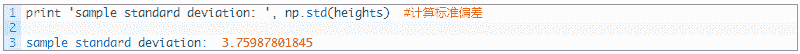

# 【Python 量化统计】——『置信区间』全角度解析（附源码）

> 原文：[`mp.weixin.qq.com/s?__biz=MzAxNTc0Mjg0Mg==&mid=2653283977&idx=1&sn=2a420c0d636ce4db37e8ec22655acaa6&chksm=802e249cb759ad8adb1bbd032a45f595a8210850d443ecbd9151e035181a7df855b38dd8655e&scene=27#wechat_redirect`](http://mp.weixin.qq.com/s?__biz=MzAxNTc0Mjg0Mg==&mid=2653283977&idx=1&sn=2a420c0d636ce4db37e8ec22655acaa6&chksm=802e249cb759ad8adb1bbd032a45f595a8210850d443ecbd9151e035181a7df855b38dd8655e&scene=27#wechat_redirect)

**所有推文全部分类**

**请在页面菜单查找**

**为了更方便的阅读**

**一、置信区间**

置信区间是指由样本统计量所构造的总体参数的估计区间。在统计学中，一个概率样本的置信区间（Confidence interval）是对这个样本的某个总体参数的区间估计。置信区间展现的是这个参数的真实值有一定概率落在测量结果的周围的程度。置信区间给出的是被测量参数的测量值的可信程度。

样本均值和总体均值是不同的。一般来说，我们想知道一个总体平均，但我们只能估算出一个样本的平均值。那么我们就希望使用样本均值来估计总体均值。我们使用置信区间这一指标，试图确定我们的样本均值是如何准确地估计总体均值的。

如果我们要估计中国女性的平均身高，我们采用的方式可能是先选出一百或者一千位女性，测量她们的身高然后计算出平均值，用这个平均值来估计全中国女性的身高值。

首先导入需要的程序包。

生成样本值和样本均值。

简单地列出样本均值对我们来说并没有多大的作用，因为我们不知道它与总体均值的相关性如何。要获得这个相关性，我们可以计算出样本方差是多少。较高的方差代表了较大的不稳定性和不确定性。下面我们获取样本的标准偏差值。

对我们来说，这个值仍然不会有太大的意义，为了真正理解样本均值与总体均值的相关性，我们需要计算标准误差值。标准误差是样本均值的方差的一种度量方法。

标准误差值：

 

下面我们来获得置信区间为 95%时的正态分布的二维图。  

 

结果如下：

 

事实上，对于一个单一的样本和由它得来的单置信区间，我们无法得出总体均值落在这个区间内的概率是多大，下面的例子说明了这一事实。

 

如图所示：

深度讲解：下面使用 t 检验来计算置信区间。

 

有一个内置的函数 scipy.stats 可以计算置信区间，记住要指定自由度！

 

对于正态分布，还有一个内置的函数可以计算置信区间，这个函数不需要指定自由度。

 

下面是一些可视化图形上的置信区间的代码：

 

结果如下：

 

标准偏差，标准误差和置信区间的计算都依赖于一定的假设。如果违反这些假设，那么 95%的置信区间的可信度将会降低。我们说，在这种情况下的置信区间是非校准的。下面是一个例子。

 

执行结果为：  

 

事实证明，对于较大的样本量，我们应该看到样本均值渐近收敛到零。

 

结果如下：

从图中可以很明显的看出结果慢慢收敛，我们也可以查看一下样本均值的均值。  

 

可以看出结果相当接近 0，那么就象征性地认为它是 0 吧。既然我们知道了总体均值，我们还可以检验置信区间的准确性。首先编写 2 个辅助函数，用以计算输入数据的置信区间以及判断是否区间内是否包含 0。

 

多次调用函数，每次都利用采样数据计算出一个置信区间，然后检查该区间是否包含了总体均值。如果区间得到正确的校准，我们应该会看到 95%的区间包含了总体均值。

很显然结果是不正确的，在这种情况下，我们需要做的是在考虑到自相关的情况下修正我们的标准误差估计。

往期精彩阅读链接 

直接点击，查看往期精彩文章

*   [【HMM 系列】之——HMM 指数择时深度研究](http://mp.weixin.qq.com/s?__biz=MzAxNTc0Mjg0Mg==&mid=2653283909&idx=1&sn=ff416c442cd1a9382bbd2142f9679745&scene=21#wechat_redirect)

*   [【全网首发】——机器学习该如何应用到量化投资系列（一）](http://mp.weixin.qq.com/s?__biz=MzAxNTc0Mjg0Mg==&mid=2653283935&idx=1&sn=56e84e986f278403d8840387c615a2a7&chksm=802e244ab759ad5c43720a7960567d215970877250ca72534016bf53a021c73f83665068639d&scene=21#wechat_redirect)

*   [【Python 量化投资】对数周期幂率（LPPL）模型在 A 股中应用](http://mp.weixin.qq.com/s?__biz=MzAxNTc0Mjg0Mg==&mid=2653283845&idx=1&sn=a00892888cd23b2bbb8c95ad3605218d&scene=21#wechat_redirect)

*   [【量化投资策略探讨】决策树和随机森林](http://mp.weixin.qq.com/s?__biz=MzAxNTc0Mjg0Mg==&mid=2653283764&idx=1&sn=f61f65377473e55428f9c2204d148b25&scene=21#wechat_redirect)

*   [【干货扫荡】公众号干货精华帖整理从创办至今](http://mp.weixin.qq.com/s?__biz=MzAxNTc0Mjg0Mg==&mid=2653283882&idx=1&sn=154943c97279a743190c9573e2e8f52e&scene=21#wechat_redirect)

*   [【Matlab 量化投资】GFTD 指标程序化实现（附源码）](http://mp.weixin.qq.com/s?__biz=MzAxNTc0Mjg0Mg==&mid=2653283878&idx=1&sn=387f9395917442553bbfde43183ce010&scene=21#wechat_redirect)

*   [【量化缠论】系列文章（一）](http://mp.weixin.qq.com/s?__biz=MzAxNTc0Mjg0Mg==&mid=2653283801&idx=1&sn=0a05bb0247535a118183be2b917c56b4&scene=21#wechat_redirect)

*   [跟你讲个笑话，我是做私募的……](http://mp.weixin.qq.com/s?__biz=MzAxNTc0Mjg0Mg==&mid=2653283777&idx=1&sn=252e295b1a788da1aaadf39c2ef959ee&scene=21#wechat_redirect)

*   [【干货】各大券商研究报告！](http://mp.weixin.qq.com/s?__biz=MzAxNTc0Mjg0Mg==&mid=2653283773&idx=1&sn=d4604682da0c5563be9da16717d11bf9&scene=21#wechat_redirect)

*   [【重磅干货】Matlab 高频算法交易——从基础到高级算法的完美 实现（源码附送，这货太干了！）](http://mp.weixin.qq.com/s?__biz=MzAxNTc0Mjg0Mg==&mid=2653283757&idx=1&sn=35a7faaf06721de2b8fdb5673126022a&scene=21#wechat_redirect)

*   [马尔可夫区制转换模型与金融市场周期【附源码】](http://mp.weixin.qq.com/s?__biz=MzAxNTc0Mjg0Mg==&mid=2653283605&idx=2&sn=aa9c31166efba53c3bf5dd496d7357e0&scene=21#wechat_redirect)

*   [【多因子系列】之新手必看 | 量化交易七宗罪](http://mp.weixin.qq.com/s?__biz=MzAxNTc0Mjg0Mg==&mid=2653283543&idx=1&sn=f7376931ac3a99647b26ba5fa0c597d7&scene=21#wechat_redirect)

*   [【多因子系列之二】where is my alpha](http://mp.weixin.qq.com/s?__biz=MzAxNTc0Mjg0Mg==&mid=2653283598&idx=1&sn=53973fe24d449159e896616faae6c804&scene=21#wechat_redirect)

*   [【机器学习】支持向量机的概念与运用初探](http://mp.weixin.qq.com/s?__biz=MzAxNTc0Mjg0Mg==&mid=2653283515&idx=1&sn=edeedbb0190fc1c1242de5795635fccc&scene=21#wechat_redirect)

*   [七夕没有对象的宽客都在看这篇文章](http://mp.weixin.qq.com/s?__biz=MzAxNTc0Mjg0Mg==&mid=2653283478&idx=1&sn=aa061849c61ee84eedda3ac9d0c74ec5&scene=21#wechat_redirect)

*   [【Python 机器学习】信息熵和在决策树中的运用（附源码）](http://mp.weixin.qq.com/s?__biz=MzAxNTc0Mjg0Mg==&mid=2653283451&idx=1&sn=2f10aaa1083856c0a2e07e718a3973cd&scene=21#wechat_redirect)

*   [增强学习与量化投资初探](http://mp.weixin.qq.com/s?__biz=MzAxNTc0Mjg0Mg==&mid=2653283440&idx=1&sn=e5dc6e12f7b28b5ede13bd582b59b73c&scene=21#wechat_redirect)

*   [【Python 机器学习】数据预处理——图像压缩与线性代数](http://mp.weixin.qq.com/s?__biz=MzAxNTc0Mjg0Mg==&mid=2653283419&idx=1&sn=43f113c5e81745b607e9e1f60e7f1a35&scene=21#wechat_redirect)

*   [【每周书籍干货】国外近期深度学习与机器学习书籍电子版——你知道一本买来好多刀啊！](http://mp.weixin.qq.com/s?__biz=MzAxNTc0Mjg0Mg==&mid=2653283143&idx=1&sn=2316c1a067239aa007196cc8cb2e6c5b&scene=21#wechat_redirect)

*   [【Matlab 量化投资】根据期货高频数据和期货交易所交易规则以及 BS 方法判断高频交易方向和多空主力建仓减仓行为（附源码！！！）](http://mp.weixin.qq.com/s?__biz=MzAxNTc0Mjg0Mg==&mid=2653283293&idx=1&sn=7c26d2958d1a463686b2600c69bd9bff&scene=21#wechat_redirect)

*   [【量化投资系列】基于多重分形理论的短趋势择时策略研究](http://mp.weixin.qq.com/s?__biz=MzAxNTc0Mjg0Mg==&mid=2653283004&idx=1&sn=95a79928c89a69ac12d07514f5085c9a&scene=21#wechat_redirect)

*   [【重！磅！干！货！】互联网金融之量化投资深度文本挖掘——附源码文档](http://mp.weixin.qq.com/s?__biz=MzAxNTc0Mjg0Mg==&mid=2653282879&idx=1&sn=12a91c4b8317662fbae470541ebe4683&scene=21#wechat_redirect)

*   [【机器学习资料整理】（学习工具、学习视频、博客和文章推荐、ML 相关算法参考、部分机器学习译文）](http://mp.weixin.qq.com/s?__biz=MzAxNTc0Mjg0Mg==&mid=2653282920&idx=1&sn=6faa96116c590c75d92569351f987e52&scene=21#wechat_redirect)

*   [大数据之微信公众号深度量化研究](http://mp.weixin.qq.com/s?__biz=MzAxNTc0Mjg0Mg==&mid=404626412&idx=1&sn=502f2a57b8f9b13887c30fb65e39a7f7&scene=21#wechat_redirect)

听说，置顶关注我们的人都不一般

****