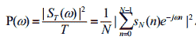
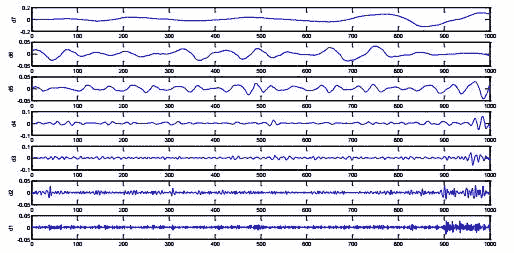

# 【量化投资】基于残差分析的大类资产轮动策略

> 原文：[`mp.weixin.qq.com/s?__biz=MzAxNTc0Mjg0Mg==&mid=2653283954&idx=1&sn=31c26640a60c319d14bd91d651198c0c&chksm=802e2467b759ad71e9110b84280e25f11689c7d0d36504effdc8418397d1bb66241f94842d2d&scene=27#wechat_redirect`](http://mp.weixin.qq.com/s?__biz=MzAxNTc0Mjg0Mg==&mid=2653283954&idx=1&sn=31c26640a60c319d14bd91d651198c0c&chksm=802e2467b759ad71e9110b84280e25f11689c7d0d36504effdc8418397d1bb66241f94842d2d&scene=27#wechat_redirect)

**所有推文全部分类**

**请在页面菜单查找**

**为了更方便的阅读**

感谢**【中信建投证券金工部】**与**【量化投资与机器学习】**公众号进行合作。

**大类资产轮动的特殊性**

相比于商品间的跨品种套利策略，大类资产轮动策略存在大类资产间相关性低、比价（或价差）均值回复特性弱的特点。基于以上事实，在制作黄金与原油轮动策略过程中，我们在考察协整残差项均值回复特性的同时，格外关注大类资产间的协整关系是否发生突变，并在协整关系因外部事件冲击而发生突变时，使用其他轮动策略。

**从协整出发**

普通的跨品种套利由于套利品种间具有可替代性或处于同一产业链的上下游，因此品种间相关度较高并具备较强的协整性；而大类资产间的协整残差项则表现为：均值回复周期较长，且均值回复特性容易被打破的特点。

有鉴于此，我们通过引入谱分析方法确定计算波动率值所需的数据长度，并以此为基础构建协整条件下的大类资产轮动策略；同时，我们通过使用小波分析方法对不同大类资产间的协整关系进行检测，以防止突发事件的影响；此外，当两类资产间不协整时，我们通过引入相对强弱指标来实现资产轮动。

**WTI 原油与伦敦金轮动策略应用**

依据两类资产不协整时是否实施轮动策略，我们将策略区分为两种，并发现从夏普率角度看，当两类资产不协整时，若通过相对强弱指标来实施轮动策略，则可得到更好的效果。同时，依据相对强弱指标构建的策略可在两类资产不协整时，提供较为显著的收益。此外，通过比较发现，使用谱分析方法主动寻找合适的数据长度方法以计算波动率值的方法在收益、稳定性两方面能给策略带来更好的效果。

**不同期货品种间的套利应用**

我们将该策略应用于股指期货沪深 300 合约和股指期货中证 500 合约（IF 主力合约与 IC 主力合约）间套利，仅以日频换仓为例，发现亦可取得不俗效果：IF 与 IC 主力合约间的跨品种套利的年化收益为 33.50%，最大回撤-7.34%；其中，该策略在 2015 年下半年的年化收益达 55.70%，最大回撤-7.34%，2016 年（截止 8 月 31 日）的年化收益和最大回撤分别为 18.81%、 -4.12%。

正文内容一大类资产轮动的特殊性

所谓大类资产，指的是具有相似收益风险特征和投资用途的资产类别。一般而言，大类资产轮动策略通常分为两类：一类是从宏观经济数据出发，依据对经济周期和相关品种基本面的判断，做多预期表现较强的一类资产来实现轮动；而另一类自下而上的方法则与传统意义上的跨品种套利思路略相近，即：从各类资产的价格序列出发，依据数量分析方法实现不同资产间的轮动。

**1.1、跨品种套利**

期货跨品种套利通常指的是利用两个相关联的、不同品种的期货合约之间价差进行买卖的交易方式，即：当相关联期货合约之间的价差背离其正常水平时，买入某一期货合约的同时，卖出另一期货合约，以期二者价差返回正常水平时，对冲平仓以获取稳定的价差收益。

根据参与跨品种套利中不同期货品种间的相关关系，通常可将跨品种套利区分为以下两种：1）相关商品间的套利，这类商品往往受多个相同因素影响而表现出较强的联动性，并在价格变动上存在着共同的趋势，例如：可作为粮食及饲料的玉米和小麦，由于其价格同时受季节、气候等因素影响，价差往往维持在一定的区间内，并表现出相当的规律性；2）同一产业链上下游品种间的套利，由于下游产品产量和供给量较大程度受上游产品的制约，而下游产品价格也极大地影响了上游企业利润，进而影响上游产品的需求和价格，因此这类品种价格波动也往往表现出较强的联动性，例如：同在一个产业链上的大豆与豆粕，铁矿石与螺纹钢。

一般来说，跨品种套利能够得以成功，关键在于：1）套利组合中的品种之间具有高度相关性，如：同属于基本金属的铜和铝，由于在工业用途上具有部分可替代性，而具有较高的相关性，而处于同一产业链上下游的铁矿石和螺纹钢同样具备较高的相关性。2）不同合约间的价差（或比价）变化具有一定的规律性，通常情况下，跨品种套利交易的合约价差变化在一定区间内波动，且从历史的角度看属大概率事件，当价差突破合理区间边界，随着偏离合理区间程度越来越大，回归正常区间的可能性也就越大，而跨品种套利交易正是利用价差短暂性偏离合理区间的机会进行套利交易而获利。

**1.2、大类资产轮动与跨品种套利**

相形之下，虽然遵循自下而上思路的大类资产轮动策略与传统意义上的跨品种套利策略非常相近，但两者间毕竟存在诸多差异：

1）相比用于跨品种套利的商品对，不同大类资产之间相关性普遍较低。以黄金和原油为例，虽然两者均受共同的宏观经济及地缘政治影响，但原油价格更易受原油库存、季节性因素、原油供给结构等因素影响，而黄金则经常受避险情绪、相关联动商品价格、投资需求等因素影响，当某个独立的因素影响程度较大，超过黄金和原油价格的共同影响因素时，两者间的价格运动趋势便可能发生背离；反映在相关性数据上，不难发现，黄金和原油间的相关性表现出显著的时高时低的特点。

2）不同大类资产之间的价差（或比价）缺乏规律性。仍以黄金和原油为例，除商品属性外，黄金还表现出较为明显的避险属性，而原油则具备战略物资属性，资产的不同属性决定了同一突发事件对两类资产价格走势可能产生完全不同的影响，这也经常导致伦敦金与 WTI 原油间所具备的共同走势经常容易被打破；反映在数据上，通常表现为：在经历一段长时间的协整关系后，伦敦金和 WTI 原油的协整残差序列经常因受突发事件冲击而导致原先的均值回复规律被打破，协整关系亦因此而中断。

究其原由，我们认为主要源于三方面：

1）受制于基本面因素影响，不同大类资产经常会因各自供求关系影响而导致其价格走势发生分化，并导致其收益率序列的相关性相应降低，比价（或价差）的均值回复特性被打破。

2）突发事件影响。不同大类资产通常具备不同的属性，以黄金和原油为例，黄金具备避险功能，而原油则有战略物资属性，这便导致同一突发事件对两者可能产生不同影响，并致使两者间的相关性降低，比价或价差的均值回复特性被打破，从而进一步使得两者间长期协整关系的瞬间解体。

3）相关市场联动性因素的影响。每一类资产价格经常会因相关商品价格影响而波动，当两类资产各自联动商品的波动明显不一致时，相关大类资产间往往会表现为：收益率相关度降低，比价（或价差）的均值回复特性减弱。

基于以上事实，在制作基于价格序列的大类资产轮动策略（例：伦敦金与 WTI 原油）时，我们将在考察协整残差项均值回复特性的同时，格外关注大类资产间的协整关系是否发生突变，并在协整关系因外部事件冲击而发生突变时，使用其他方案。

二从协整出发**2.1 关于协整**

在传统的计量经济学中，有许多建模方法是基于最小二乘估计的渐进理论，以解释便利的平稳性为前提，在平稳的短记忆时间序列的基础上进行的。而在实际的经济系统和金融市场中，各类数据却普遍表现为长记忆性和非平稳性，若用非平稳的时间序列作为解释变量，建立回归模型，就会产生“伪回归”现象。上世纪七十年代，Granger 和 Newbod 对伪回归现象进行了实证检验，他们通过 Monte Carlo 模拟指出，回归模型中随机误差项的序列相关性最终将导致传统的模型检验方法的失败。 

为解决模型设定中的伪回归现象，Granger 和 Engle 提出了协整理论。协整检验的思想在于，如果两个时间序列向量的某种线性组合可以得到一个平稳的误差序列，则这些非平稳时间序列存在长期的均衡关系。关于协整性的检验方法，从检验手段上可以分为两种：一种是基于回归残差的 Engle-Granger 两步协整检验法，即：将因变量与自变量之间是否存在协整关系等同于检验回归方程的残差序列是否平稳，并通常使用 ADF 检验来完成；另一种是基于回归系数的 Johansen 协整检验，它将对向量 yt 的协整检验转化为对矩阵П秩的分析。

对于普通的跨品种套利，由于相关套利品种之间具有可替代性或处于同一产业链的上下游，因此，两者间相关度普遍较高，并具备较强的协整性；从数据上看，表现为收益率序列相关性较高，且协整后的残差序列具有较强的均值回复特性。通常意义上的跨品种套利，也正是以协整为前提，在此基础上，通过考察残差序列的均值回复特性，来确定开平仓信号。

与此形成鲜明反差的是，不同大类资产除了受共同的宏观经济作用影响外，通常还受各自基本面因素和各品种不同属性的影响，例如：原油价格除了受原油供需及库存方面影响外，作为战略物资属性，它还受各类地缘政治影响；而黄金价格除了因商品属性而受需求影响外，经常还受避险情绪的影响。因此，不同大类资产间相关度相对较弱；在数据上表现为：收益率序列相关性较低，且当它们之间存在协整关系时，协整残差项通常表现为 2 个特征：1）残差项均值回复周期较长，2）残差项均值回复特性经常容易被打破；而实际上，大类资产间轮动策略的成功与否通常有赖于对以上两个特征的处理（即：如何获得残差序列均值回复的周期，以及如何有效判别均值回复特性是否已被打破）。在 2.2 节中，我们将通过引入谱分析的方法，对第 1）个问题予以解决，而对于第 2）个问题（即：如何发现均值回复特性被打破），我们将在 2.3 节中作进一步展开。

**2.2 序列的周期性**

对时间序列的分析一直存在两种观察、分析和解释方法，第一种是直接分析数据序列随时间变化的结构特征，即人们通常说说的时域分析法，该方法将时间序列作为一个整体进行研究，而无法区分原时间序列所包含的各种周期分量的作用效果，这方面的缺陷可能使研究者对相应时间序列的波动本质产生错误的认识。另一种方法是把时间序列看作不同谐波的叠加，并通过傅里叶变换和谱密度函数研究时间序列在频域范围内的结构特征，即通常所谓的谱分析法。该方法在将时间序列看作互不相关的周期分量叠加的同时，通过研究和比价各分量的周期变化，以充分揭示时间序列的频域结构，掌握其主要波动特征，因此，在研究时间序列的周期波动方面，具有时域方法所无法企及的优势。

2.2.1 傅里叶变换及谱分析

傅里叶分析的研究和应用已有两百多年的历史。1807 年，傅里叶首先提出傅里叶级数的概念，即：任一周期信号均可分解为复正弦信号的叠加。1822 年，傅里叶又提出了非周期信号分解的概念（即：傅里叶变换），而能量有限信号的傅里叶变换及逆变换可分别表示为：

此外，在工程技术应用中，对于平稳随机信号，通常使用功率谱密度函数来表征信号的功率特性。一般意义上的功率谱定义为：

通常情况下，时间序列的分析分为时域分析和频域分析。相比使用较多的时域分析，频域分析有助于分析时间序列潜在的波动周期。作为频域分析中的主要内容之一，谱分析则是建立在严密数学基础上的定量测量工具。

经典功率谱分析又称为线性估计法，它通过傅里叶变换将平稳时间序列的自协方差函数和频域中的功率谱密度函数建立对应关系，将平稳时间序列看做无数具有随机振幅和相位的周期震荡的叠加某一频率处的功率谱密度反映了该频率的周期震荡的强度，因此，若功率谱密度函数在某频率处有明显的峰值点，即可判定原序列中该频率分量强度较大，是一个主周期分量。同时，亦可通过衡量各周期分量的相对重要性，找出序列中隐含的各主要周期分量，从而能有效识别出周期。

根据功率谱密度函数的定义及其与自相关函数之间的关系，经典功率谱估计可分为直接法（周期图法）和间接法。直接法是在对相关信号数据进行必要的预处理后，对处理后数据进行离散 Fourier 变换，并依据功率谱定义求功率谱。而间接法则先由相应信号数据估计出自相关函数，并依据 Wiener-Khintchine 定理，对自相关函数作傅里叶变换得到功率谱。

在傅里叶谱的基础上，上世纪 60 年代，J.P.Burg 采用最大熵法进行谱估计（最大熵谱）：仅假设在所观测到的有限数据以外的数据为随机的，在信息熵为最大的前提下，将未知的那一部分相关函数用迭代方法外推至无穷后，再作频域变换从而得到功率谱；其实质是选择这样一种谱，它对应着最随机或最不可预测的时间序列，而这个时间序列的自相关函数又与一组已知值相同。最大熵谱是一种非线性谱分析方法，它的主要特点是：1）比普通线性谱估计有更高的分辨率，2）用于进行谱分析的数据长度较短，但最大熵谱结果的准确性严重依赖于阶的选择，阶数过低会丢失真实的谱峰，而过高的阶次则将导致虚假谱峰。

2.2.2 谱分析应用  

一般而言，传统的跨品种套利策略以协整为前提，在此基础上通过考察残差序列的均值回复特性，来制定相应多空套利策略；其重点在于开平仓信号的确定，而开平仓位置的确认又往往挂钩于波动率值，因此，此类问题的关键在于波动率的取值。而波动率 （如：历史波动率 ）的值除了受历史时间序列影响外，还与所取的数据长度 N 休戚相关。

对于给定的时间序列，当 N 取不同长度（如下图，N=10、15、20、25、30）时，随着时间的推移，波动率值表现出不同的性态，只有当 N 取作时间序列 y(t)的周期（即下图中 N=20）时，波动率值才不会随着时间的演进而出现大幅波动。

而对于传统的跨品种套利策略而言，在协整关系不变前提下，若任意选取数据长度，将可能导致波动率值随着时间推移而发生大幅震荡，并进而影响整个套利策略开平仓信号的稳定性。在此背景下，当两类资产因满足协整关系而沿用传统跨品种套利思路时，我们在计算波动率值时，将所需的数据长度取作一个周期，以此避免波动率值因所取数据长度的原因而产生大幅波动。通过回测，不难发现，固定的数据长度与通过谱分析方法得到的数据长度对轮动策略的结果影响较为显著（相关详细结论见本文第三部分）。

**2.3 协整机制的监测**

由于不同大类资产（例如：黄金和原油）除了受共同的宏观经济因素影响之外，往往还具备不同的属性（如：黄金具备避险功能，而原油则具有战略物资属性），因此，它们之间的弱平衡往往因某些突发事件的影响而中断；反映在数据上，此时通常表现为协整后的残差序列均值回复规律突然消失，协整均衡瞬间被打破。因此，对基于协整的轮动策略，监测不同大类资产间的协整关系则显得极为必要。由于小波分析方法在时频两域都具有良好的表现局部特征的能力，因此，在 2.3 节中，我们将引入小波分析方法，对两类资产间的协整关系进行监测，以确认突发事件对两类资产间协整关系是否产生决定性影响。

2.3.1 关于小波分析

时间和频率是描述信号的两个极重要的参数，Fourier 变换将信号的时域特征和频域特征有机联系起来，使之成为信号分析和处理的有力工具。但 Fourier 分析仅适用于平稳信号，对于非平稳信号，则无法精细地跟踪其时频特征。

上世纪 80 年代，法国地球物理学家 Morlet 在分析处理地震信号时，首次引入“小波”概念。其后，理论物理学家 Grossman 采用平移和伸缩不变性建立了小波变换的理论体系。1988 年，比利时数学家 Daubechies 证明了紧支撑正交标准小波基的存在性，并使离散小波分析成为可能。1989 年，Mallat 提出多分辨率概念，建立了小波理论的统一体系，并提出二进小波变换的快速算法（Mallat 算法），使小波在许多领域得到了广泛应用。

采用小波变换作奇异性检测是 Grossman 在作图像边缘检测时首先采用的，Mallat 等人发展并完善了小波奇异性检测的理论，成为以后各种小波奇异性检测应用的基石。传统的奇异性检测方法是基于 Fourier 变换，它只能反映信号的整体奇异性，而对信号的局部奇异性无法描述，而基于小波变换的奇异性检测方法可以实现对信号局部奇异性的刻划。因此，自该方法提出以来，便获得了广泛的应用。

2.3.2 小波变换方法

小波分析方法是一种时间和频率窗口大小（即窗口面积）固定但形状可变的时频局域化分析方法，即：在低频部分具有较高的频率分辨率和较低的时间分辨率，在高频部分具有较高的时间分辨率和较低的频率分辨率；小波分析的目的是——既见到森林（信号的概貌），又要看到树木（信号的细节），因此被誉为“数学显微镜”。

通常，小波变换可被定义为如下形式：

此时，f（t）的小波变换 是 a 和 b 的函数，其中，b 是时移因子，a 是尺度伸缩因子， 称为母小波， 是母小波经位移和伸缩后所产生的一组函数，称为小波基函数，故 f（t）的小波变换可视为 f（t）与一组小波基的内积。

2.3.3 小波变换的模极大值和多分辨率分析

原始信号可以按一定的尺度被分解成几个具有不同分辨率的分量，而且由这些分量能够不失真地重构原始信号。多分辨分析理论为人们讨论信号的局部信息提供了一个直观的框架，即认为任何一个信号都可以分解为两部分：低频（主体信息）和高频（细节纹理）。为了将信号的低频与高频部分分开处理，Mallat 提出了信号的多分辨分解与重构的算法，其地位在小波分析中相当于快速 Fourier 算法在经典 Fourier 分析中的地位。

2.3.4 奇异性的数学描述

一般情况下，信号的奇异性通常分为两种：一种是信号在某一时刻其幅值发生变化，使得信号出现非连续的跳跃，被称为第一类间断点；另一种是信号外观光滑，但信号的一阶导数不连续且发生突变，被称为第二类间断点。通常而言，人们用 Lipschitz 指数α来描述函数的局部奇异性。Lipschitz 指数给出了信号 f(t)在 x0 处光滑性的精确信息：α越大，则函数越光滑，α越小，说明函数奇异性越大。

2.3.5 信号奇异性的小波检测

根据一致 Lipschitz 指数的性质，当我们采用二进小波变换时， 

上式将小波变换的尺度特征 i 与李氏指数α联系起来，并给出小波变换的对数值随尺度特征的变化规律：当α>0 时，小波变换的极大值将随尺度特征 i 的增大而增大，当α<0 时，小波变换的极大值将随尺度特征 i 的增大而减小，当α=0 时，小波变换的极大值将不随尺度特征 i 的改变而改变。同时，若在两个连续的二进尺度 i 和 i+1 上均取等式，则 

此时，该式描述了信号 f(t)在奇异点 t0 领域内能量的变化趋势：若 α>0，信号在奇异点 t0 的某个领域内自 2i 尺度至 2i+1 尺度能量呈增加趋势，若 α<0，信号在奇异点 t0 的某个领域内自 2i 尺度至 2i+1 尺度呈衰减趋势。

利用小波变换分析信号的奇异点时，主要是利用一般信号与突变信号能量分布的不同频带为奇异点定位，利用能量在频带内的不同分配情况来区分奇异点类型。因而，利用小波方法检测信号奇异点的一般方法是：对信号进行多尺度分析，在信号出现突变时，其小波变换后的系数具有模量极大值，从而可以通过模量极大值的确定来检测奇异点的位置。

2.3.5 小波奇异值监测举例

我们以 2005 年 2 月 1 日为数据起始点，检测 2007 年至 2008 年间黄金与原油的协整关系。通过使用小波分析的奇异值检测方法对收益率回归后的残差序列进行监测，我们发现自 2008 年 9 月 22 日（图中 t=900）起，黄金与原油间协整关系发生突变。

通过查找相关日历，我们找到了在历史上与之相对应的突发事件：2008 年 9 月 15 日，雷曼兄弟宣布申请破产保护，而美联储在 2008 年 9 月 16 日至 9 月 18 日举行的会议（FOMC）上，对该事件并无反应，导致自 9 月中旬开始，黄金与原油间保持 1 年多时间的弱平衡被打破，原油在此后一个季度内出现暴跌，而黄金在此后短短 2 个月内出现宽幅震荡。

同时，这也在伦敦金与 WTI 原油间的协整残差序列中得到了印证：自 2008 年 9 月 22 日（图中 t=600）起，伦敦金和 WTI 原油间均值回复规律突然被打破。

 

**2.4 非协整情形**

若两类资产间不满足协整关系，基于协整的残差序列均值回归策略将不再可行，此时，我们将引入相对强弱指标来制作大类资产轮动策略： 

设 a、b 为两类资产， Ra、Rb 为过去一段时间资产 a、b 的累计收益，σ为资产 a、b 收益差的波动率值，则相对强弱指标表示为

其中，β为资产 a、b 日收益率序列的回归系数。实际上，相对强弱指标 描述了两类资产间的相对风险收益状况；同时，由于相对强弱指标 RY 具有较为良好的均值回复特性，且与两类资产间的累计收益差具有较好的负相关关系，因此，通常将其作为资产轮动策略的建模依据。

三 WTI 原油 Vs 伦敦金轮动策略

（1）数据选取：我们选取 2010 年 1 月 2 日至 2016 年 6 月 30 日 WTI 原油与伦敦金的日收盘价数据； 

（2）策略实施：

对 WTI 原油与伦敦金对数价格序列作协整检验：

1）当两者间满足协整关系时，通过傅里叶谱分析，确定残差序列的周期，并藉此确定计算波动率的计算公式，并依据波动率值倍数确定相应的多空开平仓信号及位置；

2）依据小波分析的模极大值原理检测两类资产的收益率残差序列是否存在突变点，当发现突变点时，即停止原先的基于残差序列的均值回复策略；

3）当 WTI 原油与伦敦金的对数价格序列不协整时，考虑不进行操作或制定基于相对强弱指标的均值回复多空策略。

（3）策略结论：

依据 WTI 原油与伦敦金不协整时是否实施轮动策略，我们将策略区分为：策略 1（WTI 原油与伦敦金不协整时暂停实施轮动策略）和策略 2（WTI 原油与伦敦金不协整时，实施基于相对强弱指标的均值回复策略）两种。

由上表可见，对于策略 1，其年化收益达 18.04%，最大回撤-11.24%；而由于 2010 年至 2016 年间伦敦金与 WTI 原油不协整时间所占比例相应较小，因此，当两者间不协整时，通过基于相对强弱指标的轮动策略可有效提高年化收益，同时，从 Sharp 率及收益回撤比的角度看，策略 2 亦具备一定优势。

 

考察 WTI 原油与伦敦金轮动策略收益率曲线图，不难发现，相比于策略 1，策略 2 中有相当比例收益来源于黄金和原油不协整时间段，即：当两类资产不协整时，通过相对强弱指标构建的轮动策略可提供较为明显的收益。

同时，深入考察当两类资产满足协整关系时，使用不同数据长度计算波动率值 ，并进而在此波动率值基础上制定均值回复策略的效果；不难发现，相比于使用固定的数据长度来计算波动率值，通过使用谱分析方法确定数据长度，并在此基础上确定均值回复策略的效果更佳。由此可见，使用谱分析方法主动寻找合适的数据长度方法在收益、稳定性两方面能给策略带来更好的效果。

四不同期货品种间的套利策略应用

我们将该策略应用于股指期货沪深 300 合约和股指期货中证 500 合约（IF 主力合约与 IC 主力合约）间套利，仅以日频换仓为例，发现亦可取得不俗效果。

（1）数据选取：我们选取 2015 年 6 月 30 日至 2016 年 8 月 31 日间 IF、IC 当月主力合约的日收盘价、结算价数据；

（2）模型假设：假设总资金为 1000 万，期货开平仓手续费万分之二，保证金比例 45%，开平仓交易滑点 0.2 点，期货仓位 60%，若信号显示继续持有，则于交割日前一天实施换月，当出现开平仓信号后以当日收盘价开、平仓；

（3）策略表现：

自 2015 年 6 月 30 日至 2016 年 8 月 31 日，IF 与 IC 主力合约间的跨品种套利的年化收益为 33.50%，其中，该策略在 2015 年（2015 年 6 月 30 日至 2015 年 12 月 31 日）的年化收益达 55.70%，最大回撤 7.34%，2016 年（2016 年 1 月 4 日至 2016 年 8 月 31 日）的年化收益和最大回撤分别下滑至 18.81%、4.12%。

 

欢迎关注中信建投官方微信

往期精彩阅读链接 

直接点击，查看往期精彩文章

*   [【HMM 系列】之——HMM 指数择时深度研究](http://mp.weixin.qq.com/s?__biz=MzAxNTc0Mjg0Mg==&mid=2653283909&idx=1&sn=ff416c442cd1a9382bbd2142f9679745&scene=21#wechat_redirect)

*   [【Python 量化投资】对数周期幂率（LPPL）模型在 A 股中应用](http://mp.weixin.qq.com/s?__biz=MzAxNTc0Mjg0Mg==&mid=2653283845&idx=1&sn=a00892888cd23b2bbb8c95ad3605218d&scene=21#wechat_redirect)

*   [【量化投资策略探讨】决策树和随机森林](http://mp.weixin.qq.com/s?__biz=MzAxNTc0Mjg0Mg==&mid=2653283764&idx=1&sn=f61f65377473e55428f9c2204d148b25&scene=21#wechat_redirect)

*   [【干货扫荡】公众号干货精华帖整理从创办至今](http://mp.weixin.qq.com/s?__biz=MzAxNTc0Mjg0Mg==&mid=2653283882&idx=1&sn=154943c97279a743190c9573e2e8f52e&scene=21#wechat_redirect)

*   [【Matlab 量化投资】GFTD 指标程序化实现（附源码）](http://mp.weixin.qq.com/s?__biz=MzAxNTc0Mjg0Mg==&mid=2653283878&idx=1&sn=387f9395917442553bbfde43183ce010&scene=21#wechat_redirect)

*   [【量化缠论】系列文章（一）](http://mp.weixin.qq.com/s?__biz=MzAxNTc0Mjg0Mg==&mid=2653283801&idx=1&sn=0a05bb0247535a118183be2b917c56b4&scene=21#wechat_redirect)

*   [跟你讲个笑话，我是做私募的……](http://mp.weixin.qq.com/s?__biz=MzAxNTc0Mjg0Mg==&mid=2653283777&idx=1&sn=252e295b1a788da1aaadf39c2ef959ee&scene=21#wechat_redirect)

*   [【干货】各大券商研究报告！](http://mp.weixin.qq.com/s?__biz=MzAxNTc0Mjg0Mg==&mid=2653283773&idx=1&sn=d4604682da0c5563be9da16717d11bf9&scene=21#wechat_redirect)

*   [【重磅干货】Matlab 高频算法交易——从基础到高级算法的完美 实现（源码附送，这货太干了！）](http://mp.weixin.qq.com/s?__biz=MzAxNTc0Mjg0Mg==&mid=2653283757&idx=1&sn=35a7faaf06721de2b8fdb5673126022a&scene=21#wechat_redirect)

*   [马尔可夫区制转换模型与金融市场周期【附源码】](http://mp.weixin.qq.com/s?__biz=MzAxNTc0Mjg0Mg==&mid=2653283605&idx=2&sn=aa9c31166efba53c3bf5dd496d7357e0&scene=21#wechat_redirect)

*   [【多因子系列】之新手必看 | 量化交易七宗罪](http://mp.weixin.qq.com/s?__biz=MzAxNTc0Mjg0Mg==&mid=2653283543&idx=1&sn=f7376931ac3a99647b26ba5fa0c597d7&scene=21#wechat_redirect)

*   [【多因子系列之二】where is my alpha](http://mp.weixin.qq.com/s?__biz=MzAxNTc0Mjg0Mg==&mid=2653283598&idx=1&sn=53973fe24d449159e896616faae6c804&scene=21#wechat_redirect)

*   [【机器学习】支持向量机的概念与运用初探](http://mp.weixin.qq.com/s?__biz=MzAxNTc0Mjg0Mg==&mid=2653283515&idx=1&sn=edeedbb0190fc1c1242de5795635fccc&scene=21#wechat_redirect)

*   [七夕没有对象的宽客都在看这篇文章](http://mp.weixin.qq.com/s?__biz=MzAxNTc0Mjg0Mg==&mid=2653283478&idx=1&sn=aa061849c61ee84eedda3ac9d0c74ec5&scene=21#wechat_redirect)

*   [【Python 机器学习】信息熵和在决策树中的运用（附源码）](http://mp.weixin.qq.com/s?__biz=MzAxNTc0Mjg0Mg==&mid=2653283451&idx=1&sn=2f10aaa1083856c0a2e07e718a3973cd&scene=21#wechat_redirect)

*   [增强学习与量化投资初探](http://mp.weixin.qq.com/s?__biz=MzAxNTc0Mjg0Mg==&mid=2653283440&idx=1&sn=e5dc6e12f7b28b5ede13bd582b59b73c&scene=21#wechat_redirect)

*   [【Python 机器学习】数据预处理——图像压缩与线性代数](http://mp.weixin.qq.com/s?__biz=MzAxNTc0Mjg0Mg==&mid=2653283419&idx=1&sn=43f113c5e81745b607e9e1f60e7f1a35&scene=21#wechat_redirect)

*   [【每周书籍干货】国外近期深度学习与机器学习书籍电子版——你知道一本买来好多刀啊！](http://mp.weixin.qq.com/s?__biz=MzAxNTc0Mjg0Mg==&mid=2653283143&idx=1&sn=2316c1a067239aa007196cc8cb2e6c5b&scene=21#wechat_redirect)

*   [【Matlab 量化投资】根据期货高频数据和期货交易所交易规则以及 BS 方法判断高频交易方向和多空主力建仓减仓行为（附源码！！！）](http://mp.weixin.qq.com/s?__biz=MzAxNTc0Mjg0Mg==&mid=2653283293&idx=1&sn=7c26d2958d1a463686b2600c69bd9bff&scene=21#wechat_redirect)

*   [【量化投资系列】基于多重分形理论的短趋势择时策略研究](http://mp.weixin.qq.com/s?__biz=MzAxNTc0Mjg0Mg==&mid=2653283004&idx=1&sn=95a79928c89a69ac12d07514f5085c9a&scene=21#wechat_redirect)

*   [【重！磅！干！货！】互联网金融之量化投资深度文本挖掘——附源码文档](http://mp.weixin.qq.com/s?__biz=MzAxNTc0Mjg0Mg==&mid=2653282879&idx=1&sn=12a91c4b8317662fbae470541ebe4683&scene=21#wechat_redirect)

*   [【机器学习资料整理】（学习工具、学习视频、博客和文章推荐、ML 相关算法参考、部分机器学习译文）](http://mp.weixin.qq.com/s?__biz=MzAxNTc0Mjg0Mg==&mid=2653282920&idx=1&sn=6faa96116c590c75d92569351f987e52&scene=21#wechat_redirect)

*   [大数据之微信公众号深度量化研究](http://mp.weixin.qq.com/s?__biz=MzAxNTc0Mjg0Mg==&mid=404626412&idx=1&sn=502f2a57b8f9b13887c30fb65e39a7f7&scene=21#wechat_redirect)

听说，置顶关注我们的人都不一般

****