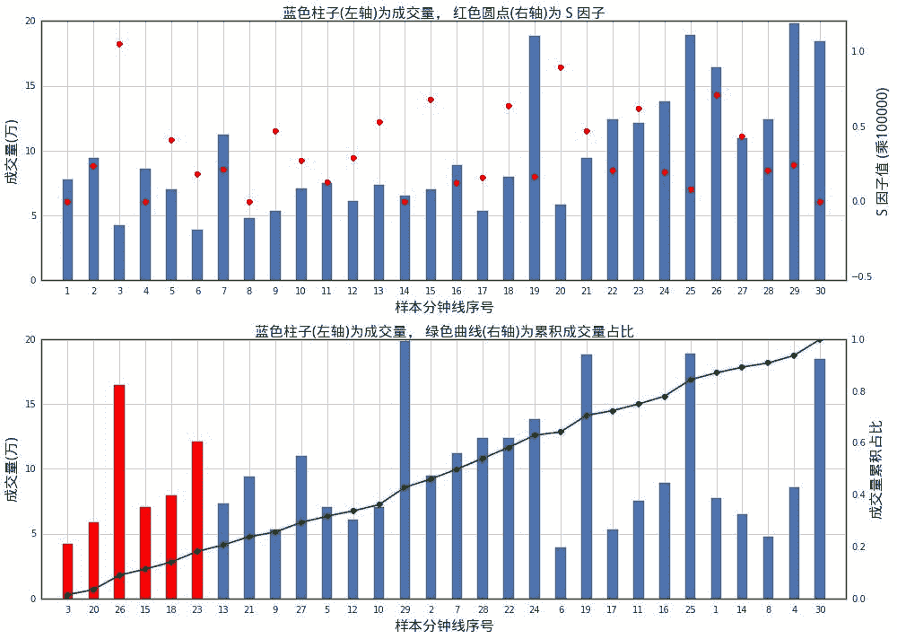

# 【全网首发】——机器学习该如何应用到量化投资系列（一）

> 原文：[`mp.weixin.qq.com/s?__biz=MzAxNTc0Mjg0Mg==&mid=2653283935&idx=1&sn=56e84e986f278403d8840387c615a2a7&chksm=802e244ab759ad5c43720a7960567d215970877250ca72534016bf53a021c73f83665068639d&scene=27#wechat_redirect`](http://mp.weixin.qq.com/s?__biz=MzAxNTc0Mjg0Mg==&mid=2653283935&idx=1&sn=56e84e986f278403d8840387c615a2a7&chksm=802e244ab759ad5c43720a7960567d215970877250ca72534016bf53a021c73f83665068639d&scene=27#wechat_redirect)

**所有推文全部分类**

**请在页面菜单查找**

**为了更方便的阅读**

有一些单纯搞计算机、数学或者物理的人会问，究竟怎么样应用 ML 在量化投资。他们能做些什么自己擅长的工作。虽然在很多平台或者自媒体有谈及有关的问题，但是不够全面和完整。从今日起，量化投资与机器学习公众号将推出一个系列【机器学习该如何应用到】。编辑部花了很长时间，采访和咨询了很多研究人员。希望各位读者有所收获，如有不足，欢迎批评指正。

**一、什么是机器学习**

机械的定义避开不谈，回答也不追求全面准确。明确一点，机器学习的主要目的在于**发现规律**或**重现规律**。（此处不谈非监督学习、强化学习，也不谈降维、集成算法）。什么是发现规律？譬如将决策树应用于多因子模型，试图从样本数据中找出具有较高收益的因子组合。什么是重现规律？譬如，拿来一篮子股票的样本（“训练样本”），假定当中 y 的值（连续值为回归、离散值为分类）与 x1,x2,...,xn 之间一些规律，那么我们用一个模型去学习这个规律，目的是使得这个模型应用于训练样本时误差最小，那么，当下一次出现一只新的股票，希望通过此模型预测这只股票未来的表现。而这个预测的原理是从训练样本中（过去的样本）学习得到的。

**二、为什么机器学习重要**

在传统的技术分析、量化投资中的具有业务背景的机理模型当中，举两个例子：

**■ 例子 1：** 前段时间比较火的《跟踪聪明钱-从分钟线到选股因子》，作者认为聪明钱应该“订单报价更激烈”，因此构造一个指标衡量聪明程度，利用这个指标的确定投资策略。

 

如上所示，首先对于 30 条样本分钟线计算 S 因子(上图)；其次以 S 因子由大到小的顺序重新对这些分钟线排序，并按此顺序计算成交量累积占比(下图)，截取 S 因子最大的前 20%成交量所包含的分钟线(下图中的红色柱子)作为聪明钱。

如上划分找到聪明钱之后，我们就可以通过这些聪明钱的交易数据来构造聪明钱的情绪因子 **Q**：

 

Q 越大，表明聪明钱的交易越倾向于出现在价格较高处，这是逢高出货的表现，反映了聪明钱的悲观态度；Q 越小，则表明聪明钱的交易多出现在价格较低处，这是逢低吸筹的表现，是乐观的情绪。

 

**■ 例子 2：**

两个例子的本质：对过去数据的分析，建立模型发现规律（例子(i)），或者重现规律（例子(ii)中，通过过去样本中某因子与收益的关系，确定评分的梯度，并应用于以后的样本，就是一种学习、重现规律的过程），从而对后面的投资产生建议。

但是，不难发现，上述两个例子，发现规律和重现规律的过程是完全人为确定的。如例子 1 中是作者基于对“聪明钱”的理解，人为构造指标的，而例子 2 中的“重现规律”过程是从过去样本中，因子与收益的关系（如 Rank corrlelation）作定性分析，人为确定评分规则和梯度的。

那么问题来了，上述两个例子的**发现规律**或**重现规律**过程能否用机器学习代替？

上述两个例子本质也是分析过去的数据，从而发现规律或重现规律，这一过程与机器学习模型的本质是无异的。但是很遗憾，就目前的成果来看，若想在非监督情况下，利用机器学习模型来**发现规律**，这一点还是比较困难的（你就想象模型怎么找出例 1 研报中的“聪明程度”指标表达式），但是**重现规律**这一点，机器学习还是可以轻松做到的。

**三、谈谈应用**

既然已经说到，“量化投资领域中，所有需要重现规律的环节都可用机器学习模型代替”，就不用再问机器学习能应用在哪儿了。举些例子，多因子模型本质是根据过去市场对某些因子或因子组合的青睐和偏好，判断当前哪些股票值得投资。因此，就可使用机器学习模型（SVM、贝叶斯方法都是不错的）学习过去的“偏好”，应用于现在。

**■ 例子 1：【**国信证券——SVM 算法选股以及 Adaboost 增强】。以每个因子作为一层特征， 在 68 个因子的维度下，支持向量机算法能够有效的对股票组合的标签进行分类与预测。

SVM 算法的样本数据的标准化采用排序法。 因此，计算每个股票按某因子的排序然后除以总股票数，这样因子的值归到(0,1]。 

然后，对下一期收益率从大到小排序，取前 30%作为强势股，后 30%作为弱势股，强势股划分类标为+1，弱势股划分类标为-1；中间百分之 40%的股票排出训练集，因为中间百分之 40%的股票收益并不强势也不弱势，相当于噪声数据。为了充分利用数据，找出相对稳定有效的因子，确保算法的稳定性，用过去 12 个月的因子数据作为输入样本。从 SVM 理论推导可以知道， 在得到最优超平面的解之后， 样本被划分为{-1，+1}两类，而样本距离超平面的距离，则可以代表样本被正确分类的程度。 用公式表达为：

其中 x 为新的样本点， w， b 为 SVM 求解超平面的输出结果。根据距离结果， 同样将股票组合分为 10 档，选择收尾两档分别作为强势组合和弱势组合，并观察回测结果。

 

**■ 例子 2：**你认为股指期货 Tick 数据的盘口与成交与价格未来的走势有关，就可以用机器学习模型（神经网络、深度学习网络）学习过去数据中盘口价量与之后的价格走势的规律，再应用于当前；诸如此类。（此处没有谈及也较常用的聚类算法，如 GMM 等。）

**三、谈谈机器学习的利弊**

建立一个成功的机器学习模型，包含但不限于以下过程：

**数据样本的选取（因子变量的选取）、数据样本的预处理（变量的预处理、样本的平衡处理、极端样本的处理等）、人为的处理（一些变换等）、模型的选取、模型算法的选取、模型参数的选取，对欠拟合、过拟合的避免等等**……撇开这些不讲，即使上述提及的过程合部处理恰当，训练结果良好，哪怕是测试样本效果也不错，应用于实际投资效果也不能保证一定好。为什么呢？

第一，这是因为我们的样本大多数时候是带有时间维度的（即训练样本、测试样本、实际投资所处的时间段都是不同的），它们**并非截面数据**，模型学习的市场“规律”或“偏好”，是会随时间变化的。第二，我们的模型往往只是学习某一些因子反映的规律，而除去这些因子以外的因素，**影响市场变化的因素有很多很多**（汇率、政策等），这些都是模型没有考虑的，一旦这些模型以外的因素成为主导市场“偏好”的时候，时间短还好说，最多也只是短期的一个回撤，如果时间较长，模型在此期间的效果就会大打折扣。

对于第二个问题，在股票多头策略中使用对冲、在多空投机策略中设置止损和失效判断（如连续 n 次投机连续失败时，可考虑一段时间内不再开仓投机等）也许是个好方法，对于第一个问题，使用时间跨度更长的样本进行训练并不一定能解决问题。（例如市值因子，哪怕从 3 年的回测跨度变成 5 年、7 年，在过去都是较为显著的因子，但未来呢？）笔者认为这个问题需要具体分析。**从数据的实际背景分析，模型所学习的规律是否可持续；如果担心这种规律变化过快，可以缩短训练样本的长度，并且采用时间滚动的样本作为训练样本。**

**PS**

机器学习应用于量化投资的过程中仍有很多环节、细节尚未谈及，重述笔者今天最想分享的观点，就是量化投资中**重现规律**这一环节，可以考虑使用机器学习模型，或许会比主观建立的模型更加简单快捷、精细有效。

往期精彩阅读链接 

直接点击，查看往期精彩文章

*   [【HMM 系列】之——HMM 指数择时深度研究](http://mp.weixin.qq.com/s?__biz=MzAxNTc0Mjg0Mg==&mid=2653283909&idx=1&sn=ff416c442cd1a9382bbd2142f9679745&scene=21#wechat_redirect)

*   [【Python 量化投资】对数周期幂率（LPPL）模型在 A 股中应用](http://mp.weixin.qq.com/s?__biz=MzAxNTc0Mjg0Mg==&mid=2653283845&idx=1&sn=a00892888cd23b2bbb8c95ad3605218d&scene=21#wechat_redirect)

*   [【量化投资策略探讨】决策树和随机森林](http://mp.weixin.qq.com/s?__biz=MzAxNTc0Mjg0Mg==&mid=2653283764&idx=1&sn=f61f65377473e55428f9c2204d148b25&scene=21#wechat_redirect)

*   [【干货扫荡】公众号干货精华帖整理从创办至今](http://mp.weixin.qq.com/s?__biz=MzAxNTc0Mjg0Mg==&mid=2653283882&idx=1&sn=154943c97279a743190c9573e2e8f52e&scene=21#wechat_redirect)

*   [【Matlab 量化投资】GFTD 指标程序化实现（附源码）](http://mp.weixin.qq.com/s?__biz=MzAxNTc0Mjg0Mg==&mid=2653283878&idx=1&sn=387f9395917442553bbfde43183ce010&scene=21#wechat_redirect)

*   [【量化缠论】系列文章（一）](http://mp.weixin.qq.com/s?__biz=MzAxNTc0Mjg0Mg==&mid=2653283801&idx=1&sn=0a05bb0247535a118183be2b917c56b4&scene=21#wechat_redirect)

*   [跟你讲个笑话，我是做私募的……](http://mp.weixin.qq.com/s?__biz=MzAxNTc0Mjg0Mg==&mid=2653283777&idx=1&sn=252e295b1a788da1aaadf39c2ef959ee&scene=21#wechat_redirect)

*   [【干货】各大券商研究报告！](http://mp.weixin.qq.com/s?__biz=MzAxNTc0Mjg0Mg==&mid=2653283773&idx=1&sn=d4604682da0c5563be9da16717d11bf9&scene=21#wechat_redirect)

*   [【重磅干货】Matlab 高频算法交易——从基础到高级算法的完美 实现（源码附送，这货太干了！）](http://mp.weixin.qq.com/s?__biz=MzAxNTc0Mjg0Mg==&mid=2653283757&idx=1&sn=35a7faaf06721de2b8fdb5673126022a&scene=21#wechat_redirect)

*   [马尔可夫区制转换模型与金融市场周期【附源码】](http://mp.weixin.qq.com/s?__biz=MzAxNTc0Mjg0Mg==&mid=2653283605&idx=2&sn=aa9c31166efba53c3bf5dd496d7357e0&scene=21#wechat_redirect)

*   [【多因子系列】之新手必看 | 量化交易七宗罪](http://mp.weixin.qq.com/s?__biz=MzAxNTc0Mjg0Mg==&mid=2653283543&idx=1&sn=f7376931ac3a99647b26ba5fa0c597d7&scene=21#wechat_redirect)

*   [【多因子系列之二】where is my alpha](http://mp.weixin.qq.com/s?__biz=MzAxNTc0Mjg0Mg==&mid=2653283598&idx=1&sn=53973fe24d449159e896616faae6c804&scene=21#wechat_redirect)

*   [【机器学习】支持向量机的概念与运用初探](http://mp.weixin.qq.com/s?__biz=MzAxNTc0Mjg0Mg==&mid=2653283515&idx=1&sn=edeedbb0190fc1c1242de5795635fccc&scene=21#wechat_redirect)

*   [七夕没有对象的宽客都在看这篇文章](http://mp.weixin.qq.com/s?__biz=MzAxNTc0Mjg0Mg==&mid=2653283478&idx=1&sn=aa061849c61ee84eedda3ac9d0c74ec5&scene=21#wechat_redirect)

*   [【Python 机器学习】信息熵和在决策树中的运用（附源码）](http://mp.weixin.qq.com/s?__biz=MzAxNTc0Mjg0Mg==&mid=2653283451&idx=1&sn=2f10aaa1083856c0a2e07e718a3973cd&scene=21#wechat_redirect)

*   [增强学习与量化投资初探](http://mp.weixin.qq.com/s?__biz=MzAxNTc0Mjg0Mg==&mid=2653283440&idx=1&sn=e5dc6e12f7b28b5ede13bd582b59b73c&scene=21#wechat_redirect)

*   [【Python 机器学习】数据预处理——图像压缩与线性代数](http://mp.weixin.qq.com/s?__biz=MzAxNTc0Mjg0Mg==&mid=2653283419&idx=1&sn=43f113c5e81745b607e9e1f60e7f1a35&scene=21#wechat_redirect)

*   [【每周书籍干货】国外近期深度学习与机器学习书籍电子版——你知道一本买来好多刀啊！](http://mp.weixin.qq.com/s?__biz=MzAxNTc0Mjg0Mg==&mid=2653283143&idx=1&sn=2316c1a067239aa007196cc8cb2e6c5b&scene=21#wechat_redirect)

*   [【Matlab 量化投资】根据期货高频数据和期货交易所交易规则以及 BS 方法判断高频交易方向和多空主力建仓减仓行为（附源码！！！）](http://mp.weixin.qq.com/s?__biz=MzAxNTc0Mjg0Mg==&mid=2653283293&idx=1&sn=7c26d2958d1a463686b2600c69bd9bff&scene=21#wechat_redirect)

*   [【量化投资系列】基于多重分形理论的短趋势择时策略研究](http://mp.weixin.qq.com/s?__biz=MzAxNTc0Mjg0Mg==&mid=2653283004&idx=1&sn=95a79928c89a69ac12d07514f5085c9a&scene=21#wechat_redirect)

*   [【重！磅！干！货！】互联网金融之量化投资深度文本挖掘——附源码文档](http://mp.weixin.qq.com/s?__biz=MzAxNTc0Mjg0Mg==&mid=2653282879&idx=1&sn=12a91c4b8317662fbae470541ebe4683&scene=21#wechat_redirect)

*   [【机器学习资料整理】（学习工具、学习视频、博客和文章推荐、ML 相关算法参考、部分机器学习译文）](http://mp.weixin.qq.com/s?__biz=MzAxNTc0Mjg0Mg==&mid=2653282920&idx=1&sn=6faa96116c590c75d92569351f987e52&scene=21#wechat_redirect)

*   [大数据之微信公众号深度量化研究](http://mp.weixin.qq.com/s?__biz=MzAxNTc0Mjg0Mg==&mid=404626412&idx=1&sn=502f2a57b8f9b13887c30fb65e39a7f7&scene=21#wechat_redirect)

听说，置顶关注我们的人都不一般

****