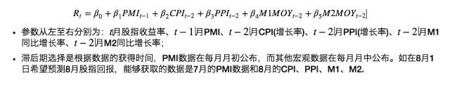
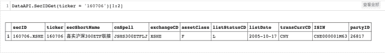
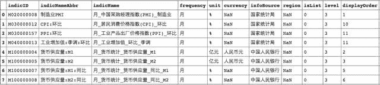
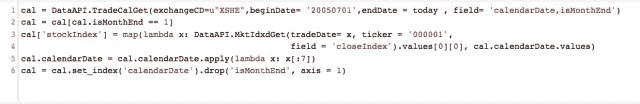
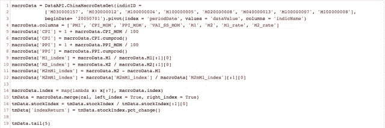
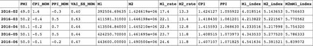
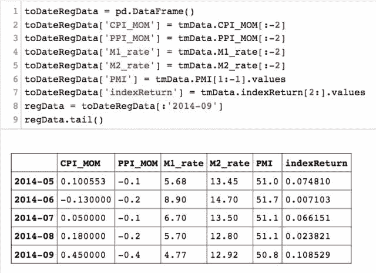
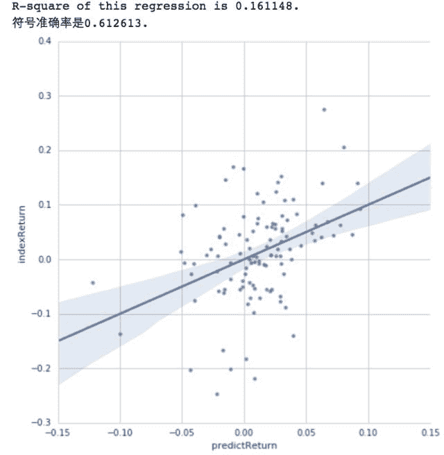
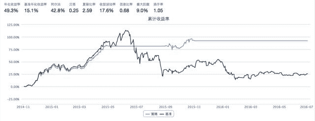

# 宏观因子择时策略

> 原文：[`mp.weixin.qq.com/s?__biz=MzAxNTc0Mjg0Mg==&mid=2653283911&idx=1&sn=e0744734418504987bbaaffe21c55b77&chksm=802e2452b759ad447622286d83009cf46057af9220efdd39ff5c53174d1ad1dc125ef1ca654b&scene=27#wechat_redirect`](http://mp.weixin.qq.com/s?__biz=MzAxNTc0Mjg0Mg==&mid=2653283911&idx=1&sn=e0744734418504987bbaaffe21c55b77&chksm=802e2452b759ad447622286d83009cf46057af9220efdd39ff5c53174d1ad1dc125ef1ca654b&scene=27#wechat_redirect)

> ********查看之前文章请点击右上角********，关注并且******查看历史消息**************所有文章全部分类和整理，让您更方便查找阅读。请在页面菜单里查找。********

**一、思路整理**

筛选对于市场波动有一定预测能力的指标，备选：

**实体经济指标：**PMI(采购经理人指数)

**物价水平指标：**CPI(消费者价格指数)**、**PPI(生产者价格指数)

**货币财政指标：**M1(狭义货币量)**、**M2(广义货币量)

选取样本期间进行模型训练，得出市场回报预测模型；

在之后的期间利用所得模型预测市场收益，大于一定门槛值则持有沪深 300ETF，否则空仓。

**二、所用模型**

**三、实战演练**

#### 引入工具包并定义全局设定：

#### 选一只上市时间长的 ETF 测试择时效果：

#### 用到的宏观数据指标是：

#### 获取每月指数行情数据：

#### 数据组合与处理：

**构建模型训练数据集：**

*   **将数据调整到相应滞后期；** 

*   **选取训练期间** —— **这里用**2005.07 - 2014.10**作为训练期间。**

#### 拟合线性回归模型：

*   #### 模型能够解释 16%的股指回报率变化情况；

*   #### 模型预测股指涨跌的准确率是 61.3%.

#### 对于模型训练外期间（这里从 2014.11 开始）进行回测，如果月初预测股指回报率高于门槛值，全仓持有沪深 300ETF；否则空仓。验证择时效果：

*   #### 能够较为准确地分辨上涨和下跌期间；

*   #### 回撤小，回报高。

**四、结论与优化**

*   #### 本篇给出了宏观因子择时的一种实现方式：采用宏观因子滞后期数据（避免预测时使用未来数据）与历史股指回报拟合模型，在训练样本外期间使用得到参数预测股指回报，并进行相应操作。样本外回测表现不错，回撤小，回报高。

*   #### 这里只提供一种思路，宏观因子选取、拟合模型等都还有不同的选择。

*   #### 参考光大证券《宏观因子择时分析方法研报》、长江证券《基于择时功效的股市宏观多因素预测模型》

听说，置顶关注我们的人都不一般

****

**后台回复下列关键字**

**更多惊喜在等着****你** **【区分大小写】**  

**1.回复****每周论文** [**获取 Market Making 论文分享**](http://mp.weixin.qq.com/s?__biz=MzAxNTc0Mjg0Mg==&mid=2653283381&idx=1&sn=48ec361d5b5a0e86e7749ff100a1f335&scene=21#wechat_redirect)

**2\. 回复****matlab 量化投资** **[**获取大量源码**](http://mp.weixin.qq.com/s?__biz=MzAxNTc0Mjg0Mg==&mid=2653283293&idx=1&sn=7c26d2958d1a463686b2600c69bd9bff&scene=21#wechat_redirect)**

****3\. 回复****每周书籍**[**获取国外书籍电子版**](http://mp.weixin.qq.com/s?__biz=MzAxNTc0Mjg0Mg==&mid=2653283159&idx=1&sn=2b5ff2017cabafc48fd3497ae5efa58c&scene=21#wechat_redirect)**

******4\.** **回复******文本挖掘**** ****[**获取关于文本挖掘的资料**](http://mp.weixin.qq.com/s?__biz=MzAxNTc0Mjg0Mg==&mid=2653283053&idx=1&sn=1d17fbc17545e561be0664af78304a67&scene=21#wechat_redirect)********

************5\. 回复******金融数学**** ****[**获取金融数学藏书**](http://mp.weixin.qq.com/s?__biz=MzAxNTc0Mjg0Mg==&mid=403111936&idx=4&sn=97822bfa300f3d856d6c9acd8dc24914&scene=21#wechat_redirect)**************

**********6\. 回复******贝叶斯 Matlab********[**获取 NBM 详解与具体应用**](http://mp.weixin.qq.com/s?__biz=MzAxNTc0Mjg0Mg==&mid=401834925&idx=1&sn=d56246158c1002b2330a7c26fd401db6&scene=21#wechat_redirect)************

************7.回复****AdaBoost******[获取 AdaBoost 算法文献、代码、研报](http://mp.weixin.qq.com/s?__biz=MzAxNTc0Mjg0Mg==&mid=2653283387&idx=1&sn=d40b3a1ea73e3d85c124b5b1e4f3057b&scene=21#wechat_redirect)**************

**********8.回复****数据包络分析** **获取****[选股分析](http://mp.weixin.qq.com/s?__biz=MzAxNTc0Mjg0Mg==&mid=2653283401&idx=1&sn=fae6d0c0638174bb713952e6af983c54&scene=21#wechat_redirect)源码**********

********9.回复****SVD** **获取数据预处理之图像处理的方法********

********10.回复 KNN 获取****[kNN-最近邻居算法](http://mp.weixin.qq.com/s?__biz=MzAxNTc0Mjg0Mg==&mid=2653283706&idx=1&sn=45ee21fda90a82a4692eb1aff62ec492&scene=21#wechat_redirect)********