# 【HMM 系列】之——HMM 指数择时深度研究

> 原文：[`mp.weixin.qq.com/s?__biz=MzAxNTc0Mjg0Mg==&mid=2653283909&idx=1&sn=ff416c442cd1a9382bbd2142f9679745&chksm=802e2450b759ad4674546c6c900f67c69772f06d1df12be3f2694d7219d2cc80ee3c6b6413e8&scene=27#wechat_redirect`](http://mp.weixin.qq.com/s?__biz=MzAxNTc0Mjg0Mg==&mid=2653283909&idx=1&sn=ff416c442cd1a9382bbd2142f9679745&chksm=802e2450b759ad4674546c6c900f67c69772f06d1df12be3f2694d7219d2cc80ee3c6b6413e8&scene=27#wechat_redirect)

> ********查看之前文章请点击右上角********，关注并且******查看历史消息**************所有文章全部分类和整理，让您更方便查找阅读。请在页面菜单里查找。********

HMM 对于研究金融市场，有着很重要的地位，前几次推文，公众号已经推送过几篇关于 HMM 在量化投资中的文章。今天推送的是来自【东北证券】的一篇金融工程研报。与大家分享，共同学习进步。

**往期 HMM 推文：（点击标题即可查看）**

[【机器学习研究】隐马尔可夫模型 (HMM) 最认真研究](http://mp.weixin.qq.com/s?__biz=MzAxNTc0Mjg0Mg==&mid=2653282907&idx=1&sn=45f5321281a52b869661cb7c27f86dc0&scene=21#wechat_redirect)

[【HMM 研究实例】运用 HMM 模型的择时策略](http://mp.weixin.qq.com/s?__biz=MzAxNTc0Mjg0Mg==&mid=2653282907&idx=2&sn=ba7f5b9480c0a1918488576552eb3b93&scene=21#wechat_redirect)

[【HMM 研究程序语言】几种不同版本的 HMM 模型语言](http://mp.weixin.qq.com/s?__biz=MzAxNTc0Mjg0Mg==&mid=2653282907&idx=3&sn=b967bfd73fcf60ca95921af9d89f7b17&scene=21#wechat_redirect)

**往期【干货】：**

[【干货扫荡】公众号干货精华帖整理从创办至今](http://mp.weixin.qq.com/s?__biz=MzAxNTc0Mjg0Mg==&mid=2653283882&idx=1&sn=154943c97279a743190c9573e2e8f52e&scene=21#wechat_redirect)

**文章有些长**

**但是，却是编辑看过**

**最详细的一篇**

**你会收获很多**

**1\. 背景介绍**

隐马尔可夫模型是马尔可夫过程衍生出的概率图模型，最早由 Baum 和 Egon 于 1967 年提出， 常被用于人脸识别、语音识别、 基因工程测序、金融时间序列的建模等。该模型假设一组观测序列是由一些隐藏的状态生成，这些隐状态的转移过程是一个马尔科夫过程，每一个隐状态对应一个或几个可观测到的变量。通常隐状态的转移概率矩阵未知，观测序列是由哪个隐状态序列生成也是未知的，需要通过观测值序列作为隐马尔科夫模型的输入变量来推测。 隐马尔可夫模型是机器学习模型中的一种，由于其理论较为抽象和艰深，我们尽可能普及一些简单的概念， 避免讲理论，不感兴趣的读者可以跳过此部分。

**1.1 概率图模型**

机器学习的一个重要任务是对数据进行分类，因此我们可以利用观测数据对感兴趣的变量进行估计和推断。概率模型(probabilistic model)提供了一种描述框架，将学习任务归结于计算变量的概率分布。具体来说，假设所关心的变量集合为𝑌，可观测集合为𝑂，其他变量的集合为𝑅，那么我们关心的是条件概率分布𝑃(𝑌|𝑂)，即给定一组观测值𝑂，我们要推断由𝑃(𝑌, 𝑅|𝑂)得到条件概率分布𝑃(𝑌|𝑂)。 

然而直接利用概率方法消去𝑅显然不可行，即使每个变量只有 2 种取值，复杂度至少有𝑂(2 𝑌 + 𝑅 )。 为此，人们研究出概率图模型(probabilistic graphical model)，这是一类用图来表达变量相关关系的概率模型。概率图模型大致可以分为两类：第一类是使用有向无环图表示变量间的依赖关系，称为有向图模型或者贝叶斯网(Bayesian network)；第二类是使用无向图表示变量间的相关关系，称为无向图模型或者马尔科夫网(Markov network)。隐马尔科夫模型(Hidden Markov Model, 简称 HMM)是结构最简单的动态贝叶斯网，主要用于时间序列建模，语音识别，自然语言处理等领域。

**1.2 马尔科夫过程**

如果一个随机过程其未来的状态只与现在的状态有关，而与过去的状态无关，那么我们称之为马尔科夫性。具有马尔科夫性的随机过程我们称之为马尔科夫过程(Markov process)。数学上习惯用连续时间下的条件概率分布来定义马尔科夫过程，这里我们以离散时间和离散状态为例进行介绍。 如果时间和状态都是离散空间我们称之为马尔科夫链(Markov chain)。 

某系统有𝑁种状态𝑆1,𝑆2,… ,𝑆𝑁， 随时间推移状态发生转移。假设在系统在𝑡时刻所处的状态为𝑆𝑡。如果系统在𝑡时刻所处的状态只与其在时间𝑡 − 1 的状态相关，则其状态随时间变化的过程是一个马尔科夫过程。 进一步， 若记其状态序列为𝑄1,𝑄2,… ,𝑄𝑡,… ,𝑄𝑛， 则 ：𝑃(𝑄𝑡 = 𝑆𝑖 |𝑄𝑡−1,𝑄𝑡−2,… ,𝑄1) = 𝑃(𝑄𝑡 = 𝑆𝑖 |𝑄𝑡−1)

**1.3  隐**马尔科夫模型三要素****

马尔可夫链的每个状态可以代表一个可观测到的事件，这样状态的转移概率矩阵加上状态的初始分布便是模型的全部参数。隐马尔可夫模型由内外双层随机过程组成，内层是马尔科夫链，但该过程不可观测； 外层由一个或多个可观测的变量(族)
组成，且受到内层状态影响。这些可观测变量的分布既可以是连续分布也可以是离
散分布。

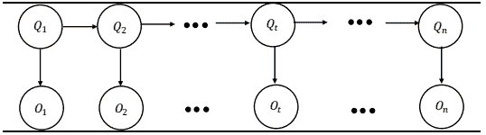 

如图所示，隐马尔科夫模型中的变量可以分为两组。第一组是状态变量{𝑄1,𝑄2,… ,𝑄𝑡 ,… ,𝑄𝑛 }， 𝑄𝑡表示𝑡时刻系统的状态， 长度是𝑛， 其中每个状态量的取值范围是{𝑆1,𝑆2,… ,𝑆𝑁 }。通常假定状态变量是隐藏的、不可观测的，因此状态变量也称为隐变量(hidden variable)。第二组是观测变量{𝑂1, 𝑂2,… ,𝑂𝑡 ,… ,𝑂𝑛 }， 𝑂𝑡表示𝑡时刻观测值，每个观测变量的取值可以是离散型或者连续型。为了方便讨论，我们以离散型观测变量为例，并假定取值范围为{𝑜1,𝑜2,… ,𝑜𝑀 }。 从图 1 中的箭头我们可以看出变量之间的依赖关系。在任一时刻，观测变量𝑂𝑡的取值仅依赖于状态变量𝑄𝑡，与其他状态变量和观测变量的取值无关。同时， 𝑡时刻状态变量𝑄𝑡只依赖于𝑡 − 1 时刻的状态𝑄𝑡−1，与之前𝑡 − 2 个状态无关。这就是上述讲的马尔科夫过程。 基于此，我们
可以得到所有变量的联合概率分布为 

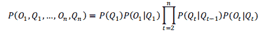 

HMM 由状态转移概率矩阵𝑨，观测概率矩阵𝑩及初始概率分布𝝅决定

■ 状态转移概率矩阵： 由状态𝑆𝑖转移到状态𝑆𝑗的概率𝑎𝑖𝑗 构成。记

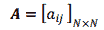 

其中， 𝑎𝑖𝑗 = 𝑃(𝑄𝑡+1 = 𝑆𝑗 |𝑄𝑡 = 𝑆𝑖 )， 1 ≤ 𝑖,𝑗 ≤ 𝑁。

■ 观测概率矩阵：由状态𝑆𝑖下观测变量取值𝑜𝑗的观测概率𝑏𝑖𝑗构成。记

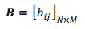 

其中， 𝑏𝑖𝑗 = 𝑃(𝑂𝑡 = 𝑜𝑗 |𝑄𝑡 = 𝑆𝑖 )， 1 ≤ 𝑖 ≤ 𝑁， 1 ≤ 𝑗 ≤ 𝑀。

■ 初始概率分布： 由初始时刻状态𝑆𝑖出现的概率𝜋𝑖构成。 记

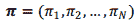 

其中， 𝜋𝑖 = 𝑃(𝑄1 = 𝑆𝑖 )， 1 ≤ 𝑖 ≤ 𝑁。

通常 HMM 的模型参数以𝝀 = (𝑨,𝑩,𝝅)表示。人们也称𝑨, 𝑩,𝝅为 HMM 的**三要素**。从 HMM 的定义可知，模型作了**两个基本假设**：一是**马尔科夫性**，也即我们在前面反复提及的当前状态只与前一个时刻的状态有关而与其他时刻无关。二是**观测(变量分布)独立假设性**，即任意时刻的观测到的变量的分布只依赖于该时刻的状态与其他时刻的状态和观测值无关。

**1.4 隐马尔科夫模型三个基本问题**

最后，介绍隐马尔科夫模型研究的三个基本问题：
■ **概率计算问题**：给定模型𝝀 = (𝑨,𝑩,𝝅)和观测序列𝑶 = (𝑂1,𝑂2,… ,𝑂𝑡 , … ,𝑂𝑛 )，如何评估模型与观测序列之间的匹配度？ 换言之，计算概率𝑃(𝑶|𝝀)。
■ **学习问题**：已知观测序列𝑶 = (𝑂1,𝑂2,… ,𝑂𝑡 ,… ,𝑂𝑛 )，估计模型参数 𝝀 = (𝑨,𝑩,𝝅)，使得在该模型下观测序列概率𝑃(𝑶|𝝀)最大？ 即用极大似然估计方法估计参数。 

■ **预测问题**：已知模型𝝀 = (𝑨, 𝑩,𝝅)和观测序列𝑶 = (𝑂1,𝑂2,… ,𝑂𝑡 , …, 𝑂𝑛 )，求使得条件概率𝑃(𝑸|𝑶)最大的𝑸 = (𝑄1,𝑄2,… ,𝑄𝑡,… ,𝑄𝑛 )？即通过观测序列找出最有可能对应的隐状态序列。

理论上，我们关心的问题是第二个和第三个问题，即如何训练好模型、 估计好参数，以及利用这个模型进行预测。 例如， 我们想通过 HMM 进行指数择时的研究，那么我们要做到就是确定隐状态数、 观测变量的种类(离散型，连续型)和个数(单变
量，多变量)以及要估计的参数有哪些。 通常我们认为市场可以分为三个隐状{涨，
跌，平}；观测变量可以是来自于市场的连续型变量例如技术指标，因此为了简便，
我们先研究单个技术指标形成的择时策略； 模型参数即模型三要素： 状态转移概率
矩阵𝑨， 每种状态的概率分布𝑩和初始分布𝝅。对于离散型观测变量， 𝑩可以用一个
有限维矩阵(有限维分布)来表示； 而对于连续型变量， 𝑩的每一个状态是一个连续型分布。我们通常假设这是一个正态分布，从而我们需要估计正态分布的均值和方差。 

针对这三个基本问题，分别有三个相应的算法， 向前向后算法、 Baum-Welch 算法和 Viterbi 算法。 我们会在之后的系列报告中专门介绍，故不在此展开。然而实际上我们研究发现，隐马尔科夫模型的输出结果并不能直接和我们的假设结果对应，即使输出隐状态的序列，也可能是无意义的序列。为什么这么说？ 由于隐状态本身是不可观测的， 而模型输出的结果只能告诉我们有那么一个特定的状态——是抽象的，因此我们无法确定这个状态是什么， 更不能强行认为这个状态就是我们所设想的状态。 这也是我们在初期研究隐马尔科夫模型碰到一个的困惑，因此这也引发我们对 HMM 应用的假设及合理性讨论。 

**1.5  ****HMM 应用合理性讨论**

隐马尔科夫模型最早被应用于语音识别，随后又在其他领域中得到了广泛的应用， 如自然语言处理、生物基因序列分析和人脸识别等等。 那么隐马尔可夫模型能否应用于股市的择时预测呢，或者说预测性如何呢？ 这里我们需要回归隐马尔可夫模型的两个基本假设，马尔科夫性和观测分布的独立性。

 其一， 这里的马尔科夫性是指一阶马尔科夫性， 这个假设的缺陷就是无法考虑隐状态之间仍有更复杂关联性。 一阶是最简单的情况，因此我们就将从这个模型开始研究，究竟一阶的隐马尔科夫模型的择时效果好不好？如果不好，我们还可以进一步改进， 研究更高阶、更复杂的模型。 我们的目标是去寻找能够更好的刻画市场运行状态的马尔科夫模型。

 其二，每个观测变量只由隐状态决定，这个假设是可以接受的。 例如， 牛市和熊市下指数的收益率有明显的差别，震荡慢熊的成交量也和快牛的成交量相去甚远，因此我们有理由认为这两个指标在不同市场状态下是不同的分布，且这个分布只依赖于市场状态本身。除此以外， 我们选择隐马尔可夫模型有三个原因：

 ■  第一， HMM 的模型参数较少， 即只需要确定隐状态的个数，从而避免过拟合的情形、 提高模型的稳定性。例如利用 MACD 进行择时，至少需要选择 3 个周期参数，而这三个参数选取往往只是为了解释或拟合出更好的收益曲线。对于一般的时间序列模型或者回归模型，模型的参数通常只是拟合的工具。 参数过多时候通常会出现过拟合的情形，模型对参数的敏感度也不容易控制，这将会大大影响模型稳定性。

 ■  第二， HMM 的状态数在某种程度上具有解释性。 HMM 模型中的隐状态虽然是系统状态，是抽象的， 但我们可以根据经验进行后验解释。例如， 我们把市场分成{涨，跌}两种或者{涨， 跌，平}三种，还可以再细分为{大涨，小涨，震荡，小跌， 大跌}等等。 不同状态数均可以有一定的解释力： 状态数分得较少， 平均每个状态包含的样本数较多，模型稳定性提高，但模型对极端情况的刻画较弱，错判率会提升；状态数分得较多， 平均每个状态包含的样本数较少，模型稳定性降低，但模型对极端情况的刻画较好， 错判率下降。

 ■ 第三， HMM 相比一般的随机过程和时间序列也有优势。 我们都知道经典的 Black-Scholes 模型假设股价服从对数正态分布。然而用历史数据去拟合漂移项𝜇和波动率𝜎无法刻画短期的特征， 因为拟合的结果(另外也跟拟合的时间段的选择有关)总是使得𝜇的值向长期均值靠拢， 这样就容易忽略了短期趋势特性。而我们认为 HMM 的优点在于可以结合随机过程和不同状态。不同状态下的漂移项和波动率都不同(牛市的漂移项正值较大，熊市漂移项负值较大，而震荡市则绝对值小)， 或者说是每个状态都是一个单独随机过程或者分布，那么对实际情况的解释度更强。再如 GARCH 模型或者 EMA，此类模型通常赋予近期(高频)的数值较高的权重，对长期(低频)数值较低的权重，可能忽略长期的趋势。而 HMM 的着眼于历史上的统计规律， 是一个概率模型， 能够兼顾长期与短期的特征。

 然而 HMM 并非完美无缺。 除了上述关于一阶马尔科夫性的假设外， HMM 的另一大缺点就是其算法较为复杂、不直观、 黑箱等特点。这也是机器学习方法的一大通病，虽然逻辑上理解起来并不困难。 HMM 还有一个缺点就是我们无法直接确定隐状态的结果是什么，尤其当隐状态数越多的时候。即我们可能得到结果可能是诸如此类的数字序列{1,2,3,2,2,3,2,1,2,3,1,1,1,2,3,2,1… }，然而我们却无法判断 1、 2 和 3 分别代表什么意思。然而这点并非无法解决。例如，我们假设股票分为涨跌震荡三个状态。我们可以分别测算只有信号 1、 2 和 3 发出的时候各自的收益率情况。收益率由高到低排序我们分别标记为涨、 震荡和跌。

**2\. 单个技术指标择时策略的构建**

从上述关于 HMM 优点的分析，我们知道模型的外部参数只有一个，那就是隐状态的个数。然后，我们需要选取合适的观测变量。但如何选取观测变量、选取几组观测变量呢?我们不妨遍历所有技术指标，在样本内选择最好的一个技术指标，将其应用于样本外的择时。 由于技术指标都是连续型变量， 并非都服从正态分布的假设，这里我们通过 Box-Cox 变换将其变为正态分布。观测变量服从正态分布的隐马尔科夫模型，我们也称为高斯隐马尔科夫模型(Gaussian Hidden Markov Model)。 实际上，我们对 HMM 的应用不仅限于择时，亦可以用于择时特征的识别和提取。 由于有 N 个技术技术指标，我们便得到 N 个 HMM 模型，那究竟哪个模型表现最好，预测能力强？ 其实我们就是做了这样一件事，在给定样本内找到一个评价最好的 HMM 模型，使其最好的匹配这段时间的样本数据。或者我们可以这样认为， HMM 的作用其实只是用于特征选取：在某段时间内，哪个指标(特征)能更好的反应市场的行为？

**2.1** **HMM 用于择时特征提取步骤**

首先，我们先提一个**多头策略**的概念。 顾名思义，是先买后卖的策略，无法做空。其择时序列以 0(卖出)和 1(买入)表示。 

设有𝑛个隐状态𝟏~𝒏，长度为𝑚的时间序列𝑡𝑚。 每个交易日模型都输出一个隐状态𝒊(𝟏~𝒏之间)， 从而形成一个𝑛状态的马尔科夫链。 我们可以在一个𝑛 × 𝑚的表格里把这样的状态序列用 0 和 1 标注出来， 那么我们得到𝑛行 0-1 序列(注意区别这里的 1 和隐状态 1)，也即𝑛个多头策略。 表 1 以𝑛 = 3 为例得到了 3 个多头策略。回测每个
多头策略，我们便得到𝑛条净值曲线。

**𝒏 = 𝟑状态序列形成多头策略示例**

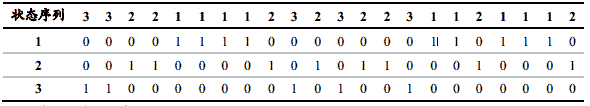 

然后我们介绍择时特征的提取步骤。
**Step1**. 选择隐状态个数𝑛。
**Step2**. 选取单个技术指标，作为模型输入变量。
**Step3**.确定样本内隐状态𝟏~𝒏对应的隐状态类别{涨，跌，震荡}， 并形成交易信号。 首先， 对于每个数字𝒊 ∈ {𝟏, 𝟐,… ,𝒏}， 计算的对应的多头策略。 然后，将对应的多头策略按照收益率由高到低排序并分成 3 组，分别代表“涨”、 “震荡”和“跌”状态集合。最后，将所有数字替换成数字 1、 0 和-1，其中 1、 0 和-1 分别代表数字所属于的类别“涨”、 “震荡”和“跌”，形成最终的交易信号。
**Step4**. 计算策略样本内的评价指标，如胜率，交易频率，年化收益率，最大回撤，收益回撤比，夏普比率等。
**Step5**. 重复 Step2~Step4，挑选收益回撤比和胜率最高的技术指标。
**Step6**. 将挑出的技术指标用于样本外检测。

**2.2** **模型交叉验证**

对于一个训练样本，我们只能得到一个最好的观测变量构成的一个 HMM 的模型。而这样的模型是不是数据依赖?鲁棒性如何呢?这就是我们要涉及的模型选择问题。在进行模型的选择过程中，我们要考虑的是如何对数据进行交叉验证。

什么是交叉验证？ 当给定的样本数据充足，进行模型选择一种简单方法是随机地将数据集切分成三份，分别为训练集(training set)、验证集(validation set)和测试集(test set)。训练集用来训练模型，验证集用于模型选择，而测试集用于最终对策略的评估。由于验证集有足够多的数据，我们用它进行模型选择也是有效的。然而在实际应用当中，数据通常都是不充足的，为了更好的选择模型，就必须充分利用数据。

交叉验证的思想就是重复地利用数据，把给定的数据进行切分，将切分的数据组合成训练集和测试集，在此基础上反复进行训练和测试。而最常见的交叉验证的方式就是将所有数据分成两部分，一部分用作为训练集，另一部分作为测试集。 另一种更常用的是𝑆折交叉验证(S-folds cross validation)。随机地将样本分成𝑆段，然后利用𝑆-1 段数据去训练模型，用余下的一段去测试模型；将这一过程对所有可能的𝑆种
选择重复进行，最后平均每个模型的评价结果。 

我们以上证指数择时模型为例， 回测的时间是从 2000 年 1 月 4 日至 2016 年 9 月 2 日，数据是上证指数的日度行情数据以及相应的技术指标， 样本数量约 4000 个。 这里我们把样本平均分成五段， 前四段为训练集， 第五段为测试集。前四段数据利用𝑆折交叉验证， 但考虑到我们的样本是时间序列，所以我们是将其中一段当成训练样本，另外三段当成测试样本。 这样总共能得到 4 段样本内的训练集和 12 段样本外验证集。 在整个训练集中，我们还将最优化参数𝑛。

**2.3 模型选择**

在进行回测时， 仓位只允许全仓和空仓。当日收盘发出的信号(1、 -1 和 0)后，以第二个交易日的开盘价进行交易，如果前后两个信号是 1 和-1 或-1 和 1， 则在开盘需进行两次交易，先平仓原有头寸后反向开仓。

为了便于区别，我们采用三种交易方式进行比较。
■ Tradetype0： 允许做空指数， 不考虑交易成本，和融券成本。

■ Tradetype1： 允许做空指数， 单边交易成本 1.5‰，融券成本为年化 8.8%。
■ Tradetype2：只允许做多，单边交易成本 1.5‰。 

首先，我们以所有训练集样本来优化参数𝑛，在此过程中的交易方式为 Tradetype0。从图 2 我们可以看出， 随着𝑛的增大，年化收益率和收益回撤比呈上升趋势，最大回撤和胜率呈下降趋势。如果以收益回撤比来评价， 𝑛的最优取值为 14。这也说明了从当状态分类越细， 对趋势的分类越准确， 从而提高了收益率，虽然略微降低了胜率，但同时降低了最大回撤，提高了收益回撤比。 当𝑛越大的时候， 理论上单因子模型的复杂度将线性增加， 但实际操作中时间复杂度近似指数增加(𝑛 = 2,4,8,16 分别用时 0.196 秒、 1.04 秒、 6.13 秒、 63.5 秒)， 因此我们限制𝑛的最大值为 14。 

**2000/1/4-2013/4/19 样本内随𝒏增大各指标变化趋势**

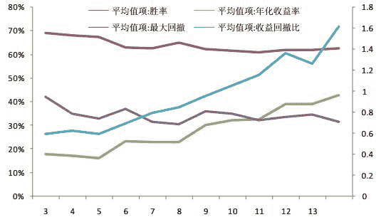

接下来我们要选取最佳的观测指标，实现样本内收益回撤比最大。 我们采用 4-折交叉验证，我们得到 4 段样本内训练集和 12 段样本外验证集。我们要在 12 段验证集中分别选取最优的观测指标。 通过对 12 段样本外的收益回撤比排序，平均排名靠前的是 RSI 和 RETURN；平均最大回撤最小的是 PVT 和 VMA；平均收益回撤比最大的是 RETURN 和 VMA；平均胜率最高的是 PVT 和 high。

**12 段样本外平均表现**

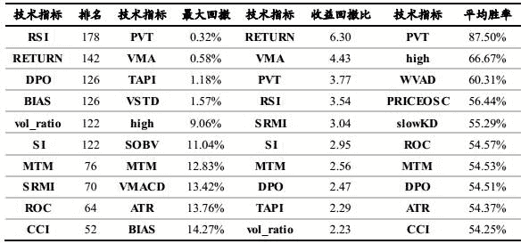 

**3\. 基于日收益率的 HMM 上证指数择时策略**

从上表我们可以看到日收益率 RETURN 这一指标的样本外平均收益回撤比最高，因此我们选取 RETURN 作为观测变量，从而决定了以 RETURN 作为因子的 HMM 指数择时模型。下面我们将前四段数据合成一段作为训练集进行样本内训练，第五段测试集进行回测。

**3.1 ****样本内参数训练**

由于𝑛取值为 14，即有 14 个隐状态，我们标记为状态 0~13。样本区间为 2000/1/4
至 2013/4/19。

 首先， 将区间内日收益率作为输入变量进行模型训练，输出的参数为：

**转移概率矩阵：**

**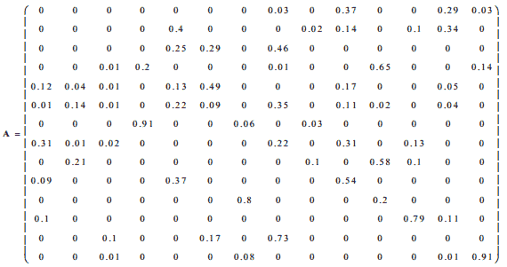** 

**观测概率分布**中每个状态均服从正态分布，具体参数见下表：

**样本内观测变量状态的均值和方差**

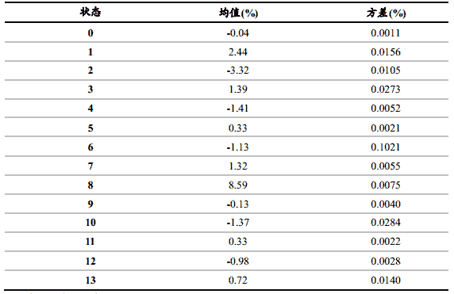 

**初始概率分布：**

 =（ 0 0 0 1 0 0 0 0 0 0 0 0 0 0 ） 

**3.2** **样本内结果分析**

为了更直观的对比不同曲线的差异，我们将每个状态的多头策略净值取对数。根据下图的多头策略净值可以看出“涨”包含状态 13、状态 6、 状态 5 和状态 12， “跌”
包含状态 9，状态 3、 状态 10 和状态 1，其余则为震荡。 最后，我们以“涨”、 “跌”
和“震荡”三个类别替代原有的 14 种状态，并以 1、 -1 和 0 表示。下图呈现了样本内三种状态对应的散点图。

**上证择时样本内状态 0-13 的多头策略对数净值曲线**

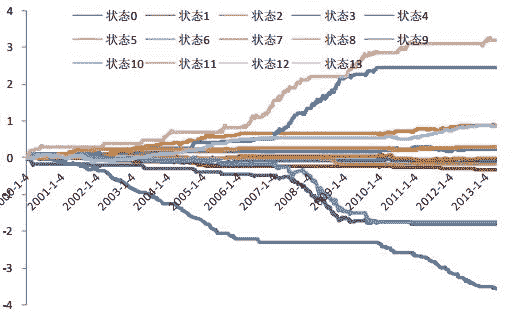 

**上证择时样本内“涨”、 “跌”和“震荡”对应的散点图**

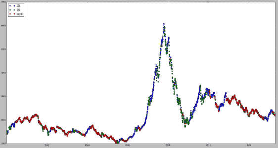 

**上证择时样本内“涨”、 “跌”和“震荡”对应的多头策略对数净值曲线**

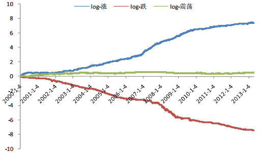 

下面我们举 2002-2004 年这段时间为例对策略表现情况进行梳理，交易方式为 Tradetype0，请见图 6-7 和表 4。在 2002-2004 年间，一共发出多空信号累计 282 次，
即完整的买卖 141 次，平均每 5.11 天完成一次买卖。 其中， 多空胜率 85.11%，年化收益率 298.13%，年化波动率 18.62%，夏普比和收益回撤比高达 16.01 和 27.59，累计净值达 17.93。但指数同期跌幅 23.05%，振幅 31.81%，呈现一段震荡慢熊行情。期间，我们模型中空仓的时间比例约为 30%，多空持仓时间各占 35%。 大部分时候我们模型给出的信号仍是快进快出， 通过多次交易次数但薄利润的方式盈利。不过我们还是抓住了为数不多的几个趋势，尤其在 04 年前后指结束下跌，迎来一波短期的牛市， 我们的模型也顺利的抓住了一个拐点，从而基本上分享了这一波反弹带来的收益。模型在 2003 年 11 月 13 日这样一个短期最低点 1307 点之后第二个交易日发出买入信号， 一直持有， 并随后在 2004 年 2 月 23 日高位首次发出了震荡信号， 同时空仓。 随后指数虽然震荡上涨了一段，但在 4 月 8 日到达短期的最高点 1783 点随后开始下跌，并在 2005 年 6 月 6 日达到 2000 年以来的最低点 998 点。

**上证择时 2002/1/4-2004/12/31 交易结果统计**

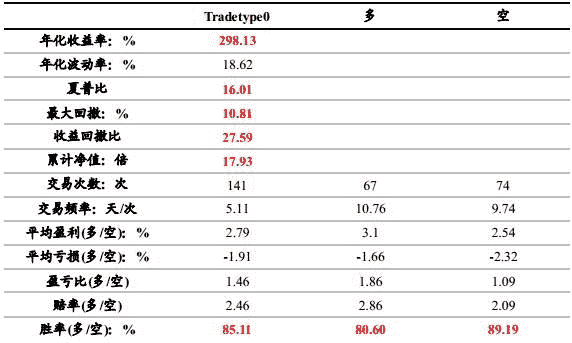

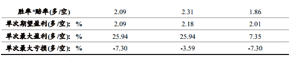

**上证择时 2002/1/4-2004/12/31 择时图例**

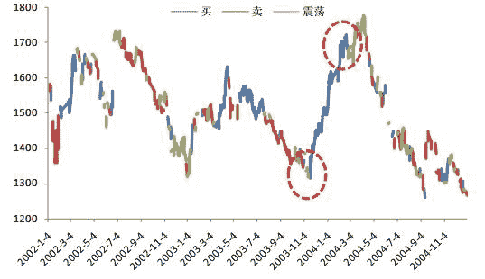

**上证择时 2002/1/4-2004/12/31 的择时图例**

**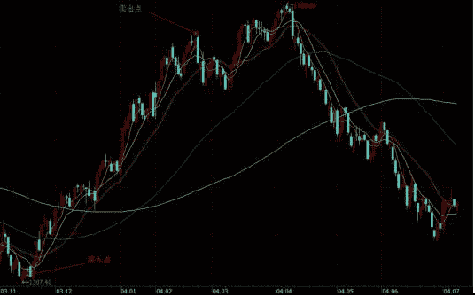** 

**上证择时样本内三种交易方式的对数净值曲线**

**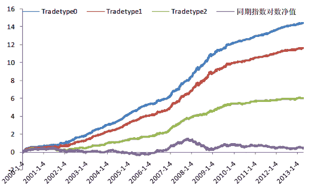** 

**上证择时样本内三种交易方式结果统计**  

**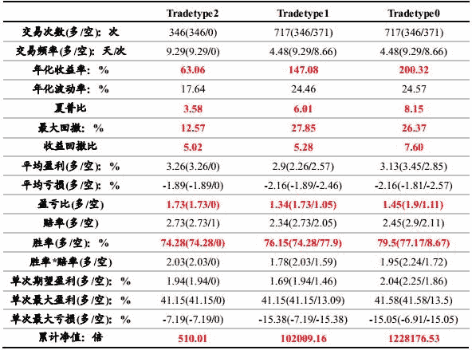** 

**上证择时样本外三种交易方式的对数净值曲线**

**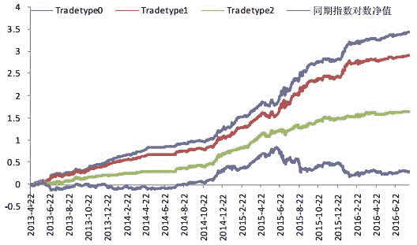** 

**上证择时样本外三种交易方式结果统计**

**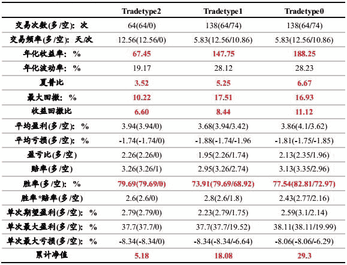** 

**3.3 小结**

基于日收益率的 HMM 择时模型之所以具备如此高的收益率和高胜率，是因为其具备形态识别和自动切换策略的能力。对于趋势市，模型和许多动量策略一样在抓住趋势的情况下降低交易频率，尽可能的分享整个趋势带来的收益；而在震荡市，模型则靠提高交易次数、提高盈亏比和胜率的方式去博取短期甚至超短期的收益。 虽然其他动量模型也都能在趋势的时候有非凡的表现，但在震荡市的时候动量模型则表现不佳甚至亏损； 而反转模型虽然在震荡市中表现出色，却在趋势市中收效甚微。我们的模型就兼顾了趋势和震荡，在震荡市里我们通过提高换手率以“薄利多销”的方式赚取短期收益，但同时又有足够的耐心等待机会抓住真正的反弹机会，从而赢得更大的收益。

 最后，总结和评价三种交易方式的结果。
(1) 传统的择时策略大都以 Tradetype0 的方式交易，即只关心择时信号的胜率和夏普比、收益回撤比等指标，而忽略交易成本。 这在交易次数不多、频率不高的情况下是勉强可以接受的。在我们的模型中，如不考虑其他成本，则策略在 13 年半的时间内累计净值接近 123 万倍，年化收益率高达 200%，更难得的是在 717 次多空交易的情形下胜率接近 80%，收益回撤比近 8 倍，夏普比超 8 倍， 策略的盈利能力毋庸臵疑。

 (2) 当交易频率达到平均 3-4 天交易 1 次的时候，这个手续费就不能再忽略了。Tradetype1 考虑单边交易成本 1.5‰和融券利率年化 8.8%，则策略年化收益率缩水 1/3 至 147%，累计净值则缩水到 10 万倍，胜率小幅下降至 76%。从中我们可以看出手续费对交易结果影响巨大， 因此交易成本在我们的模型中必须考虑，而且由于净值的提升非常快，在实际操作中往往不能实现复利。在后续的报告中，我们还会继续修正这部分的误差，同时考虑对市场的流动性冲击成本、滑点等。

 (3) Tradetype2 在不允许做空的情况下，策略净值下降至 510 倍，不到原来的净值的 0.4%，年化收益率下降至 67%，但胜率仍保持在 75%左右。在 A 股市场难以做空的前提下，多头策略表现明显不如空头，但这个纯多头策略的收益已经逐渐回归合理水平，更加符合实际情况。 然而，对于基于日度进行择时的策略而言，胜率在长期保持在七成之上，收益回撤比和夏普比均在 3 之上已经是非常难得了。

 (4) 与样本内进行对比，我们发现样本外的结果相当的稳定，胜率依然保持在七成以上，由于时间相对较短，仅三年半不到的时间，所以策略的最大回撤并不大。夏普比均大于 6，纯多头策略的 Tradetype2 净值也有 5.18 倍。从上证指数的择时策略结果来看， HMM 是一个非常优秀的择时模型，因为其具备了择时模型最关键的两个因素，胜率和收益(盈亏比)。 如果应用在期货市场，那么高频交易是其一个不错的应用。即使是股票市场的交易，平均一周一次的换手也是完全可以接受的。 最后我们统计了上证指数择时策略历年表现。 对于最符合实际情况的交易方 Tradetype2， 可以看到，除了 2002 年胜率 50%， 2013 年仅有一次交易但小幅亏损外，其他年份的胜率均大于 60%。 从样本外的结果来看， 纯多头策略的年度胜率并无显著下降，也支持了策略的有效性。

**4\. 基于其他指数日收益率的 HMM 择时策略**

上一节我们以上证指数日收益率为观测变量，运用高斯 HMM 模型进行了择时信号的判断，样本内和样本外均得到非常好的效果。那么对于同样是日收益率数据，应用于其他主流的市场指数效果又如何呢？下面我们将以沪深 300 指数、中证 500 指数和上证 50 指数为代表进行回测比较和分析。 选取这些代表性的指数的另一个原因是考虑这些指数有对应的指数期货，做空时可以考虑做空期货。 选取 2005/1/4 至今的数据作为全样本集，将前 80%的样本(2005/1/4-2014/5/15)作为训练集，后 20%
的样本(2014/5/16-2016/9/2)作为测试集，观测变量为日收益率序列。（仅以 HS300 为例） 

**4.1\. 沪深 300 指数**

**沪深 300 择时样本内三种交易方式的对数净值曲线**

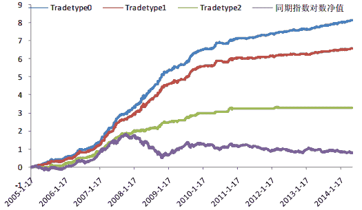 

**沪深 300 择时样本外三种交易方式的对数净值曲线** 

**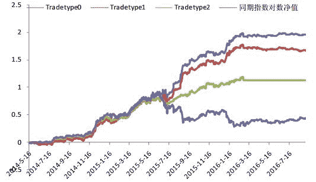** 

**沪深 300 择时样本外三种交易方式结果统计**

**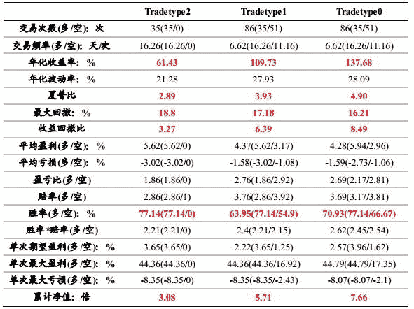** 

**5\. 总结及展望**

本篇报告是基于概率图模型——隐马尔科夫模型(HMM)的第一篇系列报告——实战篇，通过模型的实际运用让投资者更快速的理解并上手运用这个模型进行择时分析。因此只是必要的介绍了 HMM 的三要素，而更多讨论细节的处理如参数𝑛的选择、观测变量的选择以及结果的展示和说明。最终选择以日收益率作为观测变量并挑选了上证指数、沪深 300 指数、中证 500 指数及上证 500 指数进行回测。 交易方式均为 Tradetype0。

对比四个指数的回测结果，我们可以发现 HMM 具有两个特点： 

**一是高收益、高夏普比、高收益回撤比和高胜率。** 一般具有前三个特点的都是趋势策略，而趋势策略的一大通病就是胜率低，一般只有 50%左右，很难达到 60%以上。通常高胜率的择时模型与前三个特点几乎是矛盾的，即追求高收益、高夏普比和高收益回撤比就必须放弃高胜率，追求高胜率就难免回撤变大、收益降低、波动加大。而我们的模型除在样本内沪深 300 指数上的胜率稍稍低于 70%，其余三个指数的胜率均在 70%以上。 

**二是模型具有良好的鲁棒性、稳健性**，即模型在样本内、 外的表现结果差距不大。 这是因为模型的本质是一个概率模型，其唯一参数是模型的隐状态数。因此我们只需要最优化模型的隐状态数即可。而其他技术指标模型、时间序列模型、随机过程模型甚至高维的神经网络模型都有不止一个参数。过多的参数往往不具有实际意义，仅仅是为了拟合； 而且参数的过拟合会造成模型失真， 模型对参数敏感度太高也会对模型的稳定性造成影响。

听说，置顶关注我们的人都不一般

****

**后台回复下列关键字**

**更多惊喜在等着****你** **【区分大小写】**  

**1.回复****每周论文** [**获取 Market Making 论文分享**](http://mp.weixin.qq.com/s?__biz=MzAxNTc0Mjg0Mg==&mid=2653283381&idx=1&sn=48ec361d5b5a0e86e7749ff100a1f335&scene=21#wechat_redirect)

**2\. 回复****matlab 量化投资** **[**获取大量源码**](http://mp.weixin.qq.com/s?__biz=MzAxNTc0Mjg0Mg==&mid=2653283293&idx=1&sn=7c26d2958d1a463686b2600c69bd9bff&scene=21#wechat_redirect)**

****3\. 回复****每周书籍**[**获取国外书籍电子版**](http://mp.weixin.qq.com/s?__biz=MzAxNTc0Mjg0Mg==&mid=2653283159&idx=1&sn=2b5ff2017cabafc48fd3497ae5efa58c&scene=21#wechat_redirect)**

******4\.** **回复******文本挖掘**** ****[**获取关于文本挖掘的资料**](http://mp.weixin.qq.com/s?__biz=MzAxNTc0Mjg0Mg==&mid=2653283053&idx=1&sn=1d17fbc17545e561be0664af78304a67&scene=21#wechat_redirect)********

************5\. 回复******金融数学**** ****[**获取金融数学藏书**](http://mp.weixin.qq.com/s?__biz=MzAxNTc0Mjg0Mg==&mid=403111936&idx=4&sn=97822bfa300f3d856d6c9acd8dc24914&scene=21#wechat_redirect)**************

**********6\. 回复******贝叶斯 Matlab********[**获取 NBM 详解与具体应用**](http://mp.weixin.qq.com/s?__biz=MzAxNTc0Mjg0Mg==&mid=401834925&idx=1&sn=d56246158c1002b2330a7c26fd401db6&scene=21#wechat_redirect)************

************7.回复****AdaBoost******[获取 AdaBoost 算法文献、代码、研报](http://mp.weixin.qq.com/s?__biz=MzAxNTc0Mjg0Mg==&mid=2653283387&idx=1&sn=d40b3a1ea73e3d85c124b5b1e4f3057b&scene=21#wechat_redirect)**************

**********8.回复****数据包络分析** **获取****[选股分析](http://mp.weixin.qq.com/s?__biz=MzAxNTc0Mjg0Mg==&mid=2653283401&idx=1&sn=fae6d0c0638174bb713952e6af983c54&scene=21#wechat_redirect)源码**********

********9.回复****SVD** **获取数据预处理之图像处理的方法********

********10.回复 KNN 获取****[kNN-最近邻居算法](http://mp.weixin.qq.com/s?__biz=MzAxNTc0Mjg0Mg==&mid=2653283706&idx=1&sn=45ee21fda90a82a4692eb1aff62ec492&scene=21#wechat_redirect)********