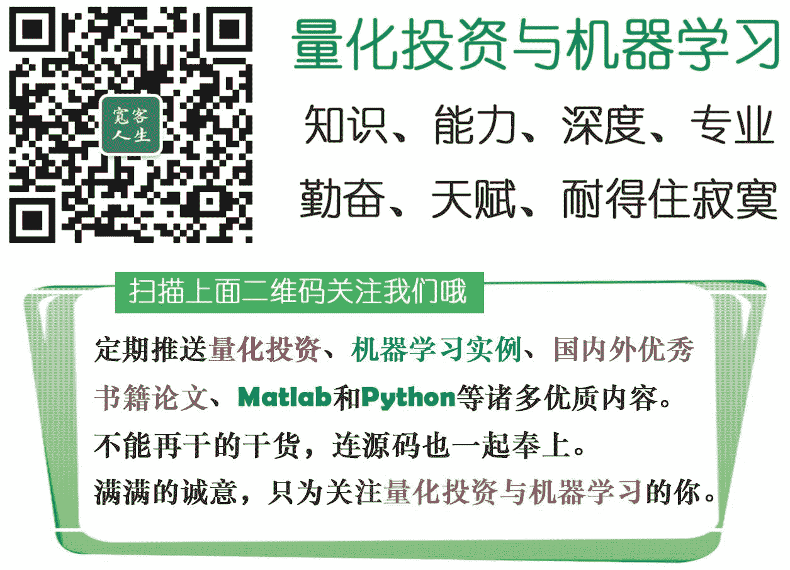

# 【干货扫荡】公众号干货精华帖整理从创办至今

> 原文：[`mp.weixin.qq.com/s?__biz=MzAxNTc0Mjg0Mg==&mid=2653283882&idx=1&sn=154943c97279a743190c9573e2e8f52e&chksm=802e243fb759ad29171fa9854c16c8019b77307872d72c3fd467f630bb02d159687eb4d6d898&scene=27#wechat_redirect`](http://mp.weixin.qq.com/s?__biz=MzAxNTc0Mjg0Mg==&mid=2653283882&idx=1&sn=154943c97279a743190c9573e2e8f52e&chksm=802e243fb759ad29171fa9854c16c8019b77307872d72c3fd467f630bb02d159687eb4d6d898&scene=27#wechat_redirect)

> ********查看之前文章请点击右上角********，关注并且******查看历史消息**************所有文章全部分类和整理，让您更方便查找阅读。请在页面菜单里查找。********

很多读者对一些干货获取有疑问，或者找不到具体位置。今天小编为大家整理出来，以后方便大家查找。谢谢大家一直以来的支持。我们无偿提供干货，有些确实也尽力在做。希望大家多多理解编辑们的辛勤劳动。

**时间从公众号创办至今**

【1】[好书推荐-----量化投资以 Matlab 为语言写的国外好教材](http://mp.weixin.qq.com/s?__biz=MzAxNTc0Mjg0Mg==&mid=401173274&idx=2&sn=67f4bff8c2f6f5892ab6bb6e8c8b9daf&scene=21#wechat_redirect)

【2】[北美 18 名校的数据挖掘及机器学习课程汇总](http://mp.weixin.qq.com/s?__biz=MzAxNTc0Mjg0Mg==&mid=401173274&idx=1&sn=2042394ef59aed7a10ca316d75d1c39f&scene=21#wechat_redirect)

【3】[好书推荐 Algorithmic trading winning strategies and their rationale](http://mp.weixin.qq.com/s?__biz=MzAxNTc0Mjg0Mg==&mid=401294678&idx=3&sn=a4b18379bcf4eab062969464b9a689d1&scene=21#wechat_redirect)

【4】[【知识食粮】最新华尔街牛人必读书籍排行](http://mp.weixin.qq.com/s?__biz=MzAxNTc0Mjg0Mg==&mid=401910135&idx=1&sn=43d5eb7549281bb9231a3be831302139&scene=21#wechat_redirect)

【5】[【很棒的经典书籍推荐】银行、货币、财务管理、金融市场、投资与组合管理](http://mp.weixin.qq.com/s?__biz=MzAxNTc0Mjg0Mg==&mid=401959558&idx=3&sn=36783a1e1334165ccd3dddd212e88bed&scene=21#wechat_redirect)

【6】[【知识食粮第二期】最新华尔街牛人必读书籍排行后 12 本](http://mp.weixin.qq.com/s?__biz=MzAxNTc0Mjg0Mg==&mid=401959558&idx=2&sn=0561027d6fe8eeaf8a3fef1869b942db&scene=21#wechat_redirect)

【7】[【无偿奉献】金融数学藏书(套利数学、数理金融初步第三版、金融工程)](http://mp.weixin.qq.com/s?__biz=MzAxNTc0Mjg0Mg==&mid=403111936&idx=4&sn=97822bfa300f3d856d6c9acd8dc24914&scene=21#wechat_redirect)

【8】[【干货】量化投资国内外很棒的论坛网站](http://mp.weixin.qq.com/s?__biz=MzAxNTc0Mjg0Mg==&mid=404455727&idx=2&sn=11acb86a872c0b4871ac094136903f3d&scene=21#wechat_redirect)

【9】[【扎实资料干货分享】Python、研究报告、计量经济学、投资书籍、R 语言等！(Book+Video)](http://mp.weixin.qq.com/s?__biz=MzAxNTc0Mjg0Mg==&mid=2653282744&idx=2&sn=c9e9fbf1fd0cd4efa8bf08b9c5f16d8a&scene=21#wechat_redirect)

【10】[【干货】经典的深度学习教程及 Python 代码实现](http://mp.weixin.qq.com/s?__biz=MzAxNTc0Mjg0Mg==&mid=405799086&idx=1&sn=a3c535c0ad47fd41d0c3ee49f2925a6a&scene=21#wechat_redirect)

【11】[【精华干货】Quant 需要哪些 Python 知识](http://mp.weixin.qq.com/s?__biz=MzAxNTc0Mjg0Mg==&mid=405488375&idx=2&sn=bb7bd9d7eadea8ad68f1f404bbb0753a&scene=21#wechat_redirect)

【12】[【干货分享】Python 数据结构与算法设计总结篇](http://mp.weixin.qq.com/s?__biz=MzAxNTc0Mjg0Mg==&mid=2653282752&idx=1&sn=5db4c3e27508abc083a7a5f388ddb6ed&scene=21#wechat_redirect)

【13】[【重！磅！干！货！】互联网金融之量化投资深度文本挖掘——附源码文档](http://mp.weixin.qq.com/s?__biz=MzAxNTc0Mjg0Mg==&mid=2653282879&idx=1&sn=12a91c4b8317662fbae470541ebe4683&scene=21#wechat_redirect)

【14】[【机器学习资料整理】（学习工具、学习视频、博客和文章推荐、ML 相关算法参考、部分机器学习译文）](http://mp.weixin.qq.com/s?__biz=MzAxNTc0Mjg0Mg==&mid=2653282920&idx=1&sn=6faa96116c590c75d92569351f987e52&scene=21#wechat_redirect)

【15】[缠论的参考文献资料【包括前两篇推文的论文参考都在这里】](http://mp.weixin.qq.com/s?__biz=MzAxNTc0Mjg0Mg==&mid=2653283047&idx=3&sn=40953ac59c09e7d3c28dee57f14e36fe&scene=21#wechat_redirect)

【16】[【最强干货】关于文本挖掘的资料（文献，报告，策略，代码）](http://mp.weixin.qq.com/s?__biz=MzAxNTc0Mjg0Mg==&mid=2653283053&idx=1&sn=1d17fbc17545e561be0664af78304a67&scene=21#wechat_redirect)

【17】[【每周书籍干货】国外近期深度学习与机器学习书籍电子版——你知道一本买来好多刀啊！](http://mp.weixin.qq.com/s?__biz=MzAxNTc0Mjg0Mg==&mid=2653283143&idx=1&sn=2316c1a067239aa007196cc8cb2e6c5b&scene=21#wechat_redirect)

【18】[【每周国外书籍】2016 年最新机器学习书籍电子版——你知道一本买来得好多刀啊！](http://mp.weixin.qq.com/s?__biz=MzAxNTc0Mjg0Mg==&mid=2653283159&idx=1&sn=2b5ff2017cabafc48fd3497ae5efa58c&scene=21#wechat_redirect)

【19】[【每周研报干货】各大券商研报免费分享（附下载链接）](http://mp.weixin.qq.com/s?__biz=MzAxNTc0Mjg0Mg==&mid=2653283257&idx=2&sn=49c78925e7f3535b9cad95bf91574519&scene=21#wechat_redirect)

【20】[【论文分享】Market Making 论文分享](http://mp.weixin.qq.com/s?__biz=MzAxNTc0Mjg0Mg==&mid=2653283381&idx=1&sn=48ec361d5b5a0e86e7749ff100a1f335&scene=21#wechat_redirect)

【21】[【最新机器学习书籍】Introduction to Machine Learning with Python](http://mp.weixin.qq.com/s?__biz=MzAxNTc0Mjg0Mg==&mid=2653283760&idx=1&sn=f4ce3621e3f49425e2fe2acc042e8316&scene=21#wechat_redirect)

【22】[【干货】各大券商研究报告！](http://mp.weixin.qq.com/s?__biz=MzAxNTc0Mjg0Mg==&mid=2653283773&idx=1&sn=d4604682da0c5563be9da16717d11bf9&scene=21#wechat_redirect)

【23】[【重磅干货】Matlab 高频算法交易——从基础到高级算法的完美实现（源码附送，这货太干了！）](http://mp.weixin.qq.com/s?__biz=MzAxNTc0Mjg0Mg==&mid=2653283757&idx=1&sn=35a7faaf06721de2b8fdb5673126022a&scene=21#wechat_redirect)

【24】[七夕没有对象的宽客都在看这篇文章](http://mp.weixin.qq.com/s?__biz=MzAxNTc0Mjg0Mg==&mid=2653283478&idx=1&sn=aa061849c61ee84eedda3ac9d0c74ec5&scene=21#wechat_redirect)

听说，置顶关注我们的人都不一般

****

**后台回复下列关键字**

**更多惊喜在等着****你** **【区分大小写】**  

**1.回复****每周论文** [**获取 Market Making 论文分享**](http://mp.weixin.qq.com/s?__biz=MzAxNTc0Mjg0Mg==&mid=2653283381&idx=1&sn=48ec361d5b5a0e86e7749ff100a1f335&scene=21#wechat_redirect)

**2\. 回复****matlab 量化投资** **[**获取大量源码**](http://mp.weixin.qq.com/s?__biz=MzAxNTc0Mjg0Mg==&mid=2653283293&idx=1&sn=7c26d2958d1a463686b2600c69bd9bff&scene=21#wechat_redirect)**

****3\. 回复****每周书籍**[**获取国外书籍电子版**](http://mp.weixin.qq.com/s?__biz=MzAxNTc0Mjg0Mg==&mid=2653283159&idx=1&sn=2b5ff2017cabafc48fd3497ae5efa58c&scene=21#wechat_redirect)**

******4\.** **回复******文本挖掘**** ****[**获取关于文本挖掘的资料**](http://mp.weixin.qq.com/s?__biz=MzAxNTc0Mjg0Mg==&mid=2653283053&idx=1&sn=1d17fbc17545e561be0664af78304a67&scene=21#wechat_redirect)********

************5\. 回复******金融数学**** ****[**获取金融数学藏书**](http://mp.weixin.qq.com/s?__biz=MzAxNTc0Mjg0Mg==&mid=403111936&idx=4&sn=97822bfa300f3d856d6c9acd8dc24914&scene=21#wechat_redirect)**************

**********6\. 回复******贝叶斯 Matlab********[**获取 NBM 详解与具体应用**](http://mp.weixin.qq.com/s?__biz=MzAxNTc0Mjg0Mg==&mid=401834925&idx=1&sn=d56246158c1002b2330a7c26fd401db6&scene=21#wechat_redirect)************

************7.回复****AdaBoost******[获取 AdaBoost 算法文献、代码、研报](http://mp.weixin.qq.com/s?__biz=MzAxNTc0Mjg0Mg==&mid=2653283387&idx=1&sn=d40b3a1ea73e3d85c124b5b1e4f3057b&scene=21#wechat_redirect)**************

**********8.回复****数据包络分析** **获取****[选股分析](http://mp.weixin.qq.com/s?__biz=MzAxNTc0Mjg0Mg==&mid=2653283401&idx=1&sn=fae6d0c0638174bb713952e6af983c54&scene=21#wechat_redirect)源码**********

********9.回复****SVD** **获取数据预处理之图像处理的方法********

********10.回复 KNN 获取****[kNN-最近邻居算法](http://mp.weixin.qq.com/s?__biz=MzAxNTc0Mjg0Mg==&mid=2653283706&idx=1&sn=45ee21fda90a82a4692eb1aff62ec492&scene=21#wechat_redirect)********