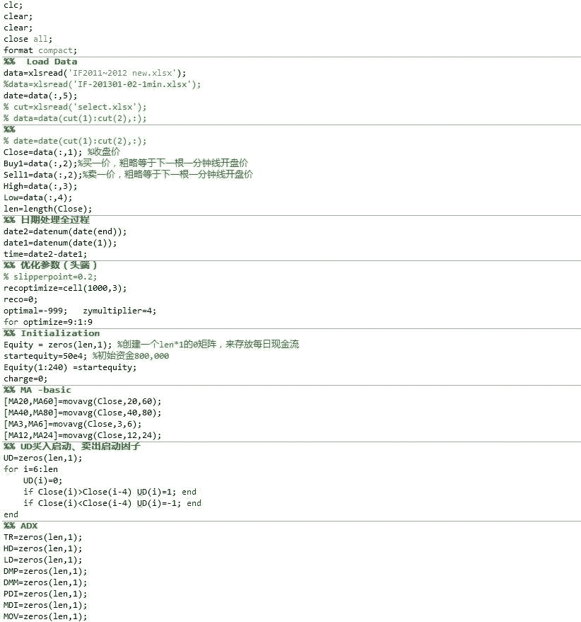
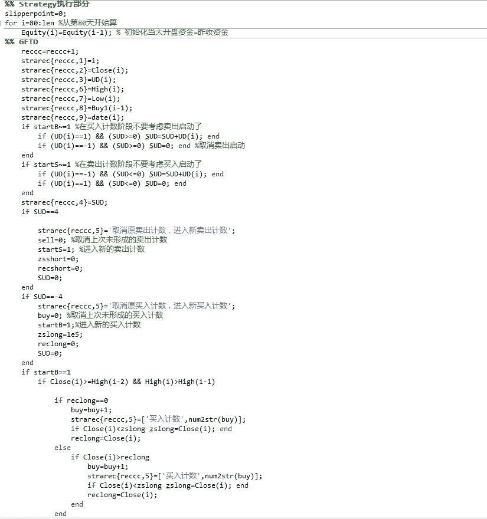
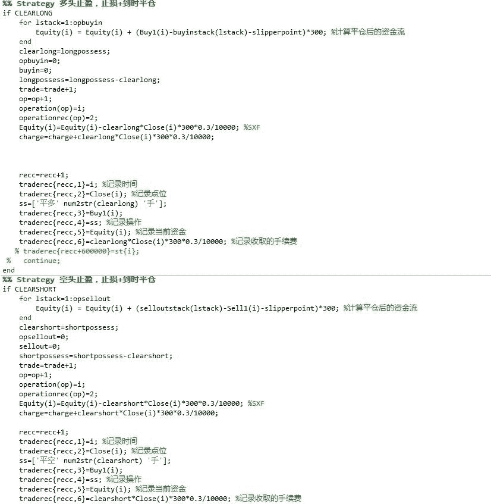

# 【Matlab 量化投资】GFTD 指标程序化实现（附源码）

> 原文：[`mp.weixin.qq.com/s?__biz=MzAxNTc0Mjg0Mg==&mid=2653283878&idx=1&sn=387f9395917442553bbfde43183ce010&chksm=802e2433b759ad2527f9c7eef4f1b2bcae2fda64d672a726220f009a580760e0fa18f1f48662&scene=27#wechat_redirect`](http://mp.weixin.qq.com/s?__biz=MzAxNTc0Mjg0Mg==&mid=2653283878&idx=1&sn=387f9395917442553bbfde43183ce010&chksm=802e2433b759ad2527f9c7eef4f1b2bcae2fda64d672a726220f009a580760e0fa18f1f48662&scene=27#wechat_redirect)

> ********查看之前文章请点击右上角********，关注并且******查看历史消息**************所有文章全部分类和整理，让您更方便查找阅读。请在页面菜单里查找。********

广发证券很早出过两篇研报。一篇名叫《基于修正 TD 指标的指数择时研究》、一篇名叫《基于 GFTD 的期指日内程序化交易策略》。今天编辑部就给大家进行实现。基于 Matlab 软件。希望大家有所收获。**（****研报内容点击阅读原文获取****。****获取代码请看文章末尾。）**

**TD 指标的优势**
TD 指标是大型投资基金 Tudor 的执行副总裁(Thomas R DeMark) 于 80 年代中期为了发现走势欲转折区域而设计的。由于其原理简单且预测精度高等特点而在近几十年内得到了广泛的应用。

**TD 指标基本原理**
TD 指标通常可分为 TD 序列和 TD 组合。 TD 序列由启动、交叉和计数三个阶段组成，而 TD 组合则仅包括启动和计数两个阶段，两者的主要区别在于计数规则的不同，但其基本原理都是一致的，即：市场走势由买方和卖方共同作用形成，当买方的力量大于卖方时走势表现为上涨，反之为下跌，但买卖双方力量强弱的表象是动态的，当走势上涨一段时间后，买方力量必然面临衰竭，从而市场转为下跌， TD 指标正是为发现走势欲转折区域而设计的。

**量化指标参数条件的调整** 本报告对传统 TD 指标参数在 A 股市场进行实证，发现效果并不理想。我们尝试通过修正 TD 指标，找到最适合中国股市特征的指标参数和条件，进而对中国股市进行更有效的预测。最后，我们确定 TD 序列的启动阶段长度为 6，计数为 12； TD 组合的启动阶段长度为 6，计数为 8。指标的修正主要包括以下三个方面：（ 1）改变计数起点；（ 2）改变 TD 指标参数；（ 3）改变计数规则。 

**择时策略的实证效果** 基于修正后的 TD 序列和 TD 组合的量化择时策略应用于上证综指、深圳成指以及沪深 300 等三个不同指数，在 2000.1—— 2010.6 间均获得了较好的超额收益。其中，基于修正 TD 组合指标的效果较佳，预测的准确率同样均大于 70%。

比较三个指数，模型效果对于上证综指效果最好， 10 年期间发出 11 对信号，平均 1 年 1 至 2 对信号，成功 9 对，准确率达到 82%。仅有的两次失败发生在 2001—— 2002 年，成功躲过 2007 年的 5.30、 2008 全年大调整、2009 年的 8.5 调整以及今年以来的调整。抓住了 2005 年到 2007 年 5.30 的牛市主升浪行情、2007 年下半年的牛尾行情、 2009 年初至 2009.8.4 的反弹行情。

 **目前信号**

经过修正的 TD 组合模型对于上证综指过去 10 年检验效果最好，该模型从 2010 年 1 月 22 日发出卖出信号以来，在 2010 年 7 月 12 日发出买入信号，指示市场当前已经处于底部区域，轻仓投资者可以考虑择机进场。

**部分代码展示**

**请在后台回复（不要在留言区回复）【GFTD】**

**获取源码**

听说，置顶关注我们的人都不一般

****

**后台回复下列关键字**

**更多惊喜在等着****你** **【区分大小写】**  

**1.回复****每周论文** [**获取 Market Making 论文分享**](http://mp.weixin.qq.com/s?__biz=MzAxNTc0Mjg0Mg==&mid=2653283381&idx=1&sn=48ec361d5b5a0e86e7749ff100a1f335&scene=21#wechat_redirect)

**2\. 回复****matlab 量化投资** **[**获取大量源码**](http://mp.weixin.qq.com/s?__biz=MzAxNTc0Mjg0Mg==&mid=2653283293&idx=1&sn=7c26d2958d1a463686b2600c69bd9bff&scene=21#wechat_redirect)**

****3\. 回复****每周书籍**[**获取国外书籍电子版**](http://mp.weixin.qq.com/s?__biz=MzAxNTc0Mjg0Mg==&mid=2653283159&idx=1&sn=2b5ff2017cabafc48fd3497ae5efa58c&scene=21#wechat_redirect)**

******4\.** **回复******文本挖掘**** ****[**获取关于文本挖掘的资料**](http://mp.weixin.qq.com/s?__biz=MzAxNTc0Mjg0Mg==&mid=2653283053&idx=1&sn=1d17fbc17545e561be0664af78304a67&scene=21#wechat_redirect)********

************5\. 回复******金融数学**** ****[**获取金融数学藏书**](http://mp.weixin.qq.com/s?__biz=MzAxNTc0Mjg0Mg==&mid=403111936&idx=4&sn=97822bfa300f3d856d6c9acd8dc24914&scene=21#wechat_redirect)**************

**********6\. 回复******贝叶斯 Matlab********[**获取 NBM 详解与具体应用**](http://mp.weixin.qq.com/s?__biz=MzAxNTc0Mjg0Mg==&mid=401834925&idx=1&sn=d56246158c1002b2330a7c26fd401db6&scene=21#wechat_redirect)************

************7.回复****AdaBoost******[获取 AdaBoost 算法文献、代码、研报](http://mp.weixin.qq.com/s?__biz=MzAxNTc0Mjg0Mg==&mid=2653283387&idx=1&sn=d40b3a1ea73e3d85c124b5b1e4f3057b&scene=21#wechat_redirect)**************

**********8.回复****数据包络分析** **获取****[选股分析](http://mp.weixin.qq.com/s?__biz=MzAxNTc0Mjg0Mg==&mid=2653283401&idx=1&sn=fae6d0c0638174bb713952e6af983c54&scene=21#wechat_redirect)源码**********

********9.回复****SVD** **获取数据预处理之图像处理的方法********

********10.回复 KNN 获取****[kNN-最近邻居算法](http://mp.weixin.qq.com/s?__biz=MzAxNTc0Mjg0Mg==&mid=2653283706&idx=1&sn=45ee21fda90a82a4692eb1aff62ec492&scene=21#wechat_redirect)********