# 【量化缠论】系列文章（四）——缠论在各个软件系统中的应用。

> 原文：[`mp.weixin.qq.com/s?__biz=MzAxNTc0Mjg0Mg==&mid=2653283873&idx=1&sn=d11bb12cf1d6fa65a08a06bba79d5c05&chksm=802e2434b759ad2205520e8d108e037e06333827a09759b734d1801686be757aa2f4416925ef&scene=27#wechat_redirect`](http://mp.weixin.qq.com/s?__biz=MzAxNTc0Mjg0Mg==&mid=2653283873&idx=1&sn=d11bb12cf1d6fa65a08a06bba79d5c05&chksm=802e2434b759ad2205520e8d108e037e06333827a09759b734d1801686be757aa2f4416925ef&scene=27#wechat_redirect)

> ********查看之前文章请点击右上角********，关注并且******查看历史消息**************所有文章全部分类和整理，让您更方便查找阅读。请在页面菜单里查找。********

此前大家对缠论的文章呼声很高，因此想做一个系列，来系统的介绍一下。但是在写之前笔者有几句话想说：**用缠论作为构建技术分析系统是很好的，但不要太执拗其中，任何理论都有其优点与不足，我们要辩证的看待问题。希望大家能从中学到有用的知识，理性对待缠论。**

**本文为公众号原创作品，未经允许，不得已任何方式进行转载。**

**缠论系列目录：（点击可查看）**

**[【量化缠论】系列文章（一）](http://mp.weixin.qq.com/s?__biz=MzAxNTc0Mjg0Mg==&mid=2653283801&idx=1&sn=0a05bb0247535a118183be2b917c56b4&scene=21#wechat_redirect)**

[**【量化缠论】系列文章（二）**](http://mp.weixin.qq.com/s?__biz=MzAxNTc0Mjg0Mg==&mid=2653283804&idx=1&sn=aba5cea22cd71516f588511703770e9c&scene=21#wechat_redirect)

[**【量化缠论】系列文章（三）**](http://mp.weixin.qq.com/s?__biz=MzAxNTc0Mjg0Mg==&mid=2653283821&idx=1&sn=55c29ffb55078ab3244cc1a1ed2b041f&scene=21#wechat_redirect)

**前言**

对于缠论来说，要实现纯量化还是比较困难，不过可以先在一些股票软件上进行简单的实现，再进行深入的研究，这个过程花的时间比较长，但是，学习知识要循序渐进，由浅及深。我们将在今后逐步有选择性的对缠论用 Python 工具进行纯量化实现。还是那句话：**取其精华，去其糟粕**。（所有指标仅限于参考，不构成直接投资建议。需要大家根据实际情况自行修改。）

**大智慧**

****■** 上涨三角形 **

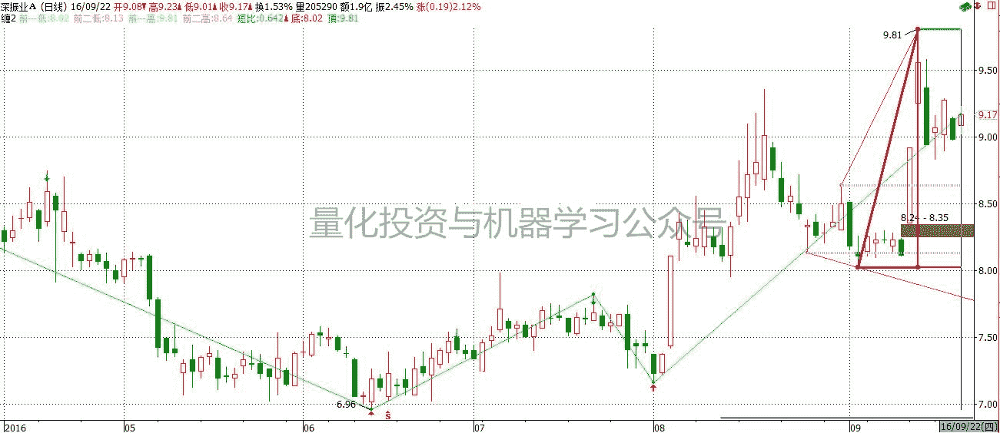

******■ 下跌**三角形 ****

****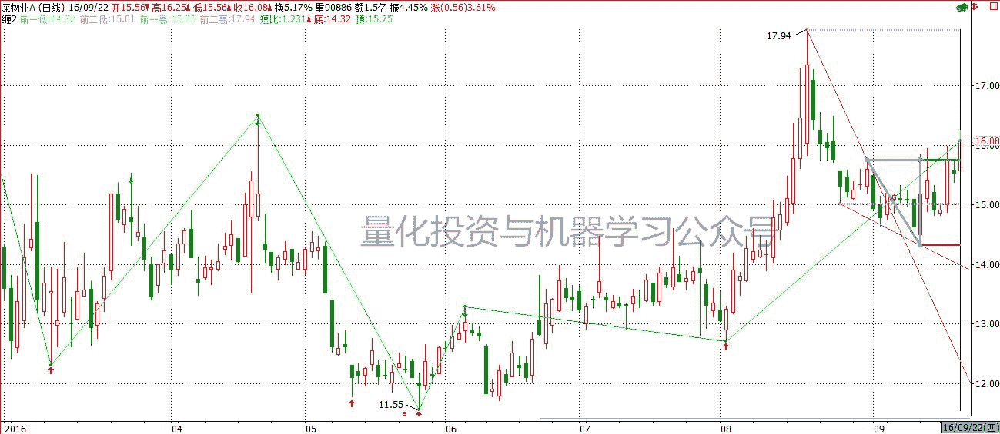**** 

■  **源码：****（**截取部分，全部请看文章末尾操作**）**

**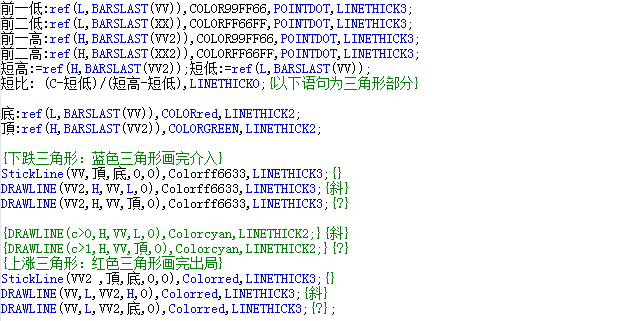** 

**■ 缠论走势中枢主图指标公式多级别**

**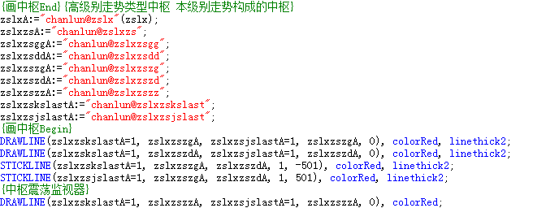** 

**通达信**

思路：以均线相交的情况作为分笔顶点的依据。同时以价格乘以时间间隔的开方作为动能。以此作为依据，与前笔比较判定是否背驰。有背驰为细线，无背驰为粗线。该指标无法在大智慧上使用，因为使用了反向过滤 filterx 函数。

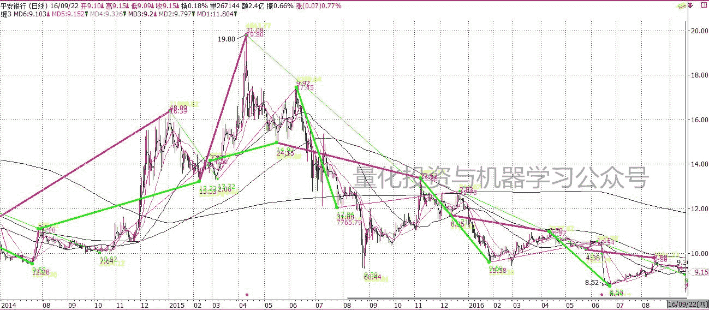 

■  **源码：****（**截取部分，全部请看文章末尾操作**）**

**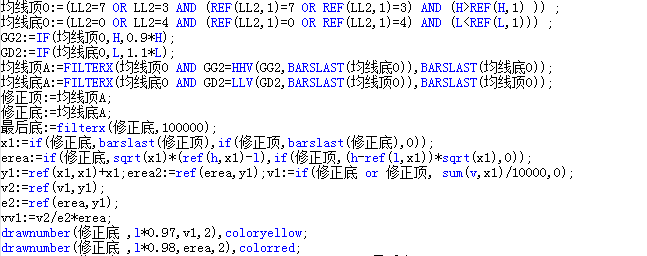** 

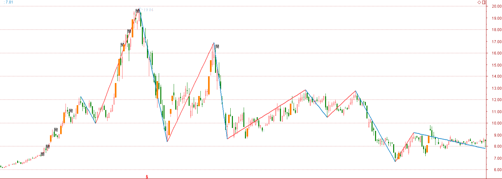

■  **源码：**

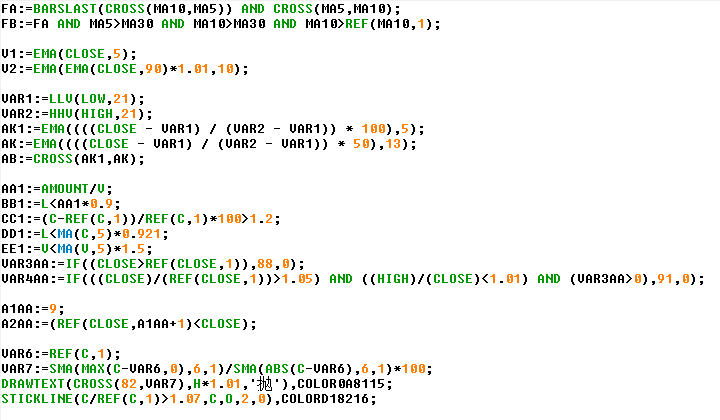

**同花顺**

■  **源码：****（**截取部分，全部请看文章末尾操作**）** 

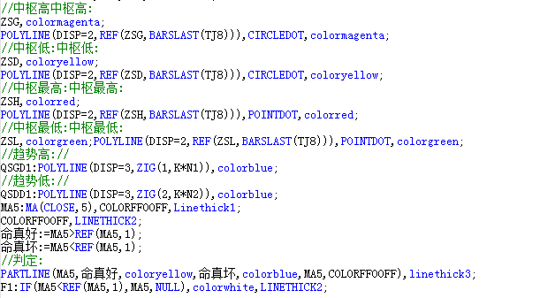 

**■ 顶底背驰**

**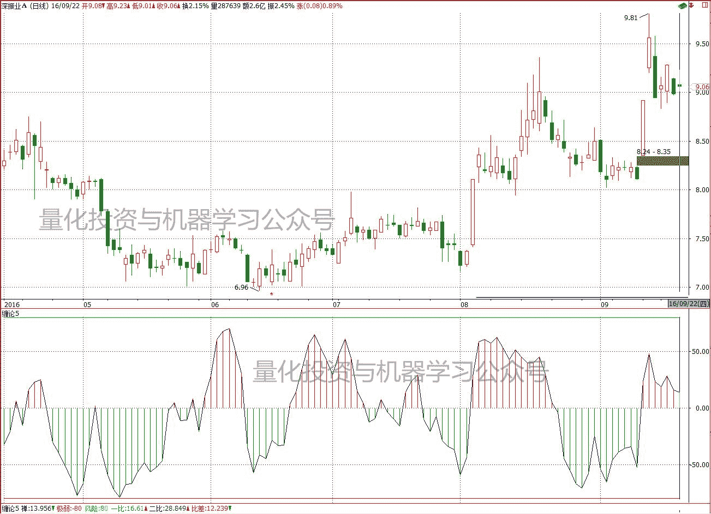** 

**■  画笔指标公式**

**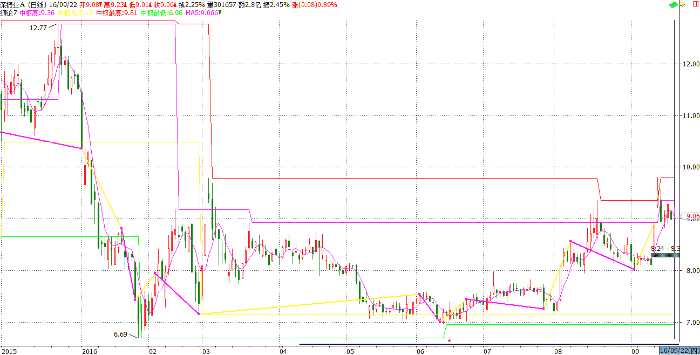** 

**■  **源码：****

****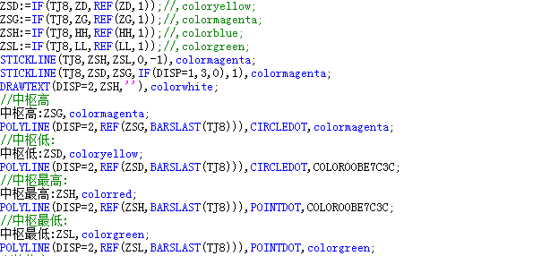**** 

**金字塔**

**■  缠论形态**

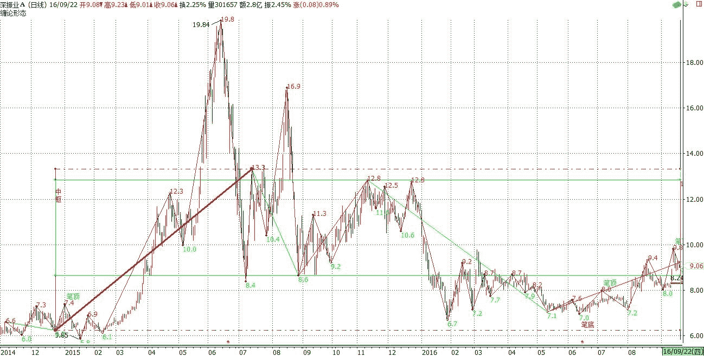

■  **源码：****（**截取部分，全部请看文章末尾操作**）**

**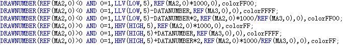** 

****■  缠论中枢****

缠论将趋势按级别分为三类：笔趋势、有一个中枢的趋势、有两个（以上）同向中枢的大趋势。

 缠论的中枢就是股价不按照上升、下降的趋势运行，即进入横盘状态，或者说盘整状态。中枢为何复杂？其复杂性体现在三点：
1.价格进入中枢后，未来运行方向难以测定。
2.价格进入中枢后，当价格出现突破中枢的情况时，难以确定是真突破还是假突破。
3.价格进入中枢后，突破中枢的时间周期难以测定。
 中枢的复杂性，说到底，就在于难以确定中枢的未来发展方向。

 缠论认为，走势中枢有两种形成方式：一是上涨形成的，为“下—上—下型”；二是下跌形成的，为“上—下—上型”。

中枢的运动有两种基本方式：
 一是盘整运动，包括中枢延伸，这是横向运动；也包括中枢扩展，这是宽幅振荡，形成更大的中枢；
 二是趋势运动，特指中枢的新生，形成价格上涨或者下跌。

研究中枢的根本目的是为了寻找趋势的拐点。

本公式的目的是提提供一种不包未来函数的中枢，探寻合适的买卖点(拐点)

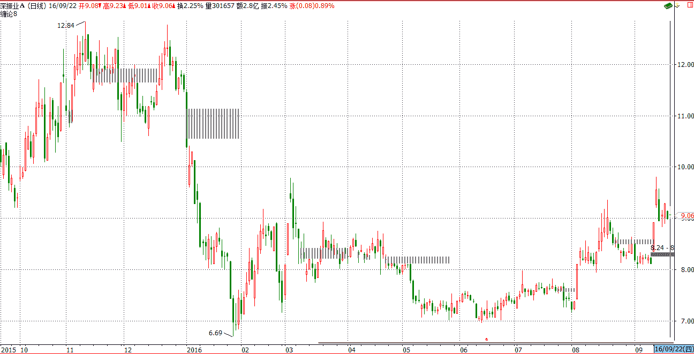 

■  **源码：**

**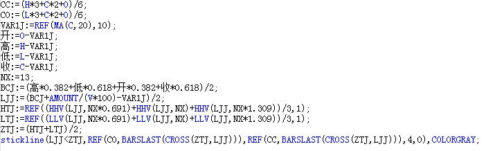** 

****■  **这里还有一套金字塔的完整缠论程序（包含 VBA）**

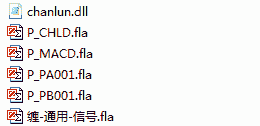

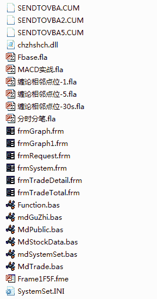

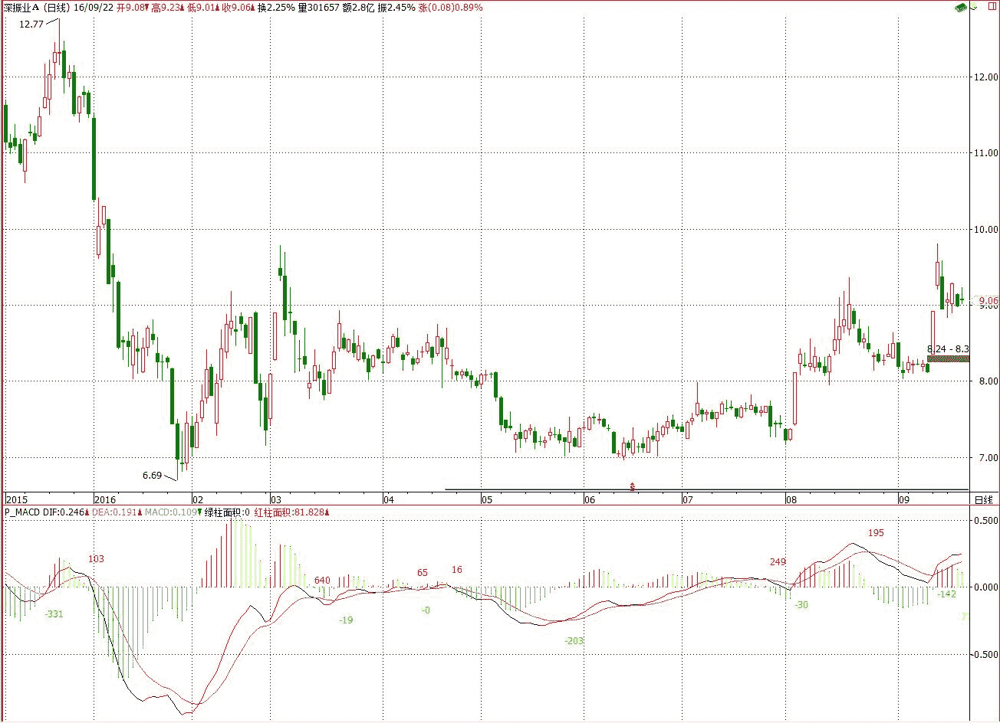

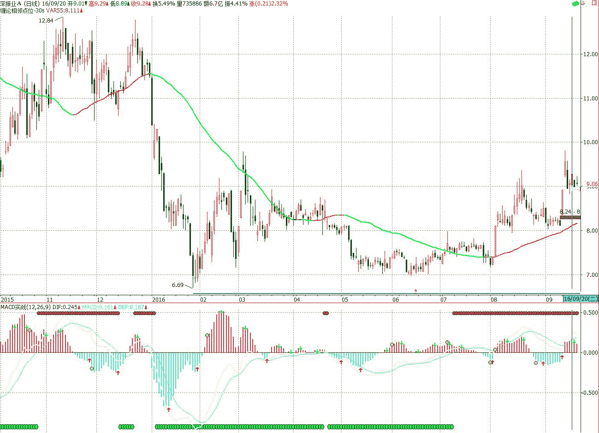

**金字塔 VBA**

■  **源码：****（**截取部分，全部请看文章末尾操作**）**

**代码 3000+行**

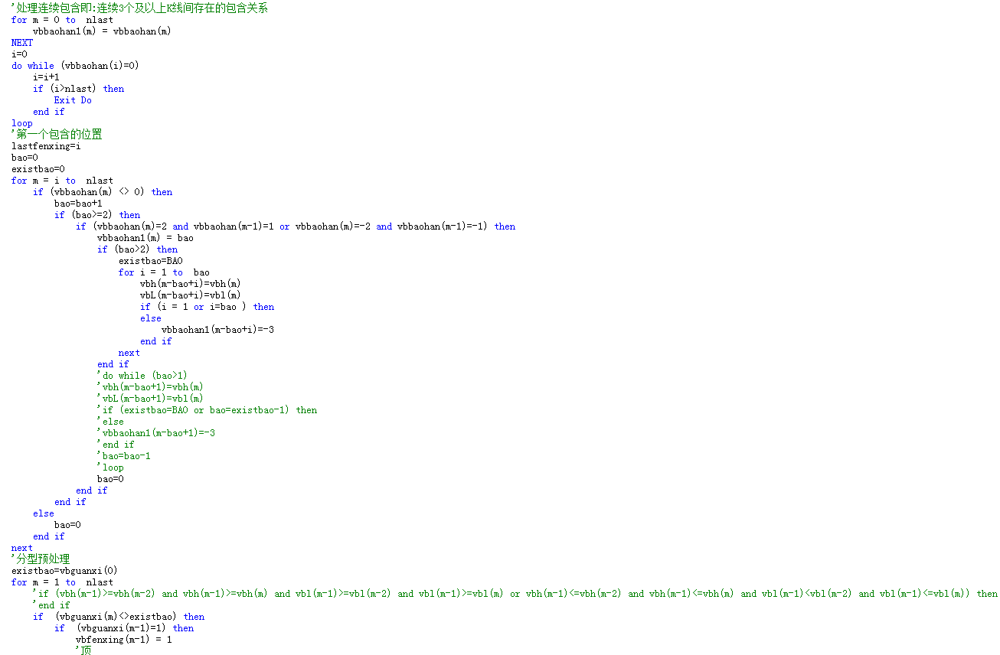

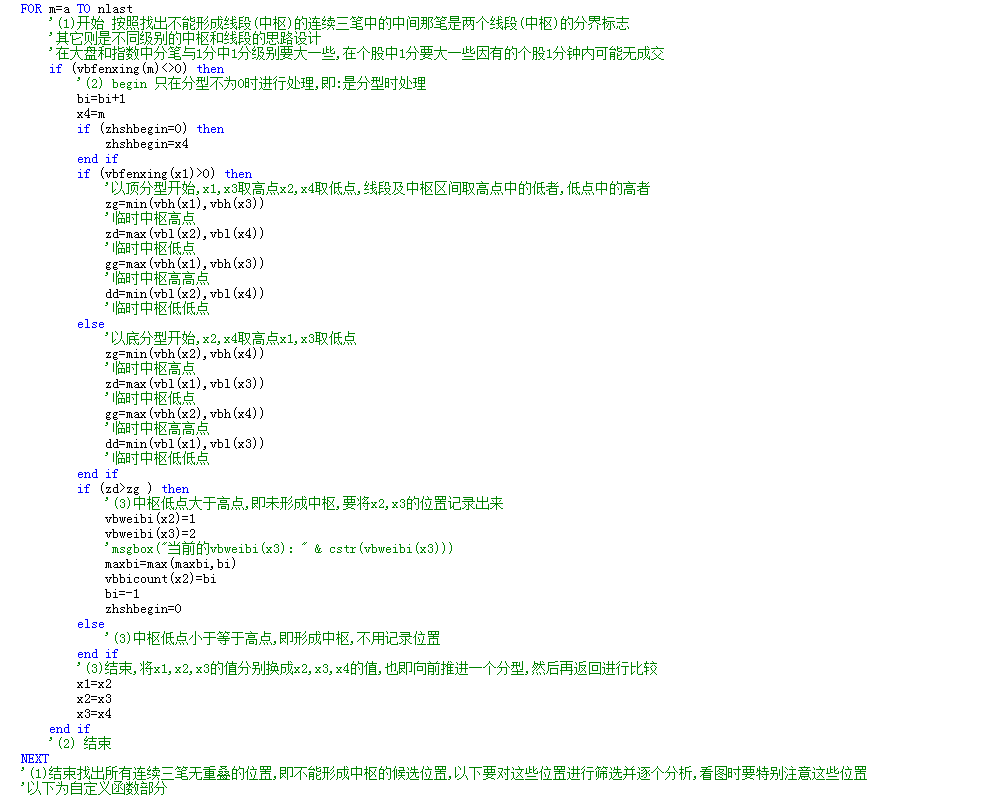

**TB（交易开拓者）**

■  **源码：****（**截取部分，全部请看文章末尾操作**）**

**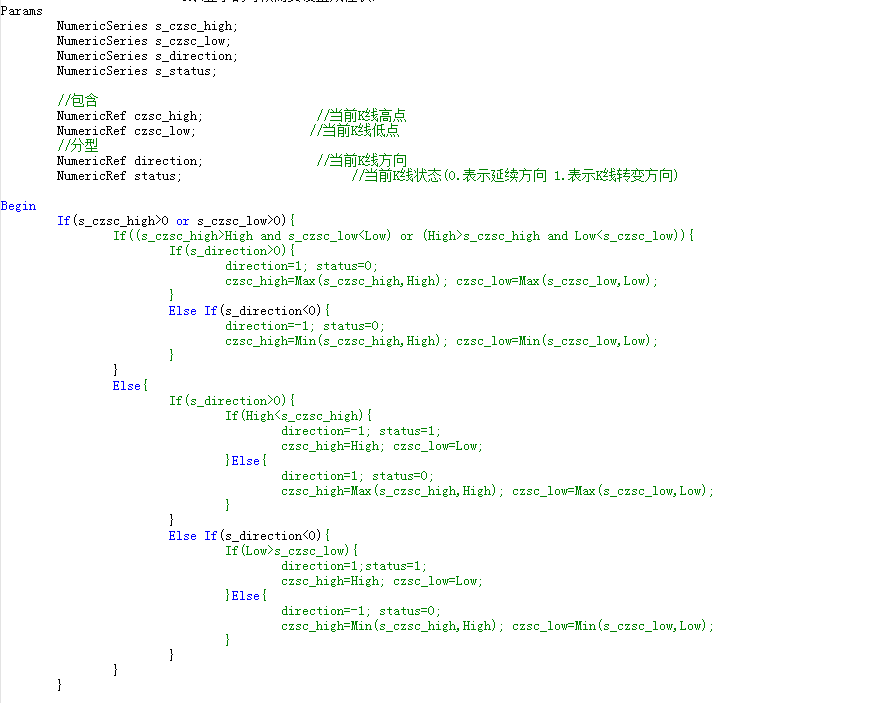** 

**请在后台回复（不要在留言区回复）【缠论源码】**

听说，置顶关注我们的人都不一般

****

**后台回复下列关键字**

**更多惊喜在等着****你** **【区分大小写】**  

**1.回复****每周论文** [**获取 Market Making 论文分享**](http://mp.weixin.qq.com/s?__biz=MzAxNTc0Mjg0Mg==&mid=2653283381&idx=1&sn=48ec361d5b5a0e86e7749ff100a1f335&scene=21#wechat_redirect)

**2\. 回复****matlab 量化投资** **[**获取大量源码**](http://mp.weixin.qq.com/s?__biz=MzAxNTc0Mjg0Mg==&mid=2653283293&idx=1&sn=7c26d2958d1a463686b2600c69bd9bff&scene=21#wechat_redirect)**

****3\. 回复****每周书籍**[**获取国外书籍电子版**](http://mp.weixin.qq.com/s?__biz=MzAxNTc0Mjg0Mg==&mid=2653283159&idx=1&sn=2b5ff2017cabafc48fd3497ae5efa58c&scene=21#wechat_redirect)**

******4\.** **回复******文本挖掘**** ****[**获取关于文本挖掘的资料**](http://mp.weixin.qq.com/s?__biz=MzAxNTc0Mjg0Mg==&mid=2653283053&idx=1&sn=1d17fbc17545e561be0664af78304a67&scene=21#wechat_redirect)********

************5\. 回复******金融数学**** ****[**获取金融数学藏书**](http://mp.weixin.qq.com/s?__biz=MzAxNTc0Mjg0Mg==&mid=403111936&idx=4&sn=97822bfa300f3d856d6c9acd8dc24914&scene=21#wechat_redirect)**************

**********6\. 回复******贝叶斯 Matlab********[**获取 NBM 详解与具体应用**](http://mp.weixin.qq.com/s?__biz=MzAxNTc0Mjg0Mg==&mid=401834925&idx=1&sn=d56246158c1002b2330a7c26fd401db6&scene=21#wechat_redirect)************

************7.回复****AdaBoost******[获取 AdaBoost 算法文献、代码、研报](http://mp.weixin.qq.com/s?__biz=MzAxNTc0Mjg0Mg==&mid=2653283387&idx=1&sn=d40b3a1ea73e3d85c124b5b1e4f3057b&scene=21#wechat_redirect)**************

**********8.回复****数据包络分析** **获取****[选股分析](http://mp.weixin.qq.com/s?__biz=MzAxNTc0Mjg0Mg==&mid=2653283401&idx=1&sn=fae6d0c0638174bb713952e6af983c54&scene=21#wechat_redirect)源码**********

********9.回复****SVD** **获取数据预处理之图像处理的方法********

********10.回复 KNN 获取****[kNN-最近邻居算法](http://mp.weixin.qq.com/s?__biz=MzAxNTc0Mjg0Mg==&mid=2653283706&idx=1&sn=45ee21fda90a82a4692eb1aff62ec492&scene=21#wechat_redirect)********