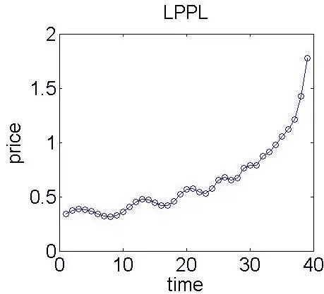
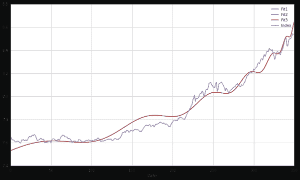
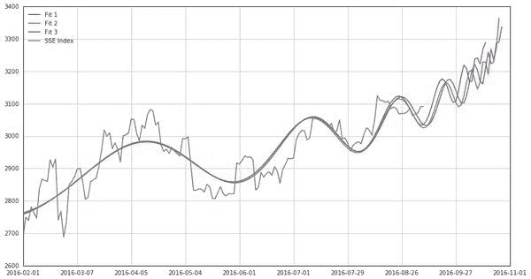

# 【Python 量化投资】对数周期幂率（LPPL）模型在 A 股中应用

> 原文：[`mp.weixin.qq.com/s?__biz=MzAxNTc0Mjg0Mg==&mid=2653283845&idx=1&sn=a00892888cd23b2bbb8c95ad3605218d&chksm=802e2410b759ad066c8eab58b68967807e623a6c7c283086d406c4504f4950753d072180f977&scene=27#wechat_redirect`](http://mp.weixin.qq.com/s?__biz=MzAxNTc0Mjg0Mg==&mid=2653283845&idx=1&sn=a00892888cd23b2bbb8c95ad3605218d&chksm=802e2410b759ad066c8eab58b68967807e623a6c7c283086d406c4504f4950753d072180f977&scene=27#wechat_redirect)

> ********查看之前文章请点击右上角********，关注并且******查看历史消息**************所有文章全部分类和整理，让您更方便查找阅读。请在页面菜单里查找。********

感谢**【优矿社区】**与**【量化投资与机器学习】**公众号进行友好合作。

## **引言**

虽然离开物理专业有好几年了，但一直有些念念不忘，码着代码，写着开题报告，又闲不住想来讲一个没有好奇心的物理学家不是好金融学家的故事。

发现金融泡沫并预测到其何时破裂是很多从事金融行业的人的梦想。如今中国股市也成为了热门的话题，然而，资本狂欢之后是股灾，多少人因此从千万富翁炒股变成百万富翁，预测泡沫是所有人的梦想。

我们的主角 Sornette 教授登场了。Didier Sornette 是一位受过培训的统计物理学家和地球物理学家，目前在瑞士联邦理工学院苏黎世分校(Swiss Federal Institute of Technology in Zurich)任金融学教授，主讲创业风险。他似乎并没有因外界对这种综合学科研究方法的热情有所减弱而感到烦恼。相反，他还在做自己大部分职业生涯一直在做的事：不仅在主要物理期刊上发表文章，还在领先的金融期刊上发表文章。

Sornette 教授开始尝试着解答这个问题——不是通过传统的金融学方法，而是将物理学思想引入其中。作为 2004 年出版的《股市为什么会崩盘》(Why Stock Markets Crash)一书的作者，Sornette 教授实质上是希望更深刻地理解泡沫的形成和发展。在对复杂体系的分析中，他独自——或者是和极少数几个人一起——引领着三个并行领域：纯物理学、应用经济学和计量经济学，以及市场从业人员。

在《股市为什么会崩盘》一书中，Sornette 教授全面分析了一个由其提出的预测市场泡沫的模型——**对数周期幂律（LPPL）模型**。该模型对之后许多次市场泡沫都进行了准确的预测，由于该模型由 Johansen，Ledoit 和 Sornette 共同提出并完善，因此也被称为 JLS 模型。我们来聊一聊它。

## **什么是对数周期幂率模型？**

作为纯物理学家的 Sornettee 教授不甘于仅仅在物理学领域有所建树，他还看到了金光闪闪的华尔街，在那里，各类炼金术师在寻找各种允许少数人持续获利的方法。于是，Sornettee 教授在金融领域的跨界之旅开始了。他脑洞大开，想将物理学模型延伸到金融学领域中，而他找到的第一把金光闪闪的钥匙叫做**易辛模型**——一种描述物质铁磁性的经典模型。简单地说，易辛模型认为单个原子的磁矩只可能有两种状态，**+1（自旋向上）**或者**-1（自旋向下）**，原子以某种规则排列着，并存在着交互作用，使得相邻之间的原子的自旋互相影响。

Sornette 教授的眼睛仿佛一下子充满了光芒，他仿佛看到了美元纸币上的林肯在向他招手。受易辛模型启发，Sornette 教授认为在金融市场中，投资者也只具有两种状态，即买或者卖。同时，投资者的交易行为取决于其他投资者的决策及外部因素的影响，这与易辛模型是多么的相似！

假想我们处于这样的一个市场中：资产没有派息、银行利率为零、市场极度厌恶风险，并且市场有着充足的流动性。显然，在这个市场中的金融资产没有任何价值，也就是其基础价值为零。在这样的框架内，市场中出现两类投资者，如上文所说，一类是理性投资者，一类是非理性的噪声投资者。后者具有羊群效应，使得金融资产价格偏离其基础价值，在没有足够的做空机制下，该结果导致**理性投资者也不得不跟随噪声投资者的行为**，通过享受泡沫来获得收益。最终当趋势达到某一临界值时，大量投资者没有足够的头寸维持该趋势，于是手中的卖单导致了市场的崩盘。

那么这是一个怎样的趋势呢？Sornette 教授考虑了**自激励的正反馈过程**的思想，而该过程会导致大量交易者的行为方式逐渐趋于一致。在经过一些推导之后，Sornette 教授发现该趋势是按对数周期幂律（LPPL）增长，这里给出唯一的也是最重要的公式。

这里不去探讨该公式的具体意义，让我们看一下它的样子。

*   可以看到，随着时间增长，资产价格有着近似指数增长的特点，但同时也伴随着不断的振荡，随着时间越来越接近临界时间，振荡的幅度逐渐减小，增长速度逐渐增大，进入超指数的增长状态，最终市场在临界时间点附近崩盘。通过该模型，人们可以提前获知可能的临界时间点来规避风险。该模型曾成功预测了 2008 年的石油泡沫，美国房地产泡沫，以及 2009 年中国股市泡沫等。

然而，试图根据泡沫迹象采取行动的交易员，现在或许会非常失望。正如 Sornette 教授自己承认的，其理论实际上旨在估计这种泡沫的存在时间，而过早退出市场将是个错误，很可能会损失大量资金，然而离开过晚就不是几个人失去工作的事了。事实上，该模型并没有考虑交易者以外的因素，比如政策层面或者市场情绪等因素，但将金融系统认为是一个复杂系统并加以研究的思想是深远的。现在也有许多将语义情绪分析等类似机器学习的方法应用于模型中来对市场状态进行分析。

毫无疑问，更多地了解泡沫的形成和发展，价值是无法估量的。关注经济和金融以外的领域有助于拓展思路，但不要指望找到一个指导市场交易的万能公式。

LPPL 模型收到的批评与收到的赞扬一样多，有不少人认为该模型没有操作价值。如果你想了解更多关于它的信息，可以仔细详读 Everything You Always Wanted to Know about Log Periodic Power Laws for Bubble Modelling but Were Afraid to Ask。

最后，如果你有好奇心，那么你一定想知道 LPPL 模型的实战结果到底如何。下面我用优矿再现了 LPPL 模型预测 2015 年夏天 A 股市场的泡沫。

P.S 这次股灾虽然我逃顶了，也许我马后炮了~ :)

*   使用 DataAPI.MktIdxdGet()函数获取上证指数 2014 年 1 月 1 日至 2015 年 6 月 10 日的指数信息（股灾发生在约一星期后）。lib 库我也放在了文章最后，大家可以尝试着使用。特别感谢 jd8001，用于拟合的 GA 算法的核心代码框架来自于他，我对参数设置做了细致的调整，以让它更好的符合 A 股市场，最后我友好地加上了一些注释。

*   高清源代码请点击文末**阅读原文**

夏天股灾期间 A 股市场的走势：

 

模型预测的临界时间（Critical Time）为 365，即为 6 月 10 日（350）之后的 15 个交易日左右。实际股灾时间为 6 月 15 日（353），比实际结果晚 10 个交易日左右。

延续至今的走势：

听说，置顶关注我们的人都不一般

****

**后台回复下列关键字**

**更多惊喜在等着****你** **【区分大小写】**  

**1.回复****每周论文** [**获取 Market Making 论文分享**](http://mp.weixin.qq.com/s?__biz=MzAxNTc0Mjg0Mg==&mid=2653283381&idx=1&sn=48ec361d5b5a0e86e7749ff100a1f335&scene=21#wechat_redirect)

**2\. 回复****matlab 量化投资** **[**获取大量源码**](http://mp.weixin.qq.com/s?__biz=MzAxNTc0Mjg0Mg==&mid=2653283293&idx=1&sn=7c26d2958d1a463686b2600c69bd9bff&scene=21#wechat_redirect)**

****3\. 回复****每周书籍**[**获取国外书籍电子版**](http://mp.weixin.qq.com/s?__biz=MzAxNTc0Mjg0Mg==&mid=2653283159&idx=1&sn=2b5ff2017cabafc48fd3497ae5efa58c&scene=21#wechat_redirect)**

******4\.** **回复******文本挖掘**** ****[**获取关于文本挖掘的资料**](http://mp.weixin.qq.com/s?__biz=MzAxNTc0Mjg0Mg==&mid=2653283053&idx=1&sn=1d17fbc17545e561be0664af78304a67&scene=21#wechat_redirect)********

************5\. 回复******金融数学**** ****[**获取金融数学藏书**](http://mp.weixin.qq.com/s?__biz=MzAxNTc0Mjg0Mg==&mid=403111936&idx=4&sn=97822bfa300f3d856d6c9acd8dc24914&scene=21#wechat_redirect)**************

**********6\. 回复******贝叶斯 Matlab********[**获取 NBM 详解与具体应用**](http://mp.weixin.qq.com/s?__biz=MzAxNTc0Mjg0Mg==&mid=401834925&idx=1&sn=d56246158c1002b2330a7c26fd401db6&scene=21#wechat_redirect)************

************7.回复****AdaBoost******[获取 AdaBoost 算法文献、代码、研报](http://mp.weixin.qq.com/s?__biz=MzAxNTc0Mjg0Mg==&mid=2653283387&idx=1&sn=d40b3a1ea73e3d85c124b5b1e4f3057b&scene=21#wechat_redirect)**************

**********8.回复****数据包络分析** **获取****[选股分析](http://mp.weixin.qq.com/s?__biz=MzAxNTc0Mjg0Mg==&mid=2653283401&idx=1&sn=fae6d0c0638174bb713952e6af983c54&scene=21#wechat_redirect)源码**********

********9.回复****SVD** **获取数据预处理之图像处理的方法********

********10.回复 KNN 获取****[kNN-最近邻居算法](http://mp.weixin.qq.com/s?__biz=MzAxNTc0Mjg0Mg==&mid=2653283706&idx=1&sn=45ee21fda90a82a4692eb1aff62ec492&scene=21#wechat_redirect)********