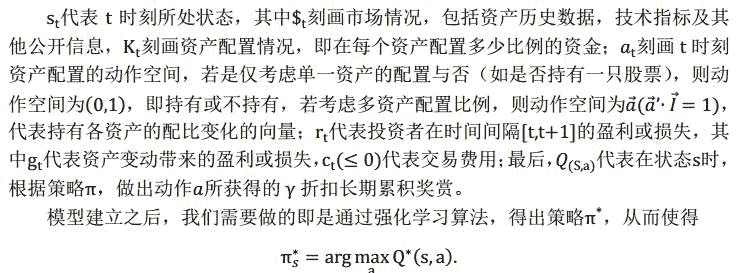

# 强化学习在量化投资中应用（理论简介）

> 原文：[`mp.weixin.qq.com/s?__biz=MzAxNTc0Mjg0Mg==&mid=2653283831&idx=1&sn=527ccfb8d54957a862698412abece0c8&chksm=802e27e2b759aef4824baa047785eda6e0feacddafe7f4f9196ea63a87e304d196e3434b1212&scene=27#wechat_redirect`](http://mp.weixin.qq.com/s?__biz=MzAxNTc0Mjg0Mg==&mid=2653283831&idx=1&sn=527ccfb8d54957a862698412abece0c8&chksm=802e27e2b759aef4824baa047785eda6e0feacddafe7f4f9196ea63a87e304d196e3434b1212&scene=27#wechat_redirect)

> ********查看之前文章请点击右上角********，关注并且******查看历史消息**************所有文章全部分类和整理，让您更方便查找阅读。请在页面菜单里查找。********

*   **什么是强化学习？**

强化学习任务通常用马尔科夫决策过程（MarkovDecision Process,MDP）来描述：机器处于环境 E 中，状态空间为 S，其中每个状态 s∈S 是机器给你知道的环境的描述；机器能采取的动作构成了动作空间 A，若某个动作 a∈A 作用在当前状态 s 上，则潜在的转移函数 P 将使得环境从当前状态按某种概率转移到另一个状态，在转移到另一个状态的同时，环境会根据潜在的“奖赏”（Reward）函数 R 反馈给机器一个奖赏。综合起来，强化学习任务对应了四元组

E= <S,A,P,R>,

其中 P:S×A×S ↦ℝ指定了状态转移概率，R: S×A×S ↦ℝ指定了奖赏。在有的应用中，奖赏可能仅与状态转移有关，即 R:S×S ↦ℝ。

强化学习过程中，机器要做的就是通过在环境中不断尝试而学得一个“策略”π，根据这个策略，在状态 s 下就能得知要执行的动作 a =π(s)。对于确定性策略，可表示为π：S↦A，表示根据状态可得确定的执行动作；对于随机性策略，可表示为π:S×A ↦ℝ，表示根据状态和可执行的动作，可得执行该动作的概率，这里

 

策略的优劣取决于长期执行这一策略后得到的累积奖赏，即不仅考虑执行一个动作执行后当前的奖赏，而且考虑随着状态的变化，后续奖赏的综合。强化学习的目的就是要找到能使长期累积奖赏最大化的策略。长期累积奖赏有多种计算方式，最为常用的是“折扣累积奖赏”

其中 rt 表示第 t 步获得的奖赏，𝔼表示对所有随机变量求期望。

实际上强化学习的策略相当于监督学习中的“分类器”，但是强化学习中没有标记样本，即每一步并不会知晓应该做什么动作，只有等最终结果揭晓，才能通过机器“反思”之前的动作是否正确来进行学习，因此，强化学习在某种意义上可看作具有“延迟标记信息”的监督学习问题。

*   **为什么是强化学习?**

   最优化动态调整流动资产配置（对单一资产的持仓与否或是对多资产的配置比例）实际上可以看作 MDP（Markovian Decision Problem）问题，因此强化学习可以考虑应用于此。

   对于流动资产配置可通过如下模型刻画：

 

   即训练出来的策略π*能够在给定状态下，选择出能使长期累积奖赏最高的动作 a。在实际应用中，我们希望利用类似方法通过强化学习获得这样一种投资策略，在当前的历史市场信息和已有的资产配置状态下，能够选择出能使长期累积收益最大的资产配置行为。

         值得说明的是，多数情况下，市场从$t 到$t+1 的变化是随机的，并不依赖的选择，从而即使是相同的状态和行为可能获得的收益也不相同。但是，该模型主要目的是获得期望的折扣收益，不管收益如何随机变动，只要折扣收益的期望不变，最优化的策略也并不发生改变。

**三、 如何利用强化学习？**

参考文献
1\. 周国平.《机器学习》
2\. Moody, John E., et al. "Reinforcement Learning for Trading Systems and Portfolios."
3\. Jian Li, Laiwan Chan., “Adjustment Reinforcement Learning for Risk-averse Asset
Allocation”
4\. Neuneier.,” Optimal Asset Allocation using Adaptive Dynamic Programming”

听说，置顶关注我们的人都不一般

****

**后台回复下列关键字**

**更多惊喜在等着****你** **【区分大小写】**  

**1.回复****每周论文** [**获取 Market Making 论文分享**](http://mp.weixin.qq.com/s?__biz=MzAxNTc0Mjg0Mg==&mid=2653283381&idx=1&sn=48ec361d5b5a0e86e7749ff100a1f335&scene=21#wechat_redirect)

**2\. 回复****matlab 量化投资** **[**获取大量源码**](http://mp.weixin.qq.com/s?__biz=MzAxNTc0Mjg0Mg==&mid=2653283293&idx=1&sn=7c26d2958d1a463686b2600c69bd9bff&scene=21#wechat_redirect)**

****3\. 回复****每周书籍**[**获取国外书籍电子版**](http://mp.weixin.qq.com/s?__biz=MzAxNTc0Mjg0Mg==&mid=2653283159&idx=1&sn=2b5ff2017cabafc48fd3497ae5efa58c&scene=21#wechat_redirect)**

******4\.** **回复******文本挖掘**** ****[**获取关于文本挖掘的资料**](http://mp.weixin.qq.com/s?__biz=MzAxNTc0Mjg0Mg==&mid=2653283053&idx=1&sn=1d17fbc17545e561be0664af78304a67&scene=21#wechat_redirect)********

************5\. 回复******金融数学**** ****[**获取金融数学藏书**](http://mp.weixin.qq.com/s?__biz=MzAxNTc0Mjg0Mg==&mid=403111936&idx=4&sn=97822bfa300f3d856d6c9acd8dc24914&scene=21#wechat_redirect)**************

**********6\. 回复******贝叶斯 Matlab********[**获取 NBM 详解与具体应用**](http://mp.weixin.qq.com/s?__biz=MzAxNTc0Mjg0Mg==&mid=401834925&idx=1&sn=d56246158c1002b2330a7c26fd401db6&scene=21#wechat_redirect)************

************7.回复****AdaBoost******[获取 AdaBoost 算法文献、代码、研报](http://mp.weixin.qq.com/s?__biz=MzAxNTc0Mjg0Mg==&mid=2653283387&idx=1&sn=d40b3a1ea73e3d85c124b5b1e4f3057b&scene=21#wechat_redirect)**************

**********8.回复****数据包络分析** **获取****[选股分析](http://mp.weixin.qq.com/s?__biz=MzAxNTc0Mjg0Mg==&mid=2653283401&idx=1&sn=fae6d0c0638174bb713952e6af983c54&scene=21#wechat_redirect)源码**********

********9.回复****SVD** **获取数据预处理之图像处理的方法********

********10.回复 KNN 获取****[kNN-最近邻居算法](http://mp.weixin.qq.com/s?__biz=MzAxNTc0Mjg0Mg==&mid=2653283706&idx=1&sn=45ee21fda90a82a4692eb1aff62ec492&scene=21#wechat_redirect)********