# 【量化缠论】系列文章（三）

> 原文：[`mp.weixin.qq.com/s?__biz=MzAxNTc0Mjg0Mg==&mid=2653283821&idx=1&sn=55c29ffb55078ab3244cc1a1ed2b041f&chksm=802e27f8b759aeee010be12d6b05d014167c1b2f18d0b0f09bd821b7d09bc2c67ec9620325b9&scene=27#wechat_redirect`](http://mp.weixin.qq.com/s?__biz=MzAxNTc0Mjg0Mg==&mid=2653283821&idx=1&sn=55c29ffb55078ab3244cc1a1ed2b041f&chksm=802e27f8b759aeee010be12d6b05d014167c1b2f18d0b0f09bd821b7d09bc2c67ec9620325b9&scene=27#wechat_redirect)

> ********查看之前文章请点击右上角********，关注并且******查看历史消息**************所有文章全部分类和整理，让您更方便查找阅读。请在页面菜单里查找。********

此前大家对缠论的文章呼声很高，因此想做一个系列，来系统的介绍一下。但是在写之前笔者有几句话想说：**用缠论作为构建技术分析系统是很好的，但不要太执拗其中，任何理论都有其优点与不足，我们要辩证的看待问题。希望大家能从中学到有用的知识，理性对待缠论。**

**系列目录**

**[【量化缠论】系列文章（一）](http://mp.weixin.qq.com/s?__biz=MzAxNTc0Mjg0Mg==&mid=2653283801&idx=1&sn=0a05bb0247535a118183be2b917c56b4&scene=21#wechat_redirect)**

[**【量化缠论】系列文章（二）**](http://mp.weixin.qq.com/s?__biz=MzAxNTc0Mjg0Mg==&mid=2653283804&idx=1&sn=aba5cea22cd71516f588511703770e9c&scene=21#wechat_redirect)

**注明：本期我们基于国金证券的报告来分析。**

**为什么要研究背驰**

  **■** **背驰与买卖点有天然的联系** 任一背驰都必然制造某级别的买卖点， 任一级别的买卖点都必源自某级别走势的背驰。
**■ 背驰与背离的重要区别**
缠论定义的（ 趋势） 背驰可以保证回到背驰前的最后一个中枢之中。
**■ 大级别的背驰有着十分重要的意义**
日线以上级别的背驰点较少出现， 可以比较可靠的抓住大顶和大底。

**基本概念**

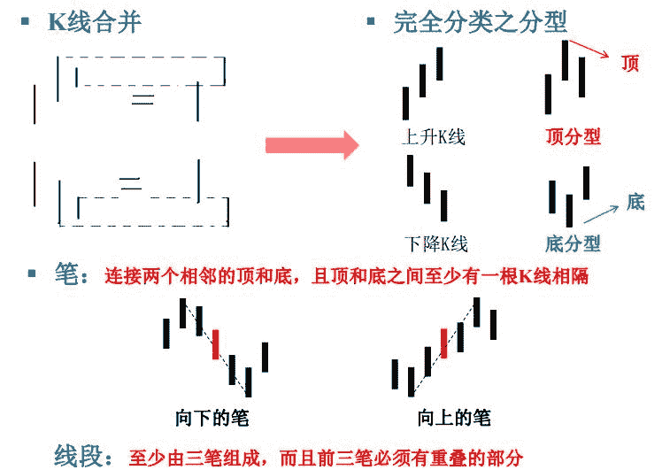

**级别、 走势类型、 中枢**

 打开走势图即看到走势，走势分不同级别， **级别是缠论体系核心组成部分之一。**
**级别**： 级别一般与 K 线图的周期是一一对应的，有周、日、 30 分钟、 5 分钟、 1 分
钟级别等，最低级别为分笔走势。 **次级别**： 以上级别分别为前一级别的次级别。
**走势类型**： 趋势、盘整，其中，趋势有上涨和下跌两种。
**中枢**： **某级别走势类型中，被至少三个连续次级别走势类型所重叠的部分。**

**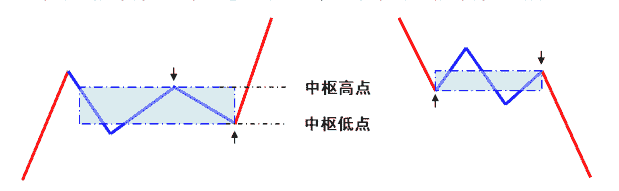** 

中枢是一个区间的概念，图中每条线段都是一个次级别走势类型，蓝色框框部分表示该级别中枢；向上走势考察下上下的次级别，向下走势考察上下上的次级别。
中枢实际上可以通过多种方法得到，定义中给出的是递归的方法，而比较简单的方法为直接使用笔或线段来代替次级别走势类型。

**盘整、趋势**

 **盘整**： 在任何级别的任何走势中，某完成的走势类型只包含一个走势中枢。
**趋势**： 在任何级别的任何走势中，某完成的走势类型至少包含两个及以上依次同
向的中枢，就称为该级别的趋势

**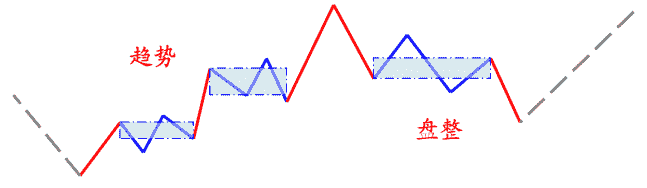** 

缠论并没有对背驰概念进行过明确定义，但对于背驰类型，则是显然区分了趋势
背驰和盘整背驰的。
**趋势背驰**：在趋势走势当中发生的背驰；
**盘整背驰**： 在盘整走势当中发生的背驰。**盘整、趋势**

**■ 背驰的级别** 一个 1 分钟级别的背弛， 在绝大多数的情况下， 不会制造一个周线级别的大顶， 除非日线上同时也出现背弛。 但出现背弛后必然有逆转， 这是没任何商量余地的。 究竟逆转多少？ 那很简单， 就是重新出现新的次级别买卖点为止。通常， 大级别背驰比小级别背驰所对应的幅度要大， 时间要长。  

**■ 背驰段**
在某级别的某走势类型中，构成背驰的某次级别走势类型称为某级别的背驰段。
通常，在某级别走势出现新高（或新低） 后，若前一次级别走势类型或最近的同级别中枢之中 MACD 黄白线回拉零轴，则可认为该级别走势进入了背驰段。 注意：并不是走势进入某级别的背驰段后就一定会出现该级别的背驰，可能会因为小级别的延续而导致走势走出背驰段。

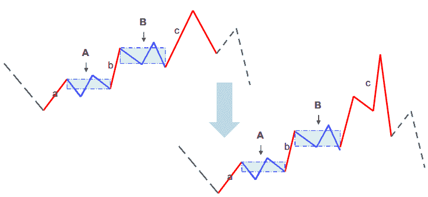 

b+B+c 在一个大的趋势里， B 之前有一个同级别中枢 A， B 中枢把 MACD 黄白线回拉到 0 轴附近再次上升不创新高，并且 c 段对应的 MACD 柱子面积(向上看红柱子，向下看绿柱子)比 b 段对应的面积小，就构成标准的背驰。有时可以比较两段中 MACD 黄白线的高度，一般来说不强求两个条件都符合。

在第一个中枢就出现的“背驰”， 只能算是盘整背驰， 其技术含义是一个企图脱离中枢的运动，由于力度有限，被阻止而出现回到中枢里。这种盘整中的类似背驰方法的应用，称为盘整背弛判断。 **判断盘整背驰的关键在于选取可以比较的两段走势。**

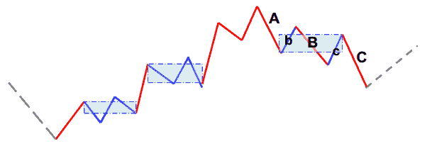

上图 C 段的 MACD 柱子面积比 A 小，且 b-B-c 中出现了 MACD 黄白线回拉零轴的过程， 就是一个盘整背驰。 但实际上， B 与 A 以及 C 与 B 也可以进行比较，但该类比较与狭义的盘整背驰有些差异，因此一般称之为线段内背驰；其要求是 A 与 B 进行比较时 b 中 MACD 黄白线要回拉零轴， C 与 B 进行比较时要求 c 中 MACD 黄白线回拉零轴。  

**背驰的辅助判断方法举例**

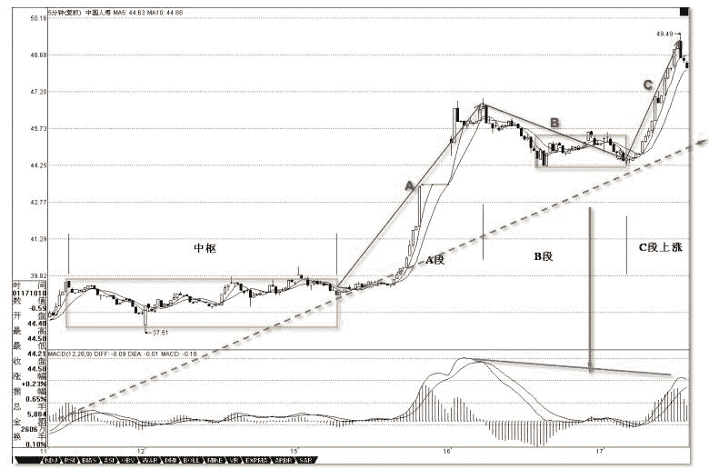

**■ 背驰段和背驰区间套** **背驰段**： 最后一个中枢被破坏后即进入背驰段。

**背驰区间套**： 某大级别的转折点，可以通过不同级别背驰段的逐级收缩范围而确定。某大级别的转折点，先找到其背驰段，然后在次级别图里，找出相应背驰段在次级别里的背驰段，将该过程反复进行下去，直到最低级别，相应的转折点就在该级别背驰段确定的范围内。

**三类买卖点与背驰**

**■ 第一类买卖点** 某种类型的走势完成后就会转化为其他类型的走势， 对于下跌的走势来说， 一旦完成， 只能转化为上涨与盘整。 **一旦能把握下跌走势转化的关节点买入， 就占据了一
个最有利的位置， 这个买点就是“第一类买点”** ；第一类卖点反之亦然。
**■** **第二类买卖点**
第一买点出现后， 无论接下来是趋势还是盘整， 在图形中都要完成， 所以在**第一类买点出现后的第一次次级别回调制造的低点， 是市场中第二有利的位置， 这就是
“第二类买点”** ；第二类卖点亦然

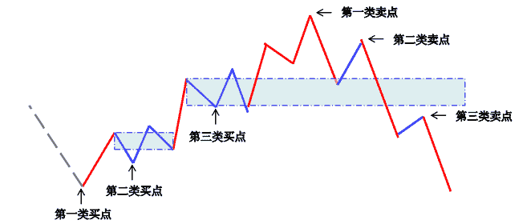 **■ 第三类买卖点**

一个次级别走势类型向上离开中枢，然后以一个次级别走势类型回试，其低点不进入中枢高点，则构成**“第三类买点”** ； 一个次级别走势类型向下离开中枢，然后以一个次级别走势类型回抽，其高点不进入中枢低点，则构成**“ 第三类卖点”**。

 

**■ 第二和第三类买卖点的背驰级别一般是次级别或以下级别**

**如何在小级别暴涨暴跌时借助 MACD 判断背驰**

MACD，当一个辅助系统，还是很有用的。 MACD 的灵敏度，和参数有关，一般都取用 12、 26、 9 为参数，这对付一般的走势就可以了，但一个太快速的走势， 1 分钟图的反应也太慢了，如果弄超短线，那就要看实际的走势。

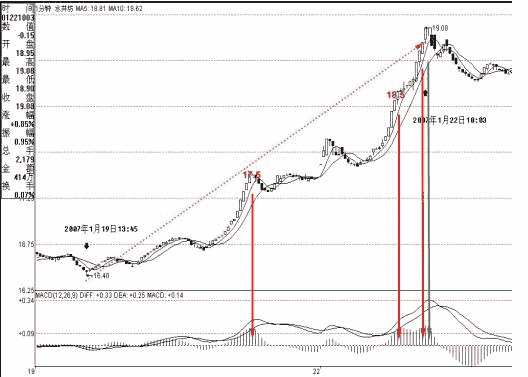 

**例如看 600779 的 1 分钟图**：①从 16.5 上冲 19 的这段，明显是一个 1 分钟上涨的不断延伸，这种走势如何把握超短的卖点？②从该 1 分钟走势可以看出， 17.5 元时的柱子高度，是一个标杆，③后面上冲时，在 18.5 与 19 元分别的两次柱子伸长都不能突破该高度，虽然其形成的面积大于前面的，但这种两次冲击乖离极限而不能突破，就意味着这种强暴的走势，要歇歇了。打开一个 MACD 图，首先应该很敏感地去发现该股票 MACD 伸长的一般高度，在盘整中，一般伸长到某个高度，就一定回去了，而在趋势中，这个高度一定高点，那也是有极限的，一般来说，一旦触及这个乖离的极限，特别是两次或三次上冲该极限，就会引发因为乖离而产生的回调。这种回调因为变动太快，在 1 分钟上都不能表现其背驰，所以必须用单纯的 MACD 柱子伸长来判断。

**小级别背驰引发大级别转折**

一个向上的 30 分钟级别的 a+A+b+B+c，如果 c 出现了一个 1 分钟级别的背驰，最终引发下跌拉回 B 里，这时候， c 里究竟发生了点什么事情？

首先， c 至少要包含一个 5 分钟的中枢，否则，中枢 B 就不可能完成，因为这样不可能形成一个第三类的买点。不妨假设 c`是 c 中最后一个 5 分钟的中枢，显然，这个 1 分钟的顶背驰，只能出现在 c`之后，而这个顶背驰必然使得走势拉回 c`里，也就是说，整个运动，都可以看成了围绕 c`的一个震荡，而这个震荡要出现大的向下变动，显然要出现 c`的第三类卖点，因此， 对于那些小级别背驰后能在最后一个次级别中枢正常震荡的，都不可能转化成大级别的转折，这个结论很重要，所以可以归纳成如下定理： 

**缠中说禅小背驰-大转折定理：** 小级别顶背驰引发大级别向下的必要条件是该级别走势的最后一个次级别中枢出现第三类卖点；小级别底背驰引发大级别向上的必要条件提是该级别走势的最后一个次级别中枢出现第三类买点。

**背驰程序算法的若干要点**

**■ 缠论实际提到的背驰有三类** **趋势背驰、 盘整背驰、 线段内类背驰**
**注：** 为便于程序实现， 在一定程度上模糊了趋势背驰和盘整背驰的区别
**■ 判断背驰时最重要的几个要素**
**1、寻找中枢、 判断 MACD 黄白线回拉零轴
2、背驰段的确定以及寻找可以比较的走势段**
**3、计算用来对比的各走势段的走势力度
4、选择那些级别进行背驰区间套
5、不用 tick 数据的情况下， 背驰区间套如何自动截**

**各种情境下的背驰对比段**

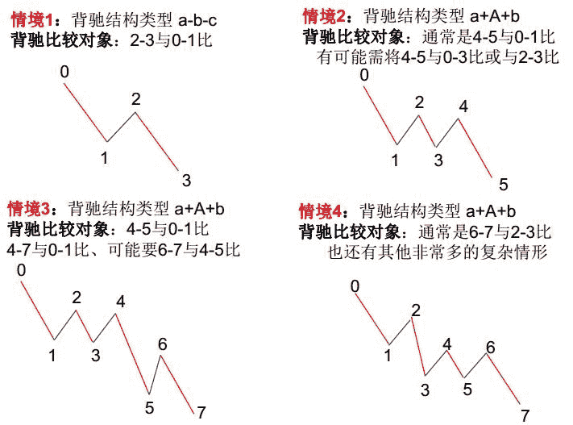

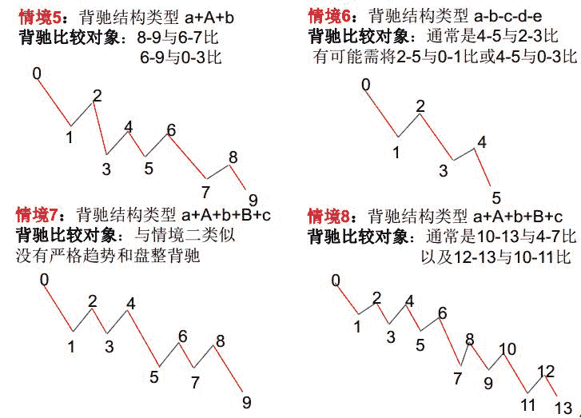

**上证综指 30 分钟级别背驰**

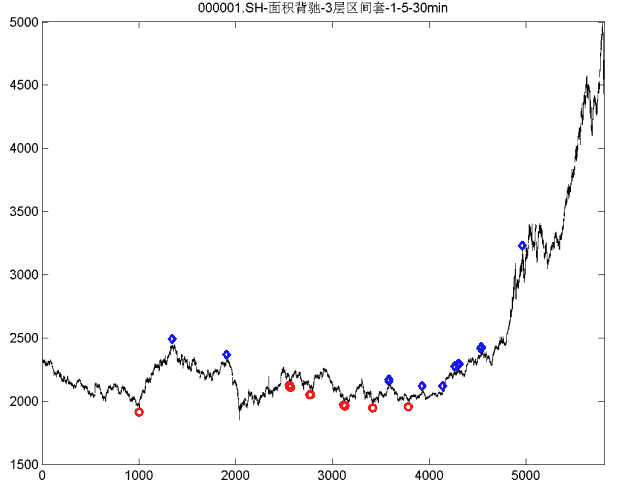2012.12.1-2015.5.30 蓝色菱形标记为顶背驰位置，红色圆圈为底背驰位置。

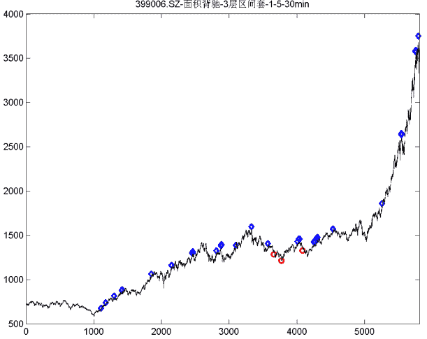       2012.12.1-2015.5.29 蓝色菱形标记为顶背驰位置，红色圆圈为底背驰位置。

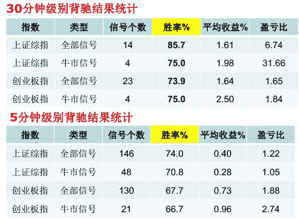 **测试区间**： 2012.12.1-2015.5.30
其中，上证综指牛市 2014.7.1 至今；创业板指牛市 2015.1.1 至今
**信号收益率**： 某笔第一次发出背驰信号至随后反向第一笔结束的幅度。

听说，置顶关注我们的人都不一般

****

**后台回复下列关键字**

**更多惊喜在等着****你** **【区分大小写】**  

**1.回复****每周论文** [**获取 Market Making 论文分享**](http://mp.weixin.qq.com/s?__biz=MzAxNTc0Mjg0Mg==&mid=2653283381&idx=1&sn=48ec361d5b5a0e86e7749ff100a1f335&scene=21#wechat_redirect)

**2\. 回复****matlab 量化投资** **[**获取大量源码**](http://mp.weixin.qq.com/s?__biz=MzAxNTc0Mjg0Mg==&mid=2653283293&idx=1&sn=7c26d2958d1a463686b2600c69bd9bff&scene=21#wechat_redirect)**

****3\. 回复****每周书籍**[**获取国外书籍电子版**](http://mp.weixin.qq.com/s?__biz=MzAxNTc0Mjg0Mg==&mid=2653283159&idx=1&sn=2b5ff2017cabafc48fd3497ae5efa58c&scene=21#wechat_redirect)**

******4\.** **回复******文本挖掘**** ****[**获取关于文本挖掘的资料**](http://mp.weixin.qq.com/s?__biz=MzAxNTc0Mjg0Mg==&mid=2653283053&idx=1&sn=1d17fbc17545e561be0664af78304a67&scene=21#wechat_redirect)********

************5\. 回复******金融数学**** ****[**获取金融数学藏书**](http://mp.weixin.qq.com/s?__biz=MzAxNTc0Mjg0Mg==&mid=403111936&idx=4&sn=97822bfa300f3d856d6c9acd8dc24914&scene=21#wechat_redirect)**************

**********6\. 回复******贝叶斯 Matlab********[**获取 NBM 详解与具体应用**](http://mp.weixin.qq.com/s?__biz=MzAxNTc0Mjg0Mg==&mid=401834925&idx=1&sn=d56246158c1002b2330a7c26fd401db6&scene=21#wechat_redirect)************

************7.回复****AdaBoost******[获取 AdaBoost 算法文献、代码、研报](http://mp.weixin.qq.com/s?__biz=MzAxNTc0Mjg0Mg==&mid=2653283387&idx=1&sn=d40b3a1ea73e3d85c124b5b1e4f3057b&scene=21#wechat_redirect)**************

**********8.回复****数据包络分析** **获取****[选股分析](http://mp.weixin.qq.com/s?__biz=MzAxNTc0Mjg0Mg==&mid=2653283401&idx=1&sn=fae6d0c0638174bb713952e6af983c54&scene=21#wechat_redirect)源码**********

********9.回复****SVD** **获取数据预处理之图像处理的方法********

********10.回复 KNN 获取****[kNN-最近邻居算法](http://mp.weixin.qq.com/s?__biz=MzAxNTc0Mjg0Mg==&mid=2653283706&idx=1&sn=45ee21fda90a82a4692eb1aff62ec492&scene=21#wechat_redirect)********