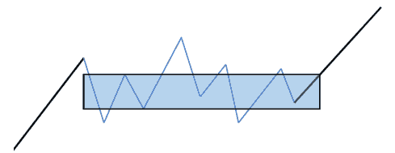

# 【量化缠论】系列文章（二）

> 原文：[`mp.weixin.qq.com/s?__biz=MzAxNTc0Mjg0Mg==&mid=2653283804&idx=1&sn=aba5cea22cd71516f588511703770e9c&chksm=802e27c9b759aedfce811409119a5b43aeb76a5675099311ca0d8d2eaa43bc17eef86182f676&scene=27#wechat_redirect`](http://mp.weixin.qq.com/s?__biz=MzAxNTc0Mjg0Mg==&mid=2653283804&idx=1&sn=aba5cea22cd71516f588511703770e9c&chksm=802e27c9b759aedfce811409119a5b43aeb76a5675099311ca0d8d2eaa43bc17eef86182f676&scene=27#wechat_redirect)

> ********查看之前文章请点击右上角********，关注并且******查看历史消息**************所有文章全部分类和整理，让您更方便查找阅读。请在页面菜单里查找。********

此前大家对缠论的文章呼声很高，因此想做一个系列，来系统的介绍一下。但是在写之前笔者有几句话想说：**用缠论作为构建技术分析系统是很好的，但不要太执拗其中，任何理论都有其优点与不足，我们要辩证的看待问题。希望大家能从中学到有用的知识，理性对待缠论。**

**系列目录**

[**【量化缠论】系列文章（一）**](http://mp.weixin.qq.com/s?__biz=MzAxNTc0Mjg0Mg==&mid=2653283801&idx=1&sn=0a05bb0247535a118183be2b917c56b4&scene=21#wechat_redirect)

本期内容感谢**【中信建投金工团队】**与【**量化投资与机器学习】**公众号进行友好合作。

缠论     缠论是一种择时类的技术理论，借助数学中的形态分类方法和物理中的动力学理论来解释市场走势。以市场走势中的 K 线图为基础，通过包含关系处理后，分辨出走势图中的分型（顶分型和底分型），根据分型划分出笔，再由笔构造出线段，再根据线段确立走势中枢，继而判别走势类型，通过分析走势中枢的位次，结合动力学部分的背驰及区间套，综合确定第一、二和三类买卖点。**分型**       在由 K 线确立分型之前，必须先对 K 线进行包含关系处理。包含的定义：一根 K 线的高低点全部在其相邻 K 线的高低点范围之内，那么这根 K 线和其相邻 K 线就称包含关系。但分为向上处理和向下处理两种情况。

      由上图可知， 在向上时（左图）， 向上的定义是 B 这根 K 线的最高价高于 A 这根 K 线的最高价， B、 C 这两根相邻 K 线满足包含定义，那么把 B、 C 这两根 K 线的最高点当高点，而这两根 K 线低点中的较高者当成低点，这样就把两 K 线合并成一新的 K 线 D；反之， 当向下时（右图）， 向下的定义是 F 这根 K 线的最低价低于 E 这根 K 线的最低价， F、 G 这两根相邻 K 线满足包含定义，那么把 F、 G 这两根 K 线的最低点当低点，而这两根 K 线高点中的较低者当成高点，这样就把 F 和 G 这两根 K 线合并成一根新 K 线 H，以此规律，向后依次递推处理。

      对所有的 K 线进行包含关系处理完成后， 连续三根 K 线走势将只会是上图中的四种形态，第一种是上升 K 线组合，即多根 K 线呈现向上排列，后一根 K 线的最高价和最低价均高于前一根。第二种是顶分型，即相邻三根 K 线中的中间那根 K 线中最高价是最高的，最低价也是最高的。第三种是下降 K 线，即多根 K 线呈现向下
排列，后一根 K 线的最高价和最低价均低于前一根。第四种是底分型，即相邻三根 K 线中的中间那根 K 线中最高价是最低的，最低价也是最低的。

**笔**

        确定分型后，连接相邻的顶分型与底分型将构成一笔。 笔的定义为两个相邻顶分型和底分型的顶底之间连线叫做笔。如下图中的 AB 线段为向下的一笔， BC 线段为向上的一笔。但需要注意是顶分型和底分型之间至少要有一根独立 K 线，即满足缠论中所说的结合律。 若 K 线走势图中，出现两个或多个同性质的分型，如果是顶分型，后面的顶高于前面的顶，则只保留后面的，否则保留前面的顶不变。若是底分型，后面的底低于前面的底，则只保留后面的，否则保留前面的底不变。

 

**线段**

 线段的定义为：连续的三笔之间若存在重叠部分，其起点和终点之间的连线为线段，如下图所示， AD 线段为向上的线段， EF 线段为向下的线段。  

下图为连续三笔不能构成线段的两种情形，即连续三笔之间无重叠部分。

线段还会有两种演变状态，一种是此线段继续延伸，另一种是此线段被另外一条线段破坏。就是说，线段不能由单单的一笔破坏，由笔产生的线段破坏不构成真正的破坏，线段只能被线段破坏。

       线段的延伸和终止可由特征序列完全确定。

       线段的特征序列：以向上笔开始的线段， 可以用笔的序列表示： S1X1S2X2S3X3…SnXn。 其中任一 S 称为线段的向上元素，任一 X 称为线段的向下元素。 容易证明，任何 Si 与 Si+1 之间，一定有重合区间。 考察序列 X1X2…Xn，该序列中， Xi 与 Xi+1 之间并不一定有重合区间，因此，这序列更能代表线段的性质。如下图， 向上线段 AB 的特征序列为 S1X1S2X2S3X3S4。

 

       定义：序列 X1X2…Xn 成为以向上笔开始线段的特征序列；序列 S1S2…Sn 成为以向下笔开始线段的特征序列。特征序列两相邻元素间没有重合区间，称为该序列的一个缺口。
      

      关于特征序列，把每一元素看成是一 K 线，那么，如同一般 K 线图中找分型的方法，也存在所谓的包含关系，也可以对此进行包含关系处理。经过包含处理后的特征序列，成为标准特征序列。以后没有特别说明，特征序列都是指标准特征序列。

       如上图所示，向上线段 AB 中，特征序列 Xi 对应的 K 线为 i（ i=1,2,3,4） ,其中 K 线 3 和 K 线 4 存在包含关系，将 K 线 3 和 4 包含处理后，线段 AB 的特征序列就称为标准特征序列。

      参照一般 K 线图关于顶分型与底分型的定义，可以确定特征序列的顶和底。注意，以向上笔开始的线段的特征序列，只考察顶分型；以向下笔开始的线段，只考察底分型。

      在标准特征序列里，构成分型的三个相邻元素，只有两种可能。第一种情况，特征序列的顶分型中，第一和第二元素间不存在特征序列的缺口，那么该线段在该顶分型的高点处结束，该高点是该线段的终点；特征序列的底分型中，第一和第二元素间不存在特征序列的缺口，那么该线段在该底分型的低点处结束，该低点是该线段的终点。第二种情况，特征序列的顶分型中，第一和第二元素间存在特征序列的缺口，如果从该分型最高点开始的向下一笔开始的序列的特征序列出现底分型，那么该线段在该顶分型的高点处结束，该高点是该线段的终点；特征序列的底分型中，第一和第二元素间存在特征序列的缺口，如果从该分型最低点开始的向上一笔开始的序列的特征序列出现顶分型，那么该线段在该底分型的低点处结束，该低点是该线段的终点。

      那么， 线段的严格划分可以分为以下两种情况：
      第一， 出现笔破坏的情况。 线段出现笔破坏，向上线段只考察 X 元素的特征序列，若出现顶分型，则原线段结束语该顶分型的高点。向下线段只考察 S 元素的标准特征序列。若出现底分型，则原线段结束于该底分型的低点。

 

      上图向上线段 AB 出现笔破坏，并且特征序列 X 出现顶分型，则 B 点是此线段的终点。

 

      上图显示，向上线段 AB 出现笔破坏， 但特征序列 X 未出现顶分型，则 B 点不是线段的终点，线段仍在延伸中，直到特征序列 X 出现顶分型。

第二，未出现笔破坏的情况，即特征序列分型中的第一和第二元素间存在特征序列的缺口。 在特征序列的顶分型中（即向上线段），如果从该顶分型最高点开始的向下一笔开始的 X 序列的特征序列出现底分型，那么该线段的终点是此顶分型的顶。 在特征序列的底分型中（即向下线段），如果从该顶分型最低点开始的向上一笔开始的 S 序列的特征序列出现顶分型，那么该线段的终点是此底分型的底。 

      上图显示，向上线段 AB 未出现笔破坏，即有缺口，并且特征序列 X 出现底分型，则 B 点是此线段的终点。

 

     上图显示，向上线段 AB 未出现笔破坏，且特征序列 X 未出现底分型，则 B 点不是此线段的终点，线段仍在延伸中，直到特征序列 X 出现底分型。

**走势中****枢**

      相对于走势中枢来讲，线段属于次级别走势类型，某级别走势类型中，被
至少三个连续次级别走势类型（线段）所重叠的部分，走势中枢形成方式有两种：
一种是回调形成的（下—上—下型），一种是回升形成的（上—下—上型）。

      走势中枢的区间范围确定方法为： 中枢高点为构成此走势中枢前三根线段中的次高点，中枢低点为前三根线段中的次低点，走势中枢范围为中枢高点与中枢低点构成的矩形区域。 具体见下图。

走势中枢是缠论中非常重要的概念， 有以下三种论述。

第一， 走势中枢的延伸。在盘整中，无论是离开还是返回。走势类型必然是次级别以下的。 某级别的破坏，当且仅当一个次级别走势离开该后，其后的次级别回抽走势不重新回到该区间内。也就是说，走势中枢由前三个次级别线段的重叠部分产生之后，若其以一个次级别的线段返回中枢，其过程就是走势中枢的延伸。

第二， 走势中枢的新生。当一个走势中枢产生之后，以一个次级别的线段离开中枢，跟着的一个次级别线段若不返回到中枢区间，称其为走势中枢的新生。

第三，在走势中枢的新生中，同级别的前后两个走势中枢的区间是不能有任何重叠的，这包括任何围绕走势中枢产生的任何瞬间波动之间的重叠。如果连续三个次级别线段的重叠区间虽然不和前面的走势中枢有任何重叠，但围绕该走势中枢产
生的波动触及前面走势中枢延续时的某个瞬间波动区间，就不能认为该走势中枢是走势中枢的新生，而只是走势中枢的扩展，就产生了一个更大级别的走势中枢， 即高级别走势中枢。 如下图，中枢 2 中的某一线段低点 ZD 触及到了中枢 1 的范围内，那么中枢 1 将拓展，中枢 2 将不成立。

**走势类型**

根据缠论的完全分类方法完成后，市场走势将分为盘整和趋势两种走势类型。

盘整：在任何级别的任何走势中，某完成的走势类型只包含一个走势中枢，则称为该级别的盘整。

 

 趋势：在任何级别的任何走势中，某完成的走势类型至少包含两个以上依次同向的走势中枢，就称为该级别的趋势。向上趋势称为上涨，向下趋势称为下跌。

由上图可看出，两个同向走势中枢的连接段称为趋势，向上则为向上趋势，向下则为向下趋势。

**买卖点分析**

缠论作为一种择时类技术分析，买卖点分析处于核心地位。在缠论中共有三类买卖点，买卖点依附于走势中枢而生，买卖点与走势中枢的区间位置有着密切关系。 同时，买卖点的判别也涉及到物理动力学中的背驰问题。

“缠论中的所有买卖点（ 包括 K 线系统和均线系统），最终都可以归结到某级别的第一类买卖点”，而背驰与该种买卖点密切相关。任何的逆转都是从第一类买卖点开始的，无论是买点还是卖点，必然都对应着某级别的背驰。 因此，背驰与买卖点必须结合在一起来讨论。 缠中说禅背驰-买卖点定理：任一背驰都必然制造某级别的买卖点，任一级别的买卖点都必然源自某级别走势的背驰。

**背驰**

缠论中的背驰分为两种：趋势背驰和盘整背驰。

      趋势背驰的发生必须在至少两个同向同级别中枢的基础上，是指围绕最后一个同级别中枢的前后两个次级别走势（线段），后面线段的力度要弱于前面线段。所以说，趋势背驰肯定发生在第二个同向中枢之后，对于一个日线以上级别的第二个中枢，就可以密切关注背驰的出现。而对于 1 分钟小级别的情况， 第二和第三个中枢背驰的情况占大多数，四、五个中枢以后才出现背驰的情况就相当罕见了。如果趋势背驰出现创新高或新低，将构成绝大多数的第一类买卖点。

      盘整背驰是指在第一个中枢就出现背驰，这时不能算作是趋势背驰，只能算是盘整背驰。盘整背驰的技术含义在于，一个企图脱离中枢的向上线段，但由于力度有限，被阻止而被拉回到原来的中枢里面。 但盘整背驰有两点用处，第一点是多数的第二、三类买点是由盘整背驰构成的，第二点是在大级别上，特别是至少周线级
别以上的，这种盘整背驰所发现的，往往是历史性的大底部。

****一类买卖点****

缠中说禅技术分析基本原理一：任何级别的任何走势类型终要完成，即“走势终完成”，意思在于“所有级别的都能分解成趋势与盘整”。根据“走势终完美”的观点， 必然要转化成其他走势类型。那么一个下跌走势类型完成后，必然要转化成上涨或盘整的走势类型。所以一类买卖点关键在于找到一个最有利的买卖位置。缠论的方法就是引入动力学中的背驰概念，利用走势中的背驰来确定一类买卖点。

       一种根据 MACD 对背驰的辅助判断方法。 MACD 判断背驰方法如下：首先要有两段同向的趋势，同向趋势之间一定有一个盘整或反向趋势连接，把这三段分别称为 A、 B、 C 段，具体见下图。 B 的中枢级别要比 A、 C 里的中枢级别（是说 A、 C 线段里面的小级别中枢）要大，在 A 段之前，一定存在一个与 B 同级别或更大级别的一个同向中枢，这就说明 A、 B、 C 在一个大的趋势里， B 这个中枢一般会把 MACD 的黄白线（也就是 DIFF 和 DEA）会拉到 0 轴附近，而 C 段的走势类型完成时对应的 MACD 柱子面积（向上的看红柱子，向下看绿柱子）比 A 段对应的面积要小，这时可称为构成了标准的背驰。

除了 MACD 指标辅助判别方法之外，还有一些其他判别背驰的方法，如均线相交面积背驰方法、黄白线运行位置等方法。 均线相交面积背驰方法是以均线为基础定义的“背驰”，主要在缠论均线系统操作方法中运用。“趋势力度”概念： 前一均线缠绕阶段与后一均线缠绕阶段之间的由短期均线与长期均线相交所形成的面积。利用均线相交面积判断背驰，主要是考察同向趋势中前、后一段时间短期均线与长期均线相交时形成的面积。若此面积越来越小，说明趋势力度越来越弱，就形成了背驰。

黄白线运行位置方法判别如下：在一个下跌趋势里，对于 A+B 中枢+C 的走势情况， C 段对比 A 线创出新低，但 MACD 技术指标的黄白线返回 0 轴后不再创出新低，就构成了趋势底背驰。

**二类买卖点**

二类买卖点的定义：第一类买（卖） 点出现后，随着第一次次级别的上涨（下跌） 结束，接着会有一次次级别的回调（上升），这个回调（上升） 制造出来的低（高） 点，是市场中仅次于第一类买（卖） 点的较佳买入（ 卖出） 位置，称为第二类买（卖） 点。

      从时间顺序来讲，二类买卖点发生在一类买卖点之后。从次级别的角度来看， 缠论买卖点定律一：任何级别的第二类买卖点都由次级别相应走势的第一类买卖点构成。 缠中说禅的第二类买卖点与中枢的关系也比较特殊，可以出现在最后一个中枢的任何位置，对于二类买（卖）点的位置出现在中枢下（上）的，其后的力度就值得怀疑，出现扩张性中枢的可能性极大，若出现在中枢区间围中，出现中枢扩张和新生的机会对半，若出现在中枢上（下），中枢新生的机会就很大。

**三类买卖点**

三类买卖点的定义：第一类买（卖）点出现后，一个次级别走势向上（下）离开走势中枢，然后以一个次级别走势回调（上升），其低（高）点不跌（涨）回中枢区间，则构成第三类买（卖）点。

第三类买卖点定理：一个次级别走势类型向上离开走势中枢，然后以一个次级别走势类型回试，其低点不跌破 ZG（中枢区间的上界），则构成第三类买点；一个次级别走势类型向下离开走势中枢，然后以一个次级别走势类型会抽，其高点不升破 ZD（中枢区间的下界），则构成第三类卖点。

**缠论实际案例分**

以上证指数 5 分钟数据为例子，完全按照缠论原文的概念划分市场走势，并根据 MACD 指标方法判断背驰，找出了三类买卖点。 下面例子选择的时间区间约为： 2015 年 12 月 17 日 14 点 30 分至 2016 年 5 月 10 日 14 点 55 分。这段时间的市场走势在顶背驰（ 3684.57 点， 2015 年 12 月 23 日 14 点 25 分）发生后，市场下跌，形成第二、第三类卖点（ 3627.85 点， 2015 年 12 月 25 日 10 点 15 分形成第二类卖点； 3556.65 点， 2015 年 12 月 19 日 14 点 15 分形成第三类卖点），随后再形成下跌趋势，连接三个连续下跌的同级别走势中枢，之后出现底背驰（ 2647.55 点， 2016 年 1 月 28 日 14 点 50 分），市场转而上涨，形成第二、第三类买点（ 2755.24 点， 2016 年 1 月 29 日 14 点 40 分形成第二类买点； 2772.46 点， 2016 年 2 月 5 日 10 点 35 分形成第三类买点），市场继续上涨（需要去除一段市场极端行情）， 形成上涨趋势，连接两个连续上涨的同级别走势中枢，之后出现顶背驰（ 3097.16 点， 2016 年 4 月 13 日 13 点 25 分），市场转而下跌。 为了更加详细的阐述， 下面将这段市场走势分成四个阶段，并对趋势、走势中枢、背驰和买卖点等内容进行详细地分析。

如上图所示，从 2015 年 12 月 17 日 14 点 30 分开始形成一条向上的线段，之后再从 2015 年 12 月 22 日 9 点 35 分开始，由连续三条线段的重叠部分形成最后一个向上的 5 分钟级别的走势中枢，并且在 2015 年 12 月 23 日 14 点 25 分（ 3684.57 点）发生顶背驰，形成第一类卖点，根据第二类卖点的定义，出现第一类卖点之后的下跌线段回升形成的高点就是第二类卖点，所以在 2015 年 12 月 25 日 10 点 15 分（ 3627.85 点）形成第二类卖点。 中枢 1 的时间段约为 2015 年 12 月 22 日 9 点 35 分至 2015 年 12 月 28 日 10 点 55 分。趋势段 1 的时间段约为 2015 年 12 月 28 日 10 点 55 分至 2015 年 12 月 29 日 10 点 10 分。

由上图可看出， 随后上证指数继续下跌，根据第三类卖点定义（ 第一类卖点出现后，一个次级别走势向下离开走势中枢，然后以一个次级别走势上升，其高点不涨回原来的中枢区间，则构成第三类卖点）， 则在 2015 年 12 月 29 日 14 点 15 分（ 3556.65 点） 形成第三类卖点， 之后再形成 5 分钟级别中枢（中枢 2），市场指数趋势继续向下，并在 2016 年 1 月 6 日 10 点 00 分（ 3322.53 点）再次形成第三类卖点。

由上图可看出， 此后，上证指数总体上继续下跌，并之后再次形成了两个 5 分钟级别的下跌中枢， 在中枢 4 形成后，在 2016 年 1 月 28 日 14 点 50 分（ 2647.55 点）构成了底背驰，形成了第一类买点，随后在 2016 年 2 月 3 日 10 点 00 分（ 2699.01 点）形成第二类买点。

由上图可以看出，在底背驰之后，首次离开最后一个中枢的上升线段回调形成的低点（高于中枢），此点就是一个安全的第三类买点，那么在 2016 年 2 月 5 日 10 点 45 分（ 2767.61 点）形成了第三类买点。 2 月 25 日左右由于市场上传言“自 3 月 1 日起创业板将全面停止审核，将实施注册制改革，实施期限为两年”，市场反应强跌，造成暴跌，导致了市场发生极端行情， 但市场不久后就完成了修复， 所以为了便于分析， 暂时不考虑这一段市场行情，也就是说，附近的两个走势中枢不进行扩展处理。 随后，再形成了两个向上的走势中枢，并在 2016 年 4 月 13 日 13 点 25 分（ 3097.16 点）构成顶背驰，形成第一类卖点。 市场之后转而进入下跌趋势。

**中信建投金融工程团队官方微信**

听说，置顶关注我们的人都不一般

****

**后台回复下列关键字**

**更多惊喜在等着****你** **【区分大小写】**  

**1.回复****每周论文** [**获取 Market Making 论文分享**](http://mp.weixin.qq.com/s?__biz=MzAxNTc0Mjg0Mg==&mid=2653283381&idx=1&sn=48ec361d5b5a0e86e7749ff100a1f335&scene=21#wechat_redirect)

**2\. 回复****matlab 量化投资** **[**获取大量源码**](http://mp.weixin.qq.com/s?__biz=MzAxNTc0Mjg0Mg==&mid=2653283293&idx=1&sn=7c26d2958d1a463686b2600c69bd9bff&scene=21#wechat_redirect)**

****3\. 回复****每周书籍**[**获取国外书籍电子版**](http://mp.weixin.qq.com/s?__biz=MzAxNTc0Mjg0Mg==&mid=2653283159&idx=1&sn=2b5ff2017cabafc48fd3497ae5efa58c&scene=21#wechat_redirect)**

******4\.** **回复******文本挖掘**** ****[**获取关于文本挖掘的资料**](http://mp.weixin.qq.com/s?__biz=MzAxNTc0Mjg0Mg==&mid=2653283053&idx=1&sn=1d17fbc17545e561be0664af78304a67&scene=21#wechat_redirect)********

************5\. 回复******金融数学**** ****[**获取金融数学藏书**](http://mp.weixin.qq.com/s?__biz=MzAxNTc0Mjg0Mg==&mid=403111936&idx=4&sn=97822bfa300f3d856d6c9acd8dc24914&scene=21#wechat_redirect)**************

**********6\. 回复******贝叶斯 Matlab********[**获取 NBM 详解与具体应用**](http://mp.weixin.qq.com/s?__biz=MzAxNTc0Mjg0Mg==&mid=401834925&idx=1&sn=d56246158c1002b2330a7c26fd401db6&scene=21#wechat_redirect)************

************7.回复****AdaBoost******[获取 AdaBoost 算法文献、代码、研报](http://mp.weixin.qq.com/s?__biz=MzAxNTc0Mjg0Mg==&mid=2653283387&idx=1&sn=d40b3a1ea73e3d85c124b5b1e4f3057b&scene=21#wechat_redirect)**************

**********8.回复****数据包络分析** **获取****[选股分析](http://mp.weixin.qq.com/s?__biz=MzAxNTc0Mjg0Mg==&mid=2653283401&idx=1&sn=fae6d0c0638174bb713952e6af983c54&scene=21#wechat_redirect)源码**********

********9.回复****SVD** **获取数据预处理之图像处理的方法********

********10.回复 KNN 获取****[kNN-最近邻居算法](http://mp.weixin.qq.com/s?__biz=MzAxNTc0Mjg0Mg==&mid=2653283706&idx=1&sn=45ee21fda90a82a4692eb1aff62ec492&scene=21#wechat_redirect)********