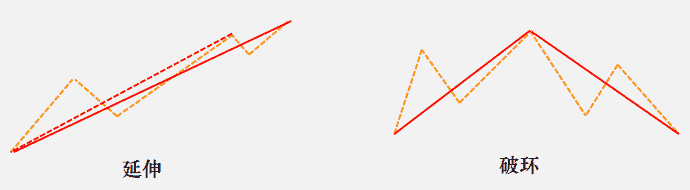
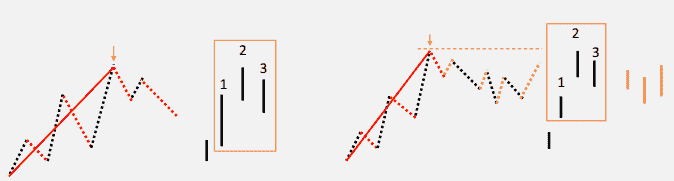

# 【量化缠论】系列文章（一）

> 原文：[`mp.weixin.qq.com/s?__biz=MzAxNTc0Mjg0Mg==&mid=2653283801&idx=1&sn=0a05bb0247535a118183be2b917c56b4&chksm=802e27ccb759aedaadb0f111206b14b5127a7677461608cdf57aa152611f258c34386376f2af&scene=27#wechat_redirect`](http://mp.weixin.qq.com/s?__biz=MzAxNTc0Mjg0Mg==&mid=2653283801&idx=1&sn=0a05bb0247535a118183be2b917c56b4&chksm=802e27ccb759aedaadb0f111206b14b5127a7677461608cdf57aa152611f258c34386376f2af&scene=27#wechat_redirect)

> ********查看之前文章请点击右上角********，关注并且******查看历史消息**************所有文章全部分类和整理，让您更方便查找阅读。请在页面菜单里查找。********

此前大家对缠论的文章呼声很高，因此想做一个系列，来系统的介绍一下。但是在写之前笔者有几句话想说：**用缠论作为构建技术分析系统是很好的，但不要太执拗其中，任何理论都有其优点与不足，我们要辩证的看待问题。希望大家能从中学到有用的知识，理性对待缠论。**

注明：本期我们基于国信证的券报告来分析。

**一． 缠论理论体系梳理及精髓解读** **1.1 K 线包含处理目的：清洗 K 线数据，识别顶底分型** 相邻两 K 线可能出现包含关系（ 注： K 线包含影线，且不分阴阳线）

 

 

**1.2 分型：对局部高低点的识别（ K 线已经过包含处理）** 

 

**1.3 笔：对阶段性高低点的识别（ K 线已经过包含处理）**

两个相邻的顶和底，并且顶分型和底分型之间至少有一根独立的 K 线，这就构成一笔，笔从其构成的 K 线走向看分为向上笔和向下笔。

 

将 K 线图的分型按照一顶一低交替出现的方式进行笔的连接，遇到连续两
个分型是同类分型时，笔将延伸， 忽略前面出现的，连接后面出现的分型。

**1.4 线段：** 

**** 

连续的三笔之间若存在重叠部分，其起点和终点之间的连线为线段。
同样，线段依据走势分为向上线段和向下线段。

 

线段产生以后，若不在相反方向产生新线段，那么这个线段在同方向上继续延伸，否则称为线段被线段破环。 

 

•  向上线段用笔的序列表示成： S1X1S2X2…Sn。反向往下运动的笔序列 X1X2…Xn 称
  之为向上线段的特征序列， 同理 S1S2…Sn 序列称为向下线段的特征序列。

•  特征序列两相邻元素之间没有重叠的区间，称为序列的缺口。
•  对于特征序列，将每一元素看成一 K 线，也存在所谓的包含关系，也可以对此进行 K 线
  合并处理。经过处理的特征序列，称为标准特征序列。

 

准特征序列分型中，第一二元素无缺口
• 向上线段出现顶分型，线段结束于该顶分型的顶
• 向下线段出现底分型，线段结束于该底分型的底 

标准特征序列分型中，第一二元素存在缺口
• 向上线段出现顶分型，如果从该分型最高点开始的向下一笔开始的序列的特征序列出现底      分型，并且在完成底分型前不破顶分型最高点，那么该线段在该顶分型的高点处结束
• 向下线段同理 

**1.5 中枢**

 

•  某级别走势类型中，被至少三个连续次级别走势类型所重叠的部分称为**中枢**。向上走势 考察下上下…的次级别，向下走势考察下上下…的次级别。
•  对上升的线段，取其回撤构成中枢，对下降的线段，取其回升构成中枢。
•  中枢三种生长方式： 新生（前后两个中枢波动区间无重合）， 延伸（前后两个中枢中枢 区间重合）， 扩展（前后两个中枢中枢区间无重合，波动区间有重合）。

 

根据中枢的相对位置关系和数量，可将走势类型分为两类：
•  一个已完成的走势类型若只包含一个中枢，称其为盘整。
•  一个已完成的走势类型若包含两个以上的同向中枢，称其为趋势。中枢依次向上且波
动区间无重合，为上涨趋势；中枢依次向下且波动区间无重合，为下降趋势。

 

背驰：是指围绕同一中枢的前后两个次级别波动，后面的力度弱于前面。力度有多种衡量方式，缠论中用 MACD， MACD 又有三种标准（红绿柱子面积/红绿柱子高度/黄白线高度）。 

趋势背驰：趋势的最后一个中枢前后两个次级别波动，必须创新高/新低。例如， b 段对应
的 MACD 柱子面积（向上看红柱子，向下看绿柱子）比 a 段对应的面积小,且 b 段创新高，这
就构成标准的趋势背驰。 

盘整背驰：与趋势背驰类似，但定义相对宽松。 通常比较的是同向的相邻两个次级别波动，并且不需要考虑是否创新高/低。

**1.7 三类买卖点**

**** 

•  第一类买卖点由趋势背驰产生，第一类买卖点出现意味着原走势终结。
•  第二类买卖点出现在第一类买卖点之后，如果走势不创新低新高或者新低新高之后盘整背驰，都构成第二类买卖点。
•  第三类买卖点出现在最近的一个同级别中枢之上/之下，如果次级别离开后次级别回抽，回不到最近的一个同级别中枢中，则构成第三类买卖点，意味着中枢的新生或者中枢级别的扩展。

每周都有好吃的

赞赏我们吧

听说，置顶关注我们的人都不一般

****

**后台回复下列关键字**

**更多惊喜在等着****你** **【区分大小写】**  

**1.回复****每周论文** [**获取 Market Making 论文分享**](http://mp.weixin.qq.com/s?__biz=MzAxNTc0Mjg0Mg==&mid=2653283381&idx=1&sn=48ec361d5b5a0e86e7749ff100a1f335&scene=21#wechat_redirect)

**2\. 回复****matlab 量化投资** **[**获取大量源码**](http://mp.weixin.qq.com/s?__biz=MzAxNTc0Mjg0Mg==&mid=2653283293&idx=1&sn=7c26d2958d1a463686b2600c69bd9bff&scene=21#wechat_redirect)**

****3\. 回复****每周书籍**[**获取国外书籍电子版**](http://mp.weixin.qq.com/s?__biz=MzAxNTc0Mjg0Mg==&mid=2653283159&idx=1&sn=2b5ff2017cabafc48fd3497ae5efa58c&scene=21#wechat_redirect)**

******4\.** **回复******文本挖掘**** ****[**获取关于文本挖掘的资料**](http://mp.weixin.qq.com/s?__biz=MzAxNTc0Mjg0Mg==&mid=2653283053&idx=1&sn=1d17fbc17545e561be0664af78304a67&scene=21#wechat_redirect)********

************5\. 回复******金融数学**** ****[**获取金融数学藏书**](http://mp.weixin.qq.com/s?__biz=MzAxNTc0Mjg0Mg==&mid=403111936&idx=4&sn=97822bfa300f3d856d6c9acd8dc24914&scene=21#wechat_redirect)**************

**********6\. 回复******贝叶斯 Matlab********[**获取 NBM 详解与具体应用**](http://mp.weixin.qq.com/s?__biz=MzAxNTc0Mjg0Mg==&mid=401834925&idx=1&sn=d56246158c1002b2330a7c26fd401db6&scene=21#wechat_redirect)************

************7.回复****AdaBoost******[获取 AdaBoost 算法文献、代码、研报](http://mp.weixin.qq.com/s?__biz=MzAxNTc0Mjg0Mg==&mid=2653283387&idx=1&sn=d40b3a1ea73e3d85c124b5b1e4f3057b&scene=21#wechat_redirect)**************

**********8.回复****数据包络分析** **获取****[选股分析](http://mp.weixin.qq.com/s?__biz=MzAxNTc0Mjg0Mg==&mid=2653283401&idx=1&sn=fae6d0c0638174bb713952e6af983c54&scene=21#wechat_redirect)源码**********

********9.回复****SVD** **获取数据预处理之图像处理的方法********

********10.回复 KNN 获取****[kNN-最近邻居算法](http://mp.weixin.qq.com/s?__biz=MzAxNTc0Mjg0Mg==&mid=2653283706&idx=1&sn=45ee21fda90a82a4692eb1aff62ec492&scene=21#wechat_redirect)********