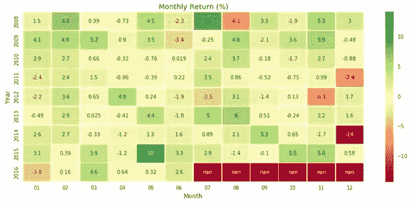
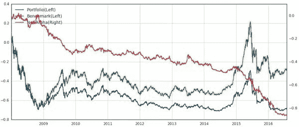

# 【量化重磅】Smart Beta 洪荒之力全解析

> 原文：[`mp.weixin.qq.com/s?__biz=MzAxNTc0Mjg0Mg==&mid=2653283784&idx=1&sn=3526d5b68126749d17b196e9c962f036&chksm=802e27ddb759aecb03a770e6a627d357a9c6c3e849fdfc61d7a5a4c19c3332d522efbef1dc97&scene=27#wechat_redirect`](http://mp.weixin.qq.com/s?__biz=MzAxNTc0Mjg0Mg==&mid=2653283784&idx=1&sn=3526d5b68126749d17b196e9c962f036&chksm=802e27ddb759aecb03a770e6a627d357a9c6c3e849fdfc61d7a5a4c19c3332d522efbef1dc97&scene=27#wechat_redirect)

感谢**【优矿社区】**与**【量化投资与机器学习】**公众号进行友好合作。

<main class="main-container ng-scope" ng-view="" style="min-height: 660px; color: rgb(51, 51, 51); font-family: -apple-system, 'Helvetica Neue', Arial, 'PingFang SC', 'Hiragino Sans GB', 'Microsoft YaHei', 'WenQuanYi Micro Hei', sans-serif; line-height: 16px; white-space: normal;">

本文从权重优化的角度来实证 Smart Beta 组合在 A 股市场上的效果，在以上证 50 指数 为基准的例子中，几种不同的 Smart Beta 配权方式，包括等权组合（Equal Weight）、最小方差组合（Minimum Variance）、风险平价组合（Risk Parity）、最大多元化组合（Maximum Diversification），均取得了高于基准指数的收益风险比表现。此外，四种构建组合的方式均 有各自的特点，对于低风险偏好的投资者来说，最小方差组合、等权组合和风险平价组合 是其可选的方案，对于稍高风险的投资者来说，最大多元化组合是个不错的选择。

随后，本文从风险因子的视角来实证 Smart Beta 组合，分别从价值、成长、质量、股息、规模和动量这六类最基本的风险因子来构建组合，回测组合从 2008 年 1 月 1 日以来相对基准的表现。实证结果显示，六类风险因子组合均取得了高于基准的超额收益，在没有任何主观择时的情况下，风险因子组合均表现得比基准指数 Smart。

最后，结合六类风险因子组合各自的表现，将 2008 年 1 月 1 日以来的市场表现划分为 牛市、熊市、震荡市三种不同的市场环境，并详细分析了在不同市场环境下各类风险因子 表现的差异。研究发现，在牛市中，价值、规模和动量因子表现较为优异；在熊市中，价 值、股息和质量因子表现较好；而在震荡市中，规模、动量和成长因子表现较好，分辨这 些基本风险因子分别适合什么样的市场环境对指导我们投资具有重大的价值。

## 1 Smart Beta 简介

众所周知，Beta 在资本资产定价模型中代表单个资产或者投资组合相对整个市场组合 的波动程度，Beta 值越大，代表着相比市场组合波动程度也越大。那么何为 Smart Beta 呢， 简单来讲就是如何更加聪明的构建投资组合。目前市场上对于 Smart Beta 的定义可以从两个 方面入手，一方面是从优化权重算法的角度，另一方面是从组合收益来源的角度，也就是从风险因子的角度。权重优化比较简单，构建组合时和基准指数成分股保持一致，但是成分股的配置权重有差异，比如常见的沪深 300 指数更偏向于市值加权，一种聪明的做法可能就是采用等权处理。组合收益来源更多则从风险角度入手，一般认为股票收益来源由众多风险因子所解释，比如市值、估值、成长性等，从这些风险因子的角度入手构建组合便是 Smart Beta 的另一种途径，比如可以通过选择特定股票使组合完全暴露于某一风险因子，以期能获取对 应的风险溢价。

上述 Smart Beta 的两种方式都不提倡主动择时，高透明性、严格的纪律性是其投资特点， 这使得其在国外非常的流行，尤其是在被动投资领域，比如在全球范围内仅交易所交易产品 的总规模就超过 4970 亿美元。在我国，市场参与者还是以散户为主，大部分人的投资理念 还停留在投机交易，这使得被动投资理念在国内被接收的程度不高，对应的相关投资研究和 投资产品也比较匮乏。本文从此入手，结合我国市场实际情况，一方面，将 Smart Beta 的上 述两种投资模式在 A 股市场进行实证研究，另一方面，将市场周期和 Smart Beta 结合起来， 研究在不同市场环境下各风险因子组合表现的差异。

## 2 权重优化下的 Smart Beta

在满足资本资产定价模型假设的情况下，理性的投资者持有的风险资产必须是整个市场组合，在实际中整个市场组合通常用某个具有代表性的市场指数代替，比如 A 股的沪深 300 指数。这种投资理念深受被动投资者喜爱，因为实际中他们就是根据沪深 300 各成分股的权 重来对应着买卖，但市场指数的编制是否合理却很少有人问津过。通常情况下市场指数都是按照市值加权来构建组合，比如沪深 300 指数，先根据一定的条件挑选出 300 个成分股，然 后主要根据 300 个成分股的总市值来确定各自的权重，总市值大的对应的权重也高。Smart Beta 打破这种局限，还是以这 300 个成分股为基础，但是成分股的权重选取用其他方法来确定，以期达到构建的组合比传统的沪深 300 指数要“聪明”些。常见的几种权重优化方式 有等权重加权（Equal Weight）、风险平价加权（Risk Parity）、最小方差加权（Minimum Variance） 和最大多元化加权（Maximum Diversification），下面先对各种权重配置的理论算法做简单介绍，然后以上证 50 指数为例做实证分析。

2.1 等权重

等权重的做法比较简单，认为组合中每个股票具有同等的重要性，假设组合中股票个数 为 *N*，则组合中个股权重如下式所示：

一般来说，等权重构建的组合表现不会太差，又因为其算法简单，所以这种加权方式被大家广泛所使用。

2.2 风险平价

风险评价英文表述为 Risk Parity，不同的使用者对其可能有不同的中文翻译，另外，风 险平价又可以细分为考虑协方差的风险平价和不考虑协方差的风险平价。鉴于考虑协方差风险平价是不考虑协方差风险平价的衍生版本，本文只重点分析考虑协方差情况下的风险平价权重配置方案。

风险平价的构建思想非常简单，保证股票组合中所有成分股对于组合的整体风险贡献都 一样，这样的好处是组合的整体风险不会偏向单个股票，从大类资产配置的角度去看的话就是保证各大类资产对整体组合的风险贡献都一致，这样组合就不会因为某个大类资产表现 太差而出现较大回撤。假设成分股权重为 w ，成分股之间的方差协方差矩阵为 Ω，那么组合的风险（标准差）可以表示为下式：

上式对 w 求导，再经过简单的数学变换可以得到各成分股的风险分配额为 *w**i *(Ωw)*i *， 所以风险评价下的权重求解就可以变为如下的优化问题：

在实际应用中，只需估算出成分股的方差协方差矩阵便可以得到优化后的权重，在本节实证分析部分将以上证 50 指数为例进行实例分析。

2.3 最小方差

最小方差的优化方法也比较直观，算是马科维茨均值方差优化的简化版。马科维茨均值 方差优化算是组合构建过程中的经典方法，但其有个缺点是优化的结果对预期收益率非常敏 感，而预期收益率也是最具有不确定性的。为此，很多学者在实践中放弃使用预期收益率，在优化过程中只关注组合整体风险，那么均值方差优化问题就变为简单的最小化组合方差问题。假设 Ω为组合成分股的方差协方差矩阵，那么组合风险就可以表示为 ，最小化组合方差问题就可以表述为如下优化问题：

引入拉格朗日乘子，易求得最优权重的封闭解表达式，如下所示：

2.4 最大多元化

最大多元化的思想也比较好理解，这里先直接给出计算公式，再做说明。同样假设组合 各成分股的方差协方差矩阵为 Ω，各成分股的标准差为 σ，那么最大多元化权重可以表示为如下的优化问题：

上述目标函数分母为组合风险，分子为各成分股的波动率加权求和，因为组合的预期收益率等于各成分股预期收益率的加权求和，但各成分股的标准差加权求和值在绝大多数情况 下不等于组合的标准差，这里目标函数的构建方法不妨理解为组合风险被分解的比率。从上式容易看出，当资产预期收益率与其波动率成正比时，最大多元化就等价于最大夏普比；同 时，当所有资产波动率都相等的话，最大多元化又等同于最小方差。和最小方差相比，这里 站在最大化组合风险分散程度的角度来衡量，而最小方差站在组合方差绝对值最小的角度来 考虑。

2.5 实证分析

如上介绍了四种从权重优化的角度来构建组合的 Smart 方式，这些在国外非常成熟的方法在国内表现如何呢？带着这个疑问与好奇，本文以上证 50 指数为例，从 2006 年 1 月 1 日至今，每隔三个月调仓一次，看各种组合的构建方式是否真的比基准 Smart2。随后从年化 收益率、年化标准差、夏普比率、最大回撤等角度来综合对比分析几种构建组合方式的差异 以及优缺点。下面首先展示从 2006 年 1 月 1 日至今不同权重优化下组合的收益表现，如下图所示。

图 1 不同权重优化视角下的组合累计收益表现

如上图所示，仅从累计收益率来看，四种优化方式均优于基准指数。同时可以看到，最 大多元化体现了高收益高波动性的特征，与之相反，最小方差组合表现了极强的稳定性，但 同时其收益表现也显得一般。下面从各项常见评价指标来更细致的分析各组合的表现。

如上所示，四种不同权重优化视角下组合的夏普比均高于上证 50 指数，确实说明这些组合相比基准要显得 Smart 些。从收益角度来看最大多元化表现最优，但同时风险也最高， 年化标准差高达 35.8%，最大回撤高达 35.8%，这两项在所有组合中均是最高的。另外可以 看到，风险平价和等权组合表现比较一致，综合考量两者的收益风险比是最高的，分别为 0.572 和 0.571。这一点也很好理解，Risk Parity 在构建组合时保证每个资产对于组合的风险 贡献都相等，所以优化出来的结果和等权差异不大，但对于最小方差和最大多元化组合，优化出来的组合有效持仓多半不足 50 只股票，这也导致其风险程度相比其他组合要大一些。同时，正因为成分股的频繁变动，也导致最小方差和最大多元化组合的换手率较高，年化换 手率高达 354.3%和 317.7%。

整体上来说，从风险收益比角度来衡量，四种权重优化下的组合均优于基准指数，同时四种构建组合的方式均有各自的特点，对于低风险偏好的投资者来说，最小方差组合、等权组合和风险评价组合是其可选的方案，对于稍高风险的投资者来说，最大多元化组合是个不 错的选择。

## 3 风险因子下的 smart beta

尽管不同权重优化视角下的组合确实显得比基准指数要 Smart 些，但聪明的投资者绝不 仅满足于此，于是就诞生了风险因子视角下的 Smart Beta，同样希望构建的组合比基准要聪 明些。从资本资产定价模型到 Fama-French 三因子再到结构化风险模型（Barra、Axioma、 Northfield），投资者对于股票收益的来源越来越清晰，组合在某段时间表现优异很大概率就 是对某个特定风险因子的暴露，比如在 A 股市场等权构建的沪深 300 组合比真实的沪深 300 指数表现要好，一个很重要的原因是 A 股市场规模因子效应特别明显，长期来看小盘股相 比大盘股有明显的超额收益。这样我们对组合的认识可以上升到因子层面，就可以选择特定 证券使组合盯住某一特定的风险因子，这便是 Smart Beta 的另一种思路。

从因子的角度构建组合最重要的一点莫过于因子的选取，尽管结构化风险模型发展至今 已经非常的完备，但针对任何一个市场依然不能称之完美。本文作为 Smart Beta 研究的一个 范本，所选取的因子至少在现在看来均是在学界或者业界得到普遍认可的，比如价值、动量、 质量等；而对于这些因子的构建细节尽管市面上有很多版本，我们也尽量采用最通用的方式， 不做过多的优化以尽量保证因子的“原滋原味”。

接下来将对这些公认的风险因子进行单一分析，每个因子分析都通过构建 Smart 组合使 其尽量仅暴露于该因子，从历史表现来分析这些从因子角度构建的组合是否足够聪明。这里 需要强调一点的是，根据 Smart Beta 定义理想的构建组合的方式是使组合仅暴露于某个风险 因子，而对其他风险因子暴露为零，这一点在实际处理中会遇到些困难，主要在于所有的这 些被公认的风险因子之间本身存在着某种相关性，比如动量因子和价值因子之间就存在着明 显的负相关性，所以我们的处理是使其“尽量”暴露于某个风险因子。另外，鉴于规模因子 在我国市场上表现得格外显眼，在构建组合时我们采用流通市值加权以尽量减少规模因子对 其他因子的影响 3。

最后，将组合构建中的一些细节总结如下 4：

*   回测区间从 2008 年 1 月 1 日至 2016 年 7 月 28 日

*   股票池为中证 800 指数动态成分股

*   调仓频率为每两周调仓一次，每周第一个交易日调仓

*   组合经过市场中性化处理，且选股比例为 20%（800 只里挑选出 160 只）

3.1 价值

价值因子着眼于价值被低估的股票，价值的低估或者高估通常用股票的总市值和某个财报科目相除得到的指标来衡量，比如经常选用的财报指标有账面价值、净利润、销售额、经营活动产生的现金流量净额等，这样就构建了常见的市净率、市盈率、市销率、市现率等估值指标。在很多经典的文献中都有对价值因子相关的探讨，比如 Fama-French 三因子模型就将其作为解释股票收益来的重要因子之一，并认为低估值组合相比高估值组合能够带来超额 收益。我们这里对于价值因子的构建也采用最通用的方法，仅用到优矿因子库中的市盈率和市净率两个因子指标 5，等权合成，回测结果如下图所示。

图 2 价值因子回测表现

如上图所示，价值因子在 A 股市场具有非常明显的超额收益，整体呈上升趋势，回测 期间累计超额收益率高达 80%。另外，可以明显看到，价值因子在趋势市场表现尤为优异，而在震荡市表现则比较一般。一个比较好的解释是我国市场的实际情况，在牛市时消灭低估 值股票而在熊市时抱团取暖低估值股票，因而呈现出在趋势市时低估值股票相比高估值股票 具有明显的超额收益。这种横跨牛熊市场的回测分析可以让我们对因子的表现有一个更深层 次的了解，作为第一个 Smart 单因子，这里只简单提一下不同时段因子表现分析，在本篇下 一部分将重点讨论六个基本风险因子在不同市场环境下的表现分析。另外，正如本文前面提 到的，构建组合时只是尽量保证组合仅暴露于价值因子，但组合收益和风险的来源肯定也逃 不了其他因子的干预；限于本文的写作重点和内容连贯性，风险收益的归因部分将不再本篇 单独提出，后续文章将详细介绍如何在优矿上轻松实现自定义风险模型、以及如何轻松进行 单因子分析，比如常见的收益归因、风险归因、因子分组表现、因子 decay 表现，还有一些 诸如因子不同市场环境表现、因子特殊市场时段表现、因子月历分析等非常有趣且有价值的 功能。

3.2 成长

成长因子专注于选取具有高成长性的公司，成长性经常由诸如净利润增长率、总资产增 长率和销售收入增长率来衡量。一般来说，成长性投资者通过股票利得而不是股息来获取收 益。关于投资高成长性股票的支撑者当属 Thomas Rowe Price，其被认为是成长投资之父，他认为企业会经历成长、维持和衰退这样的生命周期，而最佳的投资时期就是公司处于成长期时，此时公司规模不大但盈利水平呈现长期增长状态，但这时公司的股价也一般呈上涨趋势，因而风险性相对价值股来说会大一些。在本文中，用到了 5 年收益增长率(EGRO)因子来 代表长期增长水平，同时从规模增长和盈利增长两个角度来刻画成长性。为此我们选用 5 年收益增长率、净资产增长率、归属于母公司所有者净利润增长率这三个因子来构建成长性 风险因子，同样等权处理，具体的回测结果如下。

图 3 成长因子回测表现

如上图所示，成长性因子相比基准也显示出了足够的 Smart，回测期间累计超额收益高 达近 40%。另外，可以看到成长因子在趋势市场表现一般，但在震荡市表现却非常优异，这 一点正好前面的价值因子情况相反。而这也是我们非常乐意看到的一种情况，搞清楚各个风 险因子在不同市场环境下的表现对提高组合表现是非常有价值的。

3.3 质量

质量因子试图寻找“高质量”的公司来获取超额收益，但和其他因子不一样，对于“高质 量”的定义目前还没有达到完全的统一。比如从包含广泛的“令公司有价值的特征”(Asness、 Frazzini 和 Pedersen, 2013)到更精确的“盈利稳定且盈利较高，同时债务较低”(Calvert, 2012)， 都存在一定的质疑。因此，对于高质量公司的评价多半都会涉及一些投资经理的主观因素在 里面。但尽管如此，高质量公司还是具有某些共性。从最宽泛的角度来讲，这些公司应该有 较好的盈利、现金流充裕、具有竞争力、透明度高且具有清晰的股权结构来融资发展。为此， 对于质量因子的构建我们也是从多方面入手，从常见的财务分析角度入手，综合公司的偿债 能力、资本结构、盈利能力和营运状况等方面来衡量一个公司的质量，所选取的因子包括流 动比率、营业利润率、权益收益率和总资产周转率，和前面一样，等权处理构建质量因子， 回测结果详见下图。

图 4 质量因子回测表现

回测结果和预想中的不大一样，质量因子在回测期间的表现并不是很好，整体的超额收 益也只有 15%，在所选的 6 个风险因子里表现是最差的，这一点和最开始的直观感觉是相违 背的。另外值得关注的一点是，在 2014 年下半年至 2015 年上半年的大牛市中，质量因子 出现了非常大的回撤，这一点或许在 A 股市场非常贴切，因为刚过去的这一波牛市以沪港 通的券商为发起点，随后便由一带一路、国企改革等概念股接过涨幅，但涨幅惊人的这些诸 如钢铁、煤炭、军工等大国企经营效益并不好，在经济放缓去产能背景下这些企业净利润甚 至是负的，导致质量因子出现明显回撤也自然不足为奇。

3.4 股息

从更广泛的意义来讲，股息因子也可以归为价值因子，有时候就是将个股分红率作为一 项估值指标。与常见的估值指标不同的是，高分红率意味着额外且稳定的现金流收入，这对 于偏好现金流的投资者来说是个不错的选择。对于股息因子的处理，我们综合考虑短期分红 和长期稳健分红两个方面，分别对应的因子指标是现金流市值比(CTOP)和 5 年平均现金流市 值比(CTP5)，然后等权处理构建股息因子，其回测结果如下所示。

图 5 股息因子回测表现

从上图可以看到，股息因子表现非常优异，能够长期持续稳定的带来超额收益，整个回 测期间累计超额收益高达 50%。此外，股息因子表现也非常的稳健，尤其是在熊市时，比如 在 2008 年和 2015 年，股息因子都能明显的获得比较高的超额收益，真正能够做到穿越牛 熊，这一点和前面介绍的价值因子非常类似。这一点也和一般的逻辑思维一致，在熊市中， 低估值、高股息的蓝筹股永远是市场的香饽饽。结合当下的市场环境，市场取向好像也正演 绎着低估值、高股息的故事。

3.5 规模

早在上世纪 90 年代，Fama-French 就在其论文中提出，公司规模是股票收益来源的一个 重要因素，并且指出长期来看低市值股票相比高市值股票具有更高的收益。后来，各类结构 化风险模型更是在股票总市值上做大文章，将对数总市值和非线性总市值均作为股票收益来 源的风险因子，足以可见规模因子的重要性。在我国，规模因子更是神奇，在美国市场上典 型的风险因子在 A 股市场却是高信息比的 Alpha 因子。这里仅展示一个数据，2010 年 5 月 31 日至今，代表小盘股的创业板指数累计涨幅达 125%，而同期沪深 300 指数累计涨幅仅 16.3%，巨大的差异足以说明规模因子在 A 股市场的显著性。回到本部分最开始的地方，正 因为规模因子在我国市场上超额收益比较显著，为了在分析其他因子时尽量“隔离”规模因 子的影响，所以我们构建组合时使用的是按流通市值进行加权。当然，在本小结单独分析规 模因子时，还是回到最通用的等权处理方式，这里仅用对数总市值这个单因子指标。最后， 得到的规模因子回测结果如下所示。

图 6 规模因子回测表现

如前面描述，从收益上来讲规模因子完全可以“秒杀”另外 5 个风险因子，回测期间累 计超额收益高达 120%，年化超额收益更是高达 12.6%，若不考虑贴水，仅用规模因子就可 以实现每年平均 12.6%的绝对收益！但规模因子也有不足之处，其收益表现也并不是“一帆 风顺”，在 2014 年 12 月随着大盘股的强势崛起，小盘股遭遇了滑铁卢，这一点也给投机小 盘股的投资者提了个醒，没有哪个因子能在任何时候都能跑赢市场。另外关于规模因子有个非常有趣的现象，就是每到年末小盘股因子都会表现得低于平均水平，同时在年初又有着非 常不错的表现，从下图上很直观的可以看到，在 2009 年、2010 年、2011 年、2014 年年末 规模因子累计超额收益均出现了不同程度的回测，而在每年的 2 月份，规模因子的表现都是 非常不错的。这一点正是在介绍价值因子里提到的因子月历效应分析，我们可以在优矿上非 常方便的得到这个分析结果 6。作为一个简单样例，这里也展示下规模因子的月历效应分析 图。

图 7 规模因子月历效应分析

3.6 动量

动量因子相对比较容易理解，这也是趋势交易者常关注的因子之一，他们认为强者恒强、 弱者恒弱。研究表明，动量效应在不同地区和不同时期都是持续存在的。Jogadeesh 和 Titman(1993)发现在 1965 年至 1989 年的美国市场，动量策略获得了非常具有吸引力的收益。 Fama 和 French(2012)对 1989 年至 2011 年的亚太地区、北美和欧洲都进行了研究，也得到 了类似的结论。实证研究普遍认为，动量因子在较短的时间内非常值得关注，尤其是 3 到 12 个月，往后动量效应会逐渐消失，股票表现会恢复到长期均值水平(Asness, 1997)。在本 文的研究中，采用短期动量和长期动量来合成动量因子，根据我们的直观假设这里先默认动 量因子具有正向效果 7（即构建组合时选取动量排名前 20%的股票），回测结果如下所示

图 8 动量因子回测表现

回测结果和我们的直观感觉完全相反，动量因子在 A 股市场上反转效应更加明显。简单来说就是，在前期涨幅较高的个股在接下来的短时间内出现回调的概率非常高，从操作上来说就是抄底优于追涨。带着好奇，我们将前面的动量因子以反转因子来处理，得到了新的回测效果如下。

图 9 反转因子回测表现

可以看到，反转因子在 A 股市场能够长期稳健的获取超额收益，回测期间累计超额收 益高达 70%。同时和上述动量因子形成了鲜明的对比，从侧面验证了动量因子的分组表现 8 非 常符合预期，短期来看，在 A 股市场确实存在稳定的反转效应。

如上我们可以看到，风险因子视角下的 Smart Beta 确实取得了不错的成绩，上述最通用 的 6 类风险因子均取了相比基准指数不同程度的超额收益，同时需要注意到，上述的组合构 建均没有主观择时因素在里面，完全了体现了 Smart Beta 的特性。总的来看，对于不同风险偏好的投资者，风险因子视角下的投资组合是个不错的选择。但这里又留给我们一些疑问，结构化风险模型已经将股票收益的来源解释的非常清楚，既然我们能够识别很多已知的风险，为何不利用起来呢？比如最具代表性的规模因子，既然已经知道了小盘股长期来看比大盘股 具有超额收益，那么为什么不按照前述规模因子回测来构建组合呢？一个很重要的原因是不 同时间段市场的风格偏向不同，另外历史结果也不代表着未来情况，投资者可能无法承受长 期不盈利或者出现较大回撤的情况。为此，分析上述不同风格因子在不同市场环境下的表现 差异显得非常重要，这也是本文接下来的分析重点。

## 4 市场周期下的因子表现

如前文描述，以风险因子的角度构建组合长期来看会显得更加 Smart，但是不管是哪一 类风险因子都不可能时时刻刻跑赢市场。在 A 股市场表现最好的规模因子来看，在 2014 年 12 月也发生了黑天鹅事件，因子组合超额收益发生了明显的回撤。基于此，有必要对这些 有代表性的风险因子进行市场周期分析，即在不同市场环境下因子表现的差异，这对我们更 加深入了解因子的有效性以及适用市场环境是非常有帮助的。作为此类分析的一个范例，这里仅根据市场最常见的三种市场状态来划分市场周期，即 熊市、牛市、震荡市，市场选用之前定义的指数基准中证 800 指数，时间段也完全和之前定义的因子回测区间一致。这里需要解释一下，尽管我们是从事后人的角度来划分市场周期，存在使用未来信息的情形，但从现实中可以看到，对于大市场周期的定义通常存在某些共识，另外市场周期的时间跨度都比较长，偏离一两个月其实影响并不大。这里的重点在于分析在 不同市场环境下各因子的表现，最后以中证 800 指数划分的市场周期图如下所示。

图 10 中证 800 指数市场周期划分图

划分好市场周期之后，结合前面的单风险因子分析，分别统计各风险因子在不同市场环 境下的累计超额收益，最后将结果汇总到牛市、熊市、震荡市三个维度，从这三个不同的市 场维度看各风险因子的累计超额收益表现，具体结果如下表所示。

从上表可以看出，各风险因子在不同市场环境下表现差异确实很大，比如成长性因子在

牛市下面市表现一般，但在震荡市中表现尤其突出，而这一点也正好反应本部分内容的价值所 在，下面将对各个因子做具体分析。

价值：对价值因子而言没有过多的分析，因为价值因子可谓是穿越牛熊，低估值股票相 比高估值股票有比较稳定的超额收益。在牛市中，以“消灭低价股”为口号带来了低估值股 票的超额收益；在熊市中，抱团取暖低估值蓝筹股同样带来了超额收益。

成长：成长因子的表现情况让人异常兴奋，因为其在不同市场阶段呈现出了不同的收益 表现，这一点对于指导实盘具有非常大的价值。从数据上看，成长因子在震荡市表现异常突 出，这一点回头来看也很好解释，在指数不上不下的环境下，市场热衷于“讲故事”，那么 有高成长性的公司或许或者为故事的话题从而获得了超额收益。

质量：可以看到质量因子在除牛市阶段表现都还尚可，这一点也很直观，在牛市中高质 量的股票吸引力并不是很大，这牛市行情下更多是一种资金驱动下的普涨行情，低估值股票 潜力得到充分释放。

股息：股息因子的表现和质量因子比较类似，理解起来也比较一致，在熊市和震荡市时，高股息的股票因为稳健的经营和分红显得格外有价值，市场重心向蓝筹股转向，因而在这两 个阶段质量因子和股息因子表现突出。比如在经历过 2014~2015 年大牛市之后，股息因子 表现就异常突出。

规模：规模因子也没太多解释的，一个在 A 股市场异常“奇葩”的因子。这里提供两 个可供参考的解释，一个是 A 股的上市制度，在现行的核准制下小盘股都具有难得的壳资源，借壳上市、并购重组等话题让他们具备了异常的超额收益；另一方面是 A 股的投资者 构成，以散户为主导的 A 股市场炒作风味尤其浓厚，而小市值股票则是最优的炒作对象。 至于小盘股在未来是否还会有如此高的超额收益，本文不做主观预测，但至少在注册制推行 的情况下，小盘股的超额收益还是值得我们当心的。

动量：如前面描述，这里的动量因子应该理解为反转效应。可以看到，动量因子表现一 直都很好，尤其是在震荡市，这一点和震荡市的名称不谋而合。

不同市场环境下各风险因子的表现差异能够让我们更清楚什么时候应该偏向于什么因子，收获该收获的风险溢价，规避不该承担的风险损失。虽然历史并不代表未来，但本文从 历史中发现的规律能够指导我们在未来的决策，下面，就本部分的重要结论总结如下，以图表现形式更直观展示何时该偏向于哪种风险因子。

## 5 总结

本文首先介绍了 Smart Beta 的一些基本概念，随后从权重优化的角度来实证几种不同配 权方式在 A 股市场上的效果，在以上证 50 指数为基准的例子中，可以看到，几种不同的 SmartBeta 配权方式，包括等权组合（Equal Weight）、最小方差组合（Minimum Variance）、风险 平价组合（Risk Parity）、最大多元化组合（Maximum Diversification），均取得了高于基准指 数得收益风险比。另外，四种构建组合的方式均有各自的特点，对于低风险偏好的投资者来 说，最小方差组合、等权组合和风险评价组合是其可选的方案，对于稍高风险的投资者来说， 最大多元化组合是个不错的选择。

随后，本文从风险因子的视角来实证 Smart Beta 组合，分别从价值、成长、质量、股息、 规模和动量这六类最基本的风险因子来构建组合，回测其从 2008 年 1 月 1 日以来相对基准的表现。实证结果显示，六类风险因子组合均取得了高于基准的超额收益，在没有任何主观择时的情况下，风险因子组合均表现得比基准指数 Smart。 紧接着，我们将分析更进一步，结合六类风险因子组合各自的表现，将 2008 年 1 月 1 日以来的市场划分为牛市、熊市、震荡市，并详细分析了在不同市场环境下各类风险因子的 表现差异。研究发现，在牛市中，价值、规模和动量因子表现较为优异；在熊市中，价值、 股息和质量因子表现较好；而在震荡市中，规模、动量和成长因子表现较好，分辨这些基本 风险因子更适合什么样的市场环境对我们的实际投资具有重大的价值。

参考资料及释义：

【1】A Global Guide to Strategic-Beta Exchange Traded Products, Morningstar, September 2015.

【2】实证数据来源于通联数据商城，实证过程在优矿量化平台完成。

【3】更严谨的做法是在得到单因子组合收益后进行归因分析，细化组合风险和收益的真实来源，限于本文写作重点和内容连贯性，后续文章将重点介绍如何利用优矿量化平台轻松实现因子归因分析。

【4】更多组合构建细节参见优矿量化平台 long_only()函数说明文档。

【5】本文所有因子数据均来自于优矿量化平台，优矿提供了近 300 个因子。

【6】优矿量化平台上，只需给定收益率序列，并可得到诸如月历分析、前五大回撤分析、不同频度收益分布等实用功能。

【7】这里假设在过去一段时间内涨幅居前的股票在接下来的时间内会延续上涨的趋势。

</main>

