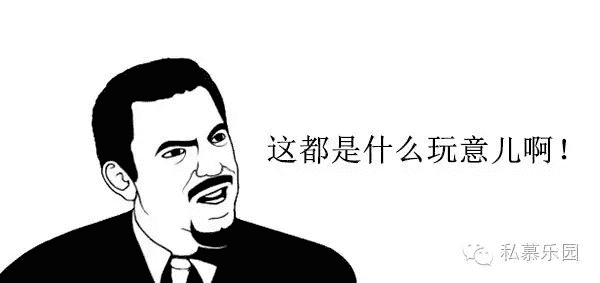
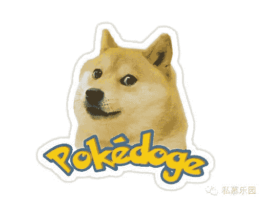
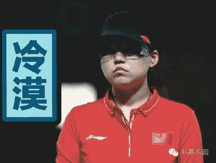
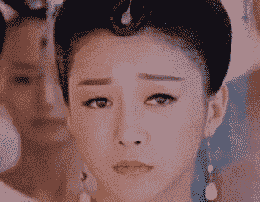
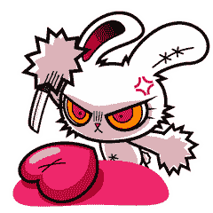
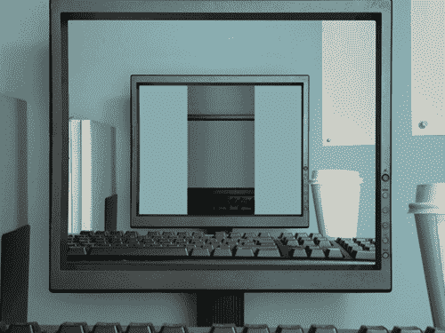
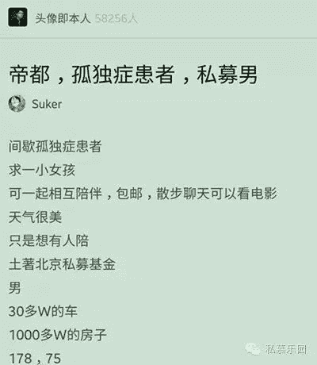
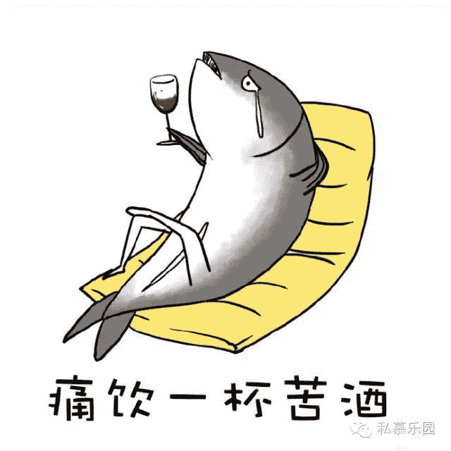

# 跟你讲个笑话，我是做私募的……

> 原文：[`mp.weixin.qq.com/s?__biz=MzAxNTc0Mjg0Mg==&mid=2653283777&idx=1&sn=252e295b1a788da1aaadf39c2ef959ee&chksm=802e27d4b759aec21eea84e0633db2f73577cf968239cba1b93538609c64d7245edae3c0c7ba&scene=27#wechat_redirect`](http://mp.weixin.qq.com/s?__biz=MzAxNTc0Mjg0Mg==&mid=2653283777&idx=1&sn=252e295b1a788da1aaadf39c2ef959ee&chksm=802e27d4b759aec21eea84e0633db2f73577cf968239cba1b93538609c64d7245edae3c0c7ba&scene=27#wechat_redirect)

感谢**【私募乐园】**与**【量化投资与机器学习】**公众号进行友好合作。

说句实在话，

当朋友圈被那篇

《跟你讲个笑话，我是创业公司 CEO》刷屏时，

小青的内心是拒绝的，我一个金融 dog，啥 CEO 没见过？
怎奈刷的朋友太多，小青实在没忍住读了一遍，自此内心激发无数回响：这样的吐槽太过瘾了！而且，创业公司 CEO 算啥，真正槽点值爆表的，应该是我们这些金融 dog，

尤其是小青这样做私募的人啊！

今天大家都很放松，小青来跟大家讲个笑话：

**我是做私募的。**

**注意！**

**前方高能！**

**如有误伤，纯属巧合。**

**关于私募是啥**“你在做什么工作啊？”每次当七大姑八大姨问起我的时候，我都会微微一笑：做金融的。为什么采用这么笼统的说法呢？因为我发现，一旦直说自己是做私募的，99%会收到如下反馈：“私募是啥呀？”“P2P 是吧？”“为什么会叫私募这么奇怪的名字？”······我不可能每次都打开百度词条，把那段释义复述一遍：**私募基金是指通过非公开方式，****面向少数投资者募集资金而设立的基金。**而比不知私募为何物更可怕的，是那些一知半解还假装懂行的人，一上来就一脸神秘，还像地下党碰头似的：“**徐翔**被抓对你们影响不大吧？”“**吴英**那事儿其实处理得还可以。”“听说**桥水基金**要来中国，怕不怕？”······你拉倒吧！徐翔做他徐翔的，影响我什么了？吴英那叫非法集资啊，知道不？桥水基金怎么了？索罗斯还天天喊着要做空中国呢？你怎么不问总理怕不怕？——人和人之间的沟通怎么这么难！**关于 100 万门槛**私募**“高收益高风险”**，这个固定属性决定了它不会成为大众情人，因此它才叫“私募”啊，上面才给设了个 100 万元的投资门槛，人人都能买那是余额宝（天弘基金），是公募啊！可就是有很多朋友聊起时，表现出了令我措不及防的反应。一类是“刮目相看”型的：“可以啊朋友，大发了，苟富贵勿相忘啊。”**——我“大发”什么了？这 100 万是客户的呀！**

举个不恰当的例子：

售楼小姐每天经手上千万的房产，她是不是早已走上人生巅峰？一类是“愤慨鄙夷”型的：“这么好的收益凭什么有钱人才能享受？鄙视你。”**——哎我冤死了，这又不是我规定的呀！**话说回来，合格投资者这个设定也不是没有道理，赚多的同时也承担着亏多的风险，**屌丝死于 P2P，土豪死于杠杆，**听说过没？还有一些实在不好归类的型，心太累我就不展开了······**关于收取费用**私募从本质上说，都是**“受人之托、代人理财”**，收点管理费什么的按理说再正常不过了。做私募的，没官家做后台，全凭基金经理死磕，而且做好了绝对能让客户大赚，收费是相对高一点，但逻辑没问题啊。然而很多人在咨询到收费时，都表现出了前所未有的惊疑：“啥？还要缴纳 1%的认购费？凭啥呀？我买你的产品是看得起你！”**——这笔钱不是我拿去花啊，**主要用于**基金的市场推广、销售、注册登记**等各项费用。“噢，还有个固定管理费，还要 1.5%-2%？你咋这么贪财呢？”**——心塞，难道我帮你打理资金不能收点辛苦费吗？**“啥啥？还有浮动管理费？看我的钱赚了你就想着多分点？”**——这浮动不是瞎浮动啊，**产品净值**创新高**后，我收这一部分的**20%**，给自己加个餐不行么·····“我想赎回还要收赎回费？！你咋不钻钱眼里去呢！”**——这个实在没商量，只要在赎回封闭期内，**想提前赎回，这叫毁约，合作中止，收点钱有问题吗？我深知只要跟钱搭上关系很多事情就会变复杂，就怕不问青红皂白（甚至不懂法）的一通怪罪。**关于家人**做私募很累的，做私募的家里人也很累。时间，时间，时间，一切问题的根源都在时间。私募基金经理每天看 10 个小时盘，**还有多少时间陪家人？**啥？你说一天只交易 4 个小时？要都跟散户一样，我们这钱从哪赚？因此私募基金经理周末更要看盘，平时盯着实时动态大脑一直活跃，只有周末才能静下心来好好研究啊！**还剩多少时间陪家人？？**当每一位私募基金经理都意识到看盘的重要性，你是不是恨不得一天有 25 个小时？**还余多少时间陪家人？？？**

不是每个人的周末都叫周末，

做私募的周末属于**复盘、周报、研报，表格、电话、交易系统····**所以在国内知名社交平台豆瓣上，才会出现这样一条红极一时的帖子：**私募男，孤独症**，这两个词就这样被放在了一起。

**关于身体健康**终于到这一 PART 了！试问哪个金融 dog 没有点颈椎病、肩周炎、掉头发、老胃病·····？做私募的更是这样！基金经理每日就是看盘、操作、总结、研判，不是**微胖**（缺乏锻炼）就是**巨瘦**（营养不良）；研究员全国各地的调研走访，上市公司那么多，水又深，**一双眼睛**不够用啊；市场奔袭千里就为了一个潜在客户（渠道），喝过**N 场酒**之后可能还会飞掉。·······这样的工作强度，这样的工作内容，很难不亚健康啊。金融行业真的高大上吗？我曾很多次对人生产生过怀疑。**关于被监管**监管！！！2016 年的主旋律！！！我心中最大的痛！！！今年心好累，基协仿佛只盯上了私募，针对私募监管的法规一部接着一部，一不留神已经有这样的量了：《私募投资基金管理人登记和基金备案办法（试行）》《私募投资基金管理人内部控制指引》《基金业务外包服务指引（试行）》《私募投资基金募集行为管理办法》《证券期货经营机构私募资产管理业务运作管理暂行规定》《私募资管备案管理规范第 1、2、3 号》······到 8 月份，全国登记在案的私募机构只剩了**16000 多家**，私募从业人员只有**27.8 万人**，你没看错，这是全国的数据！我好孤独！也因为接连出台的监管新规，现在私募机构里每个人都恨不得变成律师、会计师，好每次面对新规时不再蒙查查。可是，这怎么可能！现在连微信公众号都不敢随便推送，就怕被监管打板子。**轻则通报挂异常，****重则注销全泡汤。**给你说个笑话：我是做私募的，我因为产品资料让太多人看到而被通报。再给你说个笑话，我一同事，从业经验 10 多年，月底还要去考基金从业资格证。**关于客户**客户是电，客户是光，客户是唯一的神话，也是最霸道的大大·····由于代客理财，私募和客户之间的故事总是很容易走向**狗血**。先说牛市。哗啦啦指数一路飙升，官媒开始鼓吹：4000 点才是牛市的开始！6000 点不是梦！专业投资者这时候反而慎重，这波牛市不寻常啊，还是稳健好一点，**毕竟不能让客户担上太大风险。**——客户不这么想！“你这操作的啥呀？”“隔壁老王都赚回一辆奥迪 A8 了，我这辆奥拓算怎么回事？”“让我来，我要赎回！”**——好不容易做大的规模就这么缩了水。**再说熊市。颤巍巍指数一直磨盘，大家都意识到一种叫做**“资产荒”**的东西袭来，在干啥都不赚钱的年代，专业投资者可真是操心费力，如果能赚那最好，在保证安全的前提下赚些，如果赚不了，就保证千万别亏，如果一定是会亏，我尽最大力少亏，**毕竟客户把钱给我是信任我。**——客户不这么想！“你这啥水平呀？”“我这钱放你这儿一年了，就增加了个零头？”如果有亏损，气氛就更尴尬了：“都亏了好意思收管理费吗，你的脸可真够大的。”——可是我想说如果交给您自己来操作，**亏的可能就不是零头这么简单了啊**。 总之里外不是人，做啥都不对。做私募的人心塞啊，别被影视剧给骗了，什么金融高端人才，什么都市高级白领，在客户大大面前，就是请来帮忙打理钱财的工人。**愿全天下所有私募同行都能找到理解自己的客户。**

