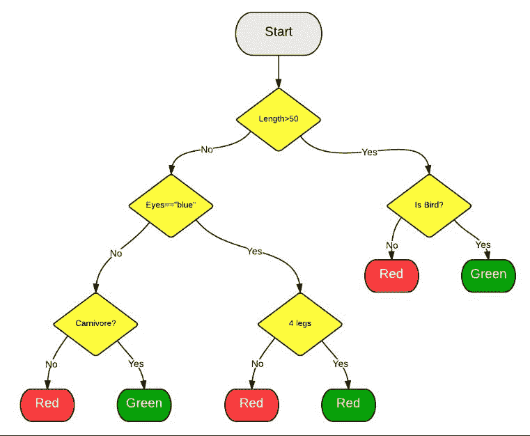
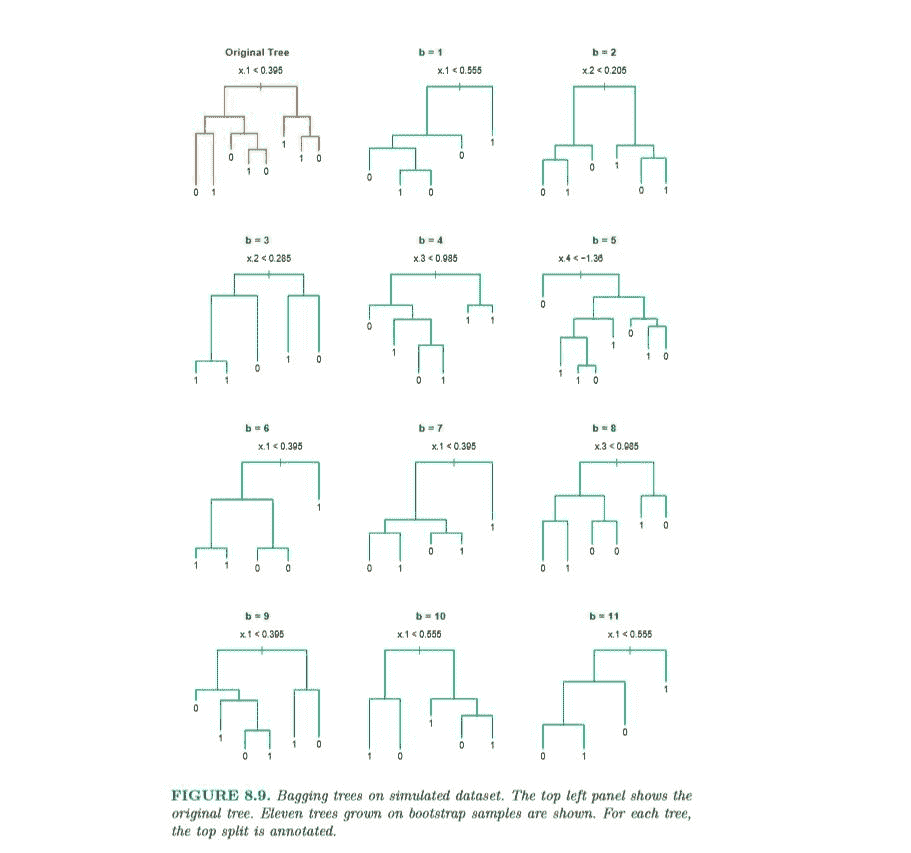

# 【量化投资策略探讨】决策树和随机森林

> 原文：[`mp.weixin.qq.com/s?__biz=MzAxNTc0Mjg0Mg==&mid=2653283764&idx=1&sn=f61f65377473e55428f9c2204d148b25&chksm=802e27a1b759aeb75032e01718b22856d476ea921d91328b1dd814364f34d1fb09fcad3f953d&scene=27#wechat_redirect`](http://mp.weixin.qq.com/s?__biz=MzAxNTc0Mjg0Mg==&mid=2653283764&idx=1&sn=f61f65377473e55428f9c2204d148b25&chksm=802e27a1b759aeb75032e01718b22856d476ea921d91328b1dd814364f34d1fb09fcad3f953d&scene=27#wechat_redirect)

> ********查看之前文章请点击右上角********，关注并且******查看历史消息**************所有文章全部分类和整理，让您更方便查找阅读。请在页面菜单里查找。********

决策树

决策树方法（decision tree）是一种代表因子值和预测值之间的一种映射关系。从决策树的“根部”往“枝叶”方向走，每路过一个节点，都会将预测值通过因子的值分类。决策树的结构如下所示：

如果我们把上图中的绿色想象成股票下跌，红色为股票上涨。同时，在每个黄色节点的分类是根据因子值阈值大小选择走左边还是右边，那么走到决策树的末端能够预测出股票的上涨与下跌。

虽然决策树能够很好的处理数据的异常值，使得极端值不会影响整个模型的构建结果，但是同样的，决策树容易出现过度拟合现象，无法正确处理噪声数值。于是，我们需要随机森林算法来改善。

Tips: 在量化预测中，由于金融市场的数据存在大量噪声，我们必须限制树的高度（即层数）防止过度拟合。当预测正确率在 70%~80%之间时，可以设定决策树的最大层数。

随机森林

“森林”即指大量的决策“树”组成了森林。随机森林的想法来自于**bootstrap aggregating (缩写为 bagging）**；即让该学习算法训练多轮，每轮的训练集由从初始的训练集中**随机**取出的 n 个训练样本组成，某个初始训练样本在某轮训练集中可以出现多次或根本不出现，训练之后可得到一个预测函数序列 h_1，⋯ ,h_n ，最终的预测函数 H 对分类问题采用投票方式，对回归问题采用简单平均方法对新示例进行判别。所以，bagging 的主要想法是平均许多噪声较多但是相对来说是无偏差性的模型，以此来降低噪声。

B = 建立的树的总棵树， T_1...T_b...T_B = 1~B 编号的树，N = 总训练样本数，Z = 抽样数，p = 总因子数，m= 抽取因子数，树的高度 = h。

**随机森林（Random Forest）的算法：**

1.  For b=1 to B;

    (a) 从训练样本总数为 N 中随机抽取样本 Z 个

    (b) 以下列三个标准来建立一棵随机森林的树 T_b，直到树的高度达到 h

    i. 从 p 个因子中随机取出 m 个因子

    ii. 找出 m 个因子中最佳的分类因子 p*

    iii. 以该因子将一个节点分成两个子节点

2.  输出树的合集{ T_1...T_b...T_B }

3.  将测试组的数据放入所有的棵树中得出 B 个预测结果，求出预测结果的平均值则为我们最后需要的预测值。

 

（图片来源：Elements of statistics 第十五章)

总结

在量化中实现随机森林算法时，建议在决策树的建立时，可以使用 python 的 sklearn。其原理设计信息熵，条件熵和信息增益等推导过程，详细可参见 http://blog.csdn.net/suipingsp/article/details/41927247 。然而，更加推荐根据上述算法过程为自己的策略量身定做。

参考资料：

兴业证券研报——万剑归宗！

Elements ofstatistics

**资料请在后台回复【决策树】进行获取**

每周都有好吃的

赞赏我们吧

听说，置顶关注我们的人都不一般

****

**后台回复下列关键字**

**更多惊喜在等着****你** **【区分大小写】**  

**1.回复****每周论文** [**获取 Market Making 论文分享**](http://mp.weixin.qq.com/s?__biz=MzAxNTc0Mjg0Mg==&mid=2653283381&idx=1&sn=48ec361d5b5a0e86e7749ff100a1f335&scene=21#wechat_redirect)

**2\. 回复****matlab 量化投资** **[**获取大量源码**](http://mp.weixin.qq.com/s?__biz=MzAxNTc0Mjg0Mg==&mid=2653283293&idx=1&sn=7c26d2958d1a463686b2600c69bd9bff&scene=21#wechat_redirect)**

****3\. 回复****每周书籍**[**获取国外书籍电子版**](http://mp.weixin.qq.com/s?__biz=MzAxNTc0Mjg0Mg==&mid=2653283159&idx=1&sn=2b5ff2017cabafc48fd3497ae5efa58c&scene=21#wechat_redirect)**

******4\.** **回复******文本挖掘**** ****[**获取关于文本挖掘的资料**](http://mp.weixin.qq.com/s?__biz=MzAxNTc0Mjg0Mg==&mid=2653283053&idx=1&sn=1d17fbc17545e561be0664af78304a67&scene=21#wechat_redirect)********

************5\. 回复******金融数学**** ****[**获取金融数学藏书**](http://mp.weixin.qq.com/s?__biz=MzAxNTc0Mjg0Mg==&mid=403111936&idx=4&sn=97822bfa300f3d856d6c9acd8dc24914&scene=21#wechat_redirect)**************

**********6\. 回复******贝叶斯 Matlab********[**获取 NBM 详解与具体应用**](http://mp.weixin.qq.com/s?__biz=MzAxNTc0Mjg0Mg==&mid=401834925&idx=1&sn=d56246158c1002b2330a7c26fd401db6&scene=21#wechat_redirect)************

************7.回复****AdaBoost******[获取 AdaBoost 算法文献、代码、研报](http://mp.weixin.qq.com/s?__biz=MzAxNTc0Mjg0Mg==&mid=2653283387&idx=1&sn=d40b3a1ea73e3d85c124b5b1e4f3057b&scene=21#wechat_redirect)**************

**********8.回复****数据包络分析** **获取****[选股分析](http://mp.weixin.qq.com/s?__biz=MzAxNTc0Mjg0Mg==&mid=2653283401&idx=1&sn=fae6d0c0638174bb713952e6af983c54&scene=21#wechat_redirect)源码**********

********9.回复****SVD** **获取数据预处理之图像处理的方法********

********10.回复 KNN 获取****[kNN-最近邻居算法](http://mp.weixin.qq.com/s?__biz=MzAxNTc0Mjg0Mg==&mid=2653283706&idx=1&sn=45ee21fda90a82a4692eb1aff62ec492&scene=21#wechat_redirect)********