# 【Python 量化投资】追踪聪明钱 - A 股市场交易的微观结构初探

> 原文：[`mp.weixin.qq.com/s?__biz=MzAxNTc0Mjg0Mg==&mid=2653283713&idx=1&sn=53f79b44eec489a71da9051e41f8d585&chksm=802e2794b759ae82ced7e2308977d678e7155a9faca5fa04dfd67cdb40324bb0bbba75d93cd4&scene=27#wechat_redirect`](http://mp.weixin.qq.com/s?__biz=MzAxNTc0Mjg0Mg==&mid=2653283713&idx=1&sn=53f79b44eec489a71da9051e41f8d585&chksm=802e2794b759ae82ced7e2308977d678e7155a9faca5fa04dfd67cdb40324bb0bbba75d93cd4&scene=27#wechat_redirect)

感谢**【优矿社区】**与**【量化投资与机器学习】**公众号进行友好合作。

导读

本文为优矿社区用户**call**创作，点击**阅读原文，查看本文高清源代码。**

# **1\. 前言**

前两天拜读了方正证券研究所的研报『跟踪聪明钱-从分钟线到选股因子』[1]，对其作者天马行空的思维所折服，想通过 uqer 平台，对其进行深入研究。在一个非完全有效的市场中，信息的传播总是一个从点到面的过程，这一过程中最先接触到信息的投资者当然具有巨大的优势，这里试图通过分钟线的交易数据来寻找这些最先接触到信息的资金的动向，这些资金我们称之为“聪明钱”。

下文中，通过定义好的聪明度指标，构造股票的聪明度因子 Q，基于此聪明度因子进行回测研究。

# **2\. 基于分钟线行情数据的聪明钱的情绪因子**

聪明钱在交易过程中，往往呈现“单笔订单数量更大，订单报价更为激进”的特征[2]，所以可以使用以下指标 S 来衡量每一分钟交易的“**聪明程度**”：

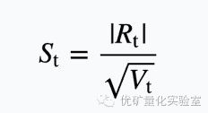

其中，Rt 为第 t 分钟的涨跌幅，Vt 为第 t 分钟的成交量。指标 St 的值越大，则表示该分钟的交易越“聪明”。借助指标 S，我们可以通过以下方法筛选聪明钱的交易：

*   对于特定股票、特定时段的所有分钟行情数据，将其按照指标 S 从大到小进行排序；

*   在按 S 排好序的分钟成交量数据中，将成交量累积占比前 20% 视为聪明钱的交易；

这一过程可以通过以下图表展示:

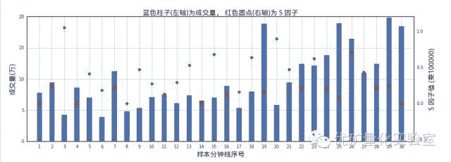

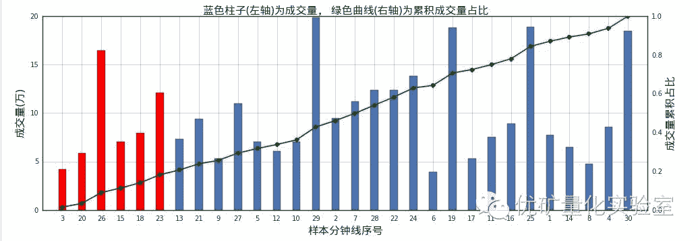 

如上所示，首先对于 30 条样本分钟线计算 S 因子(上图)；其次以 S 因子由大到小的顺序重新对这些分钟线排序，并按此顺序计算成交量累积占比(下图)，截取 S 因子最大的前 20%成交量所包含的分钟线(下图中的红色柱子)作为聪明钱。

如上划分找到聪明钱之后，我们就可以通过这些聪明钱的交易数据来构造**聪明钱的情绪因子****Q**：

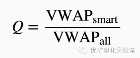 

其中，VWAPsmart 是聪明钱的成交量加权平均价，VWAPall 是所有交易的成交量加权平均价。不难看出，因子 Q 实际上反映了在该时间段中聪明钱参与交易的相对价位。之所以将其称为聪明钱的情绪因子[1]，是因为：

*   **Q****越大**，表明聪明钱的交易越倾向于出现在价格较高处，这是**逢高出货**的表现，反映了聪明钱的**悲观**态度；

*   **Q****越小**，则表明聪明钱的交易多出现在价格较低处，这是**逢低吸筹**的表现，是**乐观**的情绪。

**3\. 聪明钱情绪因子 Q 选股**  

为了进行因子回测研究，首先我们需要计算 Q 因子的历史数据：

通过以上代码，我们计算了聪明钱情绪因子 Q 的历史数据：

即在每月最后一个交易日，计算该日**前****10****日**的聪明钱情绪因子 Q；

示例数据如下：

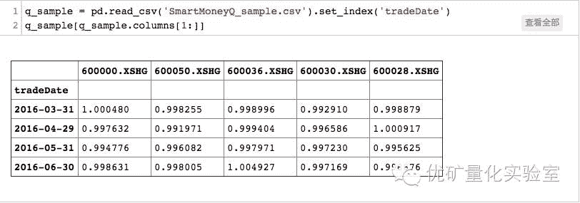

同时我们计算了的历史前瞻区间收益率（计算这个是为了下一步说明 Q 因子选股的有效性）：

*   即在每个交易日，计算该日**后****20****日**每只股票的区间收益率；

示例数据如下：

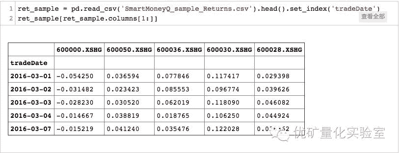

按照上述代码，笔者这里计算了 A 股股票过去四年多的月度 Q 因子和相应的前瞻收益率，并将其保存在 csv 文件中(Q 因子涉及分钟线，计算历史数据相对耗时)。

为了初窥 Q 因子对于未来股票收益的解释能力，我们此处计算 Q 因子和相应的前瞻收益率的相关系数：

*   每月最后一个交易日，计算每只股票的情绪因子 Q（基于该交易日前 10 日的分钟线数据，已计算好，读取 csv 文件即可）；

*   每月最后一个交易日，计算每只股票在该日后 20 日的收益率（已计算好，读取 csv 文件即可）；

*   每月最后一个交易日，计算情绪因子 Q 和次月收益率的相关系数；

点击文末**阅读原文，**查看高清源代码

计算月度 RankIC 的总数目： 41

显著正相关的月数目： 7

显著负相关的月数目： 25

相关性不显著的月数目： 9

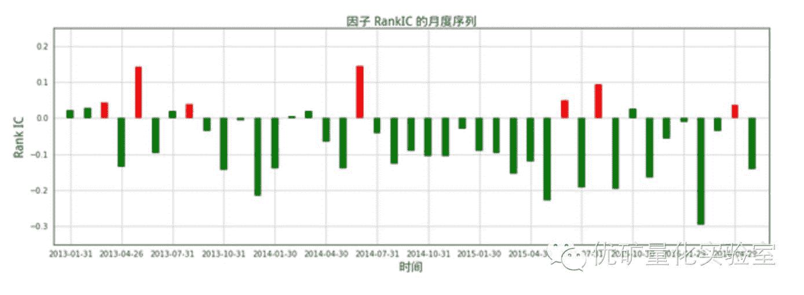

由上图所示，因子值与次月收益的秩相关系数(RankIC)，显著为正的有 7 个(红柱)，显著为负的有 25 个(绿柱)，相关性不显著的有 9 个(黑柱)。聪明钱情绪因子 Q 与次月收益率的 RankIC 基本为负，也就是说跟随聪明钱的投资方向(低位吸筹)是有利可图的。

接下来，考察上述计算得到的**聪明钱情绪因子****Q**的选股能力的回测效果。历史回测的设置如下：

*   回测时段为 2013 年 1 月 31 日至 2016 年 6 月 30 日；

*   股票池为 A 股全部股票，剔除上市未满 60 日的新股（计算 Q 因子时已剔除）；

*   组合每月月底调仓，交易费率设为双边万分之二；

*   调仓时，涨停、停牌不买入，跌停、停牌不卖出；

*   每月底调仓时，选择股票池中 Q 最小的 10%的股票；

回测结果如下：

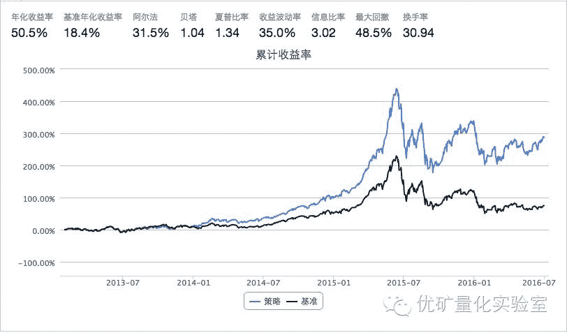

从回测结果可以看出，聪明钱情绪因子 Q 作为选股的信号，表现比较优秀，这可以从阿尔法、夏普比率、信息比率等指标轻松得到反映。

进一步，我们计算得到上述策略回测对冲中证 500 指数后净值走势图：

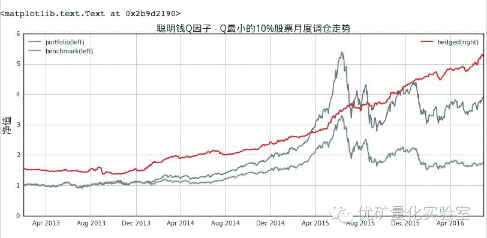

上图中，展示了我们之前在全 A 股股票池中进行的“Q 最小的 10%股票月度调仓”回测的结果，其中的红色曲线显示出对冲中证 500 指数后的净值走势，可以看到对冲后的净值走势非常稳定。

为了更好地展示聪明钱情绪因子 Q 的选股能力，我们对由 Q 因子五分位数的每个分位数区间对应的股票进行回测（回测基本参数设置同上面策略）：

对各个分位数的回测结果进行作图：

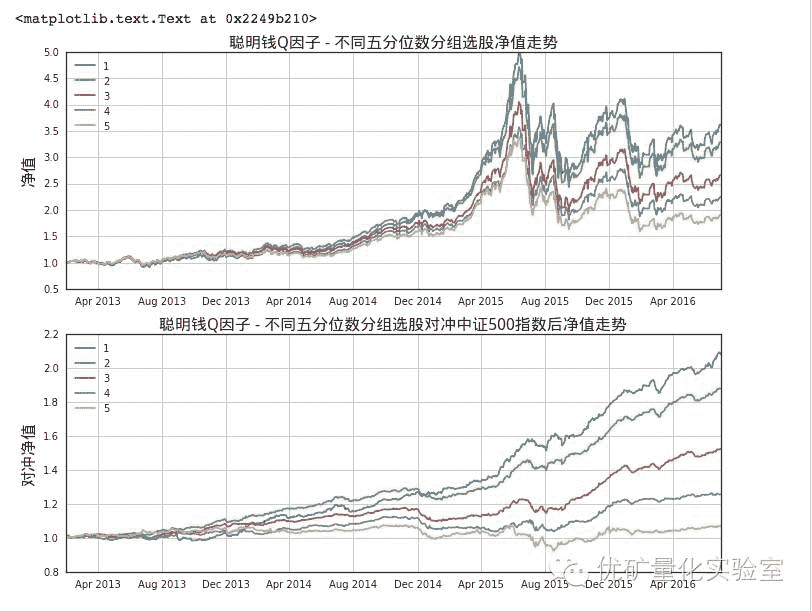

上面的图片显示“Q 因子-不同五分位数分组选股月度调仓”的净值走势，其中下面一张图片展示出各组头寸对冲完指数后的净值走势，可以看到：

*   **不同的五分位数组对应的净值走势顺序区分度很高！**

下面的表格展示出不同分位数组合的各项风险指标，**每次调仓均买入聪明钱情绪因子****Q****最小的****20%****股票**的策略，即最小分位数的组合(组合 1)各项指标表现都非常出色：

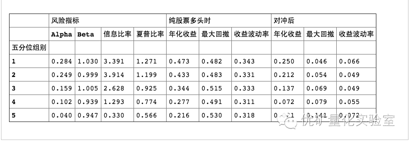

#### 我们根据聪明钱情绪因子 Q 构建了股票组合，表现最好的组合其 13 年以来年化收益达到 47.3%，信息比率高达 3.4，夏普比率为 1.3；进一步，组合对冲中证 500 指数后，年化收益达到 25.0%，最大回撤仅 4.6%，展示出稳定跑赢指数的能力。

**参考文献：**

[1] 方正证券研究所证券研究报告，『跟踪聪明钱：从分钟行情数据到选股因子』 “聆听高频世界的声音”系列研究（三）

[2] 《订单簿信息透明性对投资者行为和市场质量的影响》（上海证券交易所研究中心，2006）、《个人与机构投资者订单主动性比较》（管理评论，2004）

