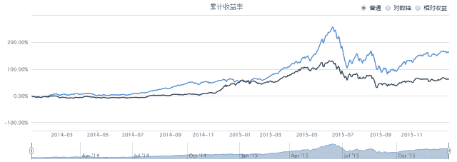
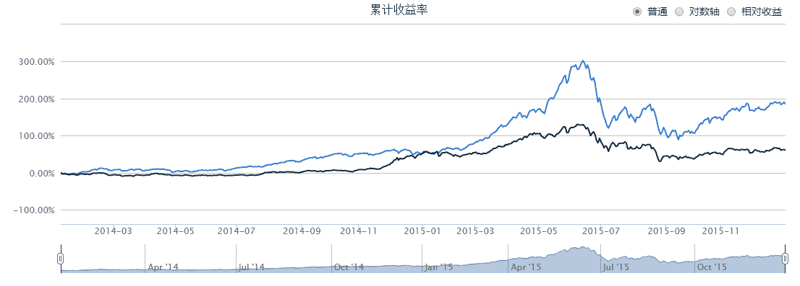

# 【WorldQuant 101 Alphas】之#41

> 原文：[`mp.weixin.qq.com/s?__biz=MzAxNTc0Mjg0Mg==&mid=2653283710&idx=1&sn=a445f8c23ece073b5cdf7cba8feea641&chksm=802e276bb759ae7d4701cade7f1c4bba140c55b826c876cfa597335594332e757c072b684391&scene=27#wechat_redirect`](http://mp.weixin.qq.com/s?__biz=MzAxNTc0Mjg0Mg==&mid=2653283710&idx=1&sn=a445f8c23ece073b5cdf7cba8feea641&chksm=802e276bb759ae7d4701cade7f1c4bba140c55b826c876cfa597335594332e757c072b684391&scene=27#wechat_redirect)

> ********查看之前文章请点击右上角********，关注并且******查看历史消息******
> 
> ********所有文章全部分类和整理，让您更方便查找阅读。请在页面菜单里查找。********

**在 2015 年 9 月份公布的《 WorldQuant Formulaic 101 Alphas 》研究报告中，以数据挖掘能力闻名业界的对冲基金 WorldQuant LLC 给出了它们正在使用，或曾经使用的 101 个阿尔法表达式。在此推出一个系列，挑选一些不错的 Alpha 因子做为参考，希望能起到抛砖引玉的作用。如有不足之处，欢迎批评指正~~ ****Alpha 是投资者获得与市场波动无关的回报，一般用来度量投资者的投资技艺。比如投资者获得了 12%的回报，其基准获得了 10%的回报，那么 Alpha 或者价值增值的部分就是 2%.**策略设计**在这里就不对 alpha 作介绍了，想了解 alpha 的读者可以去看看之前 Thomas 大大推的《多因子系列之二》~~****那我们就直接从策略开始吧。这次我们选取前一根 k 线的最高价、最低价和成交量加权平均价(vwap)来研究，定义 alpha 为:****Alpha#41:( ( (high*low) ⁰.5) ) - vwap )** **其中，vwap=总成交额(Value) / 总成交量(Vol)****若当前股票 alpha>0 时，买入 1%仓位；反之卖出股票。**开始交易**测试平台：****优矿(uqer.io)** **回测时间：****2014-01-01~2015-12-31** **测试品种：****A 股所有股票** **代码（python）:**

**start = '2014-01-01' # 回测起始时间**

**end = '2015-12-31' # 回测结束时间****benchmark = 'HS300' # 策略参考标准****universe = set_universe('A')  # 证券池****capital_base = 100000 # 起始资金****freq = 'd'  #表示日间策略使用日线回测****refresh_rate = 1 # 调仓频率为 1 天****# 初始化虚拟账户状态****def initialize(account): ****    pass****def handle_data(account): # 买入卖出指令****    prehigh = account.get_attribute_history('highPrice',1)****    prelow = account.get_attribute_history('lowPrice',1)****    value = account.get_attribute_history('turnoverValue',1)#成交额****    vol = account.get_attribute_history('turnoverVol',1)#成交量****    for s in account.universe:****        vwap = value[s][0]/vol[s][0]****        alpha = (((prehigh[s][0]*prelow[s][0])**0.5)-vwap)****        if s not in account.valid_secpos:****            if alpha > 0:****                order_pct(s,0.01)#买入****            else:****                order_to(s,0)#卖出****    return**回测结果**年化收益率：    63.3%****基准年化收益率：    27.5%****阿尔法：    40.2%****夏普比率：    1.82****最大回撤：    49.5%****对比上次的 Alpha(39.2%)，这次仅仅是高了一点点，而且 2015 年下半年表现得还是那么差。目前来说小编还没找到一个比较好的 alpha 因子能扛过行情比较差的时候，总得来说这两次的试验是失败的。(ಥ_ಥ)**

**当然，小编也尝试过将这两个 alpha 策略进行组合，但结果只是好了一点点，而且最大回撤变得更大了：**

**年化收益率：    71.2%**

**基准年化收益率：    27.5%**

**阿尔法：    47.7%**

**夏普比率：    1.92**

**最大回撤：    53.1%**

****

**这两次实验的 Alpha 都没有达到预期效果，如果大家有什么好的改进建议或者想法可以留言给我们哦，欢迎批评指正~**

听说，置顶关注我们的人都不一般

****

**后台回复下列关键字，更多惊喜在等着****你** **【区分大小写】**  

**1.回复****每周论文** [**获取 Market Making 论文分享**](http://mp.weixin.qq.com/s?__biz=MzAxNTc0Mjg0Mg==&mid=2653283381&idx=1&sn=48ec361d5b5a0e86e7749ff100a1f335&scene=21#wechat_redirect)

**2\. 回复****matlab 量化投资** **[**获取大量源码**](http://mp.weixin.qq.com/s?__biz=MzAxNTc0Mjg0Mg==&mid=2653283293&idx=1&sn=7c26d2958d1a463686b2600c69bd9bff&scene=21#wechat_redirect)**

****3\. 回复****每周书籍**[**获取国外书籍电子版**](http://mp.weixin.qq.com/s?__biz=MzAxNTc0Mjg0Mg==&mid=2653283159&idx=1&sn=2b5ff2017cabafc48fd3497ae5efa58c&scene=21#wechat_redirect)**

******4\.** **回复******文本挖掘** **[**获取关于文本挖掘的资料**](http://mp.weixin.qq.com/s?__biz=MzAxNTc0Mjg0Mg==&mid=2653283053&idx=1&sn=1d17fbc17545e561be0664af78304a67&scene=21#wechat_redirect)********

************5\. 回复******金融数学** **[**获取金融数学藏书**](http://mp.weixin.qq.com/s?__biz=MzAxNTc0Mjg0Mg==&mid=403111936&idx=4&sn=97822bfa300f3d856d6c9acd8dc24914&scene=21#wechat_redirect)**************

**********6\. 回复******贝叶斯 Matlab****[**获取 NBM 详解与具体应用**](http://mp.weixin.qq.com/s?__biz=MzAxNTc0Mjg0Mg==&mid=401834925&idx=1&sn=d56246158c1002b2330a7c26fd401db6&scene=21#wechat_redirect)************

************7.回复****AdaBoost******[获取 AdaBoost 算法文献、代码、研报](http://mp.weixin.qq.com/s?__biz=MzAxNTc0Mjg0Mg==&mid=2653283387&idx=1&sn=d40b3a1ea73e3d85c124b5b1e4f3057b&scene=21#wechat_redirect)**************

**********8.回复****数据包络分析** **获取****[选股分析](http://mp.weixin.qq.com/s?__biz=MzAxNTc0Mjg0Mg==&mid=2653283401&idx=1&sn=fae6d0c0638174bb713952e6af983c54&scene=21#wechat_redirect)源码**********

********9.回复****SVD** **获取数据预处理之图像处理的方法********