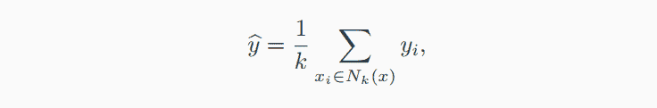
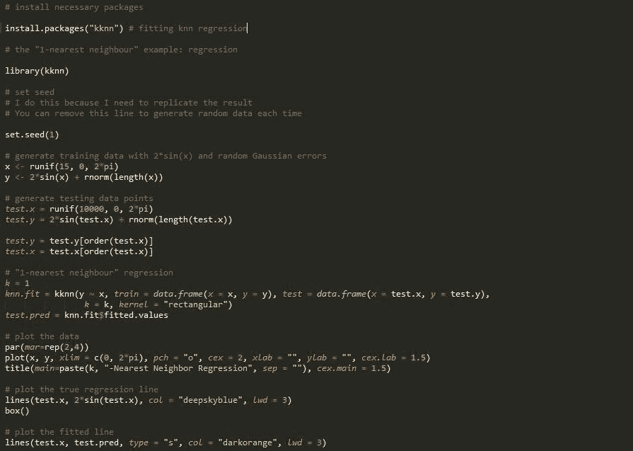
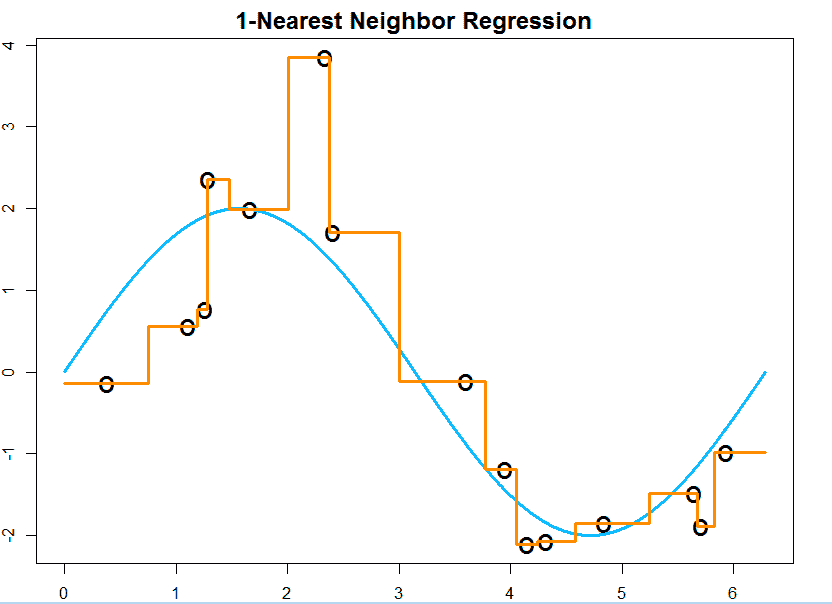
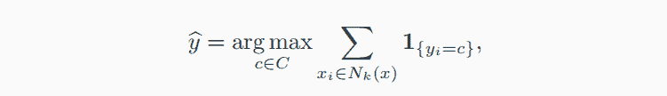
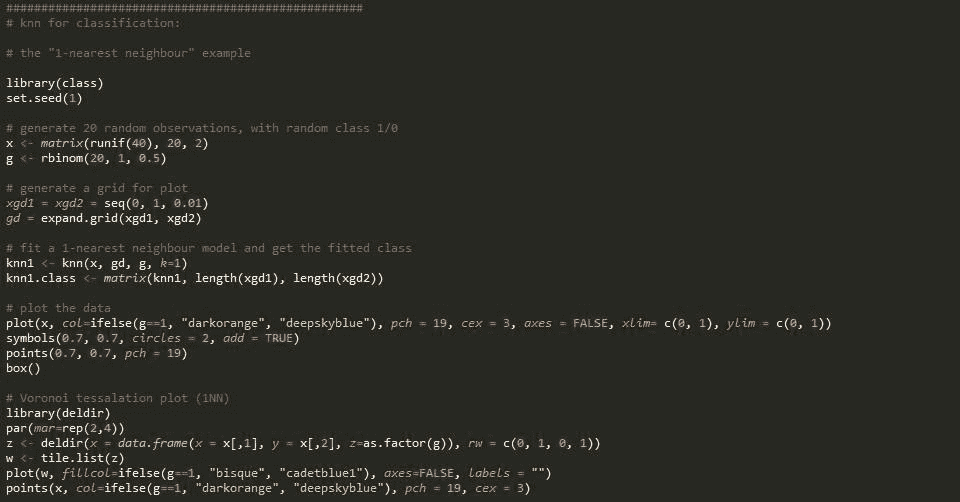
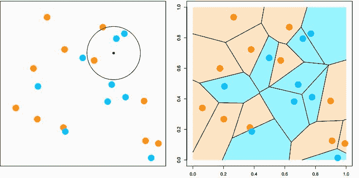
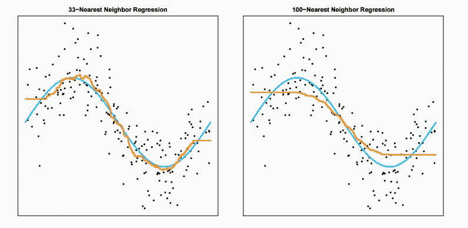
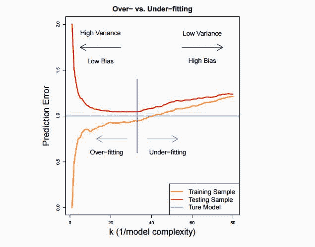
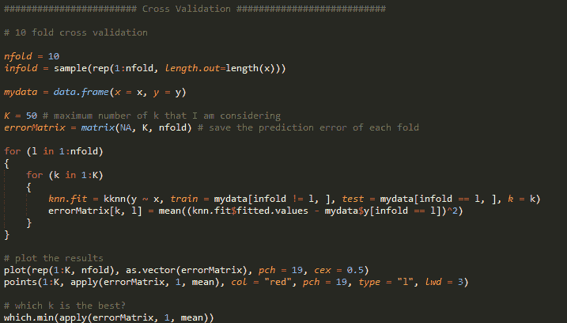

# 【机器学习】kNN-最近邻居算法（附源码）

> 原文：[`mp.weixin.qq.com/s?__biz=MzAxNTc0Mjg0Mg==&mid=2653283706&idx=1&sn=45ee21fda90a82a4692eb1aff62ec492&chksm=802e276fb759ae79eaff6fba49d5919279f020047df4489110f2fa92a0e214da015a770aed84&scene=27#wechat_redirect`](http://mp.weixin.qq.com/s?__biz=MzAxNTc0Mjg0Mg==&mid=2653283706&idx=1&sn=45ee21fda90a82a4692eb1aff62ec492&chksm=802e276fb759ae79eaff6fba49d5919279f020047df4489110f2fa92a0e214da015a770aed84&scene=27#wechat_redirect)

> ********查看之前文章请点击右上角********，关注并且******查看历史消息******
> 
> ********所有文章全部分类和整理，让您更方便查找阅读。请在页面菜单里查找。********

1.  算法介绍：

kNN (k-Nearest Neighbour) 算法是一种用于分类和回归的非参数的方法，可以用目标点周围所观察到的数据得平均值来预测出目标点 x 的值。本文将会介绍 kNN 的回归和分类算法，交叉验证和 kNN 算法的缺点。

1）kNN 回归：

其中 N{k}(x)是训练样本中离目标 x 最近的 k 个样本。

根据以上公式，我们可以看出在预测 y 的值时，kNN 算法是求在训练样本中离 x 周围最近的 k 个样本所对应 y 值们的平均值。

以 R 语言为例，我们需要安装“kknn”包，简单的 1NN 例子如下：

我们可以得到以下 fit 的结果：

2) kNN 分类：

仍以 R 语言为例， 

如上图所示，在预测左图中小黑点的分类时，我们在 k 为半径的一个圆中发现蓝色点的数量大于橙色点的数量，根据 kNN 算法，我们把目标点归为蓝色点类。当 k=1 时，我们能得到上右图分区，称作“Voronoi tessellation"。图中的线段皆是两点的垂直平分线。

3.交叉验证：

不少读者看到这里会好奇，在 kNN 模型中到底什么样的 k 最符合我的预测模型呢？

从上图中发现，33NN 模型由于方差较小显著优于 1NN。然而，当 k 增加到 100 时，误差变得尤为显著。我们需要在误差和方差选择一个这种方案：

在寻找平衡点时，我们可以用交叉验证方法寻找最优解。

（1）将训练样本随机分成 10 组

（2）其中 9 组作为训练样本，应用 k*NN 模型；剩下的一组作为模型测试样本记录误差

（3）重新再 10 组里选择 9 组作为训练样本，重复 10 次

（4）平均 10 次实验的误差，最小的即为最优 k。

简单的 R 代码实现如下，我们得到最佳的 k 值是 33。

4.kNN 的缺点：

虽然 kNN 模型具有容易实现，简单快捷的优点。但在平时建立模型是我们需要注意，kNN 模型在每次预测时需要储存所有的训练样本数据，因为在预测时需要返回训练样本找邻近的所有 k 个点。其次，kNN 模型对样本的异常值较为敏感，建立模型是，需要对数据进行预处理降低异常值对结果的影响。

5.参考资料：

https://sites.google.com/site/teazrq/teaching/STAT542

http://blog.csdn.net/suipingsp/article/details/41964713（含数字识别代码）

**后台回复【KNN】获取源码**

**区分大小写哦！**

听说，置顶关注我们的人都不一般

****

**后台回复下列关键字，更多惊喜在等着****你** **【区分大小写】**  

**1.回复****每周论文** [**获取 Market Making 论文分享**](http://mp.weixin.qq.com/s?__biz=MzAxNTc0Mjg0Mg==&mid=2653283381&idx=1&sn=48ec361d5b5a0e86e7749ff100a1f335&scene=21#wechat_redirect)

**2\. 回复****matlab 量化投资** **[**获取大量源码**](http://mp.weixin.qq.com/s?__biz=MzAxNTc0Mjg0Mg==&mid=2653283293&idx=1&sn=7c26d2958d1a463686b2600c69bd9bff&scene=21#wechat_redirect)**

****3\. 回复****每周书籍**[**获取国外书籍电子版**](http://mp.weixin.qq.com/s?__biz=MzAxNTc0Mjg0Mg==&mid=2653283159&idx=1&sn=2b5ff2017cabafc48fd3497ae5efa58c&scene=21#wechat_redirect)**

******4\.** **回复******文本挖掘** **[**获取关于文本挖掘的资料**](http://mp.weixin.qq.com/s?__biz=MzAxNTc0Mjg0Mg==&mid=2653283053&idx=1&sn=1d17fbc17545e561be0664af78304a67&scene=21#wechat_redirect)********

************5\. 回复******金融数学** **[**获取金融数学藏书**](http://mp.weixin.qq.com/s?__biz=MzAxNTc0Mjg0Mg==&mid=403111936&idx=4&sn=97822bfa300f3d856d6c9acd8dc24914&scene=21#wechat_redirect)**************

**********6\. 回复******贝叶斯 Matlab****[**获取 NBM 详解与具体应用**](http://mp.weixin.qq.com/s?__biz=MzAxNTc0Mjg0Mg==&mid=401834925&idx=1&sn=d56246158c1002b2330a7c26fd401db6&scene=21#wechat_redirect)************

************7.回复****AdaBoost******[获取 AdaBoost 算法文献、代码、研报](http://mp.weixin.qq.com/s?__biz=MzAxNTc0Mjg0Mg==&mid=2653283387&idx=1&sn=d40b3a1ea73e3d85c124b5b1e4f3057b&scene=21#wechat_redirect)**************

**********8.回复****数据包络分析** **获取****[选股分析](http://mp.weixin.qq.com/s?__biz=MzAxNTc0Mjg0Mg==&mid=2653283401&idx=1&sn=fae6d0c0638174bb713952e6af983c54&scene=21#wechat_redirect)源码**********

********9.回复****SVD** **获取数据预处理之图像处理的方法********