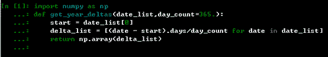

# Python 在金融中的应用——估值框架

> 原文：[`mp.weixin.qq.com/s?__biz=MzAxNTc0Mjg0Mg==&mid=2653283694&idx=1&sn=f780c4a7f1740ca40c154f9ce29ffa1f&chksm=802e277bb759ae6d1ba9d8a06fa4bc7e177ebc42022cc01cc170625a999e3e6ecb9c6c53c2f6&scene=27#wechat_redirect`](http://mp.weixin.qq.com/s?__biz=MzAxNTc0Mjg0Mg==&mid=2653283694&idx=1&sn=f780c4a7f1740ca40c154f9ce29ffa1f&chksm=802e277bb759ae6d1ba9d8a06fa4bc7e177ebc42022cc01cc170625a999e3e6ecb9c6c53c2f6&scene=27#wechat_redirect)

> ********查看之前文章请点击右上角********，关注并且******查看历史消息******
> 
> ********所有文章全部分类和整理，让您更方便查找阅读。请在页面菜单里查找。********

 

所需要的是 Python 中的 DX 库。首先，我们需要先回顾一下资产定价基本定理，因为这一理论为模拟和估值提供了理论背景。我们准备介绍的是日期处理和风险中立折现。此处只讨论最简单的情况----固定短期利率折现，但是更复杂和现实的模型很容易添加到库中。

首先先带大家回忆下资本定价基本定理，它是现代金融理论和数学的基石和成功案例之一。它的中心思想是鞅（Martingale）测度------也就是从折现后风险因素（随机过程）中消去漂移的概率测度。换句话说，在鞅测度下，所有风险因素随无风险短期利率漂移------而不随包含某种无风险短期利率之上风险溢价的任何其他市场利率漂移。

也就是，如果对于未定权益（期权、衍生品、期货、远期、掉期等），该定理的重要性可以用如下的推论阐释：

而由于鞅测度的作用，这种估值方法也常常被称作鞅方法------或者，因为鞅测度下所有风险资产都随无风险利率漂移而被称作风险中立估值方法。对于我们的目的来说，第二个术语可能更好，因为在数值应用中，我么‘简单’地让风险因素（随机过程）根据风险中立短期利率漂移。对于我们的应用，没有必要处理概率测度-----但是，这些测度从理论上证明了我们所应用的核心理论结果和实施的技术方法。

所以，我们现在进入问题的核心，很明显，风险中立折现因子是风险中立估值方法的核心。因此，我们首先开发一个用于风险中立折现的 Python 类。但是，在这之前，我们还要关注一下估值相关日期的建模和处理。

很显然，折现的必要前提条件之一就是建立日期模型。为了估值的目的，通常将当日和一般市场模型的最后日期 T 之间的间隔分为离散的时间间隔。这些时间间隔可以是等长（同构）的，也可以是不等长的（异构）。估值库应该能够处理异构时间间隔的一般情况，因为更简单的情况会自动包含。因此，我们使用日期列表，假定最小的相关时间间隔为一天。这意味着，我们不关心日间事件-----如果需要处理这些事件，就必须建立时间模型。

大体上我们可以采用两种方法：构建一个离散的日期列表（例如 Python 中的 datetime.datetime 对象）或者年分数（十进制数字，就像理论工作中常常做的）。

例如，下面的 dates 和 fraction 定义（大致）等价：

但它们只是大致等价，因为年份数很少处于某一天的开始（0 点）。

所以有时候，根据日期列表得出年份数是必要的。下面我们就引入 get_year_delatas 函数来完成这项工作。

下面来应用下该函数：

 

 

首先，还需使用我们之前定义的 get_year_delatas 函数：

然后我们定义一个 constant_short_rate 类：

 

和前面一样，我们继续使用同一个 datetime 对象列表：

这里的结果主要是一个二维 ndarray 对象，包含成对的 datetime 对象和相关折现因子。该类（特别是对象 csr）通常也能处理年份数：

这个类负责了其他类中需要的所有折现运算。

听说，置顶关注我们的人都不一般

****

**后台回复下列关键字，更多惊喜在等着****你** **【区分大小写】**  

**1.回复****每周论文** [**获取 Market Making 论文分享**](http://mp.weixin.qq.com/s?__biz=MzAxNTc0Mjg0Mg==&mid=2653283381&idx=1&sn=48ec361d5b5a0e86e7749ff100a1f335&scene=21#wechat_redirect)

**2\. 回复****matlab 量化投资** **[**获取大量源码**](http://mp.weixin.qq.com/s?__biz=MzAxNTc0Mjg0Mg==&mid=2653283293&idx=1&sn=7c26d2958d1a463686b2600c69bd9bff&scene=21#wechat_redirect)**

****3\. 回复****每周书籍**[**获取国外书籍电子版**](http://mp.weixin.qq.com/s?__biz=MzAxNTc0Mjg0Mg==&mid=2653283159&idx=1&sn=2b5ff2017cabafc48fd3497ae5efa58c&scene=21#wechat_redirect)**

******4\.** **回复******文本挖掘** **[**获取关于文本挖掘的资料**](http://mp.weixin.qq.com/s?__biz=MzAxNTc0Mjg0Mg==&mid=2653283053&idx=1&sn=1d17fbc17545e561be0664af78304a67&scene=21#wechat_redirect)********

************5\. 回复******金融数学** **[**获取金融数学藏书**](http://mp.weixin.qq.com/s?__biz=MzAxNTc0Mjg0Mg==&mid=403111936&idx=4&sn=97822bfa300f3d856d6c9acd8dc24914&scene=21#wechat_redirect)**************

**********6\. 回复******贝叶斯 Matlab****[**获取 NBM 详解与具体应用**](http://mp.weixin.qq.com/s?__biz=MzAxNTc0Mjg0Mg==&mid=401834925&idx=1&sn=d56246158c1002b2330a7c26fd401db6&scene=21#wechat_redirect)************

************7.回复****AdaBoost******[获取 AdaBoost 算法文献、代码、研报](http://mp.weixin.qq.com/s?__biz=MzAxNTc0Mjg0Mg==&mid=2653283387&idx=1&sn=d40b3a1ea73e3d85c124b5b1e4f3057b&scene=21#wechat_redirect)**************

**********8.回复****数据包络分析** **获取****[选股分析](http://mp.weixin.qq.com/s?__biz=MzAxNTc0Mjg0Mg==&mid=2653283401&idx=1&sn=fae6d0c0638174bb713952e6af983c54&scene=21#wechat_redirect)源码**********

********9.回复****SVD** **获取数据预处理之图像处理的方法********