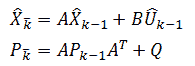
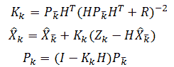
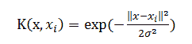
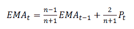
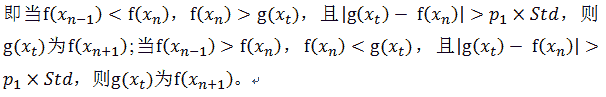
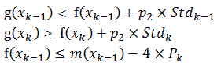
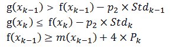
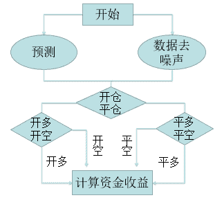
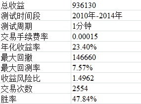
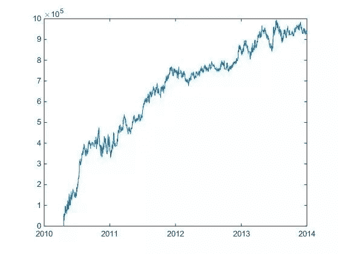

# 【全网首发】第二届广东大学生金融建模大赛一等奖作品——『基于卡尔曼滤波器预测的趋势择时交易策略 』

> 原文：[`mp.weixin.qq.com/s?__biz=MzAxNTc0Mjg0Mg==&mid=2653283682&idx=1&sn=a4eabca5356a01ad213a883b77853576&chksm=802e2777b759ae61659ace254adc98091ee8e2ebfdb38cff1b5767ee0ab17ae4b859000cdb00&scene=27#wechat_redirect`](http://mp.weixin.qq.com/s?__biz=MzAxNTc0Mjg0Mg==&mid=2653283682&idx=1&sn=a4eabca5356a01ad213a883b77853576&chksm=802e2777b759ae61659ace254adc98091ee8e2ebfdb38cff1b5767ee0ab17ae4b859000cdb00&scene=27#wechat_redirect)

> ********查看之前文章请点击右上角********，关注并且******查看历史消息******
> 
> ********所有文章全部分类和整理，让您更方便查找阅读。请在页面菜单里查找。********

 

> 作者：陈漪帆、郭江雪、纪文贤
> 
> 本文已经过作者独家授权，未经允许，不得转载！

**    基于卡尔曼滤波器预测的趋势择时交易策略**

> **一、建模目的与问题分析**

本文希望通过预测股指期货未来状态的价格进一步确定买卖信号，降低交易风险。

首先要解决的问题是如何得到较为准确的股指期货预测价格，其次是如何选择判断买卖信号的价格指标，最后是如何制定有效的买卖策略。

对于问题一，通过建立卡尔曼滤波器对观测目标即股指期货价格的动态信息,去掉噪声的影响，得到一个关于目标位置的好的估计，在模型中体现为对于将来位置的估计即股指期货的预测价格。通过卡尔曼滤波器不断校正，能得到一个较为准确的预测价格序列。

对于问题二，通过观察样本数据可知样本数据大体处于震荡上升的趋势之中，追逐历史时期每个点之前的极值并过滤所得到的极值序列能有效反映历史价格的趋势。以极值作为判断买卖信号的价格指标能够灵敏反映股指期货的价格趋势。

对于问题三，在基于极值序列判断买卖信号的同时根据卡尔曼滤波器得到的下一状态的预测价格序列进一步确认买卖信号，并以此制定买卖策略能有效降低交易风险。

> **二、模型思路**

首先，建立卡尔曼滤波器，通过对样本数据的不断更新校正能得到股指期货的预测价格序列。其次，通过高斯核函数和指数滑动平均模型得到过滤去噪及光滑化后的能反映价格长期趋势的过滤价格序列，并在过滤价格序列的基础上通过追逐极值原则得到极值序列。最后，利用预测价格序列与极值序列确定买卖信号，制定趋势择时交易策略。

> **三、模型建立**

## **       3.1 基于卡尔曼滤波器得到的预测价格序列**

卡尔曼滤波器包括两个主要过程：预估与校正。预估过程主要是利用时间更新方程建立对当前状态的先验估计，及时向前推算当前状态变量和误差协方差估计的值，以便为下一个时间状态构造先验估计值；校正过程负责反馈，利用测量更新方程在预估过程的先验估计值及当前测量变量的基础上建立起对当前状态的改进的后验估计。这样的一个过程，我们称之为预估－校正过程，对应的这种估计算法称为预估－校正算法。

将样本数据通过卡尔曼滤波器即能得到不断更新校正过的预测价格序列 m（x）。

以下给出卡尔曼滤波的时间更新方程和状态更新方程。

时间更新方程：

   状态更新方程：

 

在上面式中，各量说明如下：

A：作用在 Xk-1 上的 n×n 状态变换矩阵

B：作用在控制向量 Uk-1 上的 n×1 输入控制矩阵

H：m×n 观测模型矩阵，它把真实状态空间映射成观测空间

pk-：为 n×n 先验估计误差协方差矩阵

pk：为 n×n 后验估计误差协方差矩阵

Q：n×n 过程噪声协方差矩阵

R：m×m 过程噪声协方差矩阵

I：n×n 阶单位矩阵

Xk：系统状态变量

Zk：观测变量

Uk：系统控制输入

Kk：n×m 阶矩阵，称为卡尔曼增益或混合因数。

**3.2 基于过滤价格序列得到的极值序列**

由于股指期货的价格由市场多方面因素决定，所以存在一定的噪声，为了得到能够反映股指期货长期趋势的价格序列需要对股指期货价格进行去噪处理。通过高斯核函数和指数滑动平均模型得到过滤去噪及光滑化后的过滤价格序列能有效反映股指期货的长期趋势。然后在过滤价格序列的基础上通过追逐极值原则得到极值序列。

**      3.2.1 通过高斯核函数和指数滑动平均模型得到的过滤价格序列**

根据模式识别理论，低维空间线性不可分的模式通过非线性映射到高维特征空间则可能实现线性可分。核函数可以将 m 维高维空间的内积运算转化为 n 维低维输入空间的核函数计算，从而能在高维特征空间中解决复杂的分类或回归问题。研究表明，当缺少过程的先验知识时，选择高斯核函数比选择其他核函数好，故本文选取高斯核函数处理股指期货价格序列。

由于高斯核函数是沿径向对称的标量函数，而在进行股指期货交易过程中，右侧未来数据不可知，故不能使用右侧数据去噪。对于该问题，本模型将高斯核函数与指数滑动平均模型相结合，在时间窗口未达到右侧数据时，使用高斯核函数过滤；在时间窗口到达右侧数据时使用指数滑动平均模型光滑化。由此得到过滤价格序列。

高斯核函数的表达式为

 

指数滑动平均模型公式为：

 

###     **3.2.2 基于极值追逐原则得到的极值序列**

通过观察样本数据可知样本数据大体处于震荡上升的趋势之中，过滤价格序列中的极值点大多表现为价格趋势中的反转点，所以追逐历史时期每个点之前的极值并过滤所得到的极值序列能有效反映历史价格的趋势。

极值追逐原则如下：            

1、追逐历史时期每个点之前的极值。初始极值 f(x0)=过滤价格，在 t 时刻，当 f(Xn-1)<F(Xn)<g(Xt)时，将 g(Xt)的值替代 f(Xn)的值；当 f(Xn-1)>F(Xn)>g(Xt)时，将 g(Xt)的值替代 f(Xn)的值。

   2、在某时间段内，当价格震荡幅度变大或变小时，极值点选取距离也应随之变大或变小，将该时间段价格的标准差作为波动率，并设定一定倍数的波动率作为阈值进行过滤得到极值。

> **四、****交易策略**

在交易系统中，交易策略需要确定买卖信号以及实现止盈、止损的条件，即确定开多、开空、平多、平空四种信号。本模型通过极值序列所表现的反转状态以及预测序列来确定买卖信号，降低模型交易风险。

**4.1 策略设计**

在本策略中，选取不断更新的历史数据标准差作为模型的波动率 Stdk。并设定一定倍数 p2 的波动率构造极值点的标准差区间。

**   4.1.1 开仓策略**

假设在 k 时刻有价格序列{g(x0),……,g(xk)}，预测价格序列{m(x1),……,m(xk+1)}，极值序列{f(x1),……,f(xn)}。

 （1）当出现一个极小值，即 f(xn)为极小值时，g(xk)下穿 f(xn)的标准差区间下限则在 g(xk)上极有可能出现扭转信号。这时则可根据下一状态的预测价格 m(xk+1)进一步确认，若 m(xk+1)同样下穿 f(xn)的标准差区间下限，则说明价格序列仍处于下跌趋势，反之则可确认开多信号并记录 g(xk)的标准差区间。

 （2）当出现一个极大值，即 f(xn)为极大值时，g(xk)<f(xn)，则 g(xk)在上极有可能出现扭转信号。这时则可根据下一状态的预测价格 m(xk+1)进一步确认，若 m(xk+1)>g(xk)且 m(xk+1)上穿 f(xn)的标准差区间下限，则说明价格序列处于上涨趋势，反之可确认开空信号并记录 g(xk)的标准差区间。

**   4.1.2 平仓策略**

  （1）当开多时，若当前价格以及下一状态的预测价格下穿开多点的标准差区间的下限，则平多。

  （2）当开空时，若当前价格以及下一状态的预测价格下穿开空点的标准差区间的上限，则平空。

**4.2** **策略的制定**

开多：过滤后价格上穿上一时刻极值的标准区间上限，且上一时刻极值小于上一时刻预测价格的标准区间下限。即

 

开空：过滤后价格下穿上一时刻极值的标准区间下限，且上一时刻极值大于上一时刻预测价格的标准区间上限。即

 

平多即同开空策略

平空即同开多策略

**4.3** **策略流程**

 

> **五、****模型参数**

量化投资的模型参数是重要的内容。关于参数之间的关联与搭配、参数合理范围、参数的优化与过优化问题都是重要的探讨内容。因此，这里单独列作一章说明。

## **5.1 模型参数汇总**

1、A：作用在 Xk-1 上的 n×n 状态变换矩阵

2、B：作用在控制向量 Uk-1 上的 n×1 输入控制矩阵

3、H：m×n 观测模型矩阵，它把真实状态空间映射成观测空间

4、Pk-：为 n×n 先验估计误差协方差矩阵

5、Q：n×n 过程噪声协方差矩阵

6、R：m×m 过程噪声协方差矩阵

7、I：n×n 阶单位矩阵

8、Xk：系统状态变量

9、Uk：系统控制输入

10、σ：核宽度由它的分布参数即标准差，随着分布参数的减小，高斯卷积的平滑程度降低，反之，分布参数增大，平滑程度提高。

11、n:指数平滑的时间参数

12、Tstd：计算标准差的时间窗口

13、p1：极值追逐的波动率倍数

14、p2：开仓的波动率倍数

## **5.2 模型参数的性质与取值**

1、通过查阅资料和测试，状态转移矩阵 A 在取 6 的时候得出的测试模型拟合度效果比较好。

2、B 为控制输入的增益，由于在很多实际情况并没有控制增益，因此实际中这一项常常为 0。

3、H 取 7/6。

4、Pk-为先验估计误差协方差，初始方差 p 只要不为 0，对滤波的影响很小，都能快速收敛，故选取取收盘价的方差。

5、过程激励协方差 Q 的取值越小越好，故取零。

6、测量噪声协方差 R 的取值越小收敛速度越快，但滤波效果不一定好，因此可以在滤波前测定协方差，然后用于后续的滤波。本论文用历史数据的收益率的方差做为 R。

7、I 一般默认取 1。

8、Xk 的初始状态变量影响最小，可以直接取第一个测量值，在滤波可以收敛的情况下快速收敛。

9、Uk 一般默认为 0。

10、σ核宽度由它的分布参数即标准差决定，随着分布参数的减小，高斯卷积的平滑程度降低，反之，分布参数增大，平滑程度提高。故本文取=8。

11、n 为指数平滑的时间参数，n=3。

12、Tstd 为标准差的采样时间长度，通常以 270 分钟为一天（除交割日），故 Tstd=270。

13、p1 为极值追逐的波动率倍数，取 p1=3。

14、p2 为开仓的波动率倍数，取 p2=0.5。

> **六、****模型实现与测试**

回测数据取自组委会给定的 4 年 1 分钟股指期货交易数据，确定模型参数损失掉前面的少量数据。

 

**资金收益曲线**

> **七、**模型的评价

本文的创新点在于利用卡尔曼滤波器对下一状态点进行预测并不断校正误差，这样得到的预测价格与实际价格误差不大，能较好反映下一状态点的价格。并以此进一步确认买卖信号，降低交易风险。

听说，置顶关注我们的人都不一般

****

**后台回复下列关键字，更多惊喜在等着****你** **【区分大小写】**  

**1.回复****每周论文** [**获取 Market Making 论文分享**](http://mp.weixin.qq.com/s?__biz=MzAxNTc0Mjg0Mg==&mid=2653283381&idx=1&sn=48ec361d5b5a0e86e7749ff100a1f335&scene=21#wechat_redirect)

**2\. 回复****matlab 量化投资** **[**获取大量源码**](http://mp.weixin.qq.com/s?__biz=MzAxNTc0Mjg0Mg==&mid=2653283293&idx=1&sn=7c26d2958d1a463686b2600c69bd9bff&scene=21#wechat_redirect)**

****3\. 回复****每周书籍**[**获取国外书籍电子版**](http://mp.weixin.qq.com/s?__biz=MzAxNTc0Mjg0Mg==&mid=2653283159&idx=1&sn=2b5ff2017cabafc48fd3497ae5efa58c&scene=21#wechat_redirect)**

******4\.** **回复******文本挖掘** **[**获取关于文本挖掘的资料**](http://mp.weixin.qq.com/s?__biz=MzAxNTc0Mjg0Mg==&mid=2653283053&idx=1&sn=1d17fbc17545e561be0664af78304a67&scene=21#wechat_redirect)********

************5\. 回复******金融数学** **[**获取金融数学藏书**](http://mp.weixin.qq.com/s?__biz=MzAxNTc0Mjg0Mg==&mid=403111936&idx=4&sn=97822bfa300f3d856d6c9acd8dc24914&scene=21#wechat_redirect)**************

**********6\. 回复******贝叶斯 Matlab****[**获取 NBM 详解与具体应用**](http://mp.weixin.qq.com/s?__biz=MzAxNTc0Mjg0Mg==&mid=401834925&idx=1&sn=d56246158c1002b2330a7c26fd401db6&scene=21#wechat_redirect)************

************7.回复****AdaBoost******[获取 AdaBoost 算法文献、代码、研报](http://mp.weixin.qq.com/s?__biz=MzAxNTc0Mjg0Mg==&mid=2653283387&idx=1&sn=d40b3a1ea73e3d85c124b5b1e4f3057b&scene=21#wechat_redirect)**************

**********8.回复****数据包络分析** **获取****[选股分析](http://mp.weixin.qq.com/s?__biz=MzAxNTc0Mjg0Mg==&mid=2653283401&idx=1&sn=fae6d0c0638174bb713952e6af983c54&scene=21#wechat_redirect)源码**********

********9.回复****SVD** **获取数据预处理之图像处理的方法********