# 马尔可夫链蒙特卡洛（MCMC）算法

> 原文：[`mp.weixin.qq.com/s?__biz=MzAxNTc0Mjg0Mg==&mid=2653283670&idx=1&sn=fa10c5b8b63a84f45286860e407076ab&chksm=802e2743b759ae55c9aac72069380d9b2a4742f431a0c6d9e83f6ab06fab78581a62677a7cdb&scene=27#wechat_redirect`](http://mp.weixin.qq.com/s?__biz=MzAxNTc0Mjg0Mg==&mid=2653283670&idx=1&sn=fa10c5b8b63a84f45286860e407076ab&chksm=802e2743b759ae55c9aac72069380d9b2a4742f431a0c6d9e83f6ab06fab78581a62677a7cdb&scene=27#wechat_redirect)

> ********查看之前文章请点击右上角********，关注并且******查看历史消息******
> 
> ********所有文章全部分类和整理，让您更方便查找阅读。请在页面菜单里查找。********

在之前的推送中我们了解到什么是马尔可夫链（Markov Chain)。下面我们来介绍一下马尔可夫链蒙特卡洛算法（Markov Chain Monte Carlo)， 在此之前，我们需要回顾一下**马尔可夫链的极限分布**（limiting behavior)。

对于一个不可约非周期性的马尔可夫链，其转移矩阵为 P，当经过 t->inf 步之后，其状态概率收敛于固定值， 即：

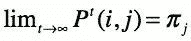

则转移矩阵

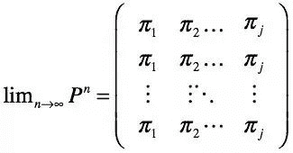

我们记向量

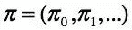

此时 pi 满足

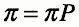

且是唯一解。

以下我们所提到的两种算法都用到马尔可夫链的极限分布。

**马尔可夫链蒙特卡洛**（MCMC）算法的产生是为了解决计算机产生随机数的问题。产生的随机数要服从一定的概率分布 P(X)，当这个目标概率分布不太复杂时，比如均匀分布，计算机可以根据算法产生较好的伪随机数。比较著名的有线性同余随机数生成器（Linear congruential generator, 更加高级的有 Mersenne Twister。但是当这个分布比较复杂，比如涉及到多元随机变量，此时可能有人会想到当随机变量之间相互独立，P(X1, X2...)可以写成几个概率分布相乘的形式。但是在实际生活中，随机变量之间一般是有联系的，此时我们就需要引入 MCMC 的两种算法： Metropolis-Hastings 采样法和 Gibbs 采样法。

**1  Metropolis-Hastings 采样**

假定我们需要对目标分布 p(x)进行取样。Metropolis-Hastings（M-H）算法的主要思路是构建一个马尔可夫链，其最终收敛的平稳分布恰好是我们想要的目标分布 p(x)。

为了进一步讨论 MH 的收敛， 我们首先介绍一个概念：**细致平稳条件**（detailed balance condition)。细致平稳条件是指: 对于所有的 i, j

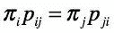

也就是说，在 t 达到平稳后，从 t 时间的状态向量 pi 转移到 t+1 时间的状态向量 pi 时， 对于任意状态 i 和 j，（也就是 pi 向量的第 i 和 j 个元素）， 从 i 转移到 j 的量恰好等于从 j 转移到 i 的量。 这样就不难理解， 第 i 个状态的量就不会改变， 因为 i 是任意的，我们也可以说从 t 时间到 t+1 时间，pi 向量的任意元素的量不发生改变。此时 pi 自然就达到平稳状态。这个条件只是充分不必要条件。

但是问题来了，如何能找到这样的一个转移矩阵 P，能够最终满足细致平稳条件呢？通常情况下，P 是不满足的，我们需要对其进行改造。假定对于任意一个转移矩阵， 我们定义它为 Q，一般情况下：

算法：

给定现有状态 Xt

1 采样 Y~q(Xt,y)

2 采样 U~U(0,1), 使得：

其中

3 重复以上步骤，当 t 足够大时，X_t 近似服从目标分布

python 代码：(2.7)

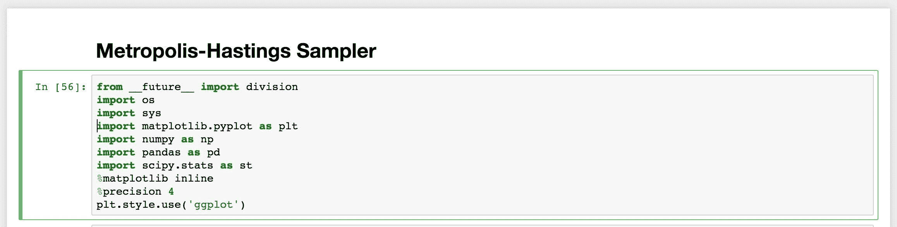

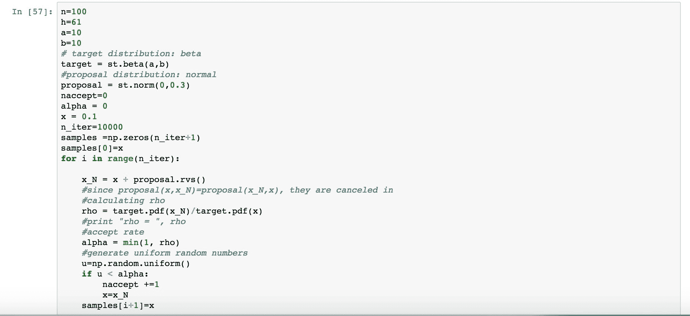

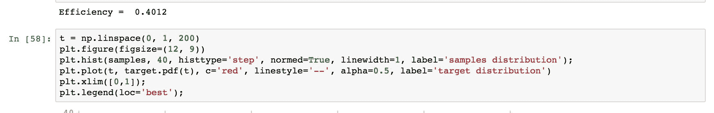

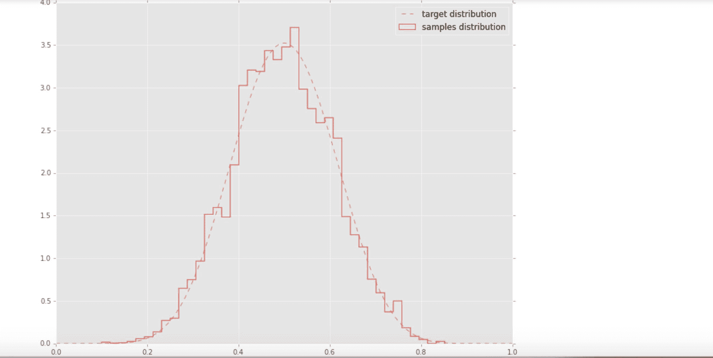

**2  Gibbs 采样**

当从条件分布采样比从联合分布采样更容易时， 我们常用 Gibbs 算法。Gibbs 采样多用于多维度（2 维以上），它的核心思想是：选定一维度 i，固定其他维度的值不变对维度 i 进行采样，然后重复对所有维度做此处理。

其算法为：

1 给定 X_t, 采集样本 Y 如下：

    a. 从条件分布

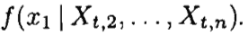

中对 Y1 采样

    b. 类似的，从条件分布

                                    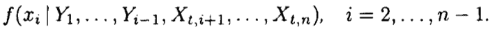

中对 Yi 采样

    c. 从条件分布

                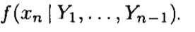

中对 Yn 采样。 本轮采样结束

2 令 X_t+1=Y

Gibbs 采样满足以上所说的细致平稳条件。以二维情形为例，假设坐标 x 恒定，y 发生变化则

因此

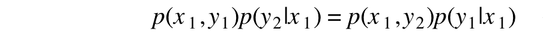

同理，当我们固定 y 坐标，x 发生变化，则

                                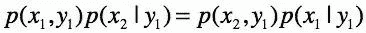

所以细致平稳条件成立。

当维度的选定是随机的时候，Gibbs 采样可以看作是 M-H 算法的一个特例（接受率 alpha＝1）。此时转移方程 q 为：

其中 y=(x1,x2,x3...,xn), 而

                                    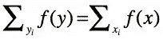
因此

下面是一个简单的对二元正态分布采样的例子： （来自 The Clever Machine）

对于一个二元正态分布：

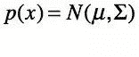

其中

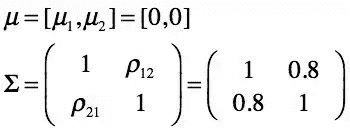

在 Gibbs 采样过程中，每一次迭代我们都先在 x2 的最新状态为条件下去对 x1 采样，然后反过来在刚采样得到的最新的 x1 为条件下对 x2 采样。其条件概率如下（数学部分省略）：

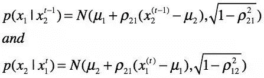

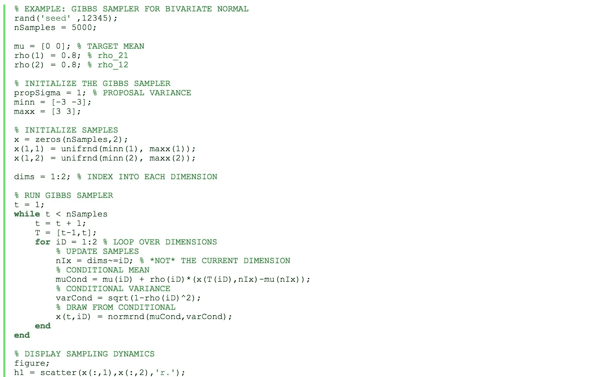

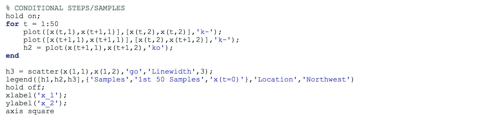

最终结果如下。

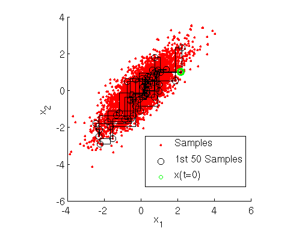

参考文献：

Simulation and the Monte Carlo Method (2nd edition) R.Y.Rubinstein, D.P.Kroese

The Clever Machine. https://theclevermachine.files.wordpress.com/2012/11/gibbssampler-2dnormal1.png

**后台回复下列关键字，更多惊喜在等着****你** **【区分大小写】** 

**1.回复****每周论文** [**获取 Market Making 论文分享**](http://mp.weixin.qq.com/s?__biz=MzAxNTc0Mjg0Mg==&mid=2653283381&idx=1&sn=48ec361d5b5a0e86e7749ff100a1f335&scene=21#wechat_redirect)

**2\. 回复****matlab 量化投资** **[**获取大量源码**](http://mp.weixin.qq.com/s?__biz=MzAxNTc0Mjg0Mg==&mid=2653283293&idx=1&sn=7c26d2958d1a463686b2600c69bd9bff&scene=21#wechat_redirect)**

****3\. 回复****每周书籍**[**获取国外书籍电子版**](http://mp.weixin.qq.com/s?__biz=MzAxNTc0Mjg0Mg==&mid=2653283159&idx=1&sn=2b5ff2017cabafc48fd3497ae5efa58c&scene=21#wechat_redirect)**

******4\.** **回复******文本挖掘**** ****[**获取关于文本挖掘的资料**](http://mp.weixin.qq.com/s?__biz=MzAxNTc0Mjg0Mg==&mid=2653283053&idx=1&sn=1d17fbc17545e561be0664af78304a67&scene=21#wechat_redirect)********

************5\. 回复******金融数学**** ****[**获取金融数学藏书**](http://mp.weixin.qq.com/s?__biz=MzAxNTc0Mjg0Mg==&mid=403111936&idx=4&sn=97822bfa300f3d856d6c9acd8dc24914&scene=21#wechat_redirect)**************

**********6\. 回复******贝叶斯 Matlab********[**获取 NBM 详解与具体应用**](http://mp.weixin.qq.com/s?__biz=MzAxNTc0Mjg0Mg==&mid=401834925&idx=1&sn=d56246158c1002b2330a7c26fd401db6&scene=21#wechat_redirect)************

************7.回复****AdaBoost******[获取 AdaBoost 算法文献、代码、研报](http://mp.weixin.qq.com/s?__biz=MzAxNTc0Mjg0Mg==&mid=2653283387&idx=1&sn=d40b3a1ea73e3d85c124b5b1e4f3057b&scene=21#wechat_redirect)**************

**********8.回复******数据包络分析**** ****获取****[选股分析](http://mp.weixin.qq.com/s?__biz=MzAxNTc0Mjg0Mg==&mid=2653283401&idx=1&sn=fae6d0c0638174bb713952e6af983c54&scene=21#wechat_redirect)源码************

********9.回复****SVD** **获取数据预处理之图像处理的方法******** 

************