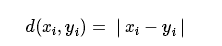
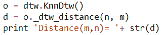
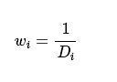
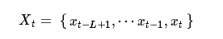

# 【动态时间规整算法】之股指期货交易策略（一）

> 原文：[`mp.weixin.qq.com/s?__biz=MzAxNTc0Mjg0Mg==&mid=2653283640&idx=1&sn=2c136de3a021a913b430affb71e78259&chksm=802e272db759ae3b442c6daf6a7829dfc70f559eed60c2e0a39e8e5d26a8833ca5c2b4bcdec6&scene=27#wechat_redirect`](http://mp.weixin.qq.com/s?__biz=MzAxNTc0Mjg0Mg==&mid=2653283640&idx=1&sn=2c136de3a021a913b430affb71e78259&chksm=802e272db759ae3b442c6daf6a7829dfc70f559eed60c2e0a39e8e5d26a8833ca5c2b4bcdec6&scene=27#wechat_redirect)

> ********查看之前文章请点击右上角********，关注并且******查看历史消息******
> 
> ********所有文章全部分类和整理，让您更方便查找阅读。请在页面菜单里查找。********

 

# **前言**

> Dynamic Time Warping（DTW），动态时间规整算法诞生有一定的历史了（日本学者 Itakura 提出），它出现的目的也比较单纯，是一种衡量两个长度不同的时间序列的相似度的方法。DTW 应用也比较广，主要是在模板匹配中，比如说用在孤立词语音识别（识别两段语音是否表示同一个单词），手势识别，数据挖掘和信息检索等中。

## **一、DTW 算法原理**

在时间序列中，需要比较相似性的两段时间序列的长度可能并不相等，在语音识别领域表现为不同人的语速不同。而且同一个单词内的不同音素的发音速度也不同，比如有的人会把“A”这个音拖得很长，或者把“i”发的很短。另外，不同时间序列可能仅仅存在时间轴上的位移，亦即在还原位移的情况下，两个时间序列是一致的。在这些复杂情况下，使用传统的欧几里得距离无法有效地求的两个时间序列之间的距离（或者相似性）。
DTW 通过把时间序列进行延伸和缩短，来计算两个时间序列性之间的相似性：

如上图所示，上下两条实线代表两个时间序列，时间序列之间的虚线代表两个时间序列之间的相似的点。DTW 使用所有这些相似点之间的距离的和，称之为**`归整路径距离(Warp Path Distance)`**来衡量两个时间序列之间的相似性。

假设下图是两个不同主力期货合约的时间序列，在形态上非常相似，但是这些形态特征点（波峰、波谷）在时间上不能一一对齐，如果用基于欧氏距离的方法来计算两个序列的相似性，会不符合我们的直观认识。但如果匹配时，在序列上容许时间上的伸缩变形，则如下图的对应结果，匹配效果会大大增强，动态时间规整模型提供的就是允许数据在时间轴上伸缩变形的匹配方式。
由下图可以看到，动态时间规整算法在进行两个序列匹配时，序列中的点不再是一一对应关系， 而是有一对一、一对多和多对一的不同映射。这种时间上的扭曲通过使得序列之间总体的距离最小化来实现。
具体而言，**`动态时间规整通过动态规划的方式来获得两个时间序列的时间对应关系，求得序列之间的最小距离`**。

## **二、DTW 计算方法**

假设两个多变量时间序列

和其中 **X** 含有 m 个观测样本，**Y** 含有 n 个观测样本，且每个观测样本 **xi**，*i*=1,2,…,**m** 和 **yj** ，*j*=1,2,…,n 都是 *q* 维的多变量样本（维度一致）。在定义好多变量样本点 **xi** 和 **yj** 之间的距离计算方式 ***d（xi，yi）* **之后，即可计算多变量序列 **X** 和 **Y** 的 动态时间规整距离

 

#### **DTW 计算步骤如下：**

# 

*   1、将 *i* = 0 和 *j* = 0 时的 *D（i，j）* 值设置为正无穷大；

*   2、对于 *i* 从 1 至 *m* ， *j* 从 1 至 *n* ，通过迭代计算：

最终获得的 ***D(m,n)* **即是多变量序列 **X** 和 **Y** 的动态时间规整距离。这是一个动态规划问题，可以通过 ***O（mnq）* **次计算，获得两个多变量序列的最优匹配（其中 ***dij=d（xi，yi）* **的计算复杂度为 ***O（q）* **。

*   单步优化公式为：

    

    其中，** *D（i-1，j）* **表示 ***xi-1* **与 ***yj* **匹配时的子序列距离, ***D（i，j-1）* **表示 ***xi* **与 ***yj-1* **匹配时的子序列距离，** *D（i-1，j-1）***表示 ***xi-1* **与 ***yj-1* **匹配时的子序列距离。动态时间规整算法从可能的三种拆分方式里边选择最优的一种，如图下图所示。

<nobr style="box-sizing: border-box; transition: none; border: 0px; max-width: none; max-height: none; min-width: 0px; min-height: 0px; vertical-align: 0px;">与之对比，普通的多变量匹配中不考虑时间的扭曲，因此要求两个序列等长，即 ***m=n* **，计算复杂度为 ***O（nq）* **。与普通的多变量时间序列匹配方法相比，动态时间规整可以获得更优的匹配效果，但是需要更长的计算时间。</nobr>

<nobr style="box-sizing: border-box; transition: none; border: 0px; max-width: none; max-height: none; min-width: 0px; min-height: 0px; vertical-align: 0px;">在多变量时间序列中， **xi** 和 **yj** 都是 ***q* **维的向量， 而且 **xi **中的元素是时刻 i 下变量的值，**yj** 中的元素是时刻 j 下变量的值，***d（xi，yi）* **即是 i 时刻的 **xi** 和 j 时刻的 **yj** 对齐时的距离。向量 **xi** 和 **yj** 之间的距离计算方式 ***d（xi，yi）* **可以通过欧氏距离或者马氏距离来计算，以单变量的序列为例</nobr>

<nobr style="box-sizing: border-box; transition: none; border: 0px; max-width: none; max-height: none; min-width: 0px; min-height: 0px; vertical-align: 0px;"></nobr> 

<nobr style="box-sizing: border-box; transition: none; border: 0px; max-width: none; max-height: none; min-width: 0px; min-height: 0px; vertical-align: 0px;">定义</nobr>

<nobr style="box-sizing: border-box; transition: none; border: 0px; max-width: none; max-height: none; min-width: 0px; min-height: 0px; vertical-align: 0px;">
</nobr> 

<nobr style="box-sizing: border-box; transition: none; border: 0px; max-width: none; max-height: none; min-width: 0px; min-height: 0px; vertical-align: 0px;">通过动态时间规整计算两个序列的距离。</nobr>

##### <nobr style="box-sizing: border-box; transition: none; border: 0px; max-width: none; max-height: none; min-width: 0px; min-height: 0px; vertical-align: 0px;">**在这里要引入在`GitHub`的一位牛人，谷歌的数据科学家 `Mark Regan` 写的包**</nobr>

### <nobr style="box-sizing: border-box; transition: none; border: 0px; max-width: none; max-height: none; min-width: 0px; min-height: 0px; vertical-align: 0px;">**K Nearest Neighbors & Dynamic Time Warping**</nobr>

<nobr style="box-sizing: border-box; transition: none; border: 0px; max-width: none; max-height: none; min-width: 0px; min-height: 0px; vertical-align: 0px;">When it comes to building a classification algorithm, analysts have a broad range of open source options to choose from. However, for time series classification, there are less out-of-the box solutions.
I began researching the domain of time series classification and was intrigued by a recommended technique called K Nearest Neighbors and Dynamic Time Warping. A meta analysis completed by Mitsa (2010) suggests that when it comes to timeseries classification, 1 Nearest Neighbor (K=1) and Dynamic Timewarping is very difficult to beat.
This repo contains a python implementation (and IPython notebook) of KNN & DTW classification algorithm.</nobr>

<nobr style="box-sizing: border-box; transition: none; border: 0px; max-width: none; max-height: none; min-width: 0px; min-height: 0px; vertical-align: 0px;"></nobr>

#### <nobr style="box-sizing: border-box; transition: none; border: 0px; max-width: none; max-height: none; min-width: 0px; min-height: 0px; vertical-align: 0px;">**下面计算两个序列的距离**</nobr>

<nobr style="box-sizing: border-box; transition: none; border: 0px; max-width: none; max-height: none; min-width: 0px; min-height: 0px; vertical-align: 0px;">

</nobr>

<nobr style="box-sizing: border-box; transition: none; border: 0px; max-width: none; max-height: none; min-width: 0px; min-height: 0px; vertical-align: 0px;">

</nobr>

<nobr style="box-sizing: border-box; transition: none; border: 0px; max-width: none; max-height: none; min-width: 0px; min-height: 0px; vertical-align: 0px;">Distance(m,n)= 14.0</nobr>

#### <nobr style="box-sizing: border-box; transition: none; border: 0px; max-width: none; max-height: none; min-width: 0px; min-height: 0px; vertical-align: 0px;">**可以计算得到 Distance(m,n)= 14**</nobr>

## <nobr style="box-sizing: border-box; transition: none; border: 0px; max-width: none; max-height: none; min-width: 0px; min-height: 0px; vertical-align: 0px;">**三、DTW 交易策略**</nobr>

<nobr style="box-sizing: border-box; transition: none; border: 0px; max-width: none; max-height: none; min-width: 0px; min-height: 0px; vertical-align: 0px;">采用日间的股指期货交易。第 t 个交易日的收盘价格和日成交量是一个观测样本</nobr>

<nobr style="box-sizing: border-box; transition: none; border: 0px; max-width: none; max-height: none; min-width: 0px; min-height: 0px; vertical-align: 0px;"></nobr> 

<nobr style="box-sizing: border-box; transition: none; border: 0px; max-width: none; max-height: none; min-width: 0px; min-height: 0px; vertical-align: 0px;">需要通过模式识别对持仓至下一个交易日的收益率</nobr>

<nobr style="box-sizing: border-box; transition: none; border: 0px; max-width: none; max-height: none; min-width: 0px; min-height: 0px; vertical-align: 0px;"></nobr> 

<nobr style="box-sizing: border-box; transition: none; border: 0px; max-width: none; max-height: none; min-width: 0px; min-height: 0px; vertical-align: 0px;">进行估计，以决定当日收盘时的建仓方向。
对于此前 ***L* **个交易日的收盘价格和日成交量序列</nobr>

<nobr style="box-sizing: border-box; transition: none; border: 0px; max-width: none; max-height: none; min-width: 0px; min-height: 0px; vertical-align: 0px;"></nobr> 

<nobr style="box-sizing: border-box; transition: none; border: 0px; max-width: none; max-height: none; min-width: 0px; min-height: 0px; vertical-align: 0px;">需要寻找与其相似的历史片段。首先，采用长度为 ***L* **的移动窗口，将历史的行情划分为不同的行情片段，每一个片段为 ***L* **个交易日的量价行情序列，如图下图所示。</nobr>

<nobr style="box-sizing: border-box; transition: none; border: 0px; max-width: none; max-height: none; min-width: 0px; min-height: 0px; vertical-align: 0px;"></nobr>

<nobr style="box-sizing: border-box; transition: none; border: 0px; max-width: none; max-height: none; min-width: 0px; min-height: 0px; vertical-align: 0px;">通过动态时间规整在历史样本中寻找与** Xt **距离最小的前 *k* 个序列，假设这 *k* 个序列分别为</nobr>

<nobr style="box-sizing: border-box; transition: none; border: 0px; max-width: none; max-height: none; min-width: 0px; min-height: 0px; vertical-align: 0px;"></nobr> 

<nobr style="box-sizing: border-box; transition: none; border: 0px; max-width: none; max-height: none; min-width: 0px; min-height: 0px; vertical-align: 0px;">与 **Xt **的距离分别为</nobr>

<nobr style="box-sizing: border-box; transition: none; border: 0px; max-width: none; max-height: none; min-width: 0px; min-height: 0px; vertical-align: 0px;"></nobr> 

<nobr style="box-sizing: border-box; transition: none; border: 0px; max-width: none; max-height: none; min-width: 0px; min-height: 0px; vertical-align: 0px;">对应的第二个交易日的收益率为</nobr>

<nobr style="box-sizing: border-box; transition: none; border: 0px; max-width: none; max-height: none; min-width: 0px; min-height: 0px; vertical-align: 0px;"></nobr> 

<nobr style="box-sizing: border-box; transition: none; border: 0px; max-width: none; max-height: none; min-width: 0px; min-height: 0px; vertical-align: 0px;">则可以获得对 ***rt* **的估计为
</nobr>

<nobr style="box-sizing: border-box; transition: none; border: 0px; max-width: none; max-height: none; min-width: 0px; min-height: 0px; vertical-align: 0px;">其中</nobr>

<nobr style="box-sizing: border-box; transition: none; border: 0px; max-width: none; max-height: none; min-width: 0px; min-height: 0px; vertical-align: 0px;"></nobr> 

<nobr style="box-sizing: border-box; transition: none; border: 0px; max-width: none; max-height: none; min-width: 0px; min-height: 0px; vertical-align: 0px;">为距离的倒数。这种加权估计的方式使得距离小（即与当前行情相似度大） 的历史样本在预测中占有较大的权重，因此，能够减小***k* **的取值对预测结果的影响。
如果 **rt** 大于 0（预测下一个交易日上涨） ，则在第 t 个交易日收盘前可以进行做多，下一个交易日收盘前平仓；如果如果 **rt** 小于 0（预测下一个交易日下跌），则在第 t 个交易日收盘前可以进行做空，下一个交易日收盘前平仓。</nobr>

<nobr style="box-sizing: border-box; transition: none; border: 0px; max-width: none; max-height: none; min-width: 0px; min-height: 0px; vertical-align: 0px;">为了减小预测错误造成的损失， 对策略设置止损。采取 1%的固定止损线的策略，即前一个交易日按照收盘价建仓以后，如果第二个交易日的盘中价格“反向”超出建仓价格的 1%，则执行平仓。“反向”是指，做多情况下，第二个交易日盘中价格相比建仓价格跌了 1%，则平仓止损；做空情况下，第二个交易日盘中价格相比建仓价格涨了 1%，则平仓止损。</nobr>

<nobr style="box-sizing: border-box; transition: none; border: 0px; max-width: none; max-height: none; min-width: 0px; min-height: 0px; vertical-align: 0px;">为了消除行情价格序列和成交量序列的非平稳性造成的偏差，对被匹配序列</nobr>

<nobr style="box-sizing: border-box; transition: none; border: 0px; max-width: none; max-height: none; min-width: 0px; min-height: 0px; vertical-align: 0px;"></nobr> 

<nobr style="box-sizing: border-box; transition: none; border: 0px; max-width: none; max-height: none; min-width: 0px; min-height: 0px; vertical-align: 0px;">的中的成交量除以最新的收盘价格 p t ( ) ，对历史样本片段也进行类似的处理；对于成交量序列，由于股指期货上市以来，成交量有明显的放大趋势，因此将所有的日成交量除以该日的成交量 50 日移动平均进行标准化。</nobr>

<nobr style="box-sizing: border-box; transition: none; border: 0px; max-width: none; max-height: none; min-width: 0px; min-height: 0px; vertical-align: 0px;">为了减小可变参数个数，考察序列 **Xt** 和样本库序列的长度都设置为 L 。由于更加关注股指期货在未来的走势，所以采取的动态时间规整和普通的动态时间规整不一样。
普通的动态时间规整算法是将第一个时刻样本先对齐，然后考察下一个样本，最终实现两个序列的整体对齐。
但由于我们更加关注未来的走势，所以，先将最后时刻的样本对齐，然后考察此前时刻的样本，具体的计算修改步骤为：</nobr>

*   <nobr style="box-sizing: border-box; transition: none; border: 0px; max-width: none; max-height: none; min-width: 0px; min-height: 0px; vertical-align: 0px;">1、将 *i* = L+1 和 *j* = L+1 时的 *D（i，j）* 值设置为正无穷大；</nobr>

*   <nobr style="box-sizing: border-box; transition: none; border: 0px; max-width: none; max-height: none; min-width: 0px; min-height: 0px; vertical-align: 0px;">2、对于 *i* 从 L 至 1， *j* 从 L 至 1 ，通过迭代计算：</nobr>

    <nobr style="box-sizing: border-box; transition: none; border: 0px; max-width: none; max-height: none; min-width: 0px; min-height: 0px; vertical-align: 0px;"></nobr>

<nobr style="box-sizing: border-box; transition: none; border: 0px; max-width: none; max-height: none; min-width: 0px; min-height: 0px; vertical-align: 0px;">在匹配中，我们并不需要获取完整序列</nobr>

<nobr style="box-sizing: border-box; transition: none; border: 0px; max-width: none; max-height: none; min-width: 0px; min-height: 0px; vertical-align: 0px;"></nobr> 

<nobr style="box-sizing: border-box; transition: none; border: 0px; max-width: none; max-height: none; min-width: 0px; min-height: 0px; vertical-align: 0px;">和样本序列</nobr>

<nobr style="box-sizing: border-box; transition: none; border: 0px; max-width: none; max-height: none; min-width: 0px; min-height: 0px; vertical-align: 0px;"></nobr> 

<nobr style="box-sizing: border-box; transition: none; border: 0px; max-width: none; max-height: none; min-width: 0px; min-height: 0px; vertical-align: 0px;">的最短距离，而只需要考察子序列</nobr>

 <nobr style="box-sizing: border-box; transition: none; border: 0px; max-width: none; max-height: none; min-width: 0px; min-height: 0px; vertical-align: 0px;"></nobr> 

<nobr style="box-sizing: border-box; transition: none; border: 0px; max-width: none; max-height: none; min-width: 0px; min-height: 0px; vertical-align: 0px;">和</nobr>

<nobr style="box-sizing: border-box; transition: none; border: 0px; max-width: none; max-height: none; min-width: 0px; min-height: 0px; vertical-align: 0px;"></nobr>

<nobr style="box-sizing: border-box; transition: none; border: 0px; max-width: none; max-height: none; min-width: 0px; min-height: 0px; vertical-align: 0px;">的最短距离以及</nobr>

<nobr style="box-sizing: border-box; transition: none; border: 0px; max-width: none; max-height: none; min-width: 0px; min-height: 0px; vertical-align: 0px;"></nobr> 

<nobr style="box-sizing: border-box; transition: none; border: 0px; max-width: none; max-height: none; min-width: 0px; min-height: 0px; vertical-align: 0px;">和子序列</nobr>

<nobr style="box-sizing: border-box; transition: none; border: 0px; max-width: none; max-height: none; min-width: 0px; min-height: 0px; vertical-align: 0px;"></nobr> 

<nobr style="box-sizing: border-box; transition: none; border: 0px; max-width: none; max-height: none; min-width: 0px; min-height: 0px; vertical-align: 0px;">的最短距离，并取其最小值，其中</nobr>

<nobr style="box-sizing: border-box; transition: none; border: 0px; max-width: none; max-height: none; min-width: 0px; min-height: 0px; vertical-align: 0px;"></nobr> 

<nobr style="box-sizing: border-box; transition: none; border: 0px; max-width: none; max-height: none; min-width: 0px; min-height: 0px; vertical-align: 0px;">具体的匹配路径如下图所示。匹配路径 A 表示 **Xt**序列的最近一段子序列与 **Yt**序列匹配；匹配路径 B 表示 **Yt**序列的最近一段子序列与**Xt**序列匹配。注意，两种匹配路径中， X t 序列和 Y 序列的最新时刻样本都是对齐的。
简单起见，价格和量在进行模式匹配时的权重相同。 由于价格和成交量的波动范围不一致， 在进行价量多变量序列匹配计算变量距离*d（xi,yi）* 时， 需要将价格项和成交量项标准化，即</nobr>

<nobr style="box-sizing: border-box; transition: none; border: 0px; max-width: none; max-height: none; min-width: 0px; min-height: 0px; vertical-align: 0px;">
其中</nobr>

<nobr style="box-sizing: border-box; transition: none; border: 0px; max-width: none; max-height: none; min-width: 0px; min-height: 0px; vertical-align: 0px;">其中</nobr> 

<nobr style="box-sizing: border-box; transition: none; border: 0px; max-width: none; max-height: none; min-width: 0px; min-height: 0px; vertical-align: 0px;"></nobr> 

<nobr style="box-sizing: border-box; transition: none; border: 0px; max-width: none; max-height: none; min-width: 0px; min-height: 0px; vertical-align: 0px;">var（*p*） 和 var（*v*） 依次为按照考察序列** Xt** 计算出来的价格和成交量的方差。</nobr>

<nobr style="box-sizing: border-box; transition: none; border: 0px; max-width: none; max-height: none; min-width: 0px; min-height: 0px; vertical-align: 0px;"></nobr>

## <nobr style="box-sizing: border-box; transition: none; border: 0px; max-width: none; max-height: none; min-width: 0px; min-height: 0px; vertical-align: 0px;">**四、股指期货日成交量的交割日问题**</nobr>

*   <nobr style="box-sizing: border-box; transition: none; border: 0px; max-width: none; max-height: none; min-width: 0px; min-height: 0px; vertical-align: 0px;">数据预处理是模式匹配方法中很重要的一个环节。 一方面， 考虑到股指期货推出以来，总体趋势上成交量在持续增大，因此将每日的成交量除以此前 50 个交易日的平均成交量，以消除非平稳因素。</nobr>

*   <nobr style="box-sizing: border-box; transition: none; border: 0px; max-width: none; max-height: none; min-width: 0px; min-height: 0px; vertical-align: 0px;">另一方面， 股指期货当月连续合约在每个月的第三个周五是交割日，在股指期货交割日及前一日，股指期货当月连续合约的成交量会有显著下滑。</nobr>

*   <nobr style="box-sizing: border-box; transition: none; border: 0px; max-width: none; max-height: none; min-width: 0px; min-height: 0px; vertical-align: 0px;">由于交割日的成交量波动， 如果直接用股指期货当月连续合约来进行价量匹配，将导致匹配不准。 需要采取措施来补偿由交割日引起的成交量下滑，使得日成交量能够反映有效的信息。</nobr>

*   <nobr style="box-sizing: border-box; transition: none; border: 0px; max-width: none; max-height: none; min-width: 0px; min-height: 0px; vertical-align: 0px;">股指期货当月连续合约和股指期货次月连续合约是沪深 300 股指期货最主要的两个合约。 事实上，如果考虑股指期货当月连续合约和股指期货次月连续合约的总成交量，则周期性的交割日成交量下滑问题不再存在。</nobr>

##### <nobr style="box-sizing: border-box; transition: none; border: 0px; max-width: none; max-height: none; min-width: 0px; min-height: 0px; vertical-align: 0px;">先写到这里。下周再写下半部分，并进行策略实现。</nobr>