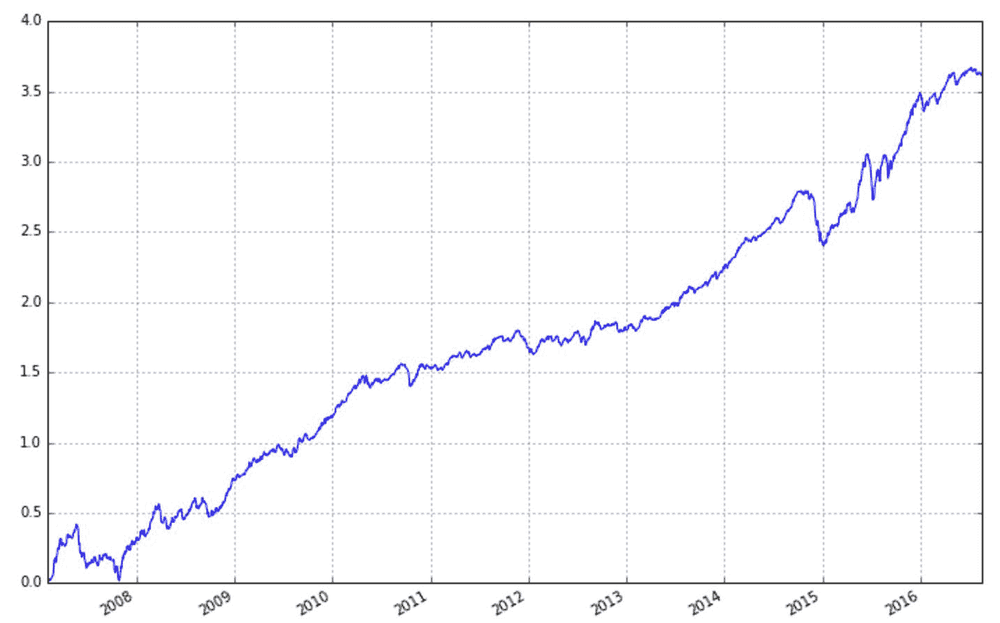
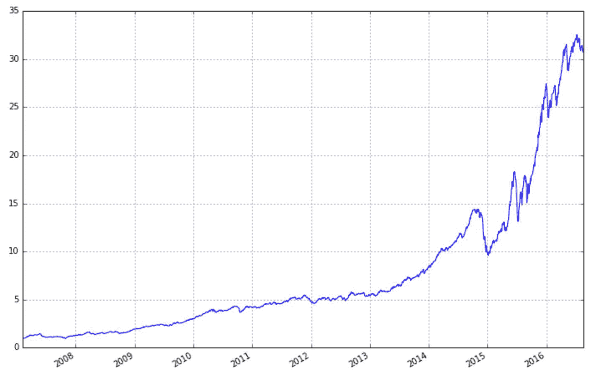

# 市值因子的罪恶，我们究竟要对冲什么

> 原文：[`mp.weixin.qq.com/s?__biz=MzAxNTc0Mjg0Mg==&mid=2653283605&idx=1&sn=eeb48a9b9580a85d29ac930a2508a2db&chksm=802e2700b759ae16f1c352f338805653dbbd2900977f51451d1e9106a5b34ef055495b92247b&scene=27#wechat_redirect`](http://mp.weixin.qq.com/s?__biz=MzAxNTc0Mjg0Mg==&mid=2653283605&idx=1&sn=eeb48a9b9580a85d29ac930a2508a2db&chksm=802e2700b759ae16f1c352f338805653dbbd2900977f51451d1e9106a5b34ef055495b92247b&scene=27#wechat_redirect)

> ********查看之前文章请点击右上角********，关注并且******查看历史消息******
> 
> ********所有文章全部分类和整理，让您更方便查找阅读。请在页面菜单里查找。********

1、   市值因子的罪恶

在 Fama 提出的三因子中有一个市值因子，实际上这一因子在美国股市上虽然有一定效果但信号非常的弱，Fama 解释市值因子有效的理由是，市值小的股票一般是那些有破产风险的公司，而持有这些股票相当于承担了公司破产的风险，而高风险带来了未来的超额收益。

但是在 a 股，市值因子是一个超强的因子，可以说要找到比市值因子更强的因子会比较难，它在 a 股的效果要远远超越其在美国股市的效果。我们可以看一下用市值因子回测的结果图，其年华夏普比达到了 2.10,第一张图为累和收益率(每日收益之和)，第二张图为累计净值。

看到这里，也许大家会认为我们以后持有小市值的股票就一本万利了，但是在这里我要给大家泼一盆冷水，后面我来讲讲市值因子的罪恶。市值因子的回测看起来让你拥有了非常多的 alpha，但实际上它也让你承受了你所承受不了的风险。我们可以看到 2014 年第四季度的时候，市值因子有一波非常大的回撤，而 2014 年第四季度正是券商疯涨开启一轮牛市的时候，当时策略可能因为巨大的回撤而停止使用，从而错过后面一整个牛市的收益。也许大家会说自己可以挺过这一段回撤期，但实际上大部分人并不能。在 2014 年第四季度牛市开始的时候，有大量的对冲策略的基金亏损甚至是清盘，而基金一旦清盘那它就意味着它接着会错过 2015 年 alpha 策略非常有效的时间段。2014 年底可以说是对市场上做对冲基金的一次洗盘，淘汰了那些不严格控制风险的基金。

那么我们需要市值因子来提供 alpha 吗？我认为应该谨慎使用市值因子。在 2014 年底之前，市场上做 alpha 的基金的策略大部分是这样做的，持有一堆创业板或中小板的股票，然后做空沪深 300 股指期货做对冲。而这一个策略实际上就是买入了很多小市值的股票，卖出了沪深 300 中大市值的股票，从而取得收益，而且在 2014 年底之前这些基金收益都很好，因为市值因子有效，但是在 2014 年底市值因子的风险暴露之后，这一类做期指对冲的基金基本被清盘了。实际上这些策略连市场中性的要求都没有达到，如果做空的是沪深 300 期指，那么选择买入的股票池也应该是沪深 300，不应该在其他的股票池里选择股票。

现在我们来谈一下，市值因子为何在过去 10 年间在 a 股上有这样好的效果。我这里说两个原因，第一个是 a 股是一个上市资源稀缺的市场，即上市非常困难，这导致很多公司需要通过借壳上市，而市值小的股票是一个非常好的壳资源，所以在之前非常容易炒作。第二个是 a 股市场的退市制度之前非常不完善，基本不会有退市的情况出现，导致小市值的股票基本就去掉了因为破产而退市的风险。我们可以看到这两个原因都是 a 股奇葩制度导致的，所以随着政策的改变，市值因子有极大可能在未来没有效果甚至带来很大的风险。目前欣泰的强制退市就是一个很好的警钟，随着 a 股制度越来越合理 a 股市场越来越开放，市值因子不可能复制它之前十年的效果，甚至 2014 年底市值因子的反向表现会时常发生。 

 所以，我们不会把市值因子作为我们 alpha 来源，其实它应该是我们需要规避的一个风险。那么下面我们说一下我们究竟要对冲什么。

2、对冲 

大家都知道，对冲策略需要对冲掉市场的风险，实际上这个话并不完整，我们需要对冲掉的应该是我们无法掌控的风险。目前来说，做多因子策略应该要有三个原则，市场中性、行业中性和市值中性，相对应的我们要去掉市场风险、行业风险和市值风险。市场风险大家肯定都能理解，市值风险上面已经说过，那么为什么要行业中性呢？多因子策略实际上是一个选股的策略，即我们要选出那些好的股票，那么好和坏是一个比较关系，在很多时候公司只能在行业中比较，在行业间实际上很难比较，所以我们还需要去掉行业的风险。当然这并不是说行业间的策略是不好的，实际我们可以做行业的动量策略，最后再叠加到多因子策略上。

下面我们用《where is my alpha》中提到的反转因子展现一下在行业中性处理后，它的表现怎么样。第一张图是原始的因子，第二张图是做过行业中性得到的图，虽然两者收益差不太多，但是风险减小很多，对应的年化夏普比从 1.82 提高到了 2.50，从中我们可以了解到去除行业风险的重要性。

这篇推文主要是想大家说一下风险的概念，做策略实际上是风险第一，收益第二的，毕竟大家投入的都是真金白银，谁都不想有亏损的时候。

**后台回复下列关键字，更多惊喜在等着****你** **【区分大小写】** 

**1.回复****每周论文** [**获取 Market Making 论文分享**](http://mp.weixin.qq.com/s?__biz=MzAxNTc0Mjg0Mg==&mid=2653283381&idx=1&sn=48ec361d5b5a0e86e7749ff100a1f335&scene=21#wechat_redirect)

**2\. 回复****matlab 量化投资** **[**获取大量源码**](http://mp.weixin.qq.com/s?__biz=MzAxNTc0Mjg0Mg==&mid=2653283293&idx=1&sn=7c26d2958d1a463686b2600c69bd9bff&scene=21#wechat_redirect)**

****3\. 回复****每周书籍**[**获取国外书籍电子版**](http://mp.weixin.qq.com/s?__biz=MzAxNTc0Mjg0Mg==&mid=2653283159&idx=1&sn=2b5ff2017cabafc48fd3497ae5efa58c&scene=21#wechat_redirect)**

******4\.** **回复******文本挖掘**** ****[**获取关于文本挖掘的资料**](http://mp.weixin.qq.com/s?__biz=MzAxNTc0Mjg0Mg==&mid=2653283053&idx=1&sn=1d17fbc17545e561be0664af78304a67&scene=21#wechat_redirect)********

************5\. 回复******金融数学**** ****[**获取金融数学藏书**](http://mp.weixin.qq.com/s?__biz=MzAxNTc0Mjg0Mg==&mid=403111936&idx=4&sn=97822bfa300f3d856d6c9acd8dc24914&scene=21#wechat_redirect)**************

**********6\. 回复******贝叶斯 Matlab********[**获取 NBM 详解与具体应用**](http://mp.weixin.qq.com/s?__biz=MzAxNTc0Mjg0Mg==&mid=401834925&idx=1&sn=d56246158c1002b2330a7c26fd401db6&scene=21#wechat_redirect)************

************7.回复****AdaBoost******[获取 AdaBoost 算法文献、代码、研报](http://mp.weixin.qq.com/s?__biz=MzAxNTc0Mjg0Mg==&mid=2653283387&idx=1&sn=d40b3a1ea73e3d85c124b5b1e4f3057b&scene=21#wechat_redirect)**************

**********8.回复****数据包络分析** **获取****[选股分析](http://mp.weixin.qq.com/s?__biz=MzAxNTc0Mjg0Mg==&mid=2653283401&idx=1&sn=fae6d0c0638174bb713952e6af983c54&scene=21#wechat_redirect)源码**********

********9.回复****SVD** **获取数据预处理之图像处理的方法******** 

************