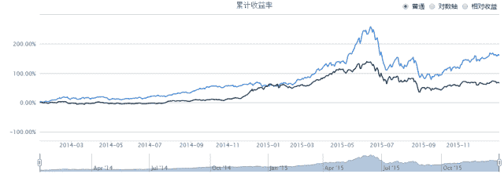

# 【Alpha 系列】之 alpha#1

> 原文：[`mp.weixin.qq.com/s?__biz=MzAxNTc0Mjg0Mg==&mid=2653283601&idx=1&sn=54888b4a92b4dfdd49a78289fb82cf6e&chksm=802e2704b759ae12138856da1d8c37b7ae10a1a205bdec71807a86b020b05a87cd4a87f92431&scene=27#wechat_redirect`](http://mp.weixin.qq.com/s?__biz=MzAxNTc0Mjg0Mg==&mid=2653283601&idx=1&sn=54888b4a92b4dfdd49a78289fb82cf6e&chksm=802e2704b759ae12138856da1d8c37b7ae10a1a205bdec71807a86b020b05a87cd4a87f92431&scene=27#wechat_redirect)

> ********查看之前文章请点击右上角********，关注并且******查看历史消息******
> 
> ********所有文章全部分类和整理，让您更方便查找阅读。请在页面菜单里查找。********

**        Alpha 是投资者获得与市场波动无关的回报，一般用来度量投资者的投资技艺。比如投资者获得了 12%的回报，其基准获得了 10%的回报，那么 Alpha 或者价值增值的部分就是 2%.****        小编将推出一系列 Alpha 策略，希望能起到抛砖引玉的作用。如有不足之处，欢迎批评指正~~**策略设计

在这里就不对 alpha 作介绍了，想了解 alpha 的读者可以去看看前两天 Thomas 大大推的《多因子系列之二》~

那我们就直接从策略开始吧。作为 alpha 系列的第一篇，我们先来实现一个简单的 Alpha 策略。
首先我们选取前一根 K 线的开盘价(open)、收盘价(close)、最高价(high)、最低价(low)进行分析。
阳线(close>open)实体越大说明买方强大，上涨越可靠，越小甚至是十字星表明多空争夺激烈，最终打平，收于开盘价附近，最终走势与原先趋势一致的可能性大。阴线(close<open)实体越大说明卖方强大，下跌的可能性更大，越小或是十字星，同上。所以我们可以定义 alpha 为：alpha = ((close - open) / ((high - low) + 0.001))
为了保证分母不等于 0，在后面加上 0.001.当 alpha>0 时，买入股票；当 alpha<0 时，卖出股票。

策略测试

**测试平台：****优矿(uqer.io)** **回测时间：****2014-1-1~2015-12-31** **测试品种：****A 股所有股票** **代码（python)：****start = '2014-01-01'                       # 回测起始时间****end = '2015-12-31'                         # 回测结束时间****benchmark = 'HS300'                       # 策略参考标准****universe = set_universe('A')  # A 股****capital_base = 100000                      # 起始资金****freq = 'd'                   # 'd'表示使用日线回测****refresh_rate = 1                           # 调仓频率****# 初始化虚拟账户状态****def initialize(account):                   ****    pass****# 每个交易日的买入卖出指令****def handle_data(account):                  ****    preopen =  account.get_attribute_history('openPrice',1)****    preclose =  account.get_attribute_history('closePrice',1)****    prehigh =  account.get_attribute_history('highPrice',1)****    prelow =  account.get_attribute_history('lowPrice',1)****    for s in account.universe:****        alpha = ((preclose[s][0]-preopen[s][0])/(prehigh[s][0]-prelow[s][0]+0.001))****        if s not in account.valid_secpos:****            if alpha > 0:****                order_pct(s,0.05)#买入****            else:****                order_to(s,0)#卖出****    return**回测结果**年化收益率：63.6%****基准年化收益率：30.1%****阿尔法：39.2%****夏普比率：1.74****最大回撤：50.4%**

**可以看到，简单的策略收益也高于基准的年化收益。但是，该 alpha 策略也存在很多问题，最大回撤较高，尤其是 2015 年下半年，该策略表现得比较差。总的来说，虽然策略简单，但其表现也出乎小编意料，后续也可以对其进行优化。****最后再唠叨两句，这次的 alpha 的策略比较简单，各位大牛如果有什么改进意见的话可以留言或者发邮件到 395460642@qq.com 联系小编，欢迎批评指正。同时也希望和大家多多交流，共同进步~~以后会陆续推出一些 alpha 策略，感谢大家的持续关注！** 

****后台回复下列关键字，更多惊喜在等着****你** **【区分大小写】**** 

****1.回复****每周论文** [**获取 Market Making 论文分享**](http://mp.weixin.qq.com/s?__biz=MzAxNTc0Mjg0Mg==&mid=2653283381&idx=1&sn=48ec361d5b5a0e86e7749ff100a1f335&scene=21#wechat_redirect)**

****2\. 回复****matlab 量化投资** **[**获取大量源码**](http://mp.weixin.qq.com/s?__biz=MzAxNTc0Mjg0Mg==&mid=2653283293&idx=1&sn=7c26d2958d1a463686b2600c69bd9bff&scene=21#wechat_redirect)****

******3\. 回复****每周书籍**[**获取国外书籍电子版**](http://mp.weixin.qq.com/s?__biz=MzAxNTc0Mjg0Mg==&mid=2653283159&idx=1&sn=2b5ff2017cabafc48fd3497ae5efa58c&scene=21#wechat_redirect)****

********4\.** **回复******文本挖掘**** ****[**获取关于文本挖掘的资料**](http://mp.weixin.qq.com/s?__biz=MzAxNTc0Mjg0Mg==&mid=2653283053&idx=1&sn=1d17fbc17545e561be0664af78304a67&scene=21#wechat_redirect)**********

************5\. 回复******金融数学**** ****[**获取金融数学藏书**](http://mp.weixin.qq.com/s?__biz=MzAxNTc0Mjg0Mg==&mid=403111936&idx=4&sn=97822bfa300f3d856d6c9acd8dc24914&scene=21#wechat_redirect)**************

**********6\. 回复******贝叶斯 Matlab********[**获取 NBM 详解与具体应用**](http://mp.weixin.qq.com/s?__biz=MzAxNTc0Mjg0Mg==&mid=401834925&idx=1&sn=d56246158c1002b2330a7c26fd401db6&scene=21#wechat_redirect)************

************7.回复****AdaBoost******[获取 AdaBoost 算法文献、代码、研报](http://mp.weixin.qq.com/s?__biz=MzAxNTc0Mjg0Mg==&mid=2653283387&idx=1&sn=d40b3a1ea73e3d85c124b5b1e4f3057b&scene=21#wechat_redirect)**************

****************