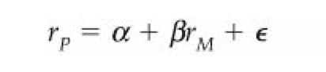

# 【多因子系列之二】where is my alpha

> 原文：[`mp.weixin.qq.com/s?__biz=MzAxNTc0Mjg0Mg==&mid=2653283598&idx=1&sn=53973fe24d449159e896616faae6c804&chksm=802e271bb759ae0db1c155bbd8ba26c0af19d45f6dc798ad882c02b3da2ba7cbaf01fde835e3&scene=27#wechat_redirect`](http://mp.weixin.qq.com/s?__biz=MzAxNTc0Mjg0Mg==&mid=2653283598&idx=1&sn=53973fe24d449159e896616faae6c804&chksm=802e271bb759ae0db1c155bbd8ba26c0af19d45f6dc798ad882c02b3da2ba7cbaf01fde835e3&scene=27#wechat_redirect)

> ********查看之前文章请点击右上角********，关注并且******查看历史消息****** 
> 
> ********所有文章全部分类和整理，让您更方便查找阅读。请在页面菜单里查找。********

多因子系列的第二篇文章主要给大家介绍一下我们经常提的 alpha 是什么，然后展示一下因子的构建过程是怎么样的，希望大家看完后有所启发，可以寻找到属于自己的因子。

1、alpha 是什么

最早 alpha 这个概念的出现应该要追溯到 capm 模型的提出，这个模型的数学公式很简单，就是一个简单的线性回归。

其中 rp 为资产的收益，而 rM 为市场的收益。这个式子表示的意思是资产的收益与市场的收益相关，市场的收益可以用来解释资产的收益，直观的解释就是今天大盘涨的多，相对应的我的股票很大概率也会涨的多。而这个式子里有两个系数项，一个是α一个是β，在这里我们常说的 alpha 就是除去市场的收益率的影响，留下来的系数α，它是资产不受市场影响的那一部分超额收益，我们称为主动收益。就这样 alpha 这个词的意义就固定下来了，表示超出基准的主动收益。

在 capm 模型提出之后，人们发现市场收益这一项只能用来解释很小的一部分资产收益，之后 Fama 等人就提出了 Fama French 三因子模型。Fama 提出不只是股票市场的 beta 值可以用来解释收益，公司的市值、账面市值比、市盈率也可以用来解释资产回报率的差异，这也是多因子模型最早的雏形，而在三因子这篇 paper 中用来检验因子有效性的方法也被业界一直沿用至今，如果大家没有看过这篇论文强烈推荐大家去看一看,现在他们又发表了一篇 Fama 五因子模型，对原来三因子做了点补充，整体大同小异。

后面我们就可以引出多因子模型，说白了在数学的形式上只是把一元回归变成了多元回归。

f1，f2 等等这一些就是我们经常提到的因子(factor)，也就是在机器学习邻域经常说的特征，因子之所以能成为因子就是因为它有能力解释资产的收益。而这里的 alpha 我们通常指的是

与 capm 模型里有些不同，由于篇幅原因这里具体不展开解释，如果对这个式子不理解，可以查看 Ludwig B Chincarini 写的《quantitative equity portfolio management》这本书的第一章。

从中我们可以看到 alpha 来自于因子，那么我们又应该怎么寻找到有效的因子呢。有很多人认为寻找因子是一个非常枯燥的工作，就是不停的尝试，留下来有效的，去除无效的。但实际上我认为寻找因子是一个需要创造力和洞察力的工作，也是我们做策略的逻辑体现的地方，一味地不停尝试不是一个正确的构建因子的过程，而是一个不停地拟合数据的过程。

下面我举两个根据人们的非理性偏差而构建的因子。(现在很多新的因子都来自行为金融学，就是研究人们的非理性行为而产生的套利机会，传统的因子基本都被挖完了==)

2、前景理论 

在讲前景理论之前，我先给出可以用这个理论解释的一个因子。反转因子(一个非常传统的因子)我想大家都比较了解，它基于的逻辑是之前跌的多的股票后面会涨，之前涨的多的股票后面会跌。那么我们基于这个逻辑，可以构建这样一个因子，过去 21 天的股票累计收益率(21 天大约为一个月的交易日)，这样每一天每一只股票都有过去 21 天累计收益率的一个值，这就是我们的因子值。我们每天将股票按照当天的因子值排序，买入过去累计收益率低的股票，卖出过去累计收益率高的股票(假设 a 股可做空股票，这样方便我们的因子有效性研究)。如果我们的逻辑是对，那么我们将获得收益。

下面进行历史回测，时间段为 2007 年 1 月 4 日到 2016 年 8 月 15 日，股票池为全市场 a 股去除上市不满 3 个月的股票、st 股以及股价低于 1 元的股票(计算股票池时需要注意在《量化交易七宗罪》里提到的生存偏差的错误)，当天收盘后计算因子值，在第二天的收盘时进行交易，持有资产组合 21 个交易日，再换仓，一直这样进行下去。回测的累和收益率如下(每天的收益率相加，不是累计净值)，年化夏普比为 1.82。

从结果中我们可以看到，这是一个有效的因子，那么我们在这个时候应该问自己“跌的多的股票后面会涨，之前涨的多的股票后面会跌”这一个逻辑为什么会成立，这个策略究竟赚的是什么钱。只有知道这个，我们才能非常放心地使用这一个因子。

下面我们来了解一下前景理论，首先要说明的是这是一个基础非常夯实的理论，有大量的实验证明这个理论。前景理论认为人们在获得和损失两种情况下的决策是不对称的；人们在面临获得时是风险规避的，在面临损失时是风险偏爱的，而且对损失比对获得更敏感。举个例子，情况 A.你一定能赚 30000 元；情况 B.你有 80%可能赚 40000 元，20%可能性什么也得不到。大部分人会选择 A，但是实际上情况 B 赚钱的期望为 32000，比情况 A 多，这就是在获得的时候人们是风险规避的。现在看损失时，情况 A.你一定会赔 30000 元；情况 B.你有 80%可能赔 40000 元，20%可能不赔钱。大部分人会选择 B，相信赌一把，但实际上 B 在期望上要赔的更多，这就是在损失时人们是风险偏好的。另外，获得和损失带来的效用是不对称的，比如获得 1 万元带来的效用是 10，那么理性的来说损失 1 万元带来的效用应该是-10，但实际并不如此，会比-10 少很多，很有可能比-100 还要少。

如下图，横轴是获得(可以看作是股市中的收益)，纵轴是效用(可以看作是股市中收益带来的心理感受)，这条曲线是经过非常多的心理学实验真实测量出来的，人们因为收益而产生的效用就是这样一条奇葩的曲线。我们从中可以看出来相对于获得人们对于损失要看重得多，这就是人的不理性所在，可以成为我们的收益来源。对于完全理性的人来说，这条曲线应该是关于原点中心对称的且是一条直线，然而因为人们认知的偏差产生了非线性的不理性结果。

下面回到我们之前构建的因子，在过去收益较低的股票对于投资者负面的心理影响非常的大，且在绝对值上远远大于那些收益较高的股票对投资者的正面心理影响。历史上出现暴跌(低收益)的股票在投资者心中打下的烙印使得投资者往往低估了现在股票的价值，而过去的高收益也使得投资者略高估了现在股票的价值，这就产生了股票估值的不合理，而我们应该买入那些低估的股票，卖出那些高估的股票，这就是这个因子的收益来源。

当然，用过去一段时间的累计收益率并不是度量这一非理性的唯一或者是最好的方法，在这里我就不展开讨论，如有兴趣可以通过后台讨论，也可以看一下行为金融学大牛 Nicholas 写的这一片论文《Prospect Theory and Stock Returns: An Empirical Test》，里面有构建这一因子更好的方法。

3、尾数定价 

比较注意生活的童鞋可能有注意到在商场或者超市，很多商品的价格都被定在 9.9，99，198 等等这种比整数小一点的价格上，大家可能会产生疑问为什么会有这种定价出现，这不是给自己收银的时候找零钱带来麻烦么。其实这也是利用了人们的不理性，从而使商品看起来价格更低。比如说商品如果是 100 和 101 这两个价格，消费者第一眼看上去会觉得这两个价格相差不多，但如果是 99 和 100 这两个价格，大部分人的潜意识里会认为 99 的价格便宜很多，倾向于购买。这又是一个认知偏差的现象，实际是线性的东西在人们的认知中是非线性的。

那么这一理论可否用在股市上呢？答案当然是可以的，也就是股民们常说的整数关口。在 9.9，19.9，29.9 这样的价格的时候，投资者会错误地认为这个价格相对便宜，从而买入股票，推高收益，这时我们需要做空这一部分股票；在 10.01，20.01，30.01 这样的价格的时候，投资者会错误的认为这个相对价格偏高，从而卖出股票，推低股票价格，这时我们需要买入这一部分股票。由于我目前所有的的数据都是用的日数据，所以我们构建这样的一个因子，取每天的收盘的价格，小于 10 元的全部乘上 10，大于 100 元的全部除以 10，这样收盘价全部变成了 10~100 之间的数字（方便后面统一处理），再将得到的数字 mod 10，再用 5 减去模 10 后得到的数字，这样就得到我们要的因子，比如收盘价为 19.9 元，mod 10 之后为 9.9，用 5 减去，就是-4.9(5-9.9);收盘价为 20.1，mod 10 之后为 0.1，用 5 减去就是 4.9。4.9 比-4.9 大，这样我们要买入收盘价为 20.1 的股票卖出收盘价为 19.9 的股票，符合我们之前说的逻辑。得到了这个因子后我们需要做一些回测，股票池和回测时间段和之前相同，但由于这个因子的特性，是一个 signal decay(详见上一篇推文，量化交易七宗罪)非常快的信号，所以我们回测设定在第二天开盘时交易，持有两天后调仓，一直这样下去。回测的累和收益率如下，年化夏普比为 1.59.

虽然这一个因子的回测结果看上去也不错，但是它的 signal decay 太快，导致换仓的交易成本会非常高，无法单独的作为一个策略使用(当然上一个因子作为一个单独的策略使用也非常勉强，我们要用多因子^^)。实际上尾数定价这一类东西在高频做市上用的比较多，比如人们下单的时候偏向于输入整的价格，不太会精确到分或者更小的单位，这也是很多收益的来源，当然我对高频了解的不多，只是顺便的提一下。

因子的来源有很多，可能是一些基础理论也可以是对生活现象的思考。如果以后有机会，我还会和大家分享一些因子，ps 真正可以直接赚钱的东西是不可能公开滴，还需靠自己多多思考，多多努力。

这周末我会和大家分享下一篇文章，主要讲讲市值因子还有对冲相关的一些东西。

**后台回复下列关键字，更多惊喜在等着****你** **【区分大小写】** 

**1.回复****每周论文** [**获取 Market Making 论文分享**](http://mp.weixin.qq.com/s?__biz=MzAxNTc0Mjg0Mg==&mid=2653283381&idx=1&sn=48ec361d5b5a0e86e7749ff100a1f335&scene=21#wechat_redirect)

**2\. 回复****matlab 量化投资** **[**获取大量源码**](http://mp.weixin.qq.com/s?__biz=MzAxNTc0Mjg0Mg==&mid=2653283293&idx=1&sn=7c26d2958d1a463686b2600c69bd9bff&scene=21#wechat_redirect)**

****3\. 回复****每周书籍**[**获取国外书籍电子版**](http://mp.weixin.qq.com/s?__biz=MzAxNTc0Mjg0Mg==&mid=2653283159&idx=1&sn=2b5ff2017cabafc48fd3497ae5efa58c&scene=21#wechat_redirect)**

******4\.** **回复******文本挖掘**** ****[**获取关于文本挖掘的资料**](http://mp.weixin.qq.com/s?__biz=MzAxNTc0Mjg0Mg==&mid=2653283053&idx=1&sn=1d17fbc17545e561be0664af78304a67&scene=21#wechat_redirect)********

************5\. 回复******金融数学**** ****[**获取金融数学藏书**](http://mp.weixin.qq.com/s?__biz=MzAxNTc0Mjg0Mg==&mid=403111936&idx=4&sn=97822bfa300f3d856d6c9acd8dc24914&scene=21#wechat_redirect)**************

**********6\. 回复******贝叶斯 Matlab********[**获取 NBM 详解与具体应用**](http://mp.weixin.qq.com/s?__biz=MzAxNTc0Mjg0Mg==&mid=401834925&idx=1&sn=d56246158c1002b2330a7c26fd401db6&scene=21#wechat_redirect)************

************7.回复****AdaBoost******[获取 AdaBoost 算法文献、代码、研报](http://mp.weixin.qq.com/s?__biz=MzAxNTc0Mjg0Mg==&mid=2653283387&idx=1&sn=d40b3a1ea73e3d85c124b5b1e4f3057b&scene=21#wechat_redirect)**************

**********8.回复****数据包络分析** **获取****[选股分析](http://mp.weixin.qq.com/s?__biz=MzAxNTc0Mjg0Mg==&mid=2653283401&idx=1&sn=fae6d0c0638174bb713952e6af983c54&scene=21#wechat_redirect)源码**********

********9.回复****SVD** **获取数据预处理之图像处理的方法******** 

************