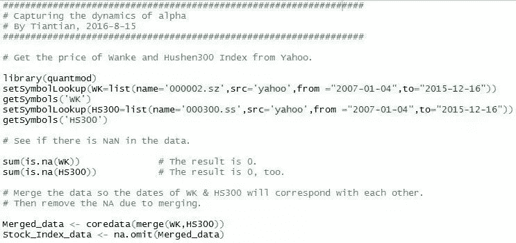
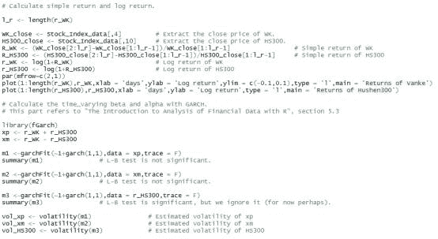
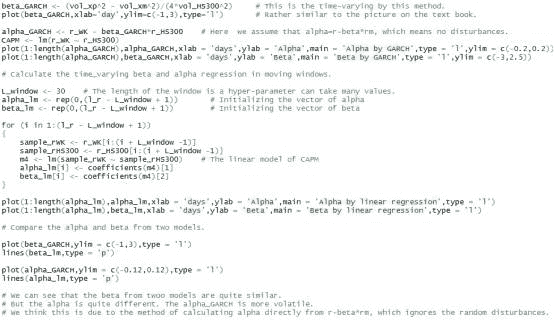

# GARCH 模型动态识别投资中的α与β （附 R 代码）

> 原文：[`mp.weixin.qq.com/s?__biz=MzAxNTc0Mjg0Mg==&mid=2653283582&idx=1&sn=c4d487dac0e10de87d8be89a98a3c312&chksm=802e26ebb759affd24277664d684064080cd1d2bf616af4f6ed27fb7b26710d6730f07a0d396&scene=27#wechat_redirect`](http://mp.weixin.qq.com/s?__biz=MzAxNTc0Mjg0Mg==&mid=2653283582&idx=1&sn=c4d487dac0e10de87d8be89a98a3c312&chksm=802e26ebb759affd24277664d684064080cd1d2bf616af4f6ed27fb7b26710d6730f07a0d396&scene=27#wechat_redirect)

> ********查看之前文章请点击右上角********，关注并且******查看历史消息******
> 
> ********所有文章全部分类和整理，让您更方便查找阅读。请在页面菜单里查找。********

 

 资本资产定价模型（CAPM）简介 

CAPM 模型由 Sharpe 等人以 Markowitz 的资产组合理论为基础进一步发展得到，是将经济学原理应用在金融领域的重要理论成果，几十年来广泛应用于风险投资、公司金融等领域。该模型的核心即是描述某特定资产风险溢价与市场风险溢价之间的关系。根据资 CAPM，任何证券（或投资组合）的期望收益率都应该等于无风险利率加上该证券由β系数测定的风险溢价：

E[r[i]] - r[f] = β[i] (E[r[m]] - r[f])

其中 r[i]代表证券 i 的期望收益率，r[f]代表无风险利率，代表市场的期望收益率；而β[i]是该证券的贝塔系数，用以度量其系统风险（也称市场风险）。上式中(E[r[i]] - r[f])与(E[r[m]] - r[f])分别表示证券 i 与市场的风险溢价。

然而实际情况并不能满足 CAPM 的诸多模型假设；即使全部满足，模型也只给出期望的收益率，未必与真实收益率相同。经过略微的修改，我们可以得到以下公式：

r[i] - r[f] = β[i] (r[m] - r[f]) + α[i]

其中的α[i]就代表超额收益率，也即一个证券的真实收益率与按 CAPM 计算的预期收益率之间的差值。实际操作时，往往将上一公式进一步简化为：

r[i]= β[i] r[m]+ α[i]

考虑到现实中诸多复杂因素，仅仅忽略无风险利率似也无伤大雅。

这个模型在量化中的实践意义在于，如果我们可以估计出α与β，那么就可以在α>0 时，买入证券并卖出β倍的股指期货；反之α<0 时，进行相反操作。这样可以大致构建起一个套利策略。而这个想法的核心就问题就在于对大部分股票而言α与β并不是固定不变的，而是随时间波动较大的变量。接下来我们就来讨论如何在这样的动态过程中识别α与β。

 动态识别α与β的方法 

       这里我们假设可以获取个股与大盘的每日价格信息，通过这些数据计算出每日的收益率，再分别使用以下两个模型。

**(1)** **移动窗口模型**

移动窗口模型的思想就是以给定日期的前 L 天的数据作为训练集，线性回归得到这一天的α与β。公式如下：

r[i,s]= β[i,t] r[m,s]+ α[i,t] , L+1≤t≤T, t-L≤s≤t-1

其中 s,t 是时间角标，T 是总的数据长度。这样就好像有一个固定长度为 L 的窗口（window）从数据集的开始一点点地移动到末尾，在每次截取的 L 个数据中回归得到待估参数的估计值，因此叫做移动窗口模型。

**(2)** **GARCH 模型**

GARCH 模型是本文想主要介绍的方法，因其在金融时间序列中有着广泛的应用。广义自回归条件异方差（Generalized AutoRegressive Conditional Heteroskedasticity）模型，是 Bollerslev 在 1986 年根据 Engle 的 ARCH 模型建立起来的专门分析金融数据波动性的模型。一般的时间序列模型如 AR,MA 或 ARMA 等都是针对时间序列数据的均值建立模型，通过均值这个点估计对时间序列的未来值进行预测。均值模型搭建好之后，应该会得到一个均值为 0 的残差序列。对这些残差的平方再建立一个类似于 ARMA 的模型，就是 GARCH 模型了。

很明显，残差的平方正是其方差（因为 0 均值），也正是整个时间序列的方差（收益率一般是平稳序列）。这种模型的意义在哪呢？首先，金融模型中风险这一概念正是指金融数据的方差，所以对方差（波动率）建模实际上就是在为风险建模。其次，ARMA-GARCH 模型可以同时给出金融时间序列均值与方差的预测值，如果再对概率分布类型进行假设（如正态分布、t 分布等），就可以给出该序列未来值的完整概率分布，从而对其它衍生品的收益、风险进行分析。

回到动态识别α与β中，先介绍一下 CAPM 中β的计算公式：

β[i] = Cov(r[i,]r[m])**/**Var(r[m])

即某资产的贝塔系数等于该资产的收益率与市场收益率的协方差除以市场收益率的方差。根据统计理论，我们有如下公式：

Cov(X,Y) = [Var (X + Y) - Var (X - Y)]**/**4

X,Y 是任意的随机变量。结合这个公式，并加入时间角标 t，我们有：β[i,t]= [Var (r[i,t]+r[m,t])-Var(r[i,t]-r[m,t])]**/**[4Var(r[m,t])]

现在就可以分别对{r[i,t]+ r[m,t]}, {r[i,t]- r[m,t]}, {r[m,t]}这三个时间序列建立 GARCH 模型，得到它们在每一时刻 t 的方差，再根据如上公式求得每一时刻的贝塔系数。再根据之前的公式求出每一时刻的超额收益α。

    是不是很神奇？

 R 代码实现 

最后附一些我用 R 写的代码。使用 R 语言的好处在于 fGarch 包可以轻松地实现 GARCH 建模。这里我挑取了万科的股票与沪深 300 指数，分别用上述两种方法建模，最后用一个非常简单的办法进行的了回测。具体内容请看注释。

水平有限，还请高手们多多指教~

**** 

****后台回复下列关键字，更多惊喜在等着****你** **【区分大小写】**** 

****1.回复****每周论文** [**获取 Market Making 论文分享**](http://mp.weixin.qq.com/s?__biz=MzAxNTc0Mjg0Mg==&mid=2653283381&idx=1&sn=48ec361d5b5a0e86e7749ff100a1f335&scene=21#wechat_redirect)**

****2\. 回复****matlab 量化投资** **[**获取大量源码**](http://mp.weixin.qq.com/s?__biz=MzAxNTc0Mjg0Mg==&mid=2653283293&idx=1&sn=7c26d2958d1a463686b2600c69bd9bff&scene=21#wechat_redirect)****

******3\. 回复****每周书籍**[**获取国外书籍电子版**](http://mp.weixin.qq.com/s?__biz=MzAxNTc0Mjg0Mg==&mid=2653283159&idx=1&sn=2b5ff2017cabafc48fd3497ae5efa58c&scene=21#wechat_redirect)****

********4\.** **回复******文本挖掘**** ****[**获取关于文本挖掘的资料**](http://mp.weixin.qq.com/s?__biz=MzAxNTc0Mjg0Mg==&mid=2653283053&idx=1&sn=1d17fbc17545e561be0664af78304a67&scene=21#wechat_redirect)**********

************5\. 回复******金融数学**** ****[**获取金融数学藏书**](http://mp.weixin.qq.com/s?__biz=MzAxNTc0Mjg0Mg==&mid=403111936&idx=4&sn=97822bfa300f3d856d6c9acd8dc24914&scene=21#wechat_redirect)**************

**********6\. 回复******贝叶斯 Matlab********[**获取 NBM 详解与具体应用**](http://mp.weixin.qq.com/s?__biz=MzAxNTc0Mjg0Mg==&mid=401834925&idx=1&sn=d56246158c1002b2330a7c26fd401db6&scene=21#wechat_redirect)************

************7.回复****AdaBoost******[获取 AdaBoost 算法文献、代码、研报](http://mp.weixin.qq.com/s?__biz=MzAxNTc0Mjg0Mg==&mid=2653283387&idx=1&sn=d40b3a1ea73e3d85c124b5b1e4f3057b&scene=21#wechat_redirect)**************

**********8.回复****数据包络分析** **获取****[选股分析](http://mp.weixin.qq.com/s?__biz=MzAxNTc0Mjg0Mg==&mid=2653283401&idx=1&sn=fae6d0c0638174bb713952e6af983c54&scene=21#wechat_redirect)源码**********

********9.回复****SVD** **获取数据预处理之图像处理的方法********

**************** 

********【过往文章】********

******0.[【机器学习】支持向量机的概念与运用初探](http://mp.weixin.qq.com/s?__biz=MzAxNTc0Mjg0Mg==&mid=2653283515&idx=1&sn=edeedbb0190fc1c1242de5795635fccc&scene=21#wechat_redirect)******

******1[.【Python】金融应用中用 matplotlib 库实现的数据可视化](http://mp.weixin.qq.com/s?__biz=MzAxNTc0Mjg0Mg==&mid=2653283501&idx=2&sn=e69633b4acd9f7fd39b64e734448a0a7&scene=21#wechat_redirect)******

******2[.【Python】信息熵和在决策树中的运用（附源码）](http://mp.weixin.qq.com/s?__biz=MzAxNTc0Mjg0Mg==&mid=2653283451&idx=1&sn=2f10aaa1083856c0a2e07e718a3973cd&scene=21#wechat_redirect)******

******3[.【论文分享】因子模型是否具有良好的预测性？](http://mp.weixin.qq.com/s?__biz=MzAxNTc0Mjg0Mg==&mid=2653283422&idx=1&sn=ab95987e8eebba4572a7004f6ced9cc2&scene=21#wechat_redirect)******

******4[.【Python 机器学习】数据预处理——图像压缩与线性代数](http://mp.weixin.qq.com/s?__biz=MzAxNTc0Mjg0Mg==&mid=2653283419&idx=1&sn=43f113c5e81745b607e9e1f60e7f1a35&scene=21#wechat_redirect)******

******5[.【Matlab 量化投资】用数据包络分析和基因算法进行选股分析？你 get 了吗！（附源程序）](http://mp.weixin.qq.com/s?__biz=MzAxNTc0Mjg0Mg==&mid=2653283401&idx=1&sn=fae6d0c0638174bb713952e6af983c54&scene=21#wechat_redirect)******

******6[.【机器学习课程】经典算法之——AdaBoost 在量化投资中的应用（附代码和很多论文资料）](http://mp.weixin.qq.com/s?__biz=MzAxNTc0Mjg0Mg==&mid=2653283387&idx=1&sn=d40b3a1ea73e3d85c124b5b1e4f3057b&scene=21#wechat_redirect)******

******7[.【论文分享】Market Making 论文分享](http://mp.weixin.qq.com/s?__biz=MzAxNTc0Mjg0Mg==&mid=2653283381&idx=1&sn=48ec361d5b5a0e86e7749ff100a1f335&scene=21#wechat_redirect)******

******8.[【机器学习课程】深度学习与神经网络系列之绪论介绍](http://mp.weixin.qq.com/s?__biz=MzAxNTc0Mjg0Mg==&mid=404690945&idx=1&sn=39ae29caade4b2fac87304d5091ecfc0&scene=21#wechat_redirect)****** 

******9.[【Python 机器学习】系列之线性回归篇【深度详细】](http://mp.weixin.qq.com/s?__biz=MzAxNTc0Mjg0Mg==&mid=405488375&idx=1&sn=e06859f0d3cf5102946bd1551d80184a&scene=21#wechat_redirect)****** 

******10.[【Python 机器学习】系列五决策树非线性回归与分类（深度详细附源码）](http://mp.weixin.qq.com/s?__biz=MzAxNTc0Mjg0Mg==&mid=2653283257&idx=1&sn=1b081581fd2b80c2bdfa03fdc73b1d3a&scene=21#wechat_redirect)****** 

******11.[【每周研报干货】各大券商研报免费分享（附下载链接）](http://mp.weixin.qq.com/s?__biz=MzAxNTc0Mjg0Mg==&mid=2653283257&idx=2&sn=49c78925e7f3535b9cad95bf91574519&scene=21#wechat_redirect)******

******12.[【每周书籍干货】国外近期深度学习与机器学习书籍电子版——你知道一本买来好多刀啊！](http://mp.weixin.qq.com/s?__biz=MzAxNTc0Mjg0Mg==&mid=2653283143&idx=1&sn=2316c1a067239aa007196cc8cb2e6c5b&scene=21#wechat_redirect)******

******13.[几种编程语言的优缺点](http://mp.weixin.qq.com/s?__biz=MzAxNTc0Mjg0Mg==&mid=2653283125&idx=1&sn=fc1a2a490600516cbdbbebfa4cd9d8fb&scene=21#wechat_redirect)****** 

******14.[【Python 机器学习】系列之从线性回归到逻辑回归篇（深度详细附源码）](http://mp.weixin.qq.com/s?__biz=MzAxNTc0Mjg0Mg==&mid=2653283118&idx=1&sn=fb38ed89200ba96f9ed2791dce76d55e&scene=21#wechat_redirect)****** 

******15.[【Python 机器学习】系列之特征提取与处理篇（深度详细附源码）](http://mp.weixin.qq.com/s?__biz=MzAxNTc0Mjg0Mg==&mid=2653283084&idx=1&sn=c7dd24ea9f5633f1f5370176fadef05f&scene=21#wechat_redirect)****** 

******16.[【最强干货】关于文本挖掘的资料（文献，报告，策略，代码）](http://mp.weixin.qq.com/s?__biz=MzAxNTc0Mjg0Mg==&mid=2653283053&idx=1&sn=1d17fbc17545e561be0664af78304a67&scene=21#wechat_redirect)******

******17.[机器学习的前期入门汇总](http://mp.weixin.qq.com/s?__biz=MzAxNTc0Mjg0Mg==&mid=404455727&idx=3&sn=d05688effdbb0583031ef9ae98c64387&scene=21#wechat_redirect)******

******18.[【深度原创研究】分级基金下折全攻略（一）](http://mp.weixin.qq.com/s?__biz=MzAxNTc0Mjg0Mg==&mid=403551881&idx=1&sn=e1ed56f607a0fe187dd7a0cf5178b638&scene=21#wechat_redirect)******

******19.[【深度原创研究】分级基金下折全攻略（二）](http://mp.weixin.qq.com/s?__biz=MzAxNTc0Mjg0Mg==&mid=403626226&idx=1&sn=4d1f56a6599c92fd6688e5eb5d7d15dc&scene=21#wechat_redirect)******

******20.[【知识食粮】最新华尔街牛人必读书籍排行](http://mp.weixin.qq.com/s?__biz=MzAxNTc0Mjg0Mg==&mid=401910135&idx=1&sn=43d5eb7549281bb9231a3be831302139&scene=21#wechat_redirect)******

******21.[通过 MATLAB 处理大数据](http://mp.weixin.qq.com/s?__biz=MzAxNTc0Mjg0Mg==&mid=401910135&idx=2&sn=5289317b5fa1afe4a5a4115520aaa8ac&scene=21#wechat_redirect)******

******22.[【扎实资料干货分享】Python、研究报告、计量经济学、投资书籍、R 语言等！(Book+Video)](http://mp.weixin.qq.com/s?__biz=MzAxNTc0Mjg0Mg==&mid=2653282744&idx=2&sn=c9e9fbf1fd0cd4efa8bf08b9c5f16d8a&scene=21#wechat_redirect)******

******23.[机器学习在统计套利中的应用](http://mp.weixin.qq.com/s?__biz=MzAxNTc0Mjg0Mg==&mid=2653282744&idx=3&sn=85d30593998974cfaf714ac0cf81f8cd&scene=21#wechat_redirect)******

******24.[量化投资修行之路](http://mp.weixin.qq.com/s?__biz=MzAxNTc0Mjg0Mg==&mid=2653282744&idx=4&sn=0ff993c537b4b1689967f1560dfd45be&scene=21#wechat_redirect)******

******25.[统计套利在股指期货跨期套利中的应用：基于协整方法的估计](http://mp.weixin.qq.com/s?__biz=MzAxNTc0Mjg0Mg==&mid=405625337&idx=3&sn=60d19beefab3a1636554b216a9b05742&scene=21#wechat_redirect)******

******26.[股指期货跨品种套利交易](http://mp.weixin.qq.com/s?__biz=MzAxNTc0Mjg0Mg==&mid=405625337&idx=2&sn=e136d7bb6542789fa12f1f90dd206641&scene=21#wechat_redirect)******

******27.[沪港通股票统计套利：基于 BP 神经网络](http://mp.weixin.qq.com/s?__biz=MzAxNTc0Mjg0Mg==&mid=405625337&idx=1&sn=c7d62703af3e5cdb90f0b1b853f8a483&scene=21#wechat_redirect)******

******28.[机器学习到底在量化金融里哪些方面有应用？](http://mp.weixin.qq.com/s?__biz=MzAxNTc0Mjg0Mg==&mid=2653282744&idx=1&sn=73db745def6298a1e352c03f51d26d95&scene=21#wechat_redirect)******

******29.[【Matlab 机器学习】之图像识别](http://mp.weixin.qq.com/s?__biz=MzAxNTc0Mjg0Mg==&mid=2653282814&idx=1&sn=f1224ea30942468ee39aa96d6ea0dd8f&scene=21#wechat_redirect)******

******30.[【干货分享】Python 数据结构与算法设计总结篇](http://mp.weixin.qq.com/s?__biz=MzAxNTc0Mjg0Mg==&mid=2653282752&idx=1&sn=5db4c3e27508abc083a7a5f388ddb6ed&scene=21#wechat_redirect)******

******31.[基于 Python 的股票数据接口调用代码实例](http://mp.weixin.qq.com/s?__biz=MzAxNTc0Mjg0Mg==&mid=2653282828&idx=1&sn=126ad1c21ce5795f8744690cb1effc13&scene=21#wechat_redirect)******

******32.[基于 Python 爬取腾讯网的最热评论代码实例](http://mp.weixin.qq.com/s?__biz=MzAxNTc0Mjg0Mg==&mid=2653282828&idx=2&sn=d73b96b78ce43b151c69ab3e70e4d24c&scene=21#wechat_redirect)******

******33.[卷积神经网络反向传播推导](http://mp.weixin.qq.com/s?__biz=MzAxNTc0Mjg0Mg==&mid=2653282851&idx=1&sn=6cc6f32f8d35089a3c80cdc4c95b48a9&scene=21#wechat_redirect)******

******34.[深度学习项目](http://mp.weixin.qq.com/s?__biz=MzAxNTc0Mjg0Mg==&mid=2653282851&idx=2&sn=d683b6a6570309b7dc07d79829c56b72&scene=21#wechat_redirect)******

******35.[混沌分形理论](http://mp.weixin.qq.com/s?__biz=MzAxNTc0Mjg0Mg==&mid=2653282968&idx=1&sn=04dcad950d1f1093ec35d7d70459020a&scene=21#wechat_redirect)******

******36.[【Python】基于情感词典进行情感分析（附代码）](http://mp.weixin.qq.com/s?__biz=MzAxNTc0Mjg0Mg==&mid=2653282977&idx=1&sn=715655ed0965227450696decde1b9864&scene=21#wechat_redirect)******

******37.[基于技术交易规则的动态模型股票价格（附论文和 Matlab 源程序）](http://mp.weixin.qq.com/s?__biz=MzAxNTc0Mjg0Mg==&mid=2653282981&idx=1&sn=7fcfb07c09bc6c40bb8e19972e4349c1&scene=21#wechat_redirect)******