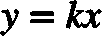

# 【机器学习】机器到底在学习什么？

> 原文：[`mp.weixin.qq.com/s?__biz=MzAxNTc0Mjg0Mg==&mid=2653283576&idx=1&sn=fcd79146a25a790e84f51b1ec6006de6&chksm=802e26edb759affb0d3d8b16c20b21346b9158748b652bb1986fa62a49463ced65c9db5722ef&scene=27#wechat_redirect`](http://mp.weixin.qq.com/s?__biz=MzAxNTc0Mjg0Mg==&mid=2653283576&idx=1&sn=fcd79146a25a790e84f51b1ec6006de6&chksm=802e26edb759affb0d3d8b16c20b21346b9158748b652bb1986fa62a49463ced65c9db5722ef&scene=27#wechat_redirect)

> ********查看之前文章请点击右上角********，关注并且******查看历史消息******
> 
> ********所有文章全部分类和整理，让您更方便查找阅读。请在页面菜单里查找。********

机器识别手写数字的问题早已经解决，MNIST 数据集 http://yann.lecun.com/exdb/mnist/如今机器识别的准确率已经超过 99%。事实上，这种问题无法通过一条条规则去 hard code 式的解决，我们不得不承认机器确实学到了东西。但我们好奇的是机器到底学到了什么？它是如何学到的？

问题设定

我们现在有 MNIST 数据集中 60000 张已经标注过得手写数字图片，每一张图片可以看做(28,28)的二维数组,像右图这样。我们需要通过这些训练数据预测未标注的数据。

思路

我们拿到一张未知的图片，我们把它与训练集的所有图片进行比较，我们找到训练集中与它最相似的一张图片，如果这张图片的 label 是 k，我们就可以说我预测未知的手写数字也是 k。这样的方法对手写数字识别确实有效，KNN 算法对此方法稍作了推广，取得了 90%以上的好成绩。但是我们很快就能发现这种方法的问题。

首先，我学到了什么？KNN 算法实际上没有学到任何东西，它只不过是把已知的数据存起来，没有真正的“训练”过程，因此我们每一次预测都需要巨大的计算量，把训练数据集拿出来一张一张的跟需要预测的这样比较，耗时耗费资源。 

再者，如果某一个新的机器学习问题过于复杂，比如识别人脸，分类更复杂的图像，那我没有足够大的训练集怎么办？即使我对每一个复杂的问题都有足够多的训练集，那我预测的时候又会带来计算更耗时的问题。 

理想的训练情况是什么样？我训练的过程可以耗费一些时间，一旦我训练完成，拿去做预测就需要非常快才行。比如说新闻分类问题，每天都会产生大量数据，每天要对大量新闻分类，所以我们必须把预测的时间限制在可控的范围内。再比如，量化策略中的预测，如果预测未来一天的行情需要三天，这种模型就不靠谱。高频交易对时间的要求更加严格，AlphaGo 下一步棋的预测过程如果需要 30 分钟，肯定无法打败李世石了。 

**实际上，机器学习的过程应该大致可以分为三步：**

**1.提出基本假设(哪些模型可能是对的?)，确定模型的空间:线性模型？非线性模型？简单模型？复杂模型？ 
2.定义模型的”最优”到底是什么?：损失函数 Loss Function 
3.如何找到最优？: 梯度下降法 Gradient Discent**

 ******** ****1.哪些模型可能是对的？**** ********

这是可能有效的模型 ：GoogLeNet

****

这也是可能有效的模型：output = weight*input

上面第一个是谷歌的深度神经网络的模型，模型非常复杂，参数非常多，能学习的问题也更复杂，但是学习过程慢，需要大量的数据驱动，还需要高性能的运算能力。第二个模型非常简单，就是一条通过原点的直线而已，也就是说它的假设空间就是所有的直线，训练过程是在所有的这些直线中搜索一条最好的，什么是”最好”?等下再说。我们现在可以知道的是简单模型能够学习的问题少，这种模型只能把一个坐标系分成两部分,学出二分类问题，连三分类问题都学习不出来，甚至二分类的问题中这条直线它都学不出来，因为假设空间里面根本没有这条直线。反观人家谷歌的模型就高大上了，模型复杂，可以学到 k 分类的问题，虽然我可能需要很多的数据，很多台计算机，但是至少我有学到的可能性。 

通过以上我们可以看到，机器学习模型假设空间的选择需要在计算效率和待解决问题的复杂度之间 trade off,解决简单问题，我们需要简单的模型，这样能学习到表现好的模型，并且计算效率高。复杂问题上复杂模型，保证我们可以学到东西，但是要更多的数据和计算资源训练。

2.假设空间内哪一个才是最优？

通过上面的介绍我们现在知道，机器学习问题需要现有基本假设，然后在假设空间里面做搜索，找到最优的模型。那什么才是最优？ 
我以线性模型为例。

我的输入可以转化成大小为 1*784 数组，我们可以理解成有 784 个特征，我们给每一个特征打分，得到最终结果就表示分到某一类的可能性有多大。 
比如我们判断数字是不是 0，

同理，判断数组是不是 1，也可以打一个分

以此类推，我们有 10 个这样的模型，我们的参数有 10*784=7840 个。我们的学习过程实际就是找到最优的这 7840 个参数,对应的是 784 维特征空间的 10 个超平面(其实就相当于二维平面中找到 10 条直线，只不过输入数据的维度高,直线表示为超平面)。现在这个模型中，我只要输入一张图，它会告诉我是这张图是[0,1,2,3,4,…..]的可能性分别是[0.01, 0.03, 0.8, 0.09….]，我们就知道模型预测的是 3。

 

那么什么是最优？SVM 定义的最优是这样的,模型给我的结果是 1*10 的数组，表示图像是手写数字 0 到 9 的可能性大小，SVM 要求正确的 label 的分值至少比其他分值大 1，越接近这种状态，越好。 
比如预测结果为[0.01, 0.01,0.9, 0.01….]的模型肯定比[0.1, 0.1, 0.6, 0.05,…..]要好(SVM 的预测分值可以大于 1，这里为了说明是“可能性”举得例子小于 1)。Logistic Regression 定义的最优跟 SVM 不一样，Logistic Regression 先在线性模型的结果上套一个 softmax 函数，把结果压缩到[0,1]的范围内，表示概率，然后和真实结果计算交叉熵 cross entropy，交叉熵越大，交叉熵损失函数越小越好。这里引入的损失函数(loss function/costfunction)实际上就是对”最好的”一种数学表达。比如 SVM 的损失函数就是

 

损失函数的意思就是模型当前的状态越偏离我定义的”最优”，损失函数就越大，这样找最优的模型就是对损失函数的最小化。

3.如何搜索到最优模型 **我们现在已经知道机器学习就是在我们的假设空间找到一个最优的模型，最优就是损失函数最小化。如何做到损失函数最小化就对应我们要解决的”如何搜索到最优模型”。 
我们知道机器学习现在就是在不断的调节参数,直到 loss function 最小。也就是说的每一次变动都会导致的变动。这里引入微积分，计算 Loss function 的梯度

梯度表示当前状态下,W 每增加 dW,b 每增加 db,损失函数增大的幅度，如果我每次让 W，b 都按照 dW,db 的幅度减小，那么损失函数就对减小一定幅度。因此学习/训练过程可以表示为

learning_rate 通常是一个很小的数，这样避免学习幅度过大，到不了最优的点。

总结

 **机器学习的问题非常复杂，但是复杂主要体现在：要解决复杂问题需要的模型也要复杂，复杂模型带来了更多的参数，更多的数据需求，更大的运算能力，在我们设计假设空间时又有很多 hyperparameter 需要设置等等。 我们面临一个新的机器学习问题时，我们需要思考的是：

> **1.我用多复杂的模型？** 
> 线性模型中一个超平面行不行？线性模型中多个超平面行不行？不行再做非线性模型，一个隐藏层的神经网络行不行？两个呢？十层呢？…（当然比选择模型更重要的往往还是找特征） 
> **2.我对最优模型的定义是什么？** 
> 采用哪种损失函数？logistic 哪种的的交叉熵？svm 哪种的？ 
> **3.怎么找到最优？** 
> 梯度下降？其他方法？

以上三个问题的背后都有大量的理论支撑，学习这些理论，你会发现机器学习，深度学习就是一系列数学的，计算机的，统计学的工具的组合，如何用好这些工具不仅需要你对工具的理解，还需要你对领域知识的掌握，对数据或者业务需求的敏感。

在量化投资领域，机器学习更像是一套验证你投资思路的工具，我们不可能把他当成一个黑箱，输入一些训练数据，得到一个万能预测模型。不明确这一点很容易误入歧途。

后面我们会在这条机器学习主线的基础上引入一些例子,主要介绍工具的使用。使用的环境主要是 Python+anaconda+theano。下次再更！

**** 

****后台回复下列关键字，更多惊喜在等着****你** **【区分大小写】**** 

****1.回复****每周论文** [**获取 Market Making 论文分享**](http://mp.weixin.qq.com/s?__biz=MzAxNTc0Mjg0Mg==&mid=2653283381&idx=1&sn=48ec361d5b5a0e86e7749ff100a1f335&scene=21#wechat_redirect)**

****2\. 回复****matlab 量化投资** **[**获取大量源码**](http://mp.weixin.qq.com/s?__biz=MzAxNTc0Mjg0Mg==&mid=2653283293&idx=1&sn=7c26d2958d1a463686b2600c69bd9bff&scene=21#wechat_redirect)****

******3\. 回复****每周书籍**[**获取国外书籍电子版**](http://mp.weixin.qq.com/s?__biz=MzAxNTc0Mjg0Mg==&mid=2653283159&idx=1&sn=2b5ff2017cabafc48fd3497ae5efa58c&scene=21#wechat_redirect)****

********4\.** **回复******文本挖掘**** ****[**获取关于文本挖掘的资料**](http://mp.weixin.qq.com/s?__biz=MzAxNTc0Mjg0Mg==&mid=2653283053&idx=1&sn=1d17fbc17545e561be0664af78304a67&scene=21#wechat_redirect)**********

************5\. 回复******金融数学**** ****[**获取金融数学藏书**](http://mp.weixin.qq.com/s?__biz=MzAxNTc0Mjg0Mg==&mid=403111936&idx=4&sn=97822bfa300f3d856d6c9acd8dc24914&scene=21#wechat_redirect)**************

**********6\. 回复******贝叶斯 Matlab********[**获取 NBM 详解与具体应用**](http://mp.weixin.qq.com/s?__biz=MzAxNTc0Mjg0Mg==&mid=401834925&idx=1&sn=d56246158c1002b2330a7c26fd401db6&scene=21#wechat_redirect)************

************7.回复****AdaBoost******[获取 AdaBoost 算法文献、代码、研报](http://mp.weixin.qq.com/s?__biz=MzAxNTc0Mjg0Mg==&mid=2653283387&idx=1&sn=d40b3a1ea73e3d85c124b5b1e4f3057b&scene=21#wechat_redirect)**************

**********8.回复****数据包络分析** **获取****[选股分析](http://mp.weixin.qq.com/s?__biz=MzAxNTc0Mjg0Mg==&mid=2653283401&idx=1&sn=fae6d0c0638174bb713952e6af983c54&scene=21#wechat_redirect)源码**********

********9.回复****SVD** **获取数据预处理之图像处理的方法********

**************** 

********【过往文章】********

******0.[【机器学习】支持向量机的概念与运用初探](http://mp.weixin.qq.com/s?__biz=MzAxNTc0Mjg0Mg==&mid=2653283515&idx=1&sn=edeedbb0190fc1c1242de5795635fccc&scene=21#wechat_redirect)******

******1[.【Python】金融应用中用 matplotlib 库实现的数据可视化](http://mp.weixin.qq.com/s?__biz=MzAxNTc0Mjg0Mg==&mid=2653283501&idx=2&sn=e69633b4acd9f7fd39b64e734448a0a7&scene=21#wechat_redirect)******

******2[.【Python】信息熵和在决策树中的运用（附源码）](http://mp.weixin.qq.com/s?__biz=MzAxNTc0Mjg0Mg==&mid=2653283451&idx=1&sn=2f10aaa1083856c0a2e07e718a3973cd&scene=21#wechat_redirect)******

******3[.【论文分享】因子模型是否具有良好的预测性？](http://mp.weixin.qq.com/s?__biz=MzAxNTc0Mjg0Mg==&mid=2653283422&idx=1&sn=ab95987e8eebba4572a7004f6ced9cc2&scene=21#wechat_redirect)******

******4[.【Python 机器学习】数据预处理——图像压缩与线性代数](http://mp.weixin.qq.com/s?__biz=MzAxNTc0Mjg0Mg==&mid=2653283419&idx=1&sn=43f113c5e81745b607e9e1f60e7f1a35&scene=21#wechat_redirect)******

******5[.【Matlab 量化投资】用数据包络分析和基因算法进行选股分析？你 get 了吗！（附源程序）](http://mp.weixin.qq.com/s?__biz=MzAxNTc0Mjg0Mg==&mid=2653283401&idx=1&sn=fae6d0c0638174bb713952e6af983c54&scene=21#wechat_redirect)******

******6[.【机器学习课程】经典算法之——AdaBoost 在量化投资中的应用（附代码和很多论文资料）](http://mp.weixin.qq.com/s?__biz=MzAxNTc0Mjg0Mg==&mid=2653283387&idx=1&sn=d40b3a1ea73e3d85c124b5b1e4f3057b&scene=21#wechat_redirect)******

******7[.【论文分享】Market Making 论文分享](http://mp.weixin.qq.com/s?__biz=MzAxNTc0Mjg0Mg==&mid=2653283381&idx=1&sn=48ec361d5b5a0e86e7749ff100a1f335&scene=21#wechat_redirect)******

******8.[【机器学习课程】深度学习与神经网络系列之绪论介绍](http://mp.weixin.qq.com/s?__biz=MzAxNTc0Mjg0Mg==&mid=404690945&idx=1&sn=39ae29caade4b2fac87304d5091ecfc0&scene=21#wechat_redirect)****** 

******9.[【Python 机器学习】系列之线性回归篇【深度详细】](http://mp.weixin.qq.com/s?__biz=MzAxNTc0Mjg0Mg==&mid=405488375&idx=1&sn=e06859f0d3cf5102946bd1551d80184a&scene=21#wechat_redirect)****** 

******10.[【Python 机器学习】系列五决策树非线性回归与分类（深度详细附源码）](http://mp.weixin.qq.com/s?__biz=MzAxNTc0Mjg0Mg==&mid=2653283257&idx=1&sn=1b081581fd2b80c2bdfa03fdc73b1d3a&scene=21#wechat_redirect)****** 

******11.[【每周研报干货】各大券商研报免费分享（附下载链接）](http://mp.weixin.qq.com/s?__biz=MzAxNTc0Mjg0Mg==&mid=2653283257&idx=2&sn=49c78925e7f3535b9cad95bf91574519&scene=21#wechat_redirect)******

******12.[【每周书籍干货】国外近期深度学习与机器学习书籍电子版——你知道一本买来好多刀啊！](http://mp.weixin.qq.com/s?__biz=MzAxNTc0Mjg0Mg==&mid=2653283143&idx=1&sn=2316c1a067239aa007196cc8cb2e6c5b&scene=21#wechat_redirect)******

******13.[几种编程语言的优缺点](http://mp.weixin.qq.com/s?__biz=MzAxNTc0Mjg0Mg==&mid=2653283125&idx=1&sn=fc1a2a490600516cbdbbebfa4cd9d8fb&scene=21#wechat_redirect)****** 

******14.[【Python 机器学习】系列之从线性回归到逻辑回归篇（深度详细附源码）](http://mp.weixin.qq.com/s?__biz=MzAxNTc0Mjg0Mg==&mid=2653283118&idx=1&sn=fb38ed89200ba96f9ed2791dce76d55e&scene=21#wechat_redirect)****** 

******15.[【Python 机器学习】系列之特征提取与处理篇（深度详细附源码）](http://mp.weixin.qq.com/s?__biz=MzAxNTc0Mjg0Mg==&mid=2653283084&idx=1&sn=c7dd24ea9f5633f1f5370176fadef05f&scene=21#wechat_redirect)****** 

******16.[【最强干货】关于文本挖掘的资料（文献，报告，策略，代码）](http://mp.weixin.qq.com/s?__biz=MzAxNTc0Mjg0Mg==&mid=2653283053&idx=1&sn=1d17fbc17545e561be0664af78304a67&scene=21#wechat_redirect)******

******17.[机器学习的前期入门汇总](http://mp.weixin.qq.com/s?__biz=MzAxNTc0Mjg0Mg==&mid=404455727&idx=3&sn=d05688effdbb0583031ef9ae98c64387&scene=21#wechat_redirect)******

******18.[【深度原创研究】分级基金下折全攻略（一）](http://mp.weixin.qq.com/s?__biz=MzAxNTc0Mjg0Mg==&mid=403551881&idx=1&sn=e1ed56f607a0fe187dd7a0cf5178b638&scene=21#wechat_redirect)******

******19.[【深度原创研究】分级基金下折全攻略（二）](http://mp.weixin.qq.com/s?__biz=MzAxNTc0Mjg0Mg==&mid=403626226&idx=1&sn=4d1f56a6599c92fd6688e5eb5d7d15dc&scene=21#wechat_redirect)******

******20.[【知识食粮】最新华尔街牛人必读书籍排行](http://mp.weixin.qq.com/s?__biz=MzAxNTc0Mjg0Mg==&mid=401910135&idx=1&sn=43d5eb7549281bb9231a3be831302139&scene=21#wechat_redirect)******

******21.[通过 MATLAB 处理大数据](http://mp.weixin.qq.com/s?__biz=MzAxNTc0Mjg0Mg==&mid=401910135&idx=2&sn=5289317b5fa1afe4a5a4115520aaa8ac&scene=21#wechat_redirect)******

******22.[【扎实资料干货分享】Python、研究报告、计量经济学、投资书籍、R 语言等！(Book+Video)](http://mp.weixin.qq.com/s?__biz=MzAxNTc0Mjg0Mg==&mid=2653282744&idx=2&sn=c9e9fbf1fd0cd4efa8bf08b9c5f16d8a&scene=21#wechat_redirect)******

******23.[机器学习在统计套利中的应用](http://mp.weixin.qq.com/s?__biz=MzAxNTc0Mjg0Mg==&mid=2653282744&idx=3&sn=85d30593998974cfaf714ac0cf81f8cd&scene=21#wechat_redirect)******

******24.[量化投资修行之路](http://mp.weixin.qq.com/s?__biz=MzAxNTc0Mjg0Mg==&mid=2653282744&idx=4&sn=0ff993c537b4b1689967f1560dfd45be&scene=21#wechat_redirect)******

******25.[统计套利在股指期货跨期套利中的应用：基于协整方法的估计](http://mp.weixin.qq.com/s?__biz=MzAxNTc0Mjg0Mg==&mid=405625337&idx=3&sn=60d19beefab3a1636554b216a9b05742&scene=21#wechat_redirect)******

******26.[股指期货跨品种套利交易](http://mp.weixin.qq.com/s?__biz=MzAxNTc0Mjg0Mg==&mid=405625337&idx=2&sn=e136d7bb6542789fa12f1f90dd206641&scene=21#wechat_redirect)******

******27.[沪港通股票统计套利：基于 BP 神经网络](http://mp.weixin.qq.com/s?__biz=MzAxNTc0Mjg0Mg==&mid=405625337&idx=1&sn=c7d62703af3e5cdb90f0b1b853f8a483&scene=21#wechat_redirect)******

******28.[机器学习到底在量化金融里哪些方面有应用？](http://mp.weixin.qq.com/s?__biz=MzAxNTc0Mjg0Mg==&mid=2653282744&idx=1&sn=73db745def6298a1e352c03f51d26d95&scene=21#wechat_redirect)******

******29.[【Matlab 机器学习】之图像识别](http://mp.weixin.qq.com/s?__biz=MzAxNTc0Mjg0Mg==&mid=2653282814&idx=1&sn=f1224ea30942468ee39aa96d6ea0dd8f&scene=21#wechat_redirect)******

******30.[【干货分享】Python 数据结构与算法设计总结篇](http://mp.weixin.qq.com/s?__biz=MzAxNTc0Mjg0Mg==&mid=2653282752&idx=1&sn=5db4c3e27508abc083a7a5f388ddb6ed&scene=21#wechat_redirect)******

******31.[基于 Python 的股票数据接口调用代码实例](http://mp.weixin.qq.com/s?__biz=MzAxNTc0Mjg0Mg==&mid=2653282828&idx=1&sn=126ad1c21ce5795f8744690cb1effc13&scene=21#wechat_redirect)******

******32.[基于 Python 爬取腾讯网的最热评论代码实例](http://mp.weixin.qq.com/s?__biz=MzAxNTc0Mjg0Mg==&mid=2653282828&idx=2&sn=d73b96b78ce43b151c69ab3e70e4d24c&scene=21#wechat_redirect)******

******33.[卷积神经网络反向传播推导](http://mp.weixin.qq.com/s?__biz=MzAxNTc0Mjg0Mg==&mid=2653282851&idx=1&sn=6cc6f32f8d35089a3c80cdc4c95b48a9&scene=21#wechat_redirect)******

******34.[深度学习项目](http://mp.weixin.qq.com/s?__biz=MzAxNTc0Mjg0Mg==&mid=2653282851&idx=2&sn=d683b6a6570309b7dc07d79829c56b72&scene=21#wechat_redirect)******

******35.[混沌分形理论](http://mp.weixin.qq.com/s?__biz=MzAxNTc0Mjg0Mg==&mid=2653282968&idx=1&sn=04dcad950d1f1093ec35d7d70459020a&scene=21#wechat_redirect)******

******36.[【Python】基于情感词典进行情感分析（附代码）](http://mp.weixin.qq.com/s?__biz=MzAxNTc0Mjg0Mg==&mid=2653282977&idx=1&sn=715655ed0965227450696decde1b9864&scene=21#wechat_redirect)******

******37.[基于技术交易规则的动态模型股票价格（附论文和 Matlab 源程序）](http://mp.weixin.qq.com/s?__biz=MzAxNTc0Mjg0Mg==&mid=2653282981&idx=1&sn=7fcfb07c09bc6c40bb8e19972e4349c1&scene=21#wechat_redirect)**************