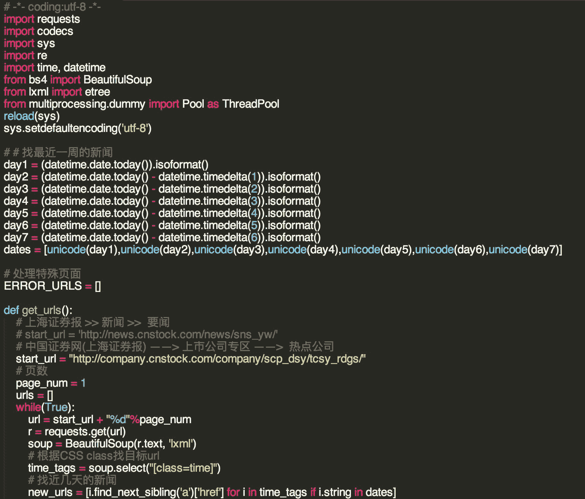
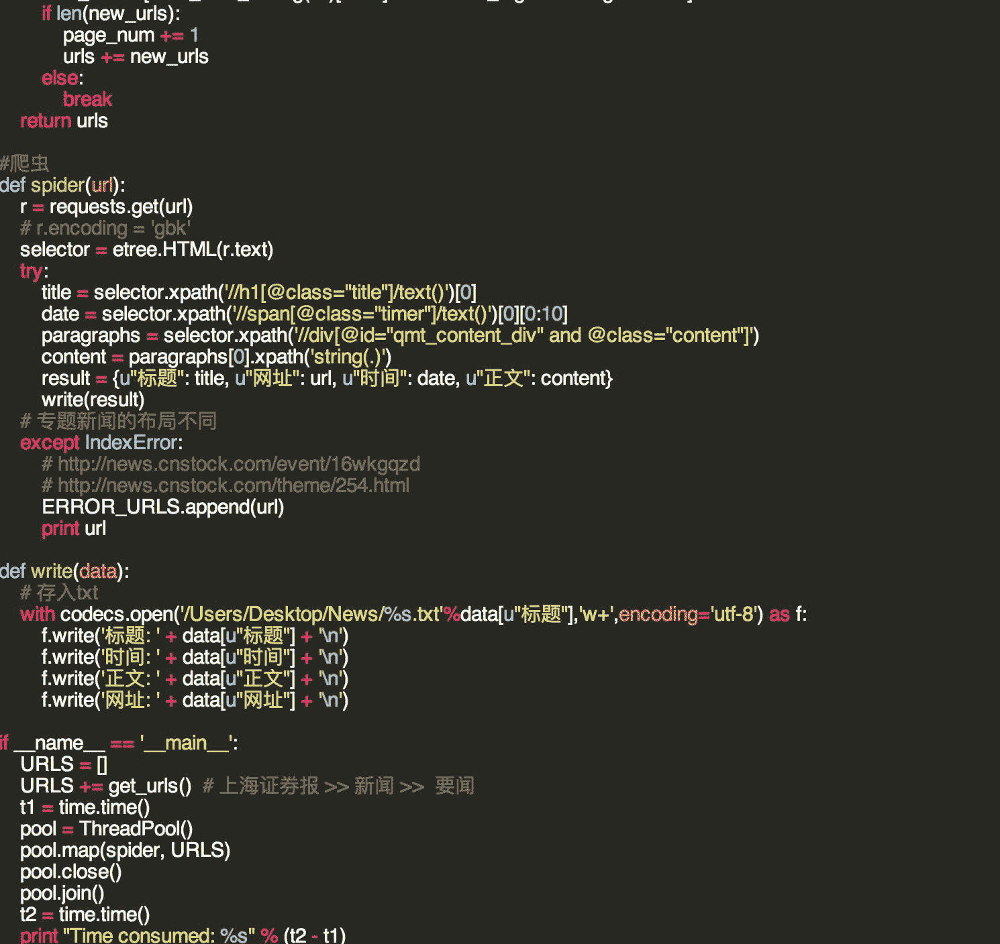
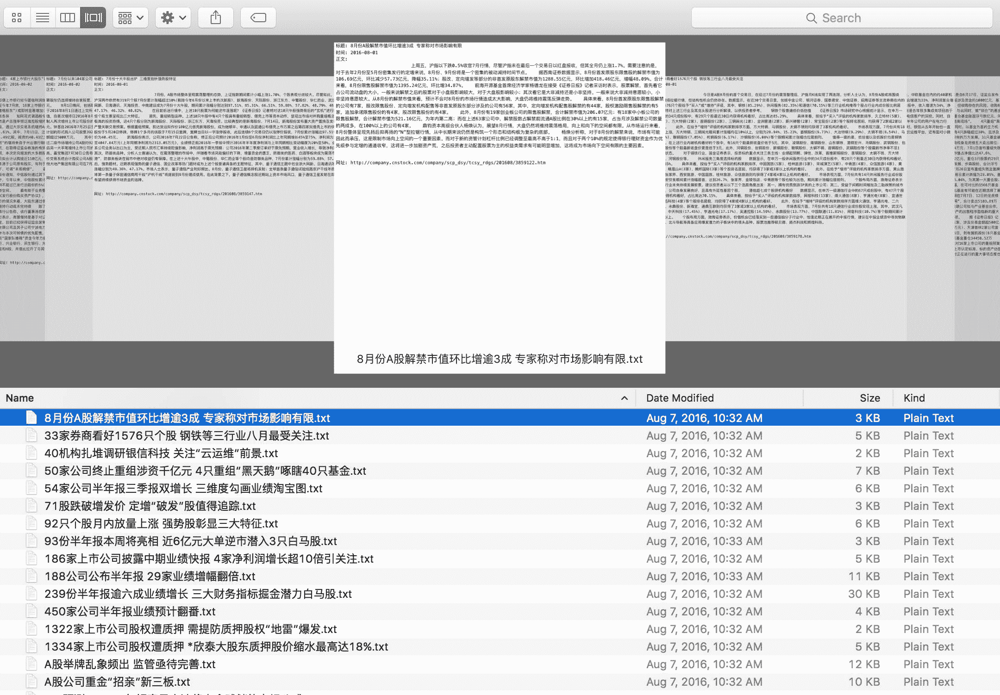
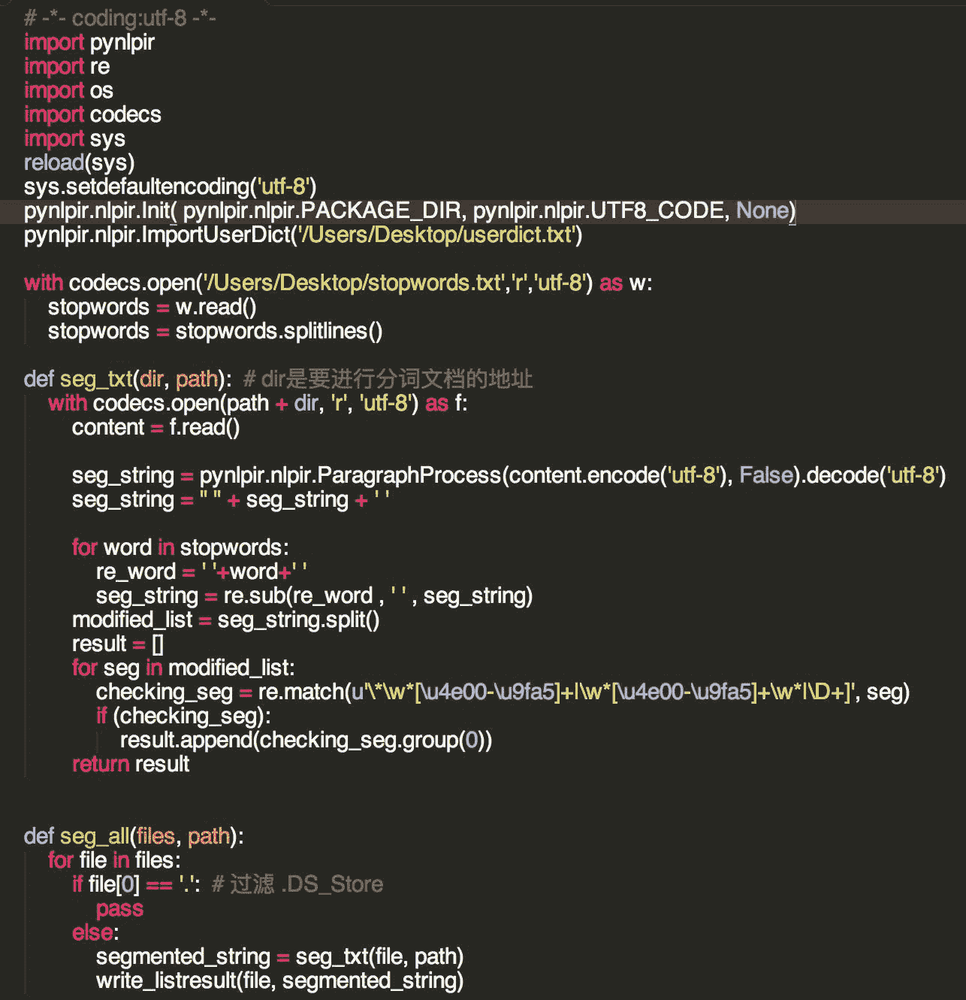
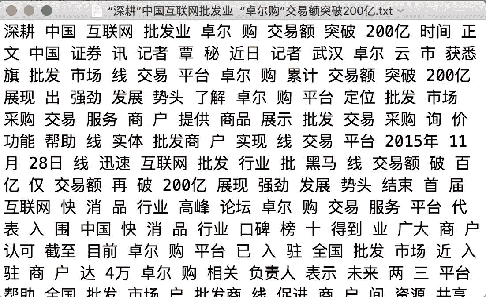
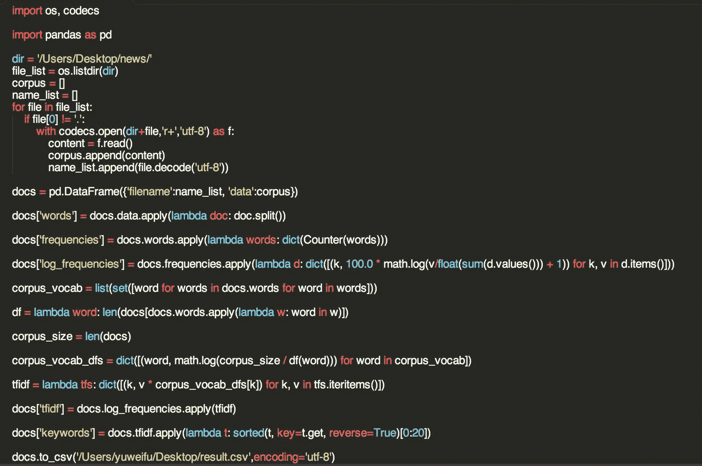
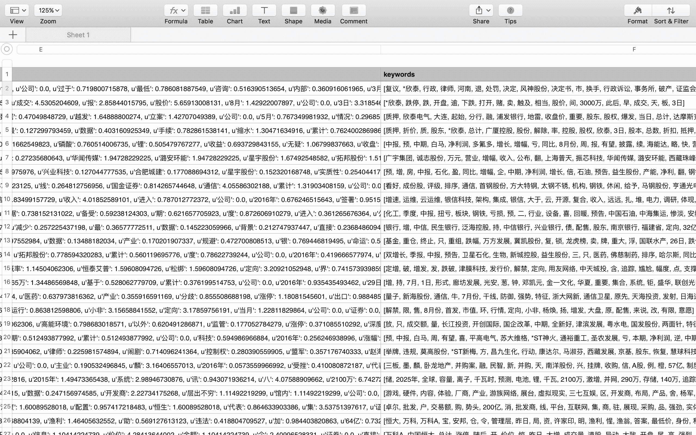

# 【Python 机器学习】文本数据分析简介

> 原文：[`mp.weixin.qq.com/s?__biz=MzAxNTc0Mjg0Mg==&mid=2653283553&idx=1&sn=ae17fcc2c7ed40bcace2812ab90977c8&chksm=802e26f4b759afe2e5a9a32a02c2496b5d8207cbc2baffc4445c0308894e8d84ba8ad4abd6a5&scene=27#wechat_redirect`](http://mp.weixin.qq.com/s?__biz=MzAxNTc0Mjg0Mg==&mid=2653283553&idx=1&sn=ae17fcc2c7ed40bcace2812ab90977c8&chksm=802e26f4b759afe2e5a9a32a02c2496b5d8207cbc2baffc4445c0308894e8d84ba8ad4abd6a5&scene=27#wechat_redirect)

> ********查看之前文章请点击右上角********，关注并且******查看历史消息******
> 
> ********所有文章全部分类和整理，让您更方便查找阅读。请在页面菜单里查找。********

 

> 文本类型数据是数据挖掘分析中重要的一部分。以证券市场分析为例，与一般的“价、量、宏观经济数字......”等相比，以新闻为代表的文本类数据揭示了市场信息不同纬度，往往更加即时、更贴近市场。

**今天就文本数据分析做简单的介绍。**

1**数据的获取**

> 依旧以对证券市场分析为例，常用到的数据有“财经新闻、上市公司公告、股吧网友讨论等”。我们希望从这些数据源中能得到有价值的信息，可能是一段时间的新闻热点、可能是网友对不同事件的正负面情绪、或者其他一些。
> 
> 第一步就是获取数据，新闻相关的有新浪财经、华尔街见闻等；上市公司公告有巨潮资讯网、交易所官网；股吧有东方财富网、雪球等。
> 
> 一般选用的方法就是爬虫了，根据各网站的不同，爬取难易程度不一 。大规模爬虫可以选用：scrapy  分布式爬取，而一般简单的爬虫可以用： lxml、BeautifulSoup、 Requests、Selenium 等。具体操作过程中，有些网站有比较强的反爬虫机制，需要加 ip 代理池等操作。
> 
> **举个简单例子 —— 爬取中国证券报网站上近一周的所有公司新闻。**
> 
> 简单过程就是：
> 
> a. 找到目标网页的 URL。
> 
> b. 在目标页面 URL 中找到目标内容并保存。
> 
> 一般可以通过 lxml.etree 用 xpath 定位实现、或者用 BeautifulSoup 根据 CSS 定位实现。
> 
> 
> 
> 
> 
> 至于数据的储存，各种数据库就依个人喜好了，例子中直接保存到 txt 里了。多说一句，例子中取的数据不牵涉到动态加载内容，如有需要最简单是 selenium 模拟，另外方法是 Chrome F12 network，分析 Ajax 内容，构造请求。具体今天就先略去了。

2**文本初步处理**

> 
> 
> 取得数据之后下一步就是简单的处理了，对中文来说，就是分词，去停用词这些，可用的工具有： Jieba 、PyNlpir 等。具体选哪个还是去试一下看哪个合适，自己选吧。
> 
> 对于要让程序到 practical 的程度，分词还是很重要的，因为很多专业术语，所以自定义字典 userdict 比较重要。上面提到的两个包都可以导入自定义字典，要达到令人满意的结果，这 userdict 就看个人了。去停用词就是删除一些没什么实际意义的形容词、助词等。
> 
> **分词程序：**
> 
> 
> 
> **分词结果：**
> 
> ****

3**提取关键词**

> 下一步是把每个文本提取关键词，用关键词向量代表每个文本。
> 
> 一般用的方法是有 TF－IDF，具体细节可以 wiki 一下。很简单，主要意思就是一个词在文档中出现频率越高，对文档而言更重要； 同时一个词要是在所有文档中都出现，比如“的”，那就重要性减弱。于是抽象出 "TF : termfrequency" 和  "IDF: inverse documentary frequency"。以“国企改革”为例，“TF”算的是“国企改革”在文章中出现的频率，“IDF”算“国企改革”在所有文档中出现频率。
> 
> 一般采用 log(...) * log(...)的形式，不过这个也可以变，没有一个规定。
> 
> scikit-learn 中有直接封装好的 TF-IDF 程序，在这里我贴出一个自己写的：
> 
> **关键词提取程序：**
> 
> 
> 
> **关键词提取结果：**
> 
> ****
> 
> 这样处理之后，一片文章就可以用几十个关键词表示，再进行下一步的聚类分析等。
> 
> 常用的文本相关性分析方法有：求文档间的余弦 Cosine、KMeans 等。

好了，今天先介绍到这里。大家有兴趣的话可以和 **royxroy@163.com** 联系，欢迎讨论问题：）

 

****后台回复下列关键字，更多惊喜在等着****你** **【区分大小写】**** 

****1.回复****每周论文** [**获取 Market Making 论文分享**](http://mp.weixin.qq.com/s?__biz=MzAxNTc0Mjg0Mg==&mid=2653283381&idx=1&sn=48ec361d5b5a0e86e7749ff100a1f335&scene=21#wechat_redirect)**

****2\. 回复****matlab 量化投资** **[**获取大量源码**](http://mp.weixin.qq.com/s?__biz=MzAxNTc0Mjg0Mg==&mid=2653283293&idx=1&sn=7c26d2958d1a463686b2600c69bd9bff&scene=21#wechat_redirect)****

******3\. 回复****每周书籍**[**获取国外书籍电子版**](http://mp.weixin.qq.com/s?__biz=MzAxNTc0Mjg0Mg==&mid=2653283159&idx=1&sn=2b5ff2017cabafc48fd3497ae5efa58c&scene=21#wechat_redirect)****

********4\.** **回复******文本挖掘**** ****[**获取关于文本挖掘的资料**](http://mp.weixin.qq.com/s?__biz=MzAxNTc0Mjg0Mg==&mid=2653283053&idx=1&sn=1d17fbc17545e561be0664af78304a67&scene=21#wechat_redirect)**********

************5\. 回复******金融数学**** ****[**获取金融数学藏书**](http://mp.weixin.qq.com/s?__biz=MzAxNTc0Mjg0Mg==&mid=403111936&idx=4&sn=97822bfa300f3d856d6c9acd8dc24914&scene=21#wechat_redirect)**************

**********6\. 回复******贝叶斯 Matlab********[**获取 NBM 详解与具体应用**](http://mp.weixin.qq.com/s?__biz=MzAxNTc0Mjg0Mg==&mid=401834925&idx=1&sn=d56246158c1002b2330a7c26fd401db6&scene=21#wechat_redirect)************

************7.回复****AdaBoost******[获取 AdaBoost 算法文献、代码、研报](http://mp.weixin.qq.com/s?__biz=MzAxNTc0Mjg0Mg==&mid=2653283387&idx=1&sn=d40b3a1ea73e3d85c124b5b1e4f3057b&scene=21#wechat_redirect)**************

**********8.回复****数据包络分析** **获取****[选股分析](http://mp.weixin.qq.com/s?__biz=MzAxNTc0Mjg0Mg==&mid=2653283401&idx=1&sn=fae6d0c0638174bb713952e6af983c54&scene=21#wechat_redirect)源码**********

********9.回复****SVD** **获取数据预处理之图像处理的方法********

**************** 

********【过往文章】********

******0.[【机器学习】支持向量机的概念与运用初探](http://mp.weixin.qq.com/s?__biz=MzAxNTc0Mjg0Mg==&mid=2653283515&idx=1&sn=edeedbb0190fc1c1242de5795635fccc&scene=21#wechat_redirect)******

******1[.【Python】金融应用中用 matplotlib 库实现的数据可视化](http://mp.weixin.qq.com/s?__biz=MzAxNTc0Mjg0Mg==&mid=2653283501&idx=2&sn=e69633b4acd9f7fd39b64e734448a0a7&scene=21#wechat_redirect)******

******2[.【Python】信息熵和在决策树中的运用（附源码）](http://mp.weixin.qq.com/s?__biz=MzAxNTc0Mjg0Mg==&mid=2653283451&idx=1&sn=2f10aaa1083856c0a2e07e718a3973cd&scene=21#wechat_redirect)******

******3[.【论文分享】因子模型是否具有良好的预测性？](http://mp.weixin.qq.com/s?__biz=MzAxNTc0Mjg0Mg==&mid=2653283422&idx=1&sn=ab95987e8eebba4572a7004f6ced9cc2&scene=21#wechat_redirect)******

******4[.【Python 机器学习】数据预处理——图像压缩与线性代数](http://mp.weixin.qq.com/s?__biz=MzAxNTc0Mjg0Mg==&mid=2653283419&idx=1&sn=43f113c5e81745b607e9e1f60e7f1a35&scene=21#wechat_redirect)******

******5[.【Matlab 量化投资】用数据包络分析和基因算法进行选股分析？你 get 了吗！（附源程序）](http://mp.weixin.qq.com/s?__biz=MzAxNTc0Mjg0Mg==&mid=2653283401&idx=1&sn=fae6d0c0638174bb713952e6af983c54&scene=21#wechat_redirect)******

******6[.【机器学习课程】经典算法之——AdaBoost 在量化投资中的应用（附代码和很多论文资料）](http://mp.weixin.qq.com/s?__biz=MzAxNTc0Mjg0Mg==&mid=2653283387&idx=1&sn=d40b3a1ea73e3d85c124b5b1e4f3057b&scene=21#wechat_redirect)******

******7[.【论文分享】Market Making 论文分享](http://mp.weixin.qq.com/s?__biz=MzAxNTc0Mjg0Mg==&mid=2653283381&idx=1&sn=48ec361d5b5a0e86e7749ff100a1f335&scene=21#wechat_redirect)******

******8.[【机器学习课程】深度学习与神经网络系列之绪论介绍](http://mp.weixin.qq.com/s?__biz=MzAxNTc0Mjg0Mg==&mid=404690945&idx=1&sn=39ae29caade4b2fac87304d5091ecfc0&scene=21#wechat_redirect)****** 

******9.[【Python 机器学习】系列之线性回归篇【深度详细】](http://mp.weixin.qq.com/s?__biz=MzAxNTc0Mjg0Mg==&mid=405488375&idx=1&sn=e06859f0d3cf5102946bd1551d80184a&scene=21#wechat_redirect)****** 

******10.[【Python 机器学习】系列五决策树非线性回归与分类（深度详细附源码）](http://mp.weixin.qq.com/s?__biz=MzAxNTc0Mjg0Mg==&mid=2653283257&idx=1&sn=1b081581fd2b80c2bdfa03fdc73b1d3a&scene=21#wechat_redirect)****** 

******11.[【每周研报干货】各大券商研报免费分享（附下载链接）](http://mp.weixin.qq.com/s?__biz=MzAxNTc0Mjg0Mg==&mid=2653283257&idx=2&sn=49c78925e7f3535b9cad95bf91574519&scene=21#wechat_redirect)******

******12.[【每周书籍干货】国外近期深度学习与机器学习书籍电子版——你知道一本买来好多刀啊！](http://mp.weixin.qq.com/s?__biz=MzAxNTc0Mjg0Mg==&mid=2653283143&idx=1&sn=2316c1a067239aa007196cc8cb2e6c5b&scene=21#wechat_redirect)******

******13.[几种编程语言的优缺点](http://mp.weixin.qq.com/s?__biz=MzAxNTc0Mjg0Mg==&mid=2653283125&idx=1&sn=fc1a2a490600516cbdbbebfa4cd9d8fb&scene=21#wechat_redirect)****** 

******14.[【Python 机器学习】系列之从线性回归到逻辑回归篇（深度详细附源码）](http://mp.weixin.qq.com/s?__biz=MzAxNTc0Mjg0Mg==&mid=2653283118&idx=1&sn=fb38ed89200ba96f9ed2791dce76d55e&scene=21#wechat_redirect)****** 

******15.[【Python 机器学习】系列之特征提取与处理篇（深度详细附源码）](http://mp.weixin.qq.com/s?__biz=MzAxNTc0Mjg0Mg==&mid=2653283084&idx=1&sn=c7dd24ea9f5633f1f5370176fadef05f&scene=21#wechat_redirect)****** 

******16.[【最强干货】关于文本挖掘的资料（文献，报告，策略，代码）](http://mp.weixin.qq.com/s?__biz=MzAxNTc0Mjg0Mg==&mid=2653283053&idx=1&sn=1d17fbc17545e561be0664af78304a67&scene=21#wechat_redirect)******

******17.[机器学习的前期入门汇总](http://mp.weixin.qq.com/s?__biz=MzAxNTc0Mjg0Mg==&mid=404455727&idx=3&sn=d05688effdbb0583031ef9ae98c64387&scene=21#wechat_redirect)******

******18.[【深度原创研究】分级基金下折全攻略（一）](http://mp.weixin.qq.com/s?__biz=MzAxNTc0Mjg0Mg==&mid=403551881&idx=1&sn=e1ed56f607a0fe187dd7a0cf5178b638&scene=21#wechat_redirect)******

******19.[【深度原创研究】分级基金下折全攻略（二）](http://mp.weixin.qq.com/s?__biz=MzAxNTc0Mjg0Mg==&mid=403626226&idx=1&sn=4d1f56a6599c92fd6688e5eb5d7d15dc&scene=21#wechat_redirect)******

******20.[【知识食粮】最新华尔街牛人必读书籍排行](http://mp.weixin.qq.com/s?__biz=MzAxNTc0Mjg0Mg==&mid=401910135&idx=1&sn=43d5eb7549281bb9231a3be831302139&scene=21#wechat_redirect)******

******21.[通过 MATLAB 处理大数据](http://mp.weixin.qq.com/s?__biz=MzAxNTc0Mjg0Mg==&mid=401910135&idx=2&sn=5289317b5fa1afe4a5a4115520aaa8ac&scene=21#wechat_redirect)******

******22.[【扎实资料干货分享】Python、研究报告、计量经济学、投资书籍、R 语言等！(Book+Video)](http://mp.weixin.qq.com/s?__biz=MzAxNTc0Mjg0Mg==&mid=2653282744&idx=2&sn=c9e9fbf1fd0cd4efa8bf08b9c5f16d8a&scene=21#wechat_redirect)******

******23.[机器学习在统计套利中的应用](http://mp.weixin.qq.com/s?__biz=MzAxNTc0Mjg0Mg==&mid=2653282744&idx=3&sn=85d30593998974cfaf714ac0cf81f8cd&scene=21#wechat_redirect)******

******24.[量化投资修行之路](http://mp.weixin.qq.com/s?__biz=MzAxNTc0Mjg0Mg==&mid=2653282744&idx=4&sn=0ff993c537b4b1689967f1560dfd45be&scene=21#wechat_redirect)******

******25.[统计套利在股指期货跨期套利中的应用：基于协整方法的估计](http://mp.weixin.qq.com/s?__biz=MzAxNTc0Mjg0Mg==&mid=405625337&idx=3&sn=60d19beefab3a1636554b216a9b05742&scene=21#wechat_redirect)******

******26.[股指期货跨品种套利交易](http://mp.weixin.qq.com/s?__biz=MzAxNTc0Mjg0Mg==&mid=405625337&idx=2&sn=e136d7bb6542789fa12f1f90dd206641&scene=21#wechat_redirect)******

******27.[沪港通股票统计套利：基于 BP 神经网络](http://mp.weixin.qq.com/s?__biz=MzAxNTc0Mjg0Mg==&mid=405625337&idx=1&sn=c7d62703af3e5cdb90f0b1b853f8a483&scene=21#wechat_redirect)******

******28.[机器学习到底在量化金融里哪些方面有应用？](http://mp.weixin.qq.com/s?__biz=MzAxNTc0Mjg0Mg==&mid=2653282744&idx=1&sn=73db745def6298a1e352c03f51d26d95&scene=21#wechat_redirect)******

******29.[【Matlab 机器学习】之图像识别](http://mp.weixin.qq.com/s?__biz=MzAxNTc0Mjg0Mg==&mid=2653282814&idx=1&sn=f1224ea30942468ee39aa96d6ea0dd8f&scene=21#wechat_redirect)******

******30.[【干货分享】Python 数据结构与算法设计总结篇](http://mp.weixin.qq.com/s?__biz=MzAxNTc0Mjg0Mg==&mid=2653282752&idx=1&sn=5db4c3e27508abc083a7a5f388ddb6ed&scene=21#wechat_redirect)******

******31.[基于 Python 的股票数据接口调用代码实例](http://mp.weixin.qq.com/s?__biz=MzAxNTc0Mjg0Mg==&mid=2653282828&idx=1&sn=126ad1c21ce5795f8744690cb1effc13&scene=21#wechat_redirect)******

******32.[基于 Python 爬取腾讯网的最热评论代码实例](http://mp.weixin.qq.com/s?__biz=MzAxNTc0Mjg0Mg==&mid=2653282828&idx=2&sn=d73b96b78ce43b151c69ab3e70e4d24c&scene=21#wechat_redirect)******

******33.[卷积神经网络反向传播推导](http://mp.weixin.qq.com/s?__biz=MzAxNTc0Mjg0Mg==&mid=2653282851&idx=1&sn=6cc6f32f8d35089a3c80cdc4c95b48a9&scene=21#wechat_redirect)******

******34.[深度学习项目](http://mp.weixin.qq.com/s?__biz=MzAxNTc0Mjg0Mg==&mid=2653282851&idx=2&sn=d683b6a6570309b7dc07d79829c56b72&scene=21#wechat_redirect)******

******35.[混沌分形理论](http://mp.weixin.qq.com/s?__biz=MzAxNTc0Mjg0Mg==&mid=2653282968&idx=1&sn=04dcad950d1f1093ec35d7d70459020a&scene=21#wechat_redirect)******

******36.[【Python】基于情感词典进行情感分析（附代码）](http://mp.weixin.qq.com/s?__biz=MzAxNTc0Mjg0Mg==&mid=2653282977&idx=1&sn=715655ed0965227450696decde1b9864&scene=21#wechat_redirect)******

******37.[基于技术交易规则的动态模型股票价格（附论文和 Matlab 源程序）](http://mp.weixin.qq.com/s?__biz=MzAxNTc0Mjg0Mg==&mid=2653282981&idx=1&sn=7fcfb07c09bc6c40bb8e19972e4349c1&scene=21#wechat_redirect)******