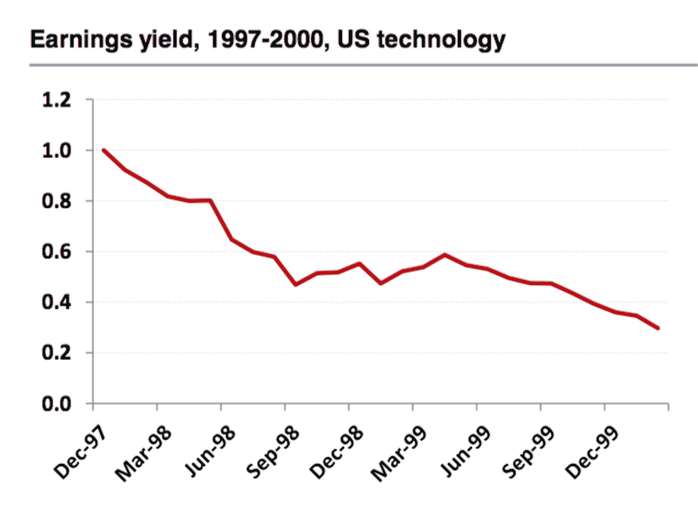
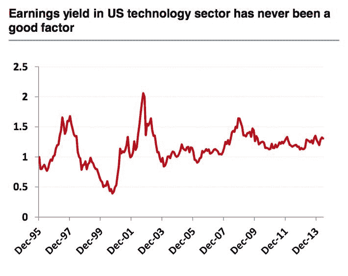

# 【多因子系列】之新手必看 | 量化交易七宗罪

> 原文：[`mp.weixin.qq.com/s?__biz=MzAxNTc0Mjg0Mg==&mid=2653283543&idx=1&sn=f7376931ac3a99647b26ba5fa0c597d7&chksm=802e26c2b759afd402eca679710b35848ee9a429becdb6a2e98358511a7894f60b0d3e1e1834&scene=27#wechat_redirect`](http://mp.weixin.qq.com/s?__biz=MzAxNTc0Mjg0Mg==&mid=2653283543&idx=1&sn=f7376931ac3a99647b26ba5fa0c597d7&chksm=802e26c2b759afd402eca679710b35848ee9a429becdb6a2e98358511a7894f60b0d3e1e1834&scene=27#wechat_redirect)

> ********查看之前文章请点击右上角********，关注并且******查看历史消息******
> 
> ********所有文章全部分类和整理，让您更方便查找阅读。请在页面菜单里查找。********

从今日的推文到后面的一段时间。编辑部会给大家带来一系列关于**多因子构建**的文章，而作为这一系列的第一篇文章，我们希望和大家分享一篇来自德银的量化报告，我们认为这是一篇新手必看的报告，而对于老手也是一篇非常值得思考的报告。

**零、**

随着计算能力的提升和现成的可使用回测软件及平台的发展，也许量化投资变得越来越容易。然而量化投资是一个坑非常多的领域，在你运用传统方法或者直接套用机器学习方法构建策略的时候，也许你已经不知不觉掉入了坑中，导致了实盘交易的直接亏损。在这篇文章中，我们讨论七个在执行回测，建立量化模型经常犯的错误。其中的一些可能大家都非常熟悉，但尽管如此，你可能会惊讶地看到这些错误会造成意想不到的偏差。

**一、Survivorship bias(生存偏差)**

忽略不活跃公司

生存偏差是投资者最常见的错误之一。大多数人都知道生存偏差，但很少有人知道它的意义。

我们在回测的时候倾向于只使用当前存在的公司，这意味我们剔除了那些因为破产、重组而退市的公司的影响。当我们在沪深 300 这 300 只股票中做策略的时候(每半年沪深 300 成分股会做调整)，如果没有考虑到那些被剔除出沪深 300 指数成分股的股票的影响，举个例子，歌华有线(600037)是今年 6 月 13 日纳入沪深 300 指数的，如果我们在做策略的时候选用了现在的沪深 300 指数的成分股作为股票池，并且固定下来用来做回测，这样 6 月 13 日之前的回测结果是不正确的，因为 6 月 13 日之前的成分股里并没有歌华有线，而是包含了一些在 6 月 13 日被剔除出成分股的股票，而这些被剔除的股票没有出现在你策略的股票池里，也就是说只利用了现在成分股的信息对过去做了回测，剔除了那些在未来因为业绩或者股价表现不好而被剔除出沪深 300 成分股的股票的影响。

然而目前在免费公开的网站上都没有提供沪深 300 这一类指数成分股的历史调整信息，大家在用这些自己抓取的数据做策略的时候要格外小心，还有我大致看了一下优矿这一类平台，好像它们做回测的时候股票池中的股票也是一开始就固定下来不随着交易日变动的，会有生存偏差的问题存在。

下面我通过几张图展现一下生存偏差带来的影响究竟有多大。

第一张图展示的是，msci 欧洲指数成分股等权重作为一个投资组合在过去的表现。蓝线为正确的投资组合，红线为存在生存偏差的组合。我们可以看到红线明显收益高于蓝线，这会使得在回测时高估投资组合的收益。

第二张图是我自己画的沪深 300 成分股的情况。

从上面两张图，我们已经看到生存偏差对回测结果的影响很大。而更令人震惊的是，在做因子分析时，它有可能带来完全相反的结果。

上面两张图是在罗素 3000 指数的测试结果，选取的因子为**公司质量/公司的债务风险**，蓝线的为因子数值高的一篮子股票，红线为因子数值低的一篮子股票。第一张图是不存在生存偏差的结果，也是符合我们的直观逻辑的，公司质量越好、债务风险越低，未来的收益也就越高。第二张图是存在生存偏差的，也就是将现在的罗素 3000 指数的成分股固定下来对过去做回测，我们得到了公司质量越差债务风险越高，未来收益越高的错误结果。这也非常容易解释，因为存在生存偏差之后，我们的股票池里没有那些在过去退市破产的股票，而在这个股票池里选出来的质量差债务风险高的股票恰恰是那些在未来实现困境反转的股票，所以它的组合收益会偏高。

上面只是一个例子，还有很多的因子在存在生存偏差的时候，会得到完全相反的结果，具体可以看德银的报告。

**二、Look-ahead bias(未来函数)**

    顾名思义，它是指在回测时，使用了回测当时还不可用或者还没有公开的数据，这也是回测中最常见的错误。

    最为典型的一个例子就是公司的财务数据。我们都知道公司财务数据一般都要延后很久才会发布，比如 2015 年的年度财务数据，要到 2016 年的 2 月，3 月甚至 4 月才会发布。在我们使用财务数据时，非常容易在 2016 年初就将 2015 年的年度财务数据拿来用，而实际上这些数据在当时并不是可用的，要到公司发布报表后才能使用。

    我们需要使用一个一个时间点的数据，比如公司在 2016 年 2 月 10 日发布财务报表，那么公司在 2016 年 2 月 9 日和 2016 年 2 月 11 日的两份财务数据就是不同的，我们把这种数据称为 point-at-time 的数据，简称 pit，在回测时需要保证所有使用的数据都是 point-at-time 的，这样才能规避未来函数的错误。

    下面一张图展现了一个基于财务数据的因子在 pit 和 non-pit 数据上的回测结果的巨大差别。

 

    另外在使用复权或者不复权价格数据时，一些因子也会在回测时产生巨大差别。如下图

**三、The sin of storytelling(讲故事)**

先来看四张图：

 

我们可以看到 Earnings yield 这一个因子在美国科技股 1997-2000 和 2000-2002 两段时间的表现截然相反。但如果看单张图，我们很容易认为 earnings yield 是一个好的因子，并且我们都可以根据回测结果讲一个故事来解释这个回测结果确实是可信的。然而当我们把回测时间拉长，我们看到在美国科技股这一个股票池上这个因子完全没有作用，但是在罗素 3000 这个股票池中这一个因子非常有效。从中我们可以看到，股票池的选取和回测的时间长短对因子的有效性判断影响非常大，而一个真正好的因子应该对于回测时间选取以及股票池选取是具有鲁棒性的。

**四、Data mining and data snooping(数据挖掘)**

数据挖掘或者说机器学习方法是现在很火的一个方向，虽然这些方法非常有用，但是都基于一些前提，比如海量的数据、底噪的数据。然而原始的金融数据这两个前提都不符合，金融的数据量离海量数据还非常远，大家也都知道金融的交易数据是噪音非常大的，如果强行用机器学习方法套用到一些原始的交易数据上，可能会产生下图的的情况。

 

在构建策略或者寻找因子时，我们都应该有自己的逻辑和动机，而量化分析只是验证自己的逻辑或动机的一个工具，而不是一味的套用机器学习方法帮助我们去寻找逻辑。一般来说我们寻找因子的动机大多来自于一些金融学基础理论、市场的无效性、行为金融学等等邻域。当然也不是说机器学习在量化邻域没有用，实际上它在量化邻域一些特定的问题上还是非常有用的，在我后面的文章里应该会提到。

**五、Signal decay, turnover, and transaction cost(信号衰减，换手率，交易成本)**

信号衰减指的是一个因子产生后对未来多长时间的股票回报有预测能力。有一些因子衰减很慢，大多为一些基于财务数据的因子，可能 2015 年 6 月产生的因子对今天的股票回报还存在预测能力；而另一些因子衰减很快，大多为一些基于价量的因子，可能前天产生的因子对今天就没有预测能力。我们当然希望因子的衰减越慢越好，这样我们根据因子构建的策略调仓频率就不会太高，相应的策略换手率也就会降低，交易成本也随之降低。然而我们知道有很大一部分因子衰减很快，所以我们需要一个折中方案，优化我们的调仓频率，究竟多久调一次仓最好，这是需要深入研究优化的。下图展现一个衰减速度极快的因子。

 

**六、Outliers – spectacular successes and failures(离群值)**

传统的离群值控制技术包括：极值调整（将某些百分比之外的数据磨平，也就是 winsorization）和截断（去除数据样本异常值）。但是这里我们提出两个问题，离群值是否应该被消除，消除离群值还有没有其他什么方法。

实际上离群值是可以包含一些信息的。下图是一个基于动量的策略的收益曲线，蓝线是去除了离群点，红线是保留了离群点的，我们可以看到保留了离群点的动量策略要远远好于去除了离群点。也就是说在离群点数据中包含了很大一部分信息，如果我们在做数据归一化时去除了离群点，我们就相当于损失了很大一部分信息。

 

那么我们可以通过什么方法在保留信息的情况下尽量不出现离群点呢？如果离群点出现在我们自己构建的因子里，很有可能我们在构建因子的时候用了除法或者乘法，比如 1/0.5=2,1/0.1=10,我们可以看到分母从 0.5 变到 0.1 虽然变化不大，但是最后的结果从 2 变到 10，这就是使用除法带来的坏处，极易产生离群点，所以在构建因子时如果可以不用乘除法来做运算，那就尽量不要用。如果无法避免出现离群点，我们可以做 log，因为 log 有很好的处理离群点的性质(log(x/y)=log(x)-log(y))相当于将除法变成了减法。另一种常用的方法是排名，即用按因子数值的大小排名替换原始的数值，这样我们就不看数据的绝对数值，只看数据相对数值。

**七、The asymmetric payoff pattern and shorting(策略的不对称性)**

一般来说，我们做多因子策略时默认的是多空策略，也就是我们在选出一些好的股票做多的同时要选出一些差的股票做空，这就是我们常说的对冲策略。这样我们的策略收益来自两部分，一部来自于做多的股票，一部分来自多空的股票。对于好的因子来说，这两部分收益应该是差不多的，但实际情况是大部分因子带来的收益是不对称的，如下图。而在天朝的 a 股市场上个股是无法做空的，所以我们只能够做空股指赚取做多的那一部分收益。

 

不过我相信在将来的某一天，a 股也会开放做空，那时候我们的策略还要考虑能否借到股票做空以及做空的成本等问题。这些问题可能会使你的策略从赚钱变成不赚钱甚至是亏损。

本文主要介绍了构建量化策略需要注意的 7 个要点，第一次写文章请大家多多包涵，原报告地址如下：http://newyork.qwafafew.org/wp-content/uploads/sites/4/2015/10/Luo_20150128.pdf

做一下下一篇文章的预告，下一篇文章我会与大家分享一下我们常常说的因子到底是什么，它从哪里来，而我们又能如何自己去发现有效的因子。

如果觉得文章很有帮助，请多多赞赏呦~！

**后台回复下列关键字，更多惊喜在等着****你** **【区分大小写】**  

**1.回复****每周论文** [**获取 Market Making 论文分享**](http://mp.weixin.qq.com/s?__biz=MzAxNTc0Mjg0Mg==&mid=2653283381&idx=1&sn=48ec361d5b5a0e86e7749ff100a1f335&scene=21#wechat_redirect)

**2\. 回复****matlab 量化投资** **[**获取大量源码**](http://mp.weixin.qq.com/s?__biz=MzAxNTc0Mjg0Mg==&mid=2653283293&idx=1&sn=7c26d2958d1a463686b2600c69bd9bff&scene=21#wechat_redirect)**

****3\. 回复****每周书籍**[**获取国外书籍电子版**](http://mp.weixin.qq.com/s?__biz=MzAxNTc0Mjg0Mg==&mid=2653283159&idx=1&sn=2b5ff2017cabafc48fd3497ae5efa58c&scene=21#wechat_redirect)**

******4\.** **回复******文本挖掘**** ****[**获取关于文本挖掘的资料**](http://mp.weixin.qq.com/s?__biz=MzAxNTc0Mjg0Mg==&mid=2653283053&idx=1&sn=1d17fbc17545e561be0664af78304a67&scene=21#wechat_redirect)********

************5\. 回复******金融数学**** ****[**获取金融数学藏书**](http://mp.weixin.qq.com/s?__biz=MzAxNTc0Mjg0Mg==&mid=403111936&idx=4&sn=97822bfa300f3d856d6c9acd8dc24914&scene=21#wechat_redirect)**************

**********6\. 回复******贝叶斯 Matlab********[**获取 NBM 详解与具体应用**](http://mp.weixin.qq.com/s?__biz=MzAxNTc0Mjg0Mg==&mid=401834925&idx=1&sn=d56246158c1002b2330a7c26fd401db6&scene=21#wechat_redirect)************

************7.回复****AdaBoost******[获取 AdaBoost 算法文献、代码、研报](http://mp.weixin.qq.com/s?__biz=MzAxNTc0Mjg0Mg==&mid=2653283387&idx=1&sn=d40b3a1ea73e3d85c124b5b1e4f3057b&scene=21#wechat_redirect)**************

**********8.回复****数据包络分析** **获取****[选股分析](http://mp.weixin.qq.com/s?__biz=MzAxNTc0Mjg0Mg==&mid=2653283401&idx=1&sn=fae6d0c0638174bb713952e6af983c54&scene=21#wechat_redirect)源码**********

********9.回复****SVD** **获取数据预处理之图像处理的方法********

**************** 

********【过往文章】********

********0.[【机器学习】支持向量机的概念与运用初探](http://mp.weixin.qq.com/s?__biz=MzAxNTc0Mjg0Mg==&mid=2653283515&idx=1&sn=edeedbb0190fc1c1242de5795635fccc&scene=21#wechat_redirect)********

********1[.【Python】金融应用中用 matplotlib 库实现的数据可视化](http://mp.weixin.qq.com/s?__biz=MzAxNTc0Mjg0Mg==&mid=2653283501&idx=2&sn=e69633b4acd9f7fd39b64e734448a0a7&scene=21#wechat_redirect)********

********2[.【Python】信息熵和在决策树中的运用（附源码）](http://mp.weixin.qq.com/s?__biz=MzAxNTc0Mjg0Mg==&mid=2653283451&idx=1&sn=2f10aaa1083856c0a2e07e718a3973cd&scene=21#wechat_redirect)********

********3[.【论文分享】因子模型是否具有良好的预测性？](http://mp.weixin.qq.com/s?__biz=MzAxNTc0Mjg0Mg==&mid=2653283422&idx=1&sn=ab95987e8eebba4572a7004f6ced9cc2&scene=21#wechat_redirect)********

********4[.【Python 机器学习】数据预处理——图像压缩与线性代数](http://mp.weixin.qq.com/s?__biz=MzAxNTc0Mjg0Mg==&mid=2653283419&idx=1&sn=43f113c5e81745b607e9e1f60e7f1a35&scene=21#wechat_redirect)********

********5[.【Matlab 量化投资】用数据包络分析和基因算法进行选股分析？你 get 了吗！（附源程序）](http://mp.weixin.qq.com/s?__biz=MzAxNTc0Mjg0Mg==&mid=2653283401&idx=1&sn=fae6d0c0638174bb713952e6af983c54&scene=21#wechat_redirect)********

********6[.【机器学习课程】经典算法之——AdaBoost 在量化投资中的应用（附代码和很多论文资料）](http://mp.weixin.qq.com/s?__biz=MzAxNTc0Mjg0Mg==&mid=2653283387&idx=1&sn=d40b3a1ea73e3d85c124b5b1e4f3057b&scene=21#wechat_redirect)********

********7[.【论文分享】Market Making 论文分享](http://mp.weixin.qq.com/s?__biz=MzAxNTc0Mjg0Mg==&mid=2653283381&idx=1&sn=48ec361d5b5a0e86e7749ff100a1f335&scene=21#wechat_redirect)********

********8.[【机器学习课程】深度学习与神经网络系列之绪论介绍](http://mp.weixin.qq.com/s?__biz=MzAxNTc0Mjg0Mg==&mid=404690945&idx=1&sn=39ae29caade4b2fac87304d5091ecfc0&scene=21#wechat_redirect)******** 

********9.[【Python 机器学习】系列之线性回归篇【深度详细】](http://mp.weixin.qq.com/s?__biz=MzAxNTc0Mjg0Mg==&mid=405488375&idx=1&sn=e06859f0d3cf5102946bd1551d80184a&scene=21#wechat_redirect)******** 

********10.[【Python 机器学习】系列五决策树非线性回归与分类（深度详细附源码）](http://mp.weixin.qq.com/s?__biz=MzAxNTc0Mjg0Mg==&mid=2653283257&idx=1&sn=1b081581fd2b80c2bdfa03fdc73b1d3a&scene=21#wechat_redirect)******** 

********11.[【每周研报干货】各大券商研报免费分享（附下载链接）](http://mp.weixin.qq.com/s?__biz=MzAxNTc0Mjg0Mg==&mid=2653283257&idx=2&sn=49c78925e7f3535b9cad95bf91574519&scene=21#wechat_redirect)********

********12.[【每周书籍干货】国外近期深度学习与机器学习书籍电子版——你知道一本买来好多刀啊！](http://mp.weixin.qq.com/s?__biz=MzAxNTc0Mjg0Mg==&mid=2653283143&idx=1&sn=2316c1a067239aa007196cc8cb2e6c5b&scene=21#wechat_redirect)********

********13.[几种编程语言的优缺点](http://mp.weixin.qq.com/s?__biz=MzAxNTc0Mjg0Mg==&mid=2653283125&idx=1&sn=fc1a2a490600516cbdbbebfa4cd9d8fb&scene=21#wechat_redirect)******** 

********14.[【Python 机器学习】系列之从线性回归到逻辑回归篇（深度详细附源码）](http://mp.weixin.qq.com/s?__biz=MzAxNTc0Mjg0Mg==&mid=2653283118&idx=1&sn=fb38ed89200ba96f9ed2791dce76d55e&scene=21#wechat_redirect)******** 

********15.[【Python 机器学习】系列之特征提取与处理篇（深度详细附源码）](http://mp.weixin.qq.com/s?__biz=MzAxNTc0Mjg0Mg==&mid=2653283084&idx=1&sn=c7dd24ea9f5633f1f5370176fadef05f&scene=21#wechat_redirect)******** 

********16.[【最强干货】关于文本挖掘的资料（文献，报告，策略，代码）](http://mp.weixin.qq.com/s?__biz=MzAxNTc0Mjg0Mg==&mid=2653283053&idx=1&sn=1d17fbc17545e561be0664af78304a67&scene=21#wechat_redirect)********

********17.[机器学习的前期入门汇总](http://mp.weixin.qq.com/s?__biz=MzAxNTc0Mjg0Mg==&mid=404455727&idx=3&sn=d05688effdbb0583031ef9ae98c64387&scene=21#wechat_redirect)********

********18.[【深度原创研究】分级基金下折全攻略（一）](http://mp.weixin.qq.com/s?__biz=MzAxNTc0Mjg0Mg==&mid=403551881&idx=1&sn=e1ed56f607a0fe187dd7a0cf5178b638&scene=21#wechat_redirect)********

********19.[【深度原创研究】分级基金下折全攻略（二）](http://mp.weixin.qq.com/s?__biz=MzAxNTc0Mjg0Mg==&mid=403626226&idx=1&sn=4d1f56a6599c92fd6688e5eb5d7d15dc&scene=21#wechat_redirect)********

********20.[【知识食粮】最新华尔街牛人必读书籍排行](http://mp.weixin.qq.com/s?__biz=MzAxNTc0Mjg0Mg==&mid=401910135&idx=1&sn=43d5eb7549281bb9231a3be831302139&scene=21#wechat_redirect)********

********21.[通过 MATLAB 处理大数据](http://mp.weixin.qq.com/s?__biz=MzAxNTc0Mjg0Mg==&mid=401910135&idx=2&sn=5289317b5fa1afe4a5a4115520aaa8ac&scene=21#wechat_redirect)********

********22.[【扎实资料干货分享】Python、研究报告、计量经济学、投资书籍、R 语言等！(Book+Video)](http://mp.weixin.qq.com/s?__biz=MzAxNTc0Mjg0Mg==&mid=2653282744&idx=2&sn=c9e9fbf1fd0cd4efa8bf08b9c5f16d8a&scene=21#wechat_redirect)********

********23.[机器学习在统计套利中的应用](http://mp.weixin.qq.com/s?__biz=MzAxNTc0Mjg0Mg==&mid=2653282744&idx=3&sn=85d30593998974cfaf714ac0cf81f8cd&scene=21#wechat_redirect)********

********24.[量化投资修行之路](http://mp.weixin.qq.com/s?__biz=MzAxNTc0Mjg0Mg==&mid=2653282744&idx=4&sn=0ff993c537b4b1689967f1560dfd45be&scene=21#wechat_redirect)********

********25.[统计套利在股指期货跨期套利中的应用：基于协整方法的估计](http://mp.weixin.qq.com/s?__biz=MzAxNTc0Mjg0Mg==&mid=405625337&idx=3&sn=60d19beefab3a1636554b216a9b05742&scene=21#wechat_redirect)********

********26.[股指期货跨品种套利交易](http://mp.weixin.qq.com/s?__biz=MzAxNTc0Mjg0Mg==&mid=405625337&idx=2&sn=e136d7bb6542789fa12f1f90dd206641&scene=21#wechat_redirect)********

********27.[沪港通股票统计套利：基于 BP 神经网络](http://mp.weixin.qq.com/s?__biz=MzAxNTc0Mjg0Mg==&mid=405625337&idx=1&sn=c7d62703af3e5cdb90f0b1b853f8a483&scene=21#wechat_redirect)********

********28.[机器学习到底在量化金融里哪些方面有应用？](http://mp.weixin.qq.com/s?__biz=MzAxNTc0Mjg0Mg==&mid=2653282744&idx=1&sn=73db745def6298a1e352c03f51d26d95&scene=21#wechat_redirect)********

********29.[【Matlab 机器学习】之图像识别](http://mp.weixin.qq.com/s?__biz=MzAxNTc0Mjg0Mg==&mid=2653282814&idx=1&sn=f1224ea30942468ee39aa96d6ea0dd8f&scene=21#wechat_redirect)********

********30.[【干货分享】Python 数据结构与算法设计总结篇](http://mp.weixin.qq.com/s?__biz=MzAxNTc0Mjg0Mg==&mid=2653282752&idx=1&sn=5db4c3e27508abc083a7a5f388ddb6ed&scene=21#wechat_redirect)********

********31.[基于 Python 的股票数据接口调用代码实例](http://mp.weixin.qq.com/s?__biz=MzAxNTc0Mjg0Mg==&mid=2653282828&idx=1&sn=126ad1c21ce5795f8744690cb1effc13&scene=21#wechat_redirect)********

********32.[基于 Python 爬取腾讯网的最热评论代码实例](http://mp.weixin.qq.com/s?__biz=MzAxNTc0Mjg0Mg==&mid=2653282828&idx=2&sn=d73b96b78ce43b151c69ab3e70e4d24c&scene=21#wechat_redirect)********

********33.[卷积神经网络反向传播推导](http://mp.weixin.qq.com/s?__biz=MzAxNTc0Mjg0Mg==&mid=2653282851&idx=1&sn=6cc6f32f8d35089a3c80cdc4c95b48a9&scene=21#wechat_redirect)********

********34.[深度学习项目](http://mp.weixin.qq.com/s?__biz=MzAxNTc0Mjg0Mg==&mid=2653282851&idx=2&sn=d683b6a6570309b7dc07d79829c56b72&scene=21#wechat_redirect)********

********35.[混沌分形理论](http://mp.weixin.qq.com/s?__biz=MzAxNTc0Mjg0Mg==&mid=2653282968&idx=1&sn=04dcad950d1f1093ec35d7d70459020a&scene=21#wechat_redirect)********

********36.[【Python】基于情感词典进行情感分析（附代码）](http://mp.weixin.qq.com/s?__biz=MzAxNTc0Mjg0Mg==&mid=2653282977&idx=1&sn=715655ed0965227450696decde1b9864&scene=21#wechat_redirect)********

********37.[基于技术交易规则的动态模型股票价格（附论文和 Matlab 源程序）](http://mp.weixin.qq.com/s?__biz=MzAxNTc0Mjg0Mg==&mid=2653282981&idx=1&sn=7fcfb07c09bc6c40bb8e19972e4349c1&scene=21#wechat_redirect)********