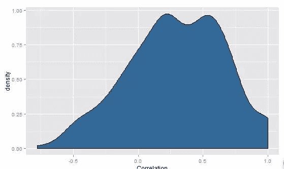
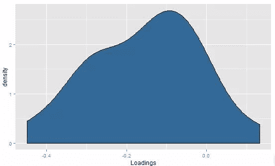
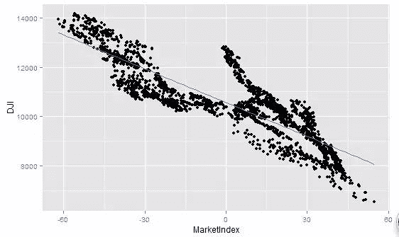
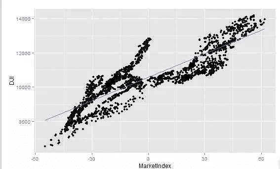
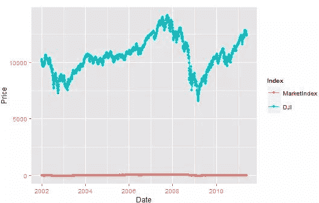
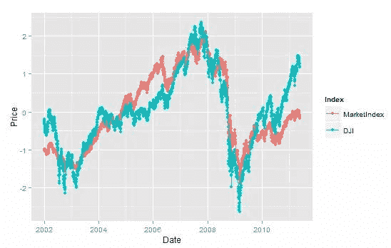
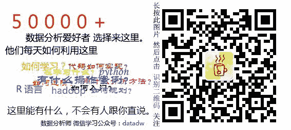

# 利用主成分分析构建股票指数

> 原文：[`mp.weixin.qq.com/s?__biz=MzAxNTc0Mjg0Mg==&mid=2653283501&idx=1&sn=f3536b9122e1153928068f5cbcb9cdcc&chksm=802e26b8b759afae383025face91730672cede04b90be45f5d2c08e8dbc394fdd817ca860ee6&scene=27#wechat_redirect`](http://mp.weixin.qq.com/s?__biz=MzAxNTc0Mjg0Mg==&mid=2653283501&idx=1&sn=f3536b9122e1153928068f5cbcb9cdcc&chksm=802e26b8b759afae383025face91730672cede04b90be45f5d2c08e8dbc394fdd817ca860ee6&scene=27#wechat_redirect)

作者：谢佳标

中国 R 语言大会讲师，高级数据分析师，8 年以上数据挖掘建模工作实战经验

https://ask.hellobi.com/blog/xiejiabiao/4288

接用 ML_for_Hackers-master 书中的数据。 

> prices<-read.csv("stock_prices.csv")
> prices[1,]
        Date Stock Close
1 2011-05-25   DTE 51.12
> # 原始数据集并不是我们喜欢使用的格式，因此需要进行预处理。
> # 第一步，把数据集中的时间戳转换为正确编码的日期变量。这要用到 lubridate 包中的 ymd 函数
> # install.packages("lubridate")
> library(lubridate)
> prices<-transform(prices,Date=ymd(Date))
> # 一旦完成这一步，就能适用 reshape 函数库中的 cast 函数
> library(reshape)

Attaching package: ‘reshape’

The following object is masked from ‘package:lubridate’:

    stamp

> date.stock.matrix<-cast(prices,Date~Stock,value="Close")
> which(complete.cases(date.stock.matrix)==F) # 22 875 条记录有缺失值
[1]  22 875
> # 分析了这个生成结--巨大的日期-股票矩阵之后，我们注意到缺失了一些元素。
> date.stock.matrix[22,];date.stock.matrix[875,]
         Date ADC AFL ARKR AZPN CLFD DDR DTE ENDP FLWS FR GMXR GPC HE ISSC ISSI KSS MTSC
22 2002-02-01  NA  NA   NA   NA   NA  19  NA   NA   NA NA   NA  NA NA   NA   NA  NA   NA
   NWN ODFL PARL RELV SIGM STT TRIB UTR
22  NA   NA   NA   NA   NA  NA   NA  NA
          Date  ADC   AFL  ARKR AZPN CLFD DDR   DTE  ENDP FLWS    FR  GMXR   GPC    HE
875 2005-06-22 30.4 43.49 26.56 5.76 1.47  NA 46.89 25.88 7.23 41.45 13.45 42.76 27.21
     ISSC ISSI   KSS  MTSC   NWN  ODFL  PARL RELV SIGM   STT TRIB   UTR
875 35.42 7.22 56.06 34.54 36.87 27.74 28.96 10.3 8.12 49.22 6.69 49.98
> # 因此回到最初的 prices 数据集，删除那些缺失元素的数据，再运行 cast 函数：
> prices<-subset(prices,Date!=ymd('2002-02-01'))
> prices<-subset(prices,Stock !='DDR')
> date.stock.matrix<-cast(prices,Date~Stock,value="Close")
> which(complete.cases(date.stock.matrix)==F)  

#0
integer(0)
> # 接下来可以适用 cor 函数来找到这个矩阵中所有数字列之间的相关性。然后将相关性矩阵转换成一个数值向量，并且画一个相关性密度图，
> # 以此来获得两个直观认识：a）相关性的均值；b）低相关性出现的频率。
> cor.matrix<-cor(date.stock.matrix[,2:ncol(date.stock.matrix)])
> correlations<-as.numeric(cor.matrix)
> library(ggplot2)
> ggplot(data.frame(Correlation=correlations),
+        aes(x=Correlation,fill=1))+
+   geom_density()+opts(legend.position='none')

> #正如密度图所示，大部分相关性是正数，因此 PCA 适合用于这份数据集.
> # 我们适用 princomp 函数来运行 PCA：
> pca<-princomp(date.stock.matrix[,2:ncol(date.stock.matrix)])
> # 我们只对第一主成份感兴趣，所以只把 pca 载荷的第一列提取出来：
> principal.component<-pca$loadings[,1]
> # 完成这些之后，我们可以分析载荷的密度图，直观地了解第一主成份是如何形成的。
> loadings<-as.numeric(principal.component)
> ggplot(data.frame(Loadings=loadings),
+        aes(x=Loadings,fill=1))+
+   geom_density()+opts(legend.position="none")

> # 这个结果有点让人疑惑，因为载荷有一个相当不错的分布，但是几乎全是负数。它实际上是个很小的麻烦，我们用一行代码就能解决。
> # 到目前为止我们获得了主成分，接下来可以把这些数据总结成一列了。可以使用 predict 函数完成这个目标：
> market.index<-predict(pca)[,1]
> # 如何才能知道这些预测值的效果呢？幸运的是，对这个实例我们可以很容易地判断结果好坏

> # ，因为可以把结果和著名的市场指数做比较。在本章中，我们用道琼斯指数（Down Jones Index DJI).
> dji.prices<-read.csv("DJI.csv")
> dji.prices<-transform(dji.prices,Date=ymd(Date))
> # 因为使用整个 DJI 运行的时间比我们预想的要长很多，所以需要取一个它的自己，仅仅获得我们感兴趣的那些日期。
> dji.prices<-subset(dji.prices,Date>ymd('2001-12-31'))
> dji.prices<-subset(dji.prices,Date !=ymd('2002-02-01'))
> # 然后，提取 DJI 中我们感兴趣的部分，也就是每日收盘价格和我们记录过的那些日期。
> # 因为它们的顺序和我们现在的数据集相反，用 rev 函数反转它们即可：
> dji<-with(dji.prices,rev(Close))
> dates<-with(dji.prices,rev(Date))
> # 现在我们可以绘制一些简单的图，将使用 PCA 生成的市场指数和 DJI 相比较：
> comparison<-data.frame(Date=dates,MarketIndex=market.index,DJI=dji)
> ggplot(comparison,aes(x=MarketIndex,y=DJI))+
+   geom_point()+geom_smooth(method="lm",se=FALSE)

> #从图可以看出，那些之前看上去烦人的负载荷，真的成为了麻烦的源头：我们的指数和 DJI 付相关。

> # 但是，我们可以很容易地解决这个麻烦。只需要对指数乘以-1，即可生成一个和 DJI 正相关的指数

> comparison<-transform(comparison,MarketIndex=-1*MarketIndex)
> # 现在可以再尝试一次进行比较：
> ggplot(comparison,aes(x=MarketIndex,y=DJI))+
+   geom_point()+geom_smooth(method="lm",se=FALSE)

+   geom_point()+geom_line(

)

> #如图，我们已经修正了指数的方向，并且它看上去和 DJI 真的很匹配。
> # 剩下的最后一件事情，就是获得我们的指数随着时间推移与 DJI 的趋势保持一直的程度。

> # 首先，使用 melt 函数获得一个数据框，它可以很容易地一次性对两个指标进行可视化。
> # 然后，我们对每个指数活出一条以日期为 x 轴，以价格为 y 轴的线。
> alt.comparison<-melt(comparison,id.vars="Date")
> names(alt.comparison)<-c("Date","Index","Price")
> ggplot(alt.comparison,aes(x=Date,y=Price,group=Index,color=Index))+
+   geom_point()+geom_line()

> # 这一次结果并不是很好，因为 DJI 都是很高的值，而我们的指数都是很小的值，但是可以使用 scale 函数解决这个问题。
> comparison$MarketIndex<-scale(comparison$MarketIndex)
> comparison$DJI<-scale(comparison$DJI)
> alt.comparison<-melt(comparison,id.vars="Date")
> names(alt.comparison)<-c("Date","Index","Price")
> ggplot(alt.comparison,aes(x=Date,y=Price,group=Index,color=Index))+
+   geom_point()+geom_line()

> # 看上去与 DJI 的趋势保持得相当好。总之，用 PCA 真的能够产生一副股票价格的趋势图。

